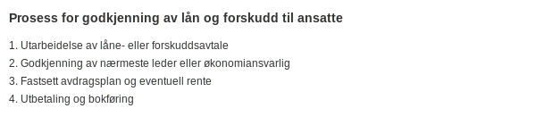

**Konto 1380 - Fordringer på ansatte** er en konto i Norsk Standard Kontoplan som brukes til å registrere **lån**, **[forskudd på lønn](/blogs/kontoplan/2930-lonn "Konto 2930 - Lønn")** og **andre forskuddsutlegg til ansatte** som kortsiktige fordringer. Kontoen omfatter både rente- og rentefrie fordringer som er innvilget av selskapet til sine ansatte, under forutsetning av at transaksjonene er godkjent i henhold til selskapets interne retningslinjer.


## Hva er fordringer på ansatte?

Fordringer på ansatte oppstår når selskapet yter **lån**, **[forskudd på lønn](/blogs/kontoplan/2930-lonn "Konto 2930 - Lønn")** eller **forskuddsutlegg** til sine ansatte. Slike transaksjoner må ha klare avtalevilkår, herunder:

* Formell avtale om lån eller forskudd
* Godkjenning av leder eller økonomiansvarlig
* Avdragsplan og eventuelt rentesats fastsatt
* Dokumentasjon av utlegg eller sikkerhet ved behov

## Prosess for godkjenning av lån og forskudd til ansatte



1. Utarbeidelse av låne- eller forskuddsavtale
2. Godkjenning av nærmeste leder eller økonomiansvarlig
3. Fastsett avdragsplan og eventuell rente
4. Utbetaling og bokføring

## Regnskapsføring

Ved utbetaling bokføres transaksjonen slik:

```plaintext
Debet: Konto 1380 - Fordringer på ansatte       XXX
Kredit: Konto 1920 - Bankinnskudd               XXX
```

Renteinntekter og eventuelle gebyrer periodiseres som følger:

```plaintext
Debet: Konto 2970 - Påløpte renter              YYY
Kredit: Konto 8140 - Renteinntekter annen finans YYY
```

## Vurdering og nedskrivning

Fordringer på ansatte skal vurderes jevnlig for **pålitelig måling** og eventuelt nedskrives ved indikasjoner på redusert inndrivbarhet. Se også prinsippene for [tapsavsetninger](/blogs/regnskap/tap-pa-fordring "Hva er Tapsavsetning? Behandling av fordringer").

## Klassifisering i kontoplanen

| Kontotype                             | Kontonummer | Beskrivelse                                      |
|---------------------------------------|-------------|--------------------------------------------------|
| Datterselskap                         | 1300        | Investeringer i datterselskaper                  |
| Investering tilknyttet selskap        | 1330        | Investeringer i selskaper med betydelig innflytelse |
| Lån til foretak samme konsern         | 1320        | Rentebærende fordringer til foretak i samme konsern |
| Lån til tilknyttede selskap           | 1340        | Rentebærende fordringer til tilknyttede selskap  |
| Investeringer i aksjer og eiendeler   | 1350        | Investeringer i aksjer og andre finansielle eiendeler |
| Obligasjoner                          | 1360        | Langsiktige obligasjonsinvesteringer og rentebærende |
| Fordringer på eiere og styremedlemmer | 1370        | Lån og forskudd til eiere og styremedlemmer      |
| **Fordringer på ansatte**             | **1380**    | **Lån og forskudd til ansatte**                  |

## Eksempel på bokføring

```plaintext
Debet: Konto 1380 - Fordringer på ansatte       50 000
Kredit: Konto 1920 - Bankinnskudd               50 000
```

## Relaterte artikler

* [Konto 1300 - Investeringer i datterselskaper](/blogs/kontoplan/1300-investeringer-i-datterselskaper "Konto 1300 - Investeringer i datterselskaper")
* [Konto 1310 - Investeringer annet foretak i samme konsern](/blogs/kontoplan/1310-investeringer-annet-foretak-i-samme-konsern "Konto 1310 - Investeringer annet foretak i samme konsern")
* [Konto 1320 - Lån til foretak samme konsern](/blogs/kontoplan/1320-lan-til-foretak-samme-konsern "Konto 1320 - Lån til foretak samme konsern")
* [Konto 1330 - Investeringer i tilknyttede selskap](/blogs/kontoplan/1330-investeringer-i-tilknyttede-selskap "Konto 1330 - Investeringer i tilknyttede selskap")
* [Konto 1340 - Lån til tilknyttede selskap](/blogs/kontoplan/1340-lan-til-tilknyttede-selskap "Konto 1340 - Lån til tilknyttede selskap")
* [Konto 1350 - Investeringer i aksjer og eiendeler](/blogs/kontoplan/1350-investeringer-i-aksjer-og-eiendeler "Konto 1350 - Investeringer i aksjer og eiendeler")
* [Konto 1360 - Obligasjoner](/blogs/kontoplan/1360-obligasjoner "Konto 1360 - Obligasjoner")
* [Konto 1370 - Fordringer på eiere og styremedlemmer](/blogs/kontoplan/1370-fordringer-pa-eiere-og-styremedlemmer "Konto 1370 - Fordringer på eiere og styremedlemmer")
* [Konto 1390 - Andre fordringer](/blogs/kontoplan/1390-andre-fordringer "Konto 1390 - Andre fordringer")
* [Konto 1580 - Avsetning tap på fordringer](/blogs/kontoplan/1580-avsetning-tap-pa-fordringer "Konto 1580 - Avsetning tap på fordringer")
* [Konto 2910 - Gjeld til ansatte og eiere](/blogs/kontoplan/2910-gjeld-til-ansatte-og-eiere "Konto 2910 - Gjeld til ansatte og eiere")
* [Hva er Tapsavsetning?](/blogs/regnskap/tap-pa-fordring "Hva er Tapsavsetning? Behandling av fordringer")
* [Hva er Langsiktig gjeld?](/blogs/regnskap/langsiktig-gjeld "Langsiktig gjeld")
* [Konto 2930 - Lønn](/blogs/kontoplan/2930-lonn "Konto 2930 - Lønn")
