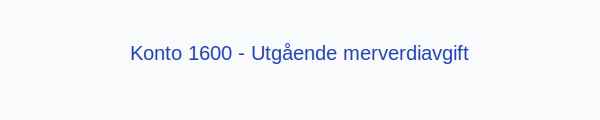

**Konto 1600 - Utgående merverdiavgift** er en konto i Norsk Standard Kontoplan som brukes til å registrere **utgående merverdiavgift (MVA)** som en gjeld til skattemyndighetene frem til innbetaling.

## Hva er utgående merverdiavgift?

*Utgående merverdiavgift* er den **merverdiavgiften** virksomheter legger til ved salg av varer og tjenester. Beløpet innbetales til skattemyndighetene etter avregning.

## Når skal konto 1600 benyttes?

* Når virksomheten fakturerer kunder med merverdiavgift
* Ved periodisk avregning og rapportering av MVA
* I forbindelse med innbetaling til skattemyndighetene

## Regnskapsføring

| Transaksjon                                | Debet                                      | Kredit                                   |
|--------------------------------------------|--------------------------------------------|------------------------------------------|
| Salg av varer eller tjenester med MVA      | Konto 3000 - Salgsinntekt                   | Konto 1600 - Utgående merverdiavgift     |
| Utbetaling til skattemyndighetene (MVA)    | Konto 1600 - Utgående merverdiavgift       | Konto 1920 - Bankinnskudd                |

For en fullstendig gjennomgang av MVA, se [Hva er MVA?](/blogs/regnskap/hva-er-moms-mva "Hva er MVA? MVA-regnskapsføring og merverdiavgift").

## Eksempel

En virksomhet har følgende salgsdokument:

| Salgsbeløp uten MVA | MVA (25 %) | Salgsbeløp inkl. MVA |
|---------------------|------------|----------------------|
| 10 000 NOK          | 2 500 NOK  | 12 500 NOK           |

## Fordeler ved korrekt MVA-behandling

* **Redusert risiko** for feilrapportering
* **Bedre likviditetsstyring** gjennom planlagt betaling
* Overholdelse av **lovpålagte krav** for merverdiavgift

## Relaterte artikler

* [Konto 1601 - Utgående merverdiavgift høy sats](/blogs/kontoplan/1601-utgaende-merverdiavgift-hoy-sats "Konto 1601 - Utgående merverdiavgift høy sats")
* [Konto 1602 - Utgående merverdiavgift kjøp tjenester fra utlandet](/blogs/kontoplan/1602-utgaende-merverdiavgift-kjop-tjen-fra-utlandet "Konto 1602 - Utgående merverdiavgift kjøp tjenester fra utlandet")
* [Konto 1603 - Utgående merverdiavgift middels sats](/blogs/kontoplan/1603-utgaende-merverdiavgift-middels-sats "Konto 1603 - Utgående merverdiavgift middels sats")
* [Konto 1604 - Utgående merverdiavgift lav sats](/blogs/kontoplan/1604-utgaende-merverdiavgift-lav-sats "Konto 1604 - Utgående merverdiavgift lav sats")
* [Konto 1610 - Inngående merverdiavgift](/blogs/kontoplan/1610-inngaaende-merverdiavgift "Konto 1610 - Inngående merverdiavgift")
* [Konto 1611 - Inngående merverdiavgift høy sats](/blogs/kontoplan/1611-inngaaende-merverdiavgift-hoy-sats "Konto 1611 - Inngående merverdiavgift høy sats")
* [Konto 1612 - Inngående merverdiavgift kjøp tjenester fra utlandet](/blogs/kontoplan/1612-inngaaende-merverdiavgift-kjop-tjen-fra-utlandet "Konto 1612 - Inngående merverdiavgift kjøp tjenester fra utlandet")
* [Konto 1640 - Oppgjørskonto merverdiavgift](/blogs/kontoplan/1640-oppgjorskonto-merverdiavgift "Konto 1640 - Oppgjørskonto merverdiavgift")
* [Konto 2700 - Utgående merverdiavgift](/blogs/kontoplan/2700-utgaende-merverdiavgift "Konto 2700 - Utgående merverdiavgift")
* [Hva er MVA?](/blogs/regnskap/hva-er-moms-mva "Hva er MVA? MVA-regnskapsføring og merverdiavgift")
* [Hva er en Kontoplan?](/blogs/regnskap/hva-er-kontoplan "Hva er en Kontoplan? Komplett Guide til Kontoplaner i Norsk Regnskap")
