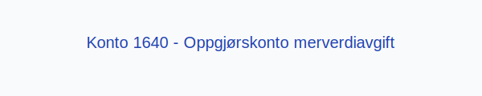

**Konto 1640 - Oppgjørskonto merverdiavgift** er en konto i **Norsk Standard Kontoplan** som brukes til å avstemme og oppgjøre **merverdiavgift (MVA)** mellom utgående og inngående MVA.

## Hva er oppgjørskonto merverdiavgift?

*Oppgjørskonto merverdiavgift* er en mellomregnskapskonto som benyttes ved periodeavslutning for å overføre saldoen mellom **konto 1600 - Utgående merverdiavgift** og **konto 1610 - Inngående merverdiavgift**. Kontoen viser netto skyldig eller til gode merverdiavgift før endelig betaling eller tilbakeføring.

## Når skal konto 1640 benyttes?

* Kontoen bør avstemmes ved hver periodeavslutning (måned, kvartal eller år) for MVA-rapportering.
* Ved overføring av utgående MVA til oppgjørskonto.
* Ved overføring av inngående MVA fra oppgjørskonto.

## Regnskapsføring

| Transaksjon                          | Debet                                    | Kredit                                   |
|--------------------------------------|------------------------------------------|------------------------------------------|
| Periodeavslutning utgående MVA       | Konto 1640 - Oppgjørskonto merverdiavgift | Konto 1600 - Utgående merverdiavgift     |
| Periodeavslutning inngående MVA      | Konto 1610 - Inngående merverdiavgift    | Konto 1640 - Oppgjørskonto merverdiavgift |

## Eksempel

En virksomhet har ved periodeavslutning følgende saldi:

| Beskrivelse                      | Beløp (NOK) |
|----------------------------------|-------------|
| Utgående merverdiavgift          | 15 000      |
| Inngående merverdiavgift         | 5 000       |

Netto merverdiavgift overføres til oppgjørskonto:

| Transaksjon                      | Debet                                 | Kredit                                |
|----------------------------------|---------------------------------------|---------------------------------------|
| Netto MVA overført til oppgjør   | Konto 1640 - Oppgjørskonto merverdiavgift | Konto 1600 - Utgående merverdiavgift |
| Netto MVA overført fra oppgjør   | Konto 1610 - Inngående merverdiavgift | Konto 1640 - Oppgjørskonto merverdiavgift |

## Fordeler ved korrekt behandling

* **Enkel avstemming** av MVA-saldo for å sikre korrekt rapportering.
* **Klar oversikt** over netto skyldig eller til gode MVA før betaling eller tilbakeføring.
* Bidrar til å overholde **skatte- og avgiftslovgivning**.

## Relaterte artikler

* [Konto 1600 - Utgående merverdiavgift](/blogs/kontoplan/1600-utgaende-merverdiavgift "Konto 1600 - Utgående merverdiavgift")
* [Konto 1610 - Inngående merverdiavgift](/blogs/kontoplan/1610-inngaaende-merverdiavgift "Konto 1610 - Inngående merverdiavgift")
* [Konto 1630 - Grunnlag investeringsavgift](/blogs/kontoplan/1630-grunnlag-investeringsavgift "Konto 1630 - Grunnlag investeringsavgift")
* [Konto 7740 - Øreavrunding, MVA - oppgjør](/blogs/kontoplan/7740-oreavrunding-mva-oppgjor "Konto 7740 - Øreavrunding, MVA - oppgjør")
* [Konto 2700 - Utgående merverdiavgift](/blogs/kontoplan/2700-utgaende-merverdiavgift "Konto 2700 - Utgående merverdiavgift")
* [Hva er MVA?](/blogs/regnskap/hva-er-moms-mva "Hva er MVA? MVA-regnskapsføring og merverdiavgift")
* [Hva er en Kontoplan?](/blogs/regnskap/hva-er-kontoplan "Hva er en Kontoplan? Komplett Guide til Kontoplaner i Norsk Regnskap")
