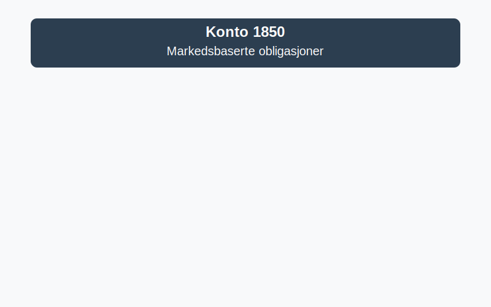

**Konto 1850 - Markedsbaserte obligasjoner** er en konto i Norsk Standard Kontoplan som brukes til å registrere **markedsbaserte obligasjoner** som omsettes på regulerte markeder, og som måles til **virkelig verdi** i [balansen](/blogs/regnskap/hva-er-balanseregnskap "Hva er Balanseregnskap?").



## Hva er markedsbaserte obligasjoner?

**Markedsbaserte obligasjoner** er rentebærende gjeldsinstrumenter utstedt av stater, kommuner eller selskaper som handles på anerkjente børser eller andre regulerte markedsplasser. Disse verdipapirene verdsettes til virkelig verdi basert på observerbare markedsdata.

### Typiske eksempler

* **Statsobligasjoner:** Utstedt av nasjonale myndigheter med minimal kredittrisiko.
* **Kommunalobligasjoner:** Utstedt av kommuner eller fylkeskommuner.
* **Selskapsobligasjoner:** Utstedt av private og børsnoterte selskaper med varierende kredittrating.
* **Inflasjonsobligasjoner:** Obligasjoner med rentejustering knyttet til inflasjonsindekser.
* **Konvertible obligasjoner:** Kan konverteres til aksjer på forhåndsdefinerte vilkår.
* **Grønne obligasjoner:** Øremerket finansiering av miljø- eller bærekraftprosjekter.

## Klassifisering og måling

Markedsbaserte obligasjoner måles til virkelig verdi i henhold til gjeldende regnskapsstandarder (for eksempel IFRS 9). Valg av målekategori avhenger av virksomhetens forretningsmodell og regnskapsmessige krav.

| Målekategori                              | Beskrivelse                                                      |
|-------------------------------------------|------------------------------------------------------------------|
| Virkelig verdi over resultatet (FVPL)     | Gevinster og tap innregnes i resultatet løpende                  |
| Virkelig verdi over utvidet resultat (FVOCI) | Gevinster og tap innregnes i øvrig totalresultat               |

| Nivå | Beskrivelse                                                         |
|------|---------------------------------------------------------------------|
| 1    | Kurser fra aktive markeder for identiske instrumenter              |
| 2    | Observerbare data for lignende instrumenter eller ikke-aktive markeder |
| 3    | Ikke-observerbare data basert på modellestimeringer                |

## Regnskapsføring av markedsbaserte obligasjoner

```plaintext
Debet: Konto 1850 - Markedsbaserte obligasjoner (virkelig verdi oppdatering)
Kredit: Konto 8300 - Urealiserte gevinster/fall i virkelig verdi
```

> **Merk:** Hvis FVOCI er valgt, innregnes gevinster og tap i øvrig totalresultat framfor resultatet.

## Eksempel på bokføring

En virksomhet vurderer sin beholdning av markedsbaserte obligasjoner med en verdiendring på 100 000 kr:

```plaintext
Debet: Konto 1850 - Markedsbaserte obligasjoner              100 000 kr
Kredit: Konto 8300 - Urealiserte gevinster/fall i virkelig verdi 100 000 kr
```

## Relaterte artikler

* [Konto 1800 - Aksjer og andeler i foretak samme konsern](/blogs/kontoplan/1800-aksjer-og-andeler-i-foretak-samme-konsern "Konto 1800 - Aksjer og andeler i foretak samme konsern")
* [Konto 1810 - Markedsbaserte aksjer](/blogs/kontoplan/1810-markedsbaserte-aksjer "Konto 1810 - Markedsbaserte aksjer")
* [Konto 1820 - Andre aksjer](/blogs/kontoplan/1820-andre-aksjer "Konto 1820 - Andre aksjer")
* [Konto 1830 - Markedsbaserte obligasjoner](/blogs/kontoplan/1830-markedsbaserte-obligasjoner "Konto 1830 - Markedsbaserte obligasjoner: Guide til markedsbaserte obligasjoner i norsk kontoplan")
* [Konto 1840 - Andre obligasjoner](/blogs/kontoplan/1840-andre-obligasjoner "Konto 1840 - Andre obligasjoner: Guide til andre obligasjoner i norsk kontoplan")
* [Konto 1860 - Andre sertifikater](/blogs/kontoplan/1860-andre-sertifikater "Konto 1860 - Andre sertifikater: Guide til sertifikater i norsk kontoplan")
* [Konto 1870 - Andre markedsbaserte finansielle instrumenter](/blogs/kontoplan/1870-andre-markedsbaserte-finansielle-instrumenter "Konto 1870 - Andre markedsbaserte finansielle instrumenter: Guide til finansielle instrumenter i norsk kontoplan")
* [Konto 1360 - Obligasjoner](/blogs/kontoplan/1360-obligasjoner "Konto 1360 - Obligasjoner: Guide til registrering av obligasjoner i norsk kontoplan")
* [Hva er Virkelig Verdi?](/blogs/regnskap/hva-er-virkelig-verdi "Hva er Virkelig Verdi? Verdsettelse og Regnskapsføring")
