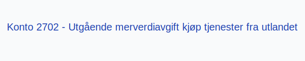

**Konto 2702 - Utgående merverdiavgift kjøp tjenester fra utlandet** er en konto i **Norsk Standard Kontoplan** som brukes ved periodisk **oppgjør av utgående merverdiavgift ved kjøp av tjenester fra utlandet** (omvendt avgiftsplikt) for å skille dette fra andre MVA-oppgjør før betaling.

## Hva er konto 2702?

*Konto 2702 - Utgående merverdiavgift kjøp tjenester fra utlandet* benyttes for å overføre påløpt MVA ved kjøp av tjenester fra utlandet etter omvendt avgiftsplikt til oppgjørskontoen før betaling. Dette gir bedre oversikt og kontroll over MVA-oppgjøret for importerte tjenester.

For transaksjonsføringen av omvendt avgiftsplikt ved kjøp av tjenester fra utlandet, se [Konto 1602 - Utgående merverdiavgift kjøp tjenester fra utlandet](/blogs/kontoplan/1602-utgaende-merverdiavgift-kjop-tjen-fra-utlandet "Konto 1602 - Utgående merverdiavgift kjøp tjenester fra utlandet").

## Når skal konto 2702 benyttes?

* Ved periodisk oppgjør av **MVA ved kjøp av tjenester fra utlandet** under omvendt avgiftsplikt.
* I forbindelse med avstemming mot [Konto 1602 - Utgående merverdiavgift kjøp tjenester fra utlandet](/blogs/kontoplan/1602-utgaende-merverdiavgift-kjop-tjen-fra-utlandet "Konto 1602 - Utgående merverdiavgift kjøp tjenester fra utlandet").
* Når netto påløpt MVA for utenlandstjenester skal betales til skattemyndighetene.

## Regnskapsføring av oppgjør

| Transaksjon                                                                      | Debet                                                             | Kredit                                                                  |
|----------------------------------------------------------------------------------|-------------------------------------------------------------------|-------------------------------------------------------------------------|
| Overføring av MVA ved omvendt avgiftsplikt fra transaksjonskonto                 | Konto 1602 - Utgående merverdiavgift kjøp tjenester fra utlandet  | Konto 2702 - Utgående merverdiavgift kjøp tjenester fra utlandet        |
| Betaling av MVA ved omvendt avgiftsplikt                                          | Konto 2702 - Utgående merverdiavgift kjøp tjenester fra utlandet  | Konto 1920 - Bankinnskudd                                                |

## Eksempel og beregning

| Beløp uten MVA  | MVA (25 %) | MVA å overføre til oppgjørskonto |
|-----------------|------------|----------------------------------|
| 5 000 NOK       | 1 250 NOK  | 1 250 NOK                       |
| 12 000 NOK      | 3 000 NOK  | 3 000 NOK                       |

## Fordeler med egen oppgjørskonto for utenlandstjenester

* **Presis avstemming** av MVA for kjøp av tjenester fra utlandet.
* **Bedre likviditetsstyring** gjennom tydelig separasjon av oppgjørsstrømmer.
* Bidrar til forenklet **rapportering** og etterlevelse av omvendt avgiftsplikt.

## Relaterte artikler

* [Konto 1602 - Utgående merverdiavgift kjøp tjenester fra utlandet](/blogs/kontoplan/1602-utgaende-merverdiavgift-kjop-tjen-fra-utlandet "Konto 1602 - Utgående merverdiavgift kjøp tjenester fra utlandet")
* [Konto 2700 - Utgående merverdiavgift](/blogs/kontoplan/2700-utgaende-merverdiavgift "Konto 2700 - Utgående merverdiavgift")
* [Konto 2701 - Utgående merverdiavgift høy sats](/blogs/kontoplan/2701-utgaende-merverdiavgift-hoy-sats "Konto 2701 - Utgående merverdiavgift høy sats")
* [Konto 2703 - Utgående merverdiavgift middels sats](/blogs/kontoplan/2703-utgaende-merverdiavgift-middels-sats "Konto 2703 - Utgående merverdiavgift middels sats")
* [Konto 2704 - Utgående merverdiavgift lav sats](/blogs/kontoplan/2704-utgaende-merverdiavgift-lav-sats "Konto 2704 - Utgående merverdiavgift lav sats")
* [Konto 1612 - Inngående merverdiavgift kjøp tjenester fra utlandet](/blogs/kontoplan/1612-inngaaende-merverdiavgift-kjop-tjen-fra-utlandet "Konto 1612 - Inngående merverdiavgift kjøp tjenester fra utlandet")
* [Konto 2712 - Inngående merverdiavgift kjøp tjenester fra utlandet](/blogs/kontoplan/2712-inngaaende-merverdiavgift-kjop-tjen-fra-utlandet "Konto 2712 - Inngående merverdiavgift kjøp tjenester fra utlandet")
* [Hva er MVA?](/blogs/regnskap/hva-er-moms-mva "Hva er MVA? MVA-regnskapsføring og merverdiavgift")
* [Hva er en Kontoplan?](/blogs/regnskap/hva-er-kontoplan "Hva er en Kontoplan? Komplett Guide til Kontoplaner i Norsk Regnskap")
