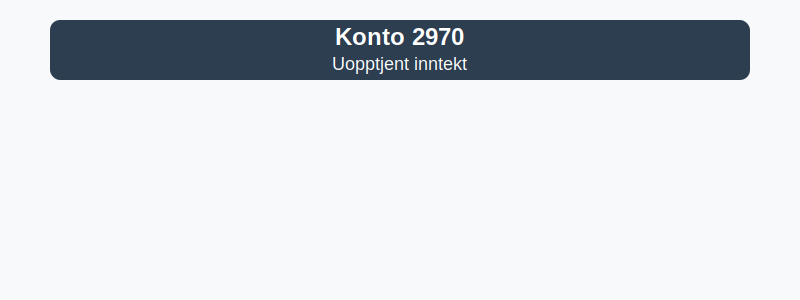

**Konto 2970 - Uopptjent inntekt** er en konto i Norsk Standard Kontoplan som brukes til å registrere **uopptjent inntekt**, altså inntekter som er mottatt på forskudd før levering av varer eller tjenester i kommende regnskapsperioder.

## Hva er uopptjent inntekt?

*Uopptjent inntekt* (også kalt forskuddsinntekter eller periodiserte inntekter) oppstår når kunder betaler for varer eller tjenester før levering. Dette sikrer at regnskapet følger **periodiseringsprinsippet** og gir et korrekt bilde av selskapets økonomiske posisjon.

Vanlige eksempler på uopptjent inntekt:

* **Abonnementsinntekter** med varighet over flere perioder
* **Prosjekt- eller konsulentavtaler** med forskuddsbetaling
* **Leieinntekter** mottatt for perioder etter balansedagen
* **Gavekort** og depositum som inntektsføres ved kundens bruk

## Regnskapsføring av uopptjent inntekt

| Transaksjon                                   | Debet                                        | Kredit                                   |
|-----------------------------------------------|----------------------------------------------|------------------------------------------|
| Mottatt forskuddsbetaling                     | Konto 1920 - Bankinnskudd                    | Konto 2970 - Uopptjent inntekt            |
| Overføring til opptjent inntekt ved levering  | Konto 2970 - Uopptjent inntekt               | Relevant inntektskonto (3000)            |
| Periodisering ved årsslutt for uopptjent andel| Relevant inntektskonto (3000)               | Konto 2970 - Uopptjent inntekt            |

## Balansepresentasjon

Saldo på konto 2970 presenteres som **kortsiktig gjeld (omløpsforpliktelser)** i balansen og vurderes til anskaffelseskost. Ved periodeavslutning må uopptjent inntekt vurderes for å sikre korrekt periodisering av inntekter.

## Eksempel

Selskapet mottar **120 000 kr** i forskuddsbetaling for et årsabonnement med varighet 12 måneder. Hver måned inntektsføres 10 000 kr, og ved årsslutt er to måneder uopptjent inntekt:

| Beskrivelse                         | Beløp (kr) |
|-------------------------------------|------------|
| Total forskuddsbetaling             | 120 000    |
| Periodisert inntekt (10 000 kr/mnd) | 120 000    |
| Uopptjent inntekt ved årsslutt      | 20 000     |

Bokføring av uopptjent inntekt ved årsslutt:

| Transaksjon                        | Debet                     | Kredit                       |
|------------------------------------|---------------------------|------------------------------|
| Periodisering av uopptjent inntekt | Inntektskonto (3000)      | Konto 2970 - Uopptjent inntekt |

## Intern lenking og relaterte kontoer

Andre kontoer i NS 4102 som ofte benyttes sammen med konto 2970:

* [Konto 2160 - Uopptjent inntekt](/blogs/kontoplan/2160-uopptjent-inntekt "Konto 2160 - Uopptjent inntekt: Regnskapsføring av forskuddsinntekter")
* [Konto 2900 - Forskudd fra kunder](/blogs/kontoplan/2900-forskudd-fra-kunder "Konto 2900 - Forskudd fra kunder: Regnskapsføring av forskudd fra kunder")
* [Konto 2960 - Påløpt kostnad og forskuddsbetalt inntekt](/blogs/kontoplan/2960-palopte-kostnad-og-forskuddsbetalt-inntekt "Konto 2960 - Påløpt kostnad og forskuddsbetalt inntekt: Regnskapsføring av påløpt kostnad og forskuddsbetalt inntekt")
* [Hva er Periodisering i Regnskap?](/blogs/regnskap/hva-er-periodisering "Hva er Periodisering i Regnskap? Komplett Guide til Periodiseringsprinsippet")
* [Hva er en Kontoplan?](/blogs/regnskap/hva-er-kontoplan "Hva er en Kontoplan? Komplett Guide til Kontoplaner i Norsk Regnskap")

**Riktig bruk** av konto 2970 sikrer at inntekter matches mot leveringstidspunktet og gir et korrekt bilde av selskapets kortsiktige forpliktelser.
