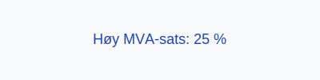

**Konto 3070 - Uttak av tjenester avgiftspliktig høy sats** er en konto i Norsk Standard Kontoplan som brukes til å registrere **uttak av tjenester** til bruk i virksomheten, der uttaket er **avgiftspliktig med høy MVA-sats**.

## Hva er Uttak av tjenester avgiftspliktig høy sats?

*Uttak av tjenester avgiftspliktig høy sats* omfatter uttak av tjenester fra selskapet til intern bruk, hvor tjenestene anses som omsetning med **25 % MVA**.

| Konto | Beskrivelse                                             | MVA-sats |
|-------|---------------------------------------------------------|----------|
| 3070  | Uttak av tjenester avgiftspliktig høy sats              | 25 %     |

## Regnskapsføring

Regnskapsføring av tjenesteuttak skal følge **tilknytningsprinsippet** og skille mellom netto uttak og merverdiavgift.

| Transaksjon                                  | Debet                                                | Kredit                                                |
|----------------------------------------------|------------------------------------------------------|-------------------------------------------------------|
| Uttak av tjenester ekskl. MVA                | Konto 3070 - Uttak av tjenester avgiftspliktig høy sats | Konto 6900 - Tjenesteforbruk (kostnad)               |
| Utgående merverdiavgift høy sats             | Konto 2701 - Utgående merverdiavgift høy sats         | Konto 3070 - Uttak av tjenester avgiftspliktig høy sats |
| Bokføring av kostpris (tjenesteforbruk)      | Konto 6900 - Tjenesteforbruk (kostnad)                | Konto 3070 - Uttak av tjenester avgiftspliktig høy sats |

## Vurdering og rapportering

Tjenesteuttak rapporteres netto, det vil si ekskludert MVA, og kostnad føres i resultatregnskapet under driftskostnader. Korrekt periodisering er viktig for **nøyaktig regnskapsanalyse**.

## Intern lenking og relaterte kontoer

* [Konto 2701 - Utgående merverdiavgift høy sats](/blogs/kontoplan/2701-utgaende-merverdiavgift-hoy-sats "Konto 2701 - Utgående merverdiavgift høy sats")
* [Konto 3060 - Uttak av varer avgiftspliktig høy sats](/blogs/kontoplan/3060-uttak-av-varer-avgiftspliktig-hoy-sats "Konto 3060 - Uttak av varer avgiftspliktig høy sats")
* [Konto 3063 - Uttak av varer avgiftspliktig middels sats](/blogs/kontoplan/3063-uttak-av-varer-avgiftspliktig-middels-sats "Konto 3063 - Uttak av varer avgiftspliktig middels sats")
* [Konto 3070 - Uttak av tjenester avgiftspliktig høy sats](/blogs/kontoplan/3070-uttak-av-tjenester-avgiftspliktig-hoy-sats "Konto 3070 - Uttak av tjenester avgiftspliktig høy sats")
* [Konto 3074 - Uttak av tjenester avgiftspliktig lav sats](/blogs/kontoplan/3074-uttak-av-tjenester-avgiftspliktig-lav-sats "Konto 3074 - Uttak av tjenester avgiftspliktig lav sats")
* [Hva er Driftskostnader? Typer, Beregning og Regnskapsføring - Komplett Guide](/blogs/regnskap/hva-er-driftskostnader "Hva er Driftskostnader? Typer, Beregning og Regnskapsføring - Komplett Guide")
* [Hva er en Kontoplan?](/blogs/regnskap/hva-er-kontoplan "Hva er en Kontoplan? Komplett Guide til Kontoplaner i Norsk Regnskap")
