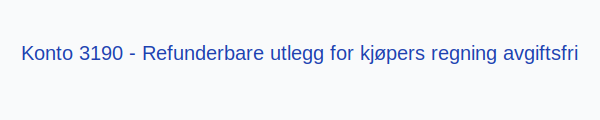

**Konto 3190 - Refunderbare utlegg for kjøpers regning avgiftsfri** er en konto i Norsk Standard Kontoplan som brukes til å registrere **refunderbare utlegg** på vegne av kunden som er **avgiftsfrie (0 % MVA)**.

## Hva er Refunderbare utlegg for kjøpers regning avgiftsfri?

*Refunderbare utlegg for kjøpers regning avgiftsfri* omfatter kostnader som pådras på vegne av kunden, som reisekostnader, tollavgifter eller **[portosalær](/blogs/kontoplan/6940-porto "Konto 6940 - Porto")**, som virksomheten senere krever dekket av kunden, og som er **avgiftsfrie (0 % MVA)**.

| Konto | Beskrivelse                             | MVA-sats |
|-------|-----------------------------------------|----------|
| 3190  | Refunderbare utlegg for kjøpers regning | 0 %      |

## Regnskapsføring

| Transaksjon                    | Debet                        | Kredit                                                   |
|--------------------------------|------------------------------|----------------------------------------------------------|
| Refunderbare utlegg ekskl. MVA | Konto 1500 - Kundefordringer | Konto 3190 - Refunderbare utlegg for kjøpers regning avgiftsfri |
| Mottatt betaling fra kunde     | Konto 1920 - Bankinnskudd    | Konto 1500 - Kundefordringer                             |

## Vurdering og rapportering

For å sikre **korrekt regnskapsanalyse** må refunderbare utlegg presenteres netto og skilles tydelig mellom beløp ekskl. MVA og eventuelle avgifter.

## Intern lenking og relaterte kontoer

* [Konto 1500 - Kundefordringer](/blogs/kontoplan/1500-kundefordringer "Konto 1500 - Kundefordringer")
* [Konto 1920 - Bankinnskudd](/blogs/kontoplan/1920-bankinnskudd "Konto 1920 - Bankinnskudd")
* [Konto 6940 - Porto](/blogs/kontoplan/6940-porto "Konto 6940 - Porto")
* [Konto 3090 - Refunderbare utlegg for kjøpers regning, avgiftspl.](/blogs/kontoplan/3090-refunderbare-utlegg-for-kjopers-regning-avgiftspl "Konto 3090 - Refunderbare utlegg for kjøpers regning, avgiftspl.")
* [Konto 3190 - Refunderbare utlegg for kjøpers regning avgiftsfri](/blogs/kontoplan/3190-refunderbare-utlegg-for-kjopers-regning-avgiftsfri "Konto 3190 - Refunderbare utlegg for kjøpers regning avgiftsfri")
* [Konto 3200 - Salgsinntekt handelsvarer utenfor avg.omr](/blogs/kontoplan/3200-salgsinntekt-handelsvarer-utenfor-avg-omr "Konto 3200 - Salgsinntekt handelsvarer utenfor avg.omr")
* [Ansattutlegg](/blogs/regnskap/ansattutlegg "Ansattutlegg - En komplett guide til utlegg fra ansatte")
* [Hva er en Kontoplan?](/blogs/regnskap/hva-er-kontoplan "Hva er en Kontoplan? Komplett Guide til Kontoplaner i Norsk Regnskap")
