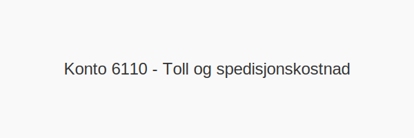

**Konto 6110 - Toll og spedisjonskostnad** er en konto i Norsk Standard Kontoplan som brukes til å registrere **toll** og **spedisjonskostnader** ved import av varer.

## Hva er Toll og spedisjonskostnad?

*Toll og spedisjonskostnad* omfatter:

* **Tollavgifter**: Avgift på importerte varer etter tolltariffen.
* **Spedisjonsgebyrer**: Kostnader for speditørtjenester, håndtering og fortolling.
* **Andre avgifter og gebyrer** relatert til import og logistikk.

| Konto | Beskrivelse               |
|-------|---------------------------|
| 6110  | Toll og spedisjonskostnad |

## Når skal konto 6110 benyttes?

* Når virksomheten pådrar seg **tollavgifter** ved innførsel av varer.
* Når speditørtjenester og fortolling faktureres som en del av vareanskaffelsen.
* Ved føring av kostnader knyttet til import- og logistikkgebyrer.

## Regnskapsføring

| Transaksjon                            | Debet                                          | Kredit                       |
|----------------------------------------|------------------------------------------------|------------------------------|
| Toll- og spedisjonskostnad             | Konto 6110 - Toll og spedisjonskostnad         | Konto 2400 - Leverandørgjeld |
| Betaling av toll- og spedisjonsfaktura | Konto 2400 - Leverandørgjeld                   | Konto 1920 - Bankinnskudd    |

## Eksempel på bokføring

| Beløp ekskl. MVA | MVA (25 %) | Total inkl. MVA |
|------------------|------------|-----------------|
| 2 500 NOK        | 625 NOK    | 3 125 NOK       |

## Fordeler ved korrekt bruk

* **Nøyaktig kostnadssporing** for importrelaterte avgifter.
* **Forbedret oversikt** over logistikk- og tollenhetskostnader.
* **Effektiv avstemming** av leverandør- og spedisjonsfakturaer.

## Intern lenking og relaterte kontoer

Andre kontoer i NS 4102 som ofte brukes sammen med konto 6110:

* [Konto 2400 - Leverandørgjeld](/blogs/kontoplan/2400-leverandorgjeld "Konto 2400 - Leverandørgjeld")
* [Konto 1920 - Bankinnskudd](/blogs/kontoplan/1920-bankinnskudd "Konto 1920 - Bankinnskudd")
* [Konto 6100 - Frakt, transportkostnad og forsikring](/blogs/kontoplan/6100-frakt-transportkostnad-og-forsikring "Konto 6100 - Frakt, transportkostnad og forsikring")
* [Konto 6200 - Elektrisitet](/blogs/kontoplan/6200-elektrisitet "Konto 6200 - Elektrisitet")
* [Konto 4060 - Frakt, toll og spedisjon](/blogs/kontoplan/4060-frakt-toll-og-spedisjon "Konto 4060 - Frakt, toll og spedisjon")
* [Hva er en Kontoplan?](/blogs/regnskap/hva-er-kontoplan "Hva er en Kontoplan? Komplett Guide til Kontoplaner i Norsk Regnskap")

**Riktig bokføring** av **toll** og **spedisjonskostnader** sikrer korrekt kostnadsallokering og rapportering.
