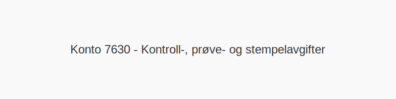

**Konto 7630 - Kontroll-, prøve- og stempelavgifter** er en kostnadskonto i norsk kontoplan som benyttes for å registrere **kontrollavgifter**, **prøveavgifter** og **stempelavgifter** ved offentlige kontrolltiltak, testing og stempling av dokumenter eller varer.



## Hva er kontroll-, prøve- og stempelavgifter?

Kontroll-, prøve- og stempelavgifter er gebyrer som påløper når offentlige myndigheter eller sertifiseringsorganer utfører kontroller, tester eller stempler varer, dokumenter eller prosesser for å sikre kvalitet, sikkerhet eller lovlighet.

## Typiske avgiftstyper

| Avgiftstype      | Beskrivelse                                              | Bokføringseksempel                                     |
|------------------|----------------------------------------------------------|--------------------------------------------------------|
| **Kontrollavgift** | Gebyr for inspeksjon eller kontroll av varer ved import/eksport | Debet: Konto 7630, Kredit: Konto 2400                  |
| **Prøveavgift**   | Kostnad for laboratorietesting og tekniske prøver        | Debet: Konto 7630, Kredit: Konto 2400                  |
| **Stempelavgift** | Avgift for stempling av dokumenter, pant eller kontrakter | Debet: Konto 7630, Kredit: Konto 2400                  |

## Regnskapsføring

Ved påløpne avgifter føres vanlig bokføring:

```text
Debet: Konto 7630 - Kontroll-, prøve- og stempelavgifter
Kredit: Konto 2400 - Leverandørgjeld
```

## Skattemessig behandling

- **Fradragsberettigede kostnader** når gebyret påløper
- **Periodisering** i henhold til regnskapsår
- Dokumentasjon må foreligge ved krav om fradrag

## Praktiske tips

- **Sørg for** å skille gebyrer på korrekt kontoklasse
- **Dokumenter** alltid grunnlaget for avgiftene
- **Føre oversikt** over datum og beløp for pålagte avgifter
- **Sammenligne** med andre immaterielle kostnader som [Konto 7600 - Lisensavgifter og royalties](/blogs/kontoplan/7600-lisensavgifter-og-royalties "Konto 7600 - Lisensavgifter og royalties")
- **Vurder** sammenheng med [Konto 7610 - Patentkostnad ved egen patent](/blogs/kontoplan/7610-patentkostnad-ved-egen-patent "Konto 7610 - Patentkostnad ved egen patent") og [Konto 7620 - Kostnader ved varemerker o.l.](/blogs/kontoplan/7620-kostnader-ved-varemerker-o-l "Konto 7620 - Kostnader ved varemerker o.l.")

## Relaterte artikler

- [Konto 7600 - Lisensavgifter og royalties](/blogs/kontoplan/7600-lisensavgifter-og-royalties "Konto 7600 - Lisensavgifter og royalties")
- [Konto 7610 - Patentkostnad ved egen patent](/blogs/kontoplan/7610-patentkostnad-ved-egen-patent "Konto 7610 - Patentkostnad ved egen patent")
- [Konto 7620 - Kostnader ved varemerker o.l.](/blogs/kontoplan/7620-kostnader-ved-varemerker-o-l "Konto 7620 - Kostnader ved varemerker o.l.")
