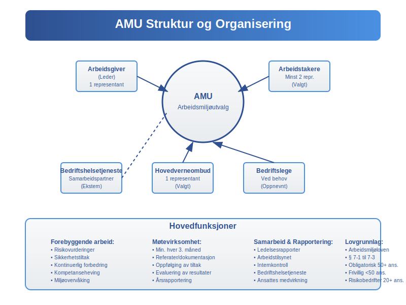
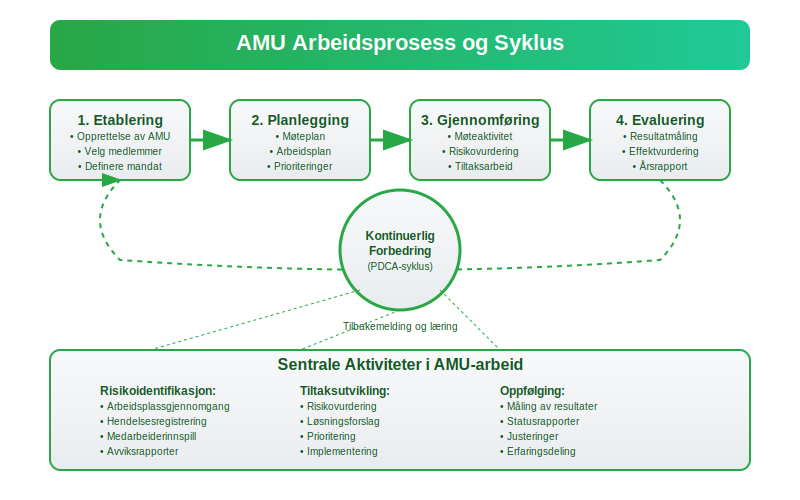

**AMU** (Arbeidsmiljøutvalg) er et obligatorisk samarbeidsorgan i virksomheter for å sikre et trygt og forsvarlig arbeidsmiljø i henhold til **arbeidsmiljøloven**. Formålet med AMU er å fremme samarbeid mellom arbeidsgiver og arbeidstakere om **HMS** (Helse, Miljø og Sikkerhet).

Innen **internkontroll** av arbeidsmiljø er AMU et sentralt verktøy. Les mer om [internkontroll](/blogs/regnskap/hva-er-internkontroll "Hva er internkontroll? Komplett Guide til Internkontroll og Regnskap").

**Bedriftshelsetjeneste** er også en viktig partner for AMU, og bidrar med helseundersøkelser og risikovurderinger. Se [Bedriftshelsetjeneste](/blogs/regnskap/bedriftshelsetjeneste "Bedriftshelsetjeneste – Guide til Bedriftshelsetjeneste i Norge").

## 1. Lovgrunnlag og Formål

**Arbeidsmiljøutvalg (AMU)** er regulert i § 7-1–7-3 i [arbeidsmiljøloven](/blogs/regnskap/hva-er-arbeidsmiljoloven "Arbeidsmiljøloven - Guide til Arbeidsrettslige Forpliktelser"). Hensikten er å:

* Systematisk forebygge arbeidsrelaterte skader og sykdommer
* Legge til rette for et fullt forsvarlig arbeidsmiljø
* Sikre at arbeidsgiver og arbeidstaker samarbeider om HMS-arbeidet
* Fremme medvirkning i planlegging og gjennomføring av HMS-tiltak
* Bidra til kontinuerlig forbedring av arbeidsmiljøet

### Juridisk Grunnlag

AMU er forankret i **arbeidsmiljøloven** kapittel 7, og er et lovpålagt organ som skal sikre at virksomheter oppfyller sine forpliktelser til å:

* Gi [ansatte](/blogs/regnskap/hva-er-lonn "Hva er lønn? Komplett Guide til Lønn i Norge") medbestemmelse i HMS-arbeidet
* Etablere systematisk og kontinuerlig HMS-arbeid
* Sikre at alle parter har tilgang til nødvendig informasjon om arbeidsmiljøet

## 2. Krav til Opprettelse

| Antall ansatte | AMU obligatorisk?         | Kommentarer                                           |
|----------------|---------------------------|-------------------------------------------------------|
| 50+            | Ja                        | Virksomheter med mer enn 50 ansatte skal opprette AMU |
| 20–49          | Ja, hvis risikofylt       | Dersom arbeidsmiljøet medfører særlig risiko          |
| Under 20       | Nei, men kan opprettes frivillig | Mindre virksomheter kan dra nytte av AMU-struktur    |

### Særlige Forhold

**Virksomheter** med **særlig risiko** omfatter (se også [Hva er et aksjeselskap?](/blogs/regnskap/hva-er-et-aksjeselskap "Hva er et aksjeselskap? Komplett Guide til AS i Norge")):

* Bygge- og anleggsvirksomhet
* Industrivirksomhet med kjemiske prosesser
* Virksomheter med høy skadefrekvens
* Offshore og maritime virksomheter

## 3. Sammensetning av AMU

| Rolle                           | Antall representanter           | Valg/Utnevning                    |
|---------------------------------|---------------------------------|-----------------------------------|
| Arbeidsgiver (leder)            | 1                               | Utnevnt av arbeidsgiver           |
| Arbeidstakernes representanter  | Minst 2 (etter avtale)          | Valgt av og blant ansatte         |
| Hovedverneombud                 | 1                               | Valgt av verneombud               |
| Bedriftslege                    | 1 (ved behov)                   | Oppnevnt av bedriftshelsetjeneste |

### Kompetansekrav

AMU-medlemmer bør ha:

* Kunnskap om virksomhetens **arbeidsprosesser**
* Forståelse av HMS-lovgivning
* Evne til å identifisere og vurdere risiko
* Kommunikasjonsferdigheter

## 4. Møter og Dokumentasjon

### Møtefrekvens

* AMU skal som hovedregel holde møter minst **hver tredje måned**
* Ekstraordinære møter kan innkalles ved behov
* Møter skal holdes oftere ved endringer i arbeidsmiljøet
* Alle møter skal dokumenteres med referat

### Dokumentasjonskrav

**Referater** fra møter skal inneholde:

* Dato, tid og deltakere
* Saker behandlet og vedtak fattet
* Oppfølgingstiltak og ansvarlige
* Frister for gjennomføring
* Evaluering av tidligere tiltak

### Tilgjengelighet

Referater skal:

* Gjøres tilgjengelige for alle ansatte
* Arkiveres i henhold til [dokumentasjonskrav](/blogs/regnskap/hva-er-dokumentasjon-regnskap-bokforing "Hva er dokumentasjon i regnskap og bokføring? Komplett Guide")
* Være tilgjengelige for Arbeidstilsynet ved inspeksjon

## 5. AMU og Internkontroll

AMU er en nøkkelkomponent i virksomhetens **internkontroll**-system for HMS. For en full oversikt over internkontroll og regnskapsrelaterte aspekter, se [Hva er internkontroll?](/blogs/regnskap/hva-er-internkontroll "Hva er internkontroll? Komplett Guide til Internkontroll og Regnskap").

### Internkontrollsystem

AMU bidrar til **internkontroll** ved å:

* Overvåke implementering av HMS-tiltak
* Vurdere effektiviteten av sikkerhetstiltak
* Sikre kontinuerlig forbedring
* Rapportere til ledelsen om HMS-status

## 6. Økonomiske Aspekter av AMU

### Kostnader

**Kostnadene** ved AMU-drift inkluderer:

* [Lønn](/blogs/regnskap/hva-er-lonn "Hva er lønn? Komplett Guide til Lønn i Norge") til medlemmer under møter
* Opplæring og kompetanseheving
* Møtelokaler og utstyr
* Dokumentasjon og rapportering

### Kostnadsføring

AMU-relaterte kostnader føres typisk som:

* [Driftskostnader](/blogs/regnskap/hva-er-driftskostnader "Hva er driftskostnader? Komplett Guide til Driftskostnader") - løpende drift av AMU
* [Personalkostnader](/blogs/regnskap/hva-er-personalkostnad "Hva er personalkostnad? Komplett Guide til Personalkostnader") - lønn under møter
* **Opplæringskostnader** - kurs og kompetanseheving

Se også [Hva er personalkostnad?](/blogs/regnskap/hva-er-personalkostnad "Hva er personalkostnad? Komplett Guide til Personalkostnader")

### Investeringer i HMS

AMU kan anbefale investeringer i:

* Sikkerhetsutstyr og verneombud
* Teknologiske løsninger for HMS
* Opplæring og kompetanseheving
* Miljøforbedringer
* [Velferdstiltak](/blogs/regnskap/hva-er-velferdstiltak "Hva er velferdstiltak? Komplett Guide til Velferdstiltak for Ansatte") for ansatte

## 7. AMU og Verneombud

**Verneombud** er sentrale i AMU-arbeidet og har følgende roller:

* Representere arbeidstakernes interesser
* Overvåke arbeidsmiljøet daglig
* Rapportere HMS-avvik til AMU
* Bidra til risikovurderinger

### Samarbeid med Bedriftshelsetjeneste

AMU samarbeider tett med [bedriftshelsetjenesten](/blogs/regnskap/bedriftshelsetjeneste "Bedriftshelsetjeneste – Guide til Bedriftshelsetjeneste i Norge") om:

* Helseundersøkelser av [ansatte](/blogs/regnskap/hva-er-lonn "Hva er lønn? Komplett Guide til Lønn i Norge")
* Kartlegging av eksponering
* Risikovurderinger
* Forebyggende tiltak

## 8. Rapportering og Oppfølging

### Årsrapport

AMU skal utarbeide en **årsrapport** som inneholder:

* Oversikt over HMS-aktiviteter
* Statistikk over skader og [sykefravær](/blogs/regnskap/hva-er-sykepenger "Hva er sykepenger? Komplett Guide til Sykepenger i Norge")
* Gjennomførte tiltak og resultater
* Planer for kommende periode

### Integrering med Regnskap

AMU-rapporter kan integreres med:

* [Årsoppgjør](/blogs/regnskap/hva-er-aarsoppgave "Hva er årsoppgave? Komplett Guide til Årsoppgave") - HMS-notater
* Bærekraftsrapportering
* [ESG-rapportering](/blogs/regnskap/hva-er-esg "Hva er ESG? Komplett Guide til ESG-rapportering")

## 9. Digitalisering av AMU-arbeid

### Digitale Verktøy

Moderne AMU-arbeid kan dra nytte av:

* **Digitale** møteplattformer
* HMS-systemer og databaser
* Rapporteringsverktøy
* Mobil-applikasjoner for registrering

### Integrering med ERP-systemer

AMU-data kan integreres med [ERP-systemer](/blogs/regnskap/hva-er-erp-system "Hva er ERP-system? Komplett Guide til Enterprise Resource Planning") for:

* Automatisert rapportering
* Kostnadsoppfølging
* Trendanalyser
* Benchmarking

## 10. Utfordringer og Løsninger

### Vanlige Utfordringer

* **Lav deltakelse** på møter
* Manglende oppfølging av tiltak
* Utilstrekkelig kompetanse
* Dårlig kommunikasjon

### Suksessfaktorer

* **Tydelig** ledelsesforankring
* Regelmessig opplæring
* Systematisk oppfølging
* Åpen kommunikasjon

## 11. Arbeidstilsynets Rolle

**Arbeidstilsynet** kan:

* Kontrollere at AMU er opprettet og fungerer
* Kreve innsyn i møtereferater
* Pålegge tiltak ved mangler
* Gi veiledning om AMU-arbeid

### Sanksjoner

Manglende opprettelse av AMU kan medføre:

* Pålegg om retting
* Tvangsmulkt
* Stenging av virksomhet
* Straffereaksjon

## 12. Internasjonale Standarder

AMU-arbeid bør ta hensyn til:

* **ISO 45001** - Arbeidsmiljøledelse
* ILO-konvensjoner
* EU-direktiver om arbeidsmiljø
* Beste praksis fra andre land

## 13. Fremtidige Utviklingstrender

### Teknologiske Innovasjoner

* **Kunstig intelligens** i risikovurdering
* IoT-sensorer for miljøovervåking
* Virtuell virkelighet i opplæring
* Blockchain for sporbarhet

### Regulatoriske Endringer

* Skjerpede krav til dokumentasjon
* Økt fokus på psykososialt arbeidsmiljø
* Integrasjon med [bærekraftsrapportering](/blogs/regnskap/baerekraft "Bærekraft i Regnskap: En Komplett Guide til Bærekraft og Bærekraftsrapportering")
* Digitalisering av rapporteringskrav

## 14. Praktiske Råd for AMU-arbeid

### Etablering av AMU

1. **Kartlegg** lovkrav og behov
2. Velg/utnevn medlemmer
3. Etabler møterutiner
4. Opprett dokumentasjonssystem
5. Sikre nødvendig kompetanse

### Effektiv Møteledelse

* **Forbered** møter grundig
* Følg opp tidligere vedtak
* Involver alle medlemmer
* Dokumenter beslutninger
* Kommuniser resultater

### Kvalitetssikring

* **Evaluer** AMU-arbeidet årlig
* Innhent tilbakemeldinger fra [ansatte](/blogs/regnskap/hva-er-lonn "Hva er lønn? Komplett Guide til Lønn i Norge")
* Benchmarking mot andre virksomheter
* Kontinuerlig forbedring

## 15. Konklusjon

**AMU** er et viktig verktøy for å sikre et trygt og forsvarlig arbeidsmiljø i norske virksomheter. Gjennom systematisk samarbeid mellom arbeidsgiver og arbeidstakere kan AMU bidra til å forebygge arbeidsrelaterte skader og sykdommer, samtidig som det styrker virksomhetens **internkontroll** og **HMS-arbeid**.

For å få maksimal nytte av AMU-arbeidet er det viktig med:

* Tydelig ledelsesforankring
* Kompetente medlemmer
* Systematisk oppfølging
* God dokumentasjon
* Kontinuerlig forbedring

Virksomheter som investerer i et aktivt og velfungerende AMU vil oppleve bedre arbeidsmiljø, færre skader og sykdommer, og styrket konkurranseevne gjennom reduserte kostnader og økt produktivitet. Dette påvirker også [arbeidskapital](/blogs/regnskap/hva-er-arbeidskapital "Hva er arbeidskapital? Komplett Guide til Arbeidskapital") positivt gjennom reduserte kostnader og økt effektivitet.
