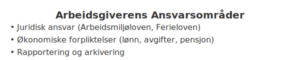

Arbeidsgiver er den juridiske parten i et arbeidsforhold som inngår en avtale om å utføre arbeid mot vederlag. En **arbeidsgiver** har en rekke *juridiske forpliktelser*, økonomiske ansvar og må følge spesifikke krav til regnskapsføring. Denne artikkelen gir en helhetlig oversikt over hvem en arbeidsgiver er, hvilke plikter som følger med rollen, og hvordan det håndteres i regnskapet.


## Hva er Arbeidsgiver?

Begrepet **arbeidsgiver** omtaler den part som tilbyr arbeidsytelse, inngår arbeidsavtaler og utbetaler lønn. Arbeidsgiver motiverer og leder arbeidstakere, og har ansvar for blant annet arbeidsmiljø, lønnsutbetalinger og rapportering til myndighetene. Les mer om ulike arbeidsforholdstyper i [Hva er Arbeidsforholdstype?](/blogs/regnskap/hva-er-arbeidsforholdstype "Hva er Arbeidsforholdstype?").

## Juridisk Rolle og Ansvar

Arbeidsgiverens ansvar fremgår av arbeidsmiljøloven, skattelovgivningen og andre relevante lover:

* Sikre et forsvarlig arbeidsmiljø i samsvar med arbeidsmiljøloven.
* Inngå og oppbevare skriftlige [arbeidskontrakter](/blogs/regnskap/arbeidskontrakten "Arbeidskontrakten").
* Overholde regler for oppsigelse, ferie og arbeidstid.
* Beregne og innbetale [arbeidsgiveravgift](/blogs/regnskap/hva-er-arbeidsgiveravgift "Hva er Arbeidsgiveravgift?")
* Rapportere lønns- og personalopplysninger via [A-meldingen](/blogs/regnskap/hva-er-a-melding "Hva er a-melding?")

## Økonomiske Forpliktelser

Arbeidsgiver bærer flere direkte kostnader knyttet til lønn og arbeidsforhold. Oversikt over sentrale forpliktelser:

| Forpliktelse                | Beskrivelse                                                   | Frist                                        |
|-----------------------------|---------------------------------------------------------------|----------------------------------------------|
| Registrering i AA-registeret| Meld inn som arbeidsgiver i Arbeidsgiver- og arbeidstakerregisteret | Før første lønnsutbetaling                   |
| A-melding                   | Månedlig rapportering av lønn, arbeidsgiveravgift og ytelser   | Innen 5. i måneden etter lønnsutbetaling      |
| Arbeidsgiveravgift          | Beregning og innbetaling av avgift basert på [bruttolønn](/blogs/regnskap/hva-er-bruttolonn "Hva er Bruttolønn? Definisjon, Beregning og Praktisk Anvendelse")       | Løpende innen året etter rapportering        |

## Regnskapsmessig Behandling

I regnskapet bokføres lønnskostnader som anskaffelseskost, og arbeidsgiveravgift som en separat kostnadskonto. Eksempel på grunnbokpost ved lønnsutbetaling:

```plaintext
Debet: Lønnskostnad
Debet: Arbeidsgiveravgift
Kredit: Bankinnskudd
```

For full oversikt over regnskapsprinsipper, se [Hva er Regnskap?](/blogs/regnskap/hva-er-regnskap "Hva er regnskap?").

## Videre Ansvarsområder



Her følger en detaljert oversikt over **ytterligere ansvar og forpliktelser** for arbeidsgiveren:

### Registrering og Identifikasjon

Arbeidsgiver må registrere virksomheten og seg selv i flere offentlige registre før første lønnsutbetaling:

| Register                       | Formål                                  | Frist                         |
|-------------------------------|-----------------------------------------|-------------------------------|
| AA-registeret                  | Arbeidsgiver- og arbeidstakerregisteret | Før ansettelse                |
| [Enhetsregisteret](/blogs/regnskap/hva-er-enhetsregisteret "Hva er Enhetsregisteret?") (Brønnøysund) | Tildeling av organisasjonsnummer        | Ved oppstart av virksomheten  |
| [NAV **B2B** (A-ordningen)](/blogs/regnskap/hva-er-b2b "Hva er B2B? Komplett Guide til Business-to-Business i Norsk Regnskap") | Avtale om rapportering til NAV via A-ordningen | Før første A-melding   |

### Lover og Regelverk

Arbeidsgiveren må følge relevante lover som regulerer arbeidsforhold og regnskap:

| Lov/regelverk           | Hovedinnhold                     | Link til artikkel                                                                 |
|-------------------------|----------------------------------|----------------------------------------------------------------------------------|
| Arbeidsmiljøloven       | HMS, arbeidstid og arbeidsmiljø  | [Arbeidsmiljøloven](/blogs/regnskap/hva-er-arbeidsmiljoloven "Arbeidsmiljøloven - Guide til Arbeidsrettslige Forpliktelser") |
| Ferieloven              | Rett til ferie og feriepenger     | [Feriepenger](/blogs/regnskap/hva-er-feriepenger "Hva er Feriepenger i Regnskap? Beregning, Regnskapsføring og Praktiske Eksempler") |
| Bokføringsloven         | Dokumentasjon og arkivering       | [Bokføringsloven](/blogs/regnskap/hva-er-bokforingsloven "Hva er Bokføringsloven? Komplett Guide til Norsk Bokføringslovgivning") |
| Skatteloven             | Skattemyndighetenes krav          | [Hva er Skatteloven?](/blogs/regnskap/hva-er-skatteloven "Hva er Skatteloven? Komplett Guide til Norsk Skattelovgivning") |

### Pensjon og Forsikring

Arbeidsgiver er ansvarlig for å tilby **obligatorisk tjenestepensjon (OTP)** og kan i tillegg velge å dekke andre forsikringsordninger:

- Obligatorisk tjenestepensjon anbefales å avsette minst 2 % av lønn.
- Mulighet for livsforsikring, ulykkesforsikring og gruppelivsforsikring.
- Lovpålagt yrkesskadeforsikring for alle ansatte; se [Yrkesskadeforsikring](/blogs/regnskap/yrkesskadeforsikring "Yrkesskadeforsikring – Guide til Yrkesskadeforsikring for Norske Virksomheter").

### Rapportering og Arkivering

Korrekt rapportering og oppbevaring av dokumenter er kritisk:

- **A-meldingen:** Månedlig rapportering av lønn og arbeidsgiveravgift (se [A-meldingen](/blogs/regnskap/hva-er-a-melding "Hva er a-melding?"))
- **Årsoppgaver:** Årlig innlevering av terminoppgaver for arbeidsgiveravgift og lønns- og trekkoppgave
- **Arkivering:** Oppbevar arbeidskontrakter, lønnskjøringsfiler og rapporter i minst 5 år i henhold til bokføringsforskriften

## Oppsummering

En **arbeidsgiver** har en sentral rolle i norsk arbeidsliv med tydelige juridiske forpliktelser og økonomiske ansvar. Korrekt håndtering av arbeidsavtaler, lønn, arbeidsgiveravgift og rapportering er avgjørende for å sikre lovlighet og effektiv drift.
