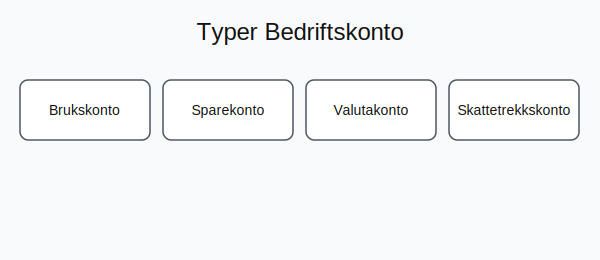

**Bedriftskonto** er en **bankkonto** designet spesielt for **virksomheter** i Norge, tilpasset for **daglig økonomistyring**, betalinger og integrasjon med regnskapssystemer.

En **bedriftskonto** er mer enn bare et betalingsverktøy; det er hjertet i bedriftens **likviditetsstyring** og finansielle infrastruktur.

Den gir oversikt over kontantstrøm, sikrer skille mellom private og forretningsmessige midler, og legger til rette for effektiv **bokføring** i henhold til norsk regnskapslov.

## Hva er bedriftskonto?

En bedriftskonto gir bedriften en strukturert måte å håndtere likviditet, betalinger og finansielle forpliktelser. Typiske funksjoner inkluderer:

* **Brukskonto** for daglige betalinger og inntekter
* **Sparekonto** for overskuddslikviditet
* **Valutakonto** for internasjonale transaksjoner
* **Skattetrekkskonto** for innskudd av skattetrekk ([Hva er Skattetrekkskonto?](/blogs/regnskap/hva-er-skattetrekkskonto "Hva er Skattetrekkskonto? Regnskapsføring av skattetrekk"))

Les mer om [Bedriftsbank](/blogs/regnskap/bedriftsbank "Bedriftsbank - Oversikt over banktjenester for bedrifter og regnskapsintegrasjon") for en helhetlig oversikt over bedriftens banktjenester.

* **Integrasjon** mot [regnskapssystemer](/blogs/regnskap/api-integrasjon-automatisering-regnskap "API-integrasjon og automatisering i regnskap")

## Typer bedriftskontoer

| Kontotype           | Beskrivelse                                    | Relatert artikkel                                                           |
|---------------------|------------------------------------------------|------------------------------------------------------------------------------|
| **Brukskonto**      | Daglig drift og betalinger                     | [Hva er Bankinnskudd?](/blogs/regnskap/hva-er-bankinnskudd "Bankinnskudd: Typer og føring") |
| **Sparekonto**      | Plassering av overskuddslikviditet             | [Hva er Bankinnskudd?](/blogs/regnskap/hva-er-bankinnskudd "Bankinnskudd: Typer og føring") |
| **Valutakonto**     | Håndtering av utenlandsk valuta                | [Hva er Banktransaksjoner?](/blogs/regnskap/hva-er-banktransaksjoner "Banktransaksjoner: Registrering og kontroll") |
| **Skattetrekkskonto**| Konto for innskudd av forskuddstrekk           | [Hva er Skattetrekkskonto?](/blogs/regnskap/hva-er-skattetrekkskonto "Skattetrekkskonto: Regnskapsføring av skattetrekk") |

## Fordeler med bedriftskonto

Å velge riktig bedriftskonto gir flere **fordeler**:

* **Oversikt** over kontantstrøm og saldo
* **Effektiv bokføring** med automatisk integrasjon
* **Bedre sikkerhet** og skille mellom private og bedriftens midler
* **Fleksibilitet** med spesialiserte kontoer for ulike behov

## Regnskapsføringshensyn

Bedriftskontoer må behandles i regnskapet i henhold til bokføringsregler:

| Kontotype           | Regnskapskontoeksempel                        |
|---------------------|-----------------------------------------------|
| **Brukskonto**      | Debet: Bank (1900) / Kredit: Inntekt/Kostnad   |
| **Sparekonto**      | Debet: Sparekonto (1920) / Kredit: Inntekt/Kostnad |
| **Skattetrekkskonto**| Debet: Skattetrekkskonto (2985) / Kredit: Skyld Skatt |

## Regulatoriske krav

Bedriftskontoer må oppfylle krav i henhold til [Bokføringsloven](/blogs/regnskap/hva-er-bokforingsloven "Hva er Bokføringsloven? Krav, Regler og Praktisk Veiledning") og Finanstilsynets retningslinjer. Dette inkluderer blant annet:

* **Registrering** med korrekt organisasjonsnummer og forretningsadresse
* **Skille** mellom driftskontoer og skattetrekkskonto
* **Hvitvaskingskontroll** gjennom etablerte internkontrollrutiner ([Hva er Internkontroll?](/blogs/regnskap/hva-er-internkontroll "Hva er Internkontroll? Prosesser og Rutiner for Kvalitetssikring"))

Se også [Hva er Bankavstemming?](/blogs/regnskap/hva-er-bankavstemming "Bankavstemming: Prosess og kontroll").

## Hvordan velge bedriftskonto

Ved valg av konto bør bedriften vurdere:

1. **Gebyrer** og kostnader
2. **Rentebetingelser** for spare- og brukskonto
3. **Digitale tjenester** som nettbank og mobilbank
4. **Integrasjon** med regnskapssystemer
5. **Kundeservice** og rådgivningstilbud

## Relaterte artikler

* [Hva er Bedriftsbank?](/blogs/regnskap/bedriftsbank "Hva er Bedriftsbank? Oversikt over banktjenester for bedrifter")
* [Hva er Bankinnskudd?](/blogs/regnskap/hva-er-bankinnskudd "Bankinnskudd: Typer og føring")
* [Hva er Banktransaksjoner?](/blogs/regnskap/hva-er-banktransaksjoner "Banktransaksjoner: Registrering og kontroll")
* [Hva er Bankavstemming?](/blogs/regnskap/hva-er-bankavstemming "Bankavstemming: Prosess og kontroll")
* [Hva er Skattetrekkskonto?](/blogs/regnskap/hva-er-skattetrekkskonto "Skattetrekkskonto: Regnskapsføring av skattetrekk")
