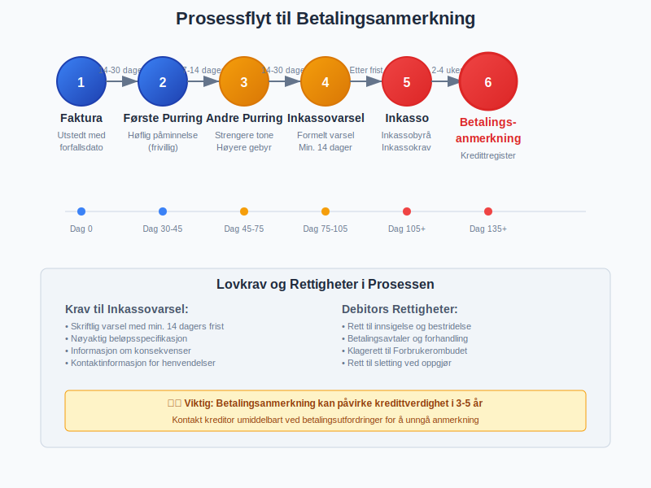
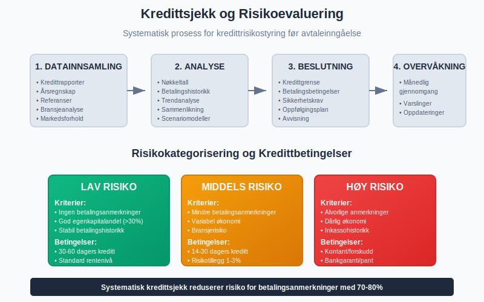
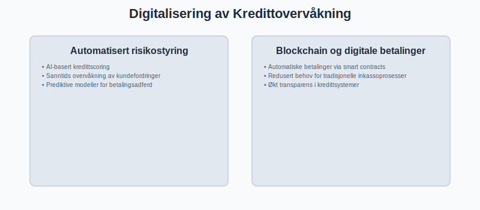

**Betalingsanmerkning** er en offentlig registrering av betalingsmislighold som får alvorlige konsekvenser for en virksomhets eller persons **[kredittverdighet](/blogs/regnskap/hva-er-bonitet "Hva er bonitet?")**. I norsk regnskap og kredittvurdering er betalingsanmerkninger et kritisk signal til markedet om manglende betalingsevne og representerer sluttstadiet i [inkassoprosessen](/blogs/regnskap/hva-er-inkasso "Hva er Inkasso? Komplett Guide til Inkassoselskaper og Inkassoprosessen"). For regnskapsførere og bedriftseiere er forståelse av betalingsanmerkninger essensielt for effektiv [kredittrisikostyring](/blogs/regnskap/hva-er-kundefordring "Hva er Kundefordring? Komplett Guide til Kundefordringer og Kredittrisiko") og [arbeidskapitalstyring](/blogs/regnskap/hva-er-arbeidskapital "Hva er Arbeidskapital? Analyse av Omløpsmidler og Likviditets­styring").

Man kan også konsultere **[Gjeldsregisteret](/blogs/regnskap/gjeldsregisteret "Hva er Gjeldsregisteret? En Guide til Gjeldsregisteret")** for informasjon om gjeld som ikke nødvendigvis fører til betalingsanmerkning, men som er relevant for en helhetlig kredittrisikostyring.

Dersom kravet fortsatt ikke dekkes etter betalingsanmerkning og gjeldsregister-registrering, kan **[Namsmannen](/blogs/regnskap/namsmannen "Namsmannen: Norsk tvangsfullbyrdelse og Namsmannens rolle")** iverksette tvangsfullbyrdelse for å kreve inn kravet.


## Seksjon 1: Definisjon og Juridisk Grunnlag

**Betalingsanmerkning** er en offentlig merknad som registreres i kredittopplysningsdatabaser når en forfalt [kundefordring](/blogs/regnskap/hva-er-kundefordring "Hva er Kundefordring? Komplett Guide til Kundefordringer og Kredittrisiko") ikke er betalt etter at inkassovarsel er sendt og rettslige frister er utløpt. Registreringen skjer i henhold til inkassoloven og personopplysningsloven, og representerer en form for **offentlig varsel** om manglende betalingsevne.

### Juridiske Rammer for Betalingsanmerkninger

Betalingsanmerkninger i Norge er regulert av:

* **Inkassoloven (1988):** Definerer prosessen for inkasso og registrering av betalingsanmerkninger
* **Personopplysningsloven/GDPR:** Regulerer behandling og lagring av kredittopplysninger
* **Kredittopplysningsloven:** Styrer virksomhet til kredittopplysningsforetak
* **Forbrukerkjøpsloven:** Beskytter forbrukere i kredittsammenheng


## Seksjon 2: Prosessen frem til Betalingsanmerkning

Veien fra ubetalt [faktura](/blogs/regnskap/hva-er-en-faktura "Hva er en Faktura? Komplett Guide til Fakturering og Regnskapsføring") til betalingsanmerkning følger en strukturert prosess som er lovregulert for å beskytte både kreditor og debitor.

### Detaljert Prosessoversikt

| Trinn | Handling | Tidsramme | Lovkrav |
|-------|----------|-----------|---------|
| **1. Faktura** | Utstedes med forfallsdato | Vanligvis 14-30 dager | Bokføringsforskriften |
| **2. Første [purring](/blogs/regnskap/hva-er-purring-og-purregebyr "Hva er Purring og Purregebyr? Guide til Norske Regler og Regnskapsføring")** | Høflig betalingspåminnelse | 7-14 dager etter forfall | Frivillig |
| **3. Andre purring** | Strengere tone, høyere gebyr | 14-30 dager etter første | Inkassoloven § 10a |
| **4. Inkassovarsel** | Formelt varsel om inkasso | Min. 14 dagers frist | Inkassoloven § 3 |
| **5. Inkassokrav** | Overføring til inkassobyrå | Umiddelbart etter frist | Inkassoloven |
| **6. **Betalingsanmerkning**** | Registrering ved manglende betaling | 2-4 uker etter inkasso | Kredittopplysningsloven |



### Krav til Inkassovarsel

For at en betalingsanmerkning skal være gyldig, må inkassovarselet oppfylle spesifikke lovkrav:

* **Skriftlig varsel** med minimum 14 dagers betalingsfrist
* **Nøyaktig beløpsspecifikasjon** inkludert hovedstol, renter og gebyrer
* **Informasjon om konsekvenser** ved manglende betaling
* **Kontaktinformasjon** for spørsmål og innsigelser
* **Referanse til originalfaktura** og tidligere påminnelser

## Seksjon 3: Typer Betalingsanmerkninger

Betalingsanmerkninger kan klassifiseres etter ulike kriterier som påvirker deres alvorlighetsgrad og konsekvenser for debitors kredittverdighet.

### Klassifisering etter Beløpsstørrelse

| Type | Beløpsgrense | Konsekvenser | Registreringsperiode |
|------|-------------|--------------|---------------------|
| **Mindre anmerkning** | Under 1 000 kr | Begrenset kredittvirkming | 1-2 år |
| **Standard anmerkning** | 1 000 - 50 000 kr | Betydelig kredittnedsetting | 3 år |
| **Alvorlig anmerkning** | Over 50 000 kr | Omfattende kredittrestriksjoner | 3-5 år |

### Klassifisering etter Type Fordring


**Kommersielle fordringer:**
* [Leverandørgjeld](/blogs/regnskap/hva-er-leverandorgjeld "Hva er Leverandørgjeld? Komplett Guide til Leverandørgjeld og Betalingsrutiner") fra næringsdrivende
* Profesjonelle tjenester (advokat, regnskapsfører)
* [Fakturaer](/blogs/regnskap/hva-er-en-faktura "Hva er en Faktura? Komplett Guide til Fakturering og Regnskapsføring") fra [B2B-transaksjoner](/blogs/regnskap/hva-er-b2b "Hva er B2B? Komplett Guide til Business-to-Business i Norsk Regnskap")

**Offentlige fordringer:**
* [Skattegjeld](/blogs/regnskap/hva-er-betalbar-skatt "Hva er Betalbar Skatt? Komplett Guide til Skatteberegning og Innbetaling") til Skatteetaten
* [MVA-gjeld](/blogs/regnskap/hva-er-moms-mva "Hva er Moms/MVA? Komplett Guide til Merverdiavgift i Norge") til MVA-registeret
* Kommunale avgifter og gebyrer

**Finansielle fordringer:**
* Banklån og kredittlinjer
* Kredittkortgjeld
* Forbrukslån

## Seksjon 4: Konsekvenser for Bedrifter og Privatpersoner

Betalingsanmerkninger får omfattende konsekvenser som påvirker både daglig drift og langsiktig finansiell planlegging. For regnskapsførere er det viktig å forstå disse konsekvensene for å gi korrekt rådgivning til klienter.

### Direkte Finansielle Konsekvenser


**Økte finansieringskostnader:**
* Høyere renter på lån (ofte 2-5 prosentpoeng økning)
* Krav om større [egenkapital](/blogs/regnskap/hva-er-egenkapital "Hva er Egenkapital? Komplett Guide til Egenkapital i Regnskap og Virksomhetsstyring") ved lånefinansiering
* Reduserte kredittgrenser hos banker og leverandører

**Operasjonelle restriksjoner:**
* Kontantbetaling kreves fra leverandører
* Kortere betalingsfrister på nye avtaler
* Krav om banksikkerhet eller depositum

### Påvirkning på Leverandørforhold

For bedrifter med betalingsanmerkninger endres [leverandørforholdet](/blogs/regnskap/hva-er-leverandorgjeld "Hva er Leverandørgjeld? Komplett Guide til Leverandørgjeld og Betalingsrutiner") betydelig:

| Område | Før anmerkning | Etter anmerkning |
|--------|---------------|------------------|
| **Betalingsbetingelser** | 30-60 dager kreditt | Kontant eller forskudd |
| **Kredittvurdering** | Automatisk godkjenning | Manuell vurdering |
| **Prisvilkår** | Standardpriser | Risikotillegg 5-15% |
| **Kontraktsvilkår** | Standardvilkår | Skjerpede sikkerhetsklausuler |

## Seksjon 5: Regnskapsmessig Behandling

Fra et regnskapsperspektiv krever betalingsanmerkninger spesiell oppmerksomhet både for kreditor og debitor. Korrekt regnskapsføring sikrer at finansrapportene gir et rettvisende bilde av virksomhetens finansielle stilling.

### Kreditors Regnskapsføring

**Ved utstedelse av inkassovarsel:**
```
Debitorkonten opprettholdes inntil endelig oppgjør
Eventuelle inkassokostnader aktiveres som del av fordringen
```

**Ved registrering av betalingsanmerkning:**
```
Vurdering av nedskrivningsbehov for [kundefordringen](/blogs/regnskap/hva-er-kundefordring "Hva er Kundefordring? Komplett Guide til Kundefordringer og Kredittrisiko")
Mulig avsetning for [tap på fordringer](/blogs/regnskap/avsetning "Avsetning i Regnskap - Komplett Guide til Avsetninger og Estimater")
```


### Debitors Regnskapsføring

For debitor påvirker betalingsanmerkninger:

* **Forpliktelser:** Gjelden øker med [forsinkelsesrenter](/blogs/regnskap/hva-er-forsinkelsesrente "Hva er Forsinkelsesrente? Komplett Guide til Morarenter og Beregning") og inkassosalær
* **Periodisering:** Påløpte renter og gebyrer må [periodiseres](/blogs/regnskap/hva-er-periodisering "Hva er Periodisering? Komplett Guide til Regnskapsperiodisering") korrekt
* **Noteopplysninger:** Vesentlige rettstvister og forpliktelser må opplyses

### Tapsavsetninger og Nedskrivninger

Kreditor må kontinuerlig vurdere behovet for tapsavsetninger:

| Situasjon | Nedskrivningsprosent | Begrunnelse |
|-----------|---------------------|-------------|
| **Nylig inkasso** | 10-25% | Økt tapsrisiko |
| **Betalingsanmerkning** | 25-75% | Betydelig tapsrisiko |
| **Juridisk forfølgelse** | 75-100% | Høy tapsrisiko |

## Seksjon 6: Forebygging og Risikostyring

Forebygging av betalingsanmerkninger krever systematisk [kredittrisikostyring](/blogs/regnskap/hva-er-kundefordring "Hva er Kundefordring? Komplett Guide til Kundefordringer og Kredittrisiko") og proaktiv kundeoppfølging. Dette er spesielt viktig for bedrifter med omfattende [fakturasalg](/blogs/regnskap/hva-er-fakturasalg "Hva er Fakturasalg? Komplett Guide til Kredittgivning og Debitorhåndtering").

### Kredittsjekk og Kundeevaluering



**Før avtaleinngåelse:**
* Kredittrapport fra Bisnode, Experian eller Lindorff
* Vurdering av årsregnskap og [nøkkeltall](/blogs/regnskap/hva-er-nokkeltall "Hva er Nøkkeltall? Komplett Guide til Finansielle Nøkkeltall i Regnskap")
* Referanser fra andre leverandører
* Vurdering av bransje og markedsrisiko

**Løpende overvåkning:**
* Månedlig gjennomgang av [kundefordringer](/blogs/regnskap/hva-er-kundefordring "Hva er Kundefordring? Komplett Guide til Kundefordringer og Kredittrisiko")
* Automatiske varslinger ved betalingsforsinkelse
* Regelmessig oppdatering av kredittgrenser

### Effektiv Fakturahåndtering

**Forebyggende tiltak:**
* Klar og tydelig [fakturering](/blogs/regnskap/hva-er-en-faktura "Hva er en Faktura? Komplett Guide til Fakturering og Regnskapsføring") med korrekte opplysninger
* Elektronisk fakturering via [eFaktura](/blogs/regnskap/hva-er-efaktura "Hva er eFaktura? Komplett Guide til Elektronisk Fakturering i Norge") eller [elektronisk fakturering](/blogs/regnskap/hva-er-elektronisk-fakturering "Hva er Elektronisk Fakturering? Komplett Guide til Digitale Fakturaløsninger")
* Systematisk oppfølging av forfallsdatoer
* Rask kontakt ved betalingsforsinkelse

## Seksjon 7: Prosedyre for Sletting av Betalingsanmerkning

Sletting av betalingsanmerkninger krever systematisk tilnærming og korrekt dokumentasjon. Prosessen kan være kompleks og tidkrevende, men er avgjørende for gjenoppbygging av kredittverdighet.

### Trinn-for-Trinn Sletteprosess


**1. Kartlegging av anmerkninger:**
* Innhent kredittrapport fra alle relevante register
* Identifiser alle registrerte anmerkninger
* Verifiser beløp og detaljer for hver anmerkning

**2. Kontakt med kreditorer:**
* Direkte kontakt med originalkreditor eller inkassobyrå
* Forhandling om oppgjør (kan være lavere enn full sum)
* Skriftlig avtale om betaling og sletting

**3. Betaling og dokumentasjon:**
* Betaling i henhold til avtale
* Innhenting av kvittering og sletteerklæring
* Oppfølging av faktisk sletting i registrene

### Kostnad ved Sletting

| Type anmerkning | Typisk oppgjørskrav | Slettingskostnad |
|----------------|-------------------|------------------|
| **Små beløp** | 50-80% av opprinnelig | 500-2 000 kr |
| **Standard beløp** | 60-90% av opprinnelig | 1 000-5 000 kr |
| **Store beløp** | 70-100% av opprinnelig | 2 000-10 000 kr |

## Seksjon 8: Betalingsanmerkninger i Ulike Bransjer

Forskjellige bransjer har ulike risikoprofiler og utfordringer knyttet til betalingsanmerkninger. Forståelse av bransjespesifikke faktorer er viktig for effektiv risikostyring.

### Høyrisikobransjer


**Bygg og anlegg:**
* Høy andel betalingsanmerkninger (8-12%)
* Sesongvariasjoner i [kontantstrøm](/blogs/regnskap/hva-er-kontantstrom "Hva er Kontantstrøm? Komplett Guide til Kontantstrømoppstilling og Analyse")
* Komplekse leverandørkjeder

**Detaljhandel:**
* Særlig utsatt ved konjunkturnedgang
* Høy [omsetning](/blogs/regnskap/hva-er-omsetning "Hva er Omsetning? Komplett Guide til Omsetning i Regnskap og Skatt") men lav margin
* Konkurranseutsatt marked

**Profesjonelle tjenester:**
* Lange innkrevingsperioder
* Subjektiv verdivurdering av tjenester
* Utfordringer med dokumentasjon

### Lavrisikobransjer

**Offentlig sektor:**
* Meget lav risiko for betalingsanmerkninger
* Forutsigbare betalingsrutiner
* Sikre kontraktsbetingelser

**Banker og finans:**
* Streng kredittovervåkning
* Automatiserte betalingssystemer
* Regulatorisk overvåkning

## Seksjon 9: Digitalisering og Fremtidige Trender

Digitaliseringen av kredittmarkedet og inkassoprosesser endrer landskapet for betalingsanmerkninger. Nye teknologier og reguleringer påvirker både risikostyring og prosedyrer.

### Teknologiske Innovasjoner



**Automatisert risikostyring:**
* AI-basert kredittscoring
* Sanntids overvåkning av kundefordringer
* Prediktive modeller for betalingsadferd

**Blockchain og digitale betalinger:**
* Automatiske betalinger via smart contracts
* Redusert behov for tradisjonelle inkassoprosesser
* Økt transparens i kredittsystemer

### Regulatoriske Endringer

**GDPR og personvern:**
* Strengere krav til behandling av kredittopplysninger
* Økt rett til sletting og korrigering
* Bedre beskyttelse av forbrukere

**Open Banking:**
* Bedre tilgang til faktiske betalingsdata
* Mer nøyaktig kredittrisikoevaluering
* Redusert avhengighet av historiske anmerkninger

## Seksjon 10: Beste Praksis for Regnskapsførere

Som regnskapsfører er det viktig å ha klare rutiner for håndtering av betalingsanmerkninger, både for å beskytte egen virksomhet og for å gi god rådgivning til klienter.

### Rutiner for Klientrådgivning


**Forebyggende rådgivning:**
* Implementering av effektive [fakturarutiner](/blogs/regnskap/hva-er-en-faktura "Hva er en Faktura? Komplett Guide til Fakturering og Regnskapsføring")
* Opplæring i kredittsjekk og kundeoppfølging
* Etablering av kredittreglement og betalingspolitikk

**Krishåndtering:**
* Bistand ved inkassovarsel og betalingsanmerkninger
* Forhandling med kreditorer og inkassobyråer
* Utarbeidelse av betalingsplaner og refinansieringsløsninger

### Dokumentasjon og Internkontroll

**Krav til dokumentasjon:**
* Systematisk arkivering av alle kredittopplysninger
* Oppbevaring av kredittavtaler og korrespondanse
* Regelmessig oppdatering av klientens kredittstatus

**Internkontrollrutiner:**
* Månedlig gjennomgang av klienters kredittrisiko
* Etablering av varslingsrutiner ved betalingsutfordringer
* Regelmessig opplæring i kredittregelverk

## Oppsummering og Praktiske Råd

**Betalingsanmerkninger** er et alvorlig regnskaps- og kreditthåndteringsemne som krever proaktiv og systematisk tilnærming. De representer betydelig kredittrisiko og kan få langvarige konsekvenser for både bedrifter og privatpersoner.

### Viktigste Lærepunkter

**For kreditorer:**
* Implementer effektive rutiner for [kundefordringsstyring](/blogs/regnskap/hva-er-kundefordring "Hva er Kundefordring? Komplett Guide til Kundefordringer og Kredittrisiko")
* Utfør grundige kredittsjekker før avtaleinngåelse
* Følg opp betalinger systematisk og konsekvent

**For debitorer:**
* Prioriter tidlig kontakt ved betalingsutfordringer
* Søk profesjonell rådgivning ved inkassovarsel
* Forstå konsekvensene av betalingsanmerkninger

**For regnskapsførere:**
* Gi proaktiv rådgivning om kredittrisikostyring
* Sikre korrekt regnskapsføring av fordringer og tapsavsetninger
* Hold deg oppdatert på endringer i kreditt- og inkassoregelverk

Effektiv håndtering av betalingsanmerkninger krever kombinasjon av juridisk kunnskap, regnskapsfaglig ekspertise og praktisk forretningsforståelse. Ved å følge etablerte prosedyrer og beste praksis kan virksomheter minimere risiko og beskytte sin kredittreputasjon i markedet.
