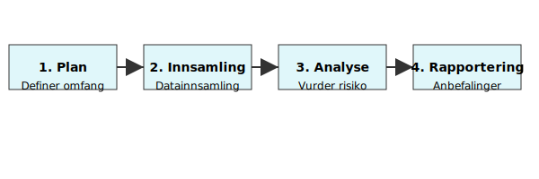

**Due diligence** er en systematisk gjennomgang og **risikovurdering** av regnskaps-, juridiske og operasjonelle forhold i en transaksjon, spesielt ved oppkjøp, fusjoner og investeringer i Norge.

## Hva er Due diligence?

Due diligence, ofte kalt *kjøpssjekk* på norsk, innebærer at en potensiell kjøper eller investor gjennomfører en grundig evaluering av en virksomhet før en transaksjon fullføres. Hensikten er å avdekke eventuelle risikoer og forpliktelser som kan påvirke kjøpsbeslutningen.

## Hvorfor er Due diligence viktig i Norge?

**Due diligence** sikrer at oppkjøp og investeringer gjennomføres på et informert grunnlag, i samsvar med norsk lovgivning som [Aksjeloven](/blogs/regnskap/hva-er-aksjeloven "Hva er Aksjeloven? Komplett Guide til Aksjeloven og Regnskapsregler"), [Regnskapsloven](/blogs/regnskap/hva-er-regnskap "Hva er Regnskapsloven? En Oversikt over Norsk Regnskapslovgivning"), og gjeldende [skatteregler](/blogs/regnskap/hva-er-skatt "Hva er Skatt? En Komplett Guide til Skatteregler i Norge").

## Typer Due diligence

| Type                  | Fokusområde                                   | Eksempler                         |
|-----------------------|-----------------------------------------------|-----------------------------------|
| **Finansiell**        | Gjennomgang av regnskap og kontantstrøm        | Revisjon av balanse, resultat, likviditet |
| **Juridisk**          | Evaluering av kontrakter og rettslige forpliktelser | Aksjonæravtaler, rettstvister, reguleringskrav |
| **Skattemessig**      | Undersøkelse av skatteposisjoner og forpliktelser | Skatterevisjoner, overføringspriser, MVA |
| **Operasjonell**      | Analyse av drift, prosesser og forsyningskjede  | Produksjonsprosesser, IT-systemer, anskaffelser |
| **Compliance**        | Vurdering av overholdelse av lover og standarder | Anti-korrupsjon, personvern (GDPR), HMS |

## Prosess for Due diligence

En typisk **due diligence**-prosess består av fire hovedfaser:

1. **Planlegging**  
   Definere omfang, mål og tidsplan for gjennomgangen.
2. **Innsamling**  
   Samle inn og strukturere dokumenter og data fra målvirksomheten.
3. **Analyse**  
   Vurdere risikoer, avdekke avvik og utarbeide anbefalinger.
4. **Rapportering**  
   Utarbeide en endelig rapport med funn, konklusjoner og handlingspunkter.

## Nøkkelfaktorer og beste praksis

* Utfør en grundig *forberedende sjekk* før dokumentinnhenting.  
* Involver spesialister innen regnskap, skatt og jus tidlig i prosessen.  
* Bruk standardiserte sjekklister og maler for konsistens og effektivitet.  
* Dokumenter alle funn og kommuniser avvik til relevante beslutningstakere.  
* Oppdater interne rutiner med læring fra tidligere due diligence-prosesser for kontinuerlig forbedring.

## Relaterte konsepter

* [Internkontroll](/blogs/regnskap/hva-er-internkontroll "Hva er Internkontroll? En Komplett Guide til Internkontroll i Norge")  
* [Datterselskap](/blogs/regnskap/datterselskap "Datterselskap - Definisjon, Styrekontroll og Konsolidering")  
* [God regnskapsskikk](/blogs/regnskap/god-regnskapsskikk "God Regnskapsskikk - Prinsipper, Standarder og Beste Praksis i Norge")  
* [Aksjeloven](/blogs/regnskap/hva-er-aksjeloven "Hva er Aksjeloven? Komplett Guide til Aksjeloven og Regnskapsregler")

## Videre lesning

For en dyptgående gjennomgang av *finansiell* og *operasjonell* due diligence, se også våre artikler om [finansregnskap](/blogs/regnskap/hva-er-finansregnskap "Hva er Finansregnskap? En Komplett Guide til Ekstern Finansiell Rapportering") og [driftsmidler](/blogs/regnskap/hva-er-driftsmidler "Hva er Driftsmidler? En Komplett Guide til Varige Driftsmidler og Avskrivninger").
