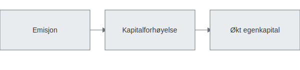

**Emisjon** er prosessen hvor et selskap utsteder nye aksjer eller andeler for å hente inn **egenkapital**. En emisjon er en måte å gjennomføre en [kapitalforhøyelse](/blogs/regnskap/kapitalforhoyelse "Kapitalforhøyelse: Metoder og Regnskapsføring") på for å finansiere vekst, investeringer eller nedbetaling av gjeld.

## Typer emisjon

| Type emisjon               | Beskrivelse                                                          | Anvendelse                                                                 |
|----------------------------|----------------------------------------------------------------------|-----------------------------------------------------------------------------|
| **Fortrinnsrettsemisjon**  | Aksjonærer får fortrinnsrett til å tegne nye aksjer i forhold til sin eierandel.        | Vanlig ved børsnoterte selskaper for å sikre eksisterende aksjonærers rettigheter. |
| **Rettet emisjon**         | Nye aksjer tilbys ett eller flere utvalgte investorer uten fortrinnsrett for andre aksjonærer. | Brukes for å hente kapital raskt eller til strategiske partnere.                |
| **Offentlig emisjon**      | Nye aksjer tilbys allmennheten og noteres ofte på børs.                            | Typisk ved børsnotering eller store kapitalinnhentinger.                  |

## Juridisk rammeverk og prosess

Emisjonsprosessen reguleres av [Aksjeloven](/blogs/regnskap/hva-er-aksjeloven "Hva er Aksjeloven? Regler for Aksjeselskaper i Norge") og selskapets [vedtekter](/blogs/regnskap/hva-er-vedtekter-for-aksjeselskap "Hva er Vedtekter for Aksjeselskap? Krav og Innhold"), og følger normalt disse trinnene:

1. **Styreforslag** om [kapitalforhøyelse](/blogs/regnskap/kapitalforhoyelse "Kapitalforhøyelse: Metoder og Regnskapsføring") og emisjonsvilkår.
2. Utarbeidelse av **prospekt** hvis emisjonen er offentlig eller stor nok til å kreve prospekt.
3. **Generalforsamling** godkjenner emisjonen og emisjonsvilkårene.
4. **Tegningsperiode** hvor investorer kan tegne og betale for nye aksjer.
5. Registrering av kapitalforhøyelsen i **Foretaksregisteret** som del av Brønnøysundregistrene.
6. Tildeling og utstedelse av nye aksjer.

Se også [Hva er et Aksjeselskap?](/blogs/regnskap/hva-er-et-aksjeselskap "Hva er et Aksjeselskap? Komplett Guide til Selskapsformen") for mer om krav til selskapsstruktur.

## Fordeler og ulemper med emisjon

- **Fordeler:**  
  - Gir tilgang på ny kapital uten økt gjeldsbyrde.  
  - Kan styrke egenkapital og kredittverdighet.  
  - Fortrinnsrettsemisjon beskytter eksisterende aksjonærers eierandeler.  

- **Ulemper:**  
  - Utvanning av eksisterende aksjonærers eierandel ved rettet eller offentlig emisjon.  
  - Kostnader tilknyttet prospekt, rådgivere og registrering.  
  - Krav til offentlig informasjon og innsyn kan være omfattende.  

## Regnskapsføring av emisjon

| Konto             | Debet             | Kredit                         |
|-------------------|-------------------|--------------------------------|
| Bankinnskudd      | Innbetalt beløp   |                                |
| Aksjekapital      |                   | Pålydende verdi av nye aksjer |
| Overkursfond      |                   | Overkursbeløp                 |

Se [Hva er Pålydende?](/blogs/regnskap/palydende "Hva er Pålydende? Guide til pålydende verdi") for detaljer om **pålydende**.

## Ofte stilte spørsmål

### Hva er forskjellen mellom fortrinnsrettsemisjon og rettet emisjon?

Fortrinnsrettsemisjon gir alle eksisterende aksjonærer en rett til å delta i emisjonen, mens rettet emisjon kun tilbys utvalgte investorer.

### Når må selskapet utarbeide prospekt?

Et prospekt kreves som regel ved offentlig emisjon eller ved emisjoner over visse terskelverdier fastsatt i prospektreglene.

### Hvordan påvirker emisjon aksjekursen?

Emisjon kan føre til utvanning og midlertidig kursnedgang, men samtidig gi selskapet økte vekstmuligheter på sikt.

## Videre lesning

- [Hva er aksjeloven?](/blogs/regnskap/hva-er-aksjeloven "Hva er Aksjeloven? Regler for Aksjeselskaper i Norge")
- [Hva er vedtekter for aksjeselskap?](/blogs/regnskap/hva-er-vedtekter-for-aksjeselskap "Hva er Vedtekter for Aksjeselskap? Krav og Innhold")
- [Hva er egenfinansiering?](/blogs/regnskap/hva-er-egenfinansiering "Hva er Egenfinansiering? Komplett guide til egenkapitalfinansiering")
- [Hva er overkursfond?](/blogs/regnskap/hva-er-overkursfond "Hva er Overkursfond? Guide til overkurs ved kapitalforhøyelse")
