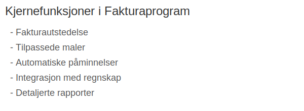

**Fakturaprogram** er spesialisert programvare for å opprette, sende og følge opp fakturaer elektronisk. Moderne fakturaprogram tilbyr **automatisering**, **integrasjon** med regnskapssystemer og fleksible maler for å sikre korrekt og profesjonell fakturabehandling i norske bedrifter.
 
Integrasjoner med **regnskapsprogram** gir deg full kontroll over økonomien i sanntid (se [Regnskapsprogram](/blogs/regnskap/regnskapsprogram "Regnskapsprogram: Økonomistyring for Norske Bedrifter")).

[Fakturering](/blogs/regnskap/fakturering "Fakturering: Guide til Prosessen for Opprettelse, Utsending og Oppfølging av Faktura") gir innsikt i hele prosessen med å utstede og følge opp fakturaer.

## Seksjon 1: Hva er et Fakturaprogram?

Et fakturaprogram er en digital løsning som håndterer hele fakturaprosessen fra opprettelse til betaling. Det bygger på funksjoner som:

* **Fakturautstedelse** med validering av lovpålagte krav (se [Hva er en faktura?](/blogs/regnskap/hva-er-en-faktura "Hva er en Faktura? En Guide til Norske Fakturakrav"))  
* **Tilpassede fakturamaler** for profesjonelt design (se [Fakturamal](/blogs/regnskap/hva-er-fakturamal "Hva er Fakturamal? Komplett Guide til Fakturamaler og Fakturadesign"))  
* **Automatiske betalingspåminnelser** og kredittoppfølging  
* **Integrasjon** med regnskapssystemer og banktjenester  
* **Rapportering** og statistikk over fakturavolum og innbetalinger

I mange bedrifter integreres fakturaprogram direkte med [regnskapsføring](/blogs/regnskap/hva-er-bokforing "Hva er Bokføring? Komplett Guide til Regnskapsføring og Bokføringsregler") og bilagsdatabase for sømløs bokføring.

## Seksjon 2: Kjernefunksjoner i Fakturaprogram

| Funksjon               | Beskrivelse                                                         | Lenke til relevant guide                                                                 |
|------------------------|---------------------------------------------------------------------|------------------------------------------------------------------------------------------|
| **Fakturautstedelse**  | Opprettelse og utsendelse av fakturaer med korrekt innhold          | [Hva er en faktura?](/blogs/regnskap/hva-er-en-faktura "Hva er en Faktura?")            |
| **Maler og design**    | Skreddersydde maler som oppfyller bokføringsforskriften             | [Fakturamal](/blogs/regnskap/hva-er-fakturamal "Hva er Fakturamal?")                    |
| **Automatiske påminnelser** | Varsling om forfalte betalinger og gebyrhåndtering              | [Hva er forsinkelsesgebyr](/blogs/regnskap/hva-er-forsinkelsesgebyr "Hva er Forsinkelsesgebyr?") |
| **Regnskapsintegrasjon**| Direkte kobling til [API-integrasjon og automatisering](/blogs/regnskap/api-integrasjon-automatisering-regnskap "API Integrasjon og Automatisering av Regnskap") | [API Integrasjon](/blogs/regnskap/api-integrasjon-automatisering-regnskap)       |
| **Rapportering**       | Detaljerte rapporter for inntektsanalyse og finansstyring           | [Hva er nøkkeltall?](/blogs/regnskap/hva-er-nokkeltall "Hva er Nøkkeltall?")              |

## Seksjon 3: Hvordan velge riktig Fakturaprogram

Valg av fakturaprogram avhenger av bedriftens behov og omfang. Vurder følgende kriterier:

* **Pris og prismodell:** Abonnement vs. engangslisens  
* **Brukervennlighet:** Intuitivt grensesnitt og opplæringsbehov  
* **Skalerbarhet:** Antall fakturaer, antall brukere og tilleggsmoduler  
* **Integrasjoner:** Støtte for [bankavstemming](/blogs/regnskap/hva-er-bankavstemming "Hva er Bankavstemming?") og økonomisystemer  
* **Sikkerhet og compliance:** ISO-sertifisering, kryptering og personvern (GDPR)

## Seksjon 4: Integrasjon og automatisering

Effektiv fakturabehandling krever ofte tett integrasjon med regnskapssystemer og betalingsløsninger. Mange fakturaprogram tilbyr:

1. **API-tilgang** for dataoverføring (se [API Integrasjon og Automatisering av Regnskap](/blogs/regnskap/api-integrasjon-automatisering-regnskap "API Integrasjon og Automatisering av Regnskap"))  
2. **Bankkoblinger** for automatisk avstemming og innlesning av betalinger  
3. **Elektronisk fakturaformat** (EHF/eFaktura) for offentlig sektor (se [Hva er elektronisk fakturering?](/blogs/regnskap/hva-er-elektronisk-fakturering "Hva er elektronisk fakturering?"))  
4. **Automatisk bokføring** av bilag (se [Bilag](/blogs/regnskap/bilag "Bilag - Komplett Guide til Digital Bilagsbehandling"))

## Seksjon 5: Implementering og beste praksis

En vellykket implementering av fakturaprogram omfatter gjerne:

* **Kartlegging av eksisterende prosesser** og dokumentflyt  
* **Datamigrering** av kunderegister og fakturahistorikk  
* **Opplæring** av ansatte og definering av roller  
* **Pilotfase** med testfakturering og kvalitetssikring  
* **Lansering** og kontinuerlig forbedring basert på tilbakemeldinger

## Konklusjon

Et riktig fakturaprogram bidrar til **økt effektivitet**, **bedre likviditetsstyring** og **redusert risiko** for feil og tapte betalinger. Ved å velge en løsning som passer bedriftens størrelse og behov, legger du grunnlaget for en profesjonell og moderne fakturaprosess.
