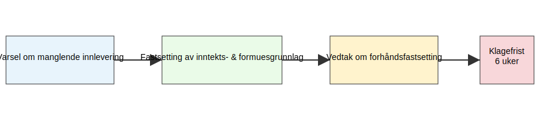

Forhåndsfastsetting er skattemyndighetenes **rett til å fastsette** en skattyters inntekts- og formuesgrunnlag på forhånd når skattemelding ikke er levert innen fristen eller når opplysningene er mangelfulle. Denne artikkelen gir en **detaljert gjennomgang** av det juridiske grunnlaget, prosessen, relevante frister og klagemuligheter.

## Juridisk grunnlag for Forhåndsfastsetting

Skattemyndighetene kan foreta forhåndsfastsetting i henhold til skatteforvaltningsloven § 9-2 når:

* Skattyter ikke leverer [skattemelding](/blogs/regnskap/skattemelding "Skattemelding") innen gitte frister.
* Skattemeldingen inneholder vesentlige mangler eller feil.

Vedtak om forhåndsfastsetting er et formelt **skattevedtak** som kan påklages.

## Oversikt over prosessen

| **Trinn** | **Beskrivelse** |
|-----------|-----------------|
| 1. Varsel om manglende innlevering | Skattemyndighetene sender forhåndsvarsel. |
| 2. Fastsetting av inntekts- og formuesgrunnlag | Skattemyndigheten estimerer grunnlaget på bakgrunn av tilgjengelige opplysninger. |
| 3. Vedtak om forhåndsfastsetting | Formelt vedtak fattes og sendes til skattyter. |
| 4. Klagefrist | Skattyter har normalt 6 uker på å klage på vedtaket. |

## Frister og klagemuligheter

Klagefristen etter vedtak om forhåndsfastsetting er **6 uker** fra den dagen skattyter mottar vedtaket. En klage sendes til skattemyndighetene og vurderes i tråd med reglene i forvaltningsloven kapittel VI.

## Praktisk eksempel

En næringsdrivende leverer ikke skattemelding innen 30. april. Skattemyndighetene sender et forhåndsvarsel 1. juni, og fastsetter deretter skattepliktig inntekt basert på fjorårets omsetning og gjennomsnittlig bransjetall. Vedtaket mottas 15. juni, og skattyter klager innen 6-ukersfristen.

## Oppsummering

Forhåndsfastsetting er et viktig virkemiddel for å sikre skatteinntekter når skattyter unnlater å levere eller gir mangelfulle opplysninger. **Kjennskap til juridisk grunnlag, prosess og klagemuligheter** gir skattytere bedre forutsetninger for å ivareta sine rettigheter.
