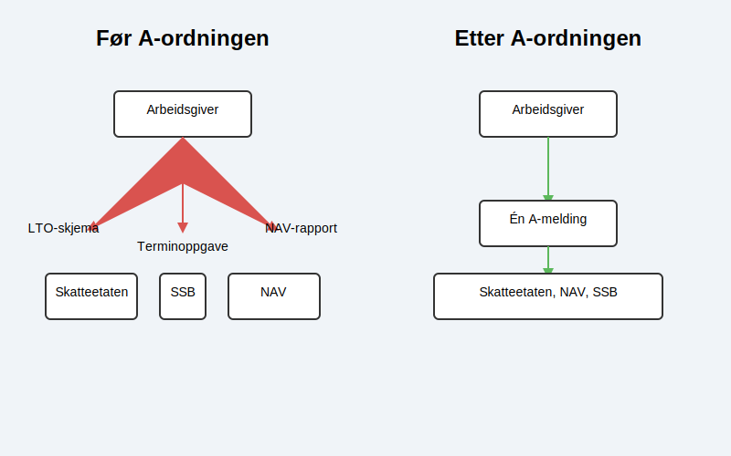
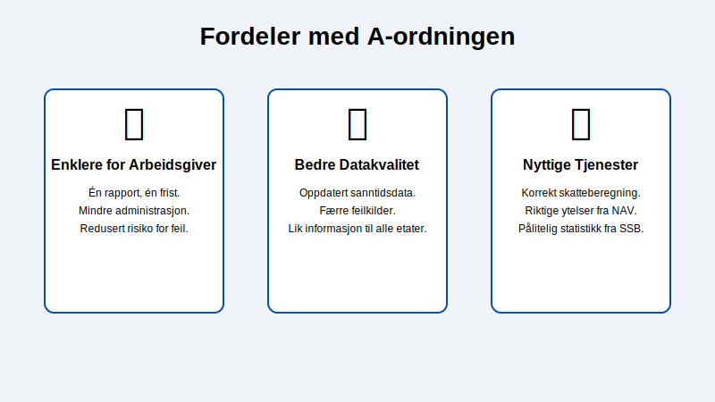

A-ordningen representerer en av de største moderniseringene i norsk offentlig forvaltning. Men hva er det egentlig?

Enkelt forklart er **A-ordningen** en **[samordnet registermelding](/blogs/regnskap/samordnet-registermelding "Samordnet registermelding")** og digital måte for [arbeidsgivere](/blogs/regnskap/arbeidsgiver "Arbeidsgiver – Roller og Ansvar i Norsk Arbeidsliv og Regnskap") å rapportere informasjon om lønn og arbeidsforhold på. I stedet for å sende flere ulike skjemaer til forskjellige etater, rapporterer arbeidsgiveren nå alt samlet på ett sted gjennom [a-meldingen](/blogs/regnskap/hva-er-a-melding "Hva er a-melding?").

Denne ordningen ble innført i 2015 for å gjøre hverdagen enklere for bedrifter og samtidig gi myndighetene (Skatteetaten, NAV og SSB) raskere og bedre tilgang til korrekte data.

## Før og etter A-ordningen

For å forstå verdien av A-ordningen, er det nyttig å se på hvordan systemet fungerte tidligere. Før 2015 måtte arbeidsgivere forholde seg til en fragmentert og tidkrevende rapporteringsprosess.

**Før A-ordningen måtte bedrifter sende inn blant annet:**

*   Lønns- og trekkoppgaver (LTO-skjema) til Skatteetaten (årlig).
*   Terminoppgave for [arbeidsgiveravgift](/blogs/regnskap/hva-er-arbeidsgiveravgift "Hva er Arbeidsgiveravgift? En Komplett Guide til Norges Lønnsavgift") (del av [trygdeavgift](/blogs/regnskap/hva-er-trygdeavgift "Hva er Trygdeavgift? Komplett Guide til Beregning og Regnskapsføring")) og forskuddstrekk til Skatteetaten (annenhver måned).
*   Melding til Aa-registeret (NAV) ved ansettelser og opphør av arbeidsforhold.
*   Lønnsstatistikk til SSB (for utvalgte bedrifter).

Denne prosessen var preget av mange skjemaer, ulike frister og fare for avvik mellom hva som ble rapportert til de forskjellige etatene. Med A-ordningen ble alt dette erstattet av én enkelt, månedlig rapport: a-meldingen.

## Mål og fordeler med A-ordningen

A-ordningen ble designet med flere klare mål, som gir fordeler for både arbeidsgivere, ansatte og myndighetene.

**De viktigste fordelene er:**

1.  **Forenkling for arbeidsgivere:** Én rapport, én innleveringsfrist og ett sted å forholde seg til. Dette reduserer den administrative byrden betraktelig.
2.  **Bedre datakvalitet og aktualitet:** Myndighetene får hyppigere og mer pålitelige data. Dette reduserer feil og sikrer at alle etater jobber med det samme, oppdaterte datagrunnlaget.
3.  **Mer effektive offentlige tjenester:** Korrekt og fersk informasjon gjør saksbehandlingen hos NAV og Skatteetaten raskere og mer presis. Dette sikrer at ansatte får riktig skatt og de ytelsene de har krav på til rett tid.
4.  **Bedre grunnlag for statistikk og samfunnsplanlegging:** SSB får tilgang til et rikt datamateriale som gir et nøyaktig bilde av lønns- og sysselsettingsutviklingen i Norge.

## Hvordan fungerer A-ordningen i praksis?

Selve hjertet i A-ordningen er **a-meldingen**. Det er den praktiske utførelsen av ordningen. Hver måned sender arbeidsgiveren inn en a-melding som inneholder alle nødvendige detaljer om de ansattes lønn og arbeidsforhold. Denne informasjonen blir deretter automatisk distribuert til de tre etatene.

For en dypere forståelse av hva som skal rapporteres og hvordan, les vår detaljerte guide: [Hva er a-melding?](/blogs/regnskap/hva-er-a-melding "En komplett guide til a-meldingen").

## A-ordningen og ditt regnskap

A-ordningen er tett knyttet til bedriftens [regnskaps-](/blogs/regnskap/hva-er-regnskap "Hva er regnskap?") og lønnsrutiner. Korrekt føring av lønn er en forutsetning for en korrekt a-melding. Moderne lønnssystemer er designet for å håndtere dette sømløst, hvor a-meldingen genereres automatisk basert på data fra lønnskjøringen.

## Relaterte ord

*   A-melding
*   Aa-registeret
*   [Arbeidsgiveravgift](/blogs/regnskap/hva-er-arbeidsgiveravgift "Hva er Arbeidsgiveravgift? En Komplett Guide til Norges Lønnsavgift")
*   [Feriepenger](/blogs/regnskap/hva-er-feriepenger "Hva er Feriepenger i Regnskap? Beregning, Regnskapsføring og Praktiske Eksempler")
*   Forskuddstrekk
*   Lønnssystem
