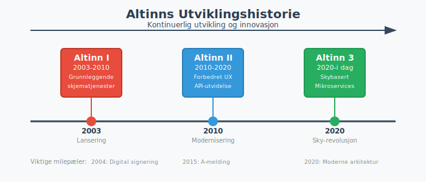
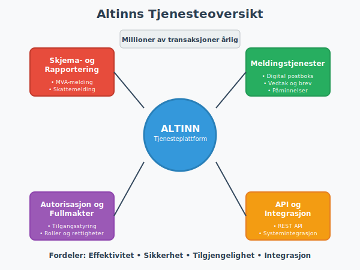
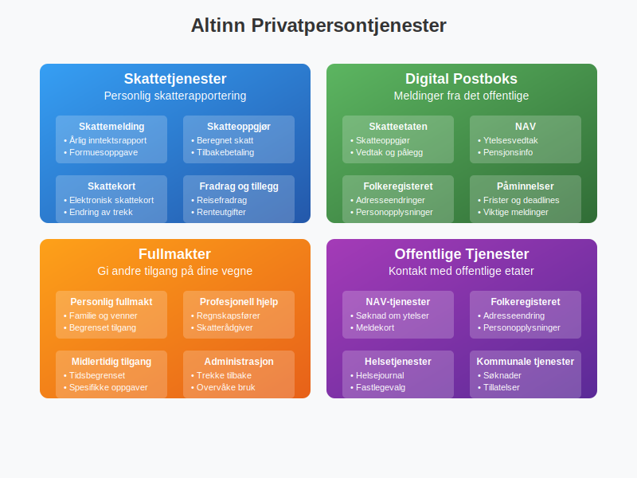
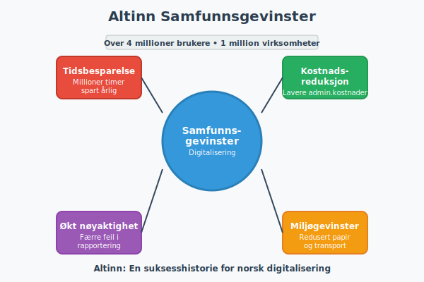
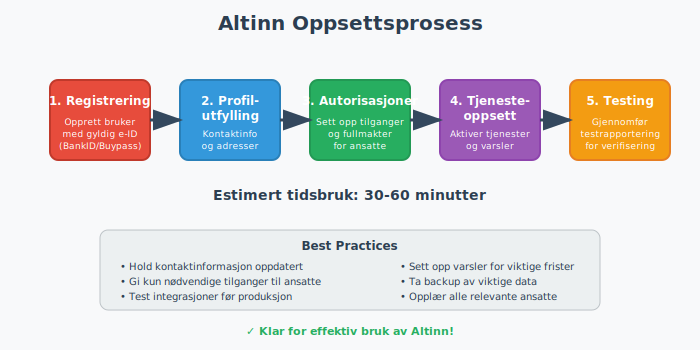

**Altinn** er Norges felles internettportal for digital dialog mellom næringslivet, privatpersoner og offentlige etater. Siden oppstarten i 2003 har Altinn revolusjonert måten nordmenn kommuniserer med det offentlige på, og har blitt en hjørnestein i Norges digitale infrastruktur. Plattformen håndterer millioner av transaksjoner årlig og er den primære kanalen for å levere lovpålagte skjemaer som MVA-meldinger, skattemeldinger og A-meldinger. Som den sentrale plattformen for **[opplysningsplikten](/blogs/regnskap/hva-er-opplysningsplikt "Hva er opplysningsplikt? Komplett guide til rapporteringsplikt")**, muliggjør Altinn **[egenmelding](/blogs/regnskap/hva-er-egenmelding "Hva er Egenmelding? Komplett Guide til Selvrapportering i Norsk Regnskap")** - selvrapportering hvor virksomheter og privatpersoner selv rapporterer sine økonomiske forhold til myndighetene.

*Se også: [Integrasjon](/blogs/regnskap/integrasjon "Integrasjon – En Innføring i Integrasjonskonsepter i Regnskap").*
*Se også: [Skjemafobi](/blogs/regnskap/skjemafobi "Skjemafobi – Hvordan overvinne frykt for skjemaer i regnskap").*

## Seksjon 1: Altinns Historie og Utvikling

Altinn integreres ofte med **[ELMA](/blogs/regnskap/elma "Hva er ELMA? En Guide til Elektronisk Mottaker- og Avsenderregister")** for å automatisere digital adressering ved utsendelse av elektroniske meldinger som eFaktura og EHF.

Altinn har gjennomgått en betydelig utvikling siden oppstarten, med tre hovedgenerasjoner som hver har brakt nye muligheter og forbedringer.

### 1.1 Altinn I (2003-2010)

Den første versjonen av Altinn ble lansert i 2003 som et pionerprosjekt for digital forvaltning. Hovedfokuset var å digitalisere de mest brukte skjemaene fra Skatteetaten, SSB og Brønnøysundregistrene.

**Viktige milepæler:**
* 2003: Lansering med grunnleggende skjematjenester
* 2004: Innføring av digital signering
* 2006: Utvidelse til å inkludere flere etater
* 2008: Introduksjon av meldingstjenester

### 1.2 Altinn II (2010-2020)

Den andre generasjonen brakte betydelige forbedringer i brukeropplevelse og funksjonalitet. Dette var perioden hvor Altinn virkelig ble en integrert del av norsk næringsliv.

**Nøkkelforbedringer:**
* Forbedret brukergrensesnitt og navigasjon
* Utvidet API-funksjonalitet for systemintegrasjon
* Innføring av [A-meldingen](/blogs/regnskap/hva-er-a-melding "Hva er A-meldingen? En Komplett Guide") i 2015
* Bedre mobilstøtte og responsivt design

### 1.3 Altinn 3 (2020-i dag)

Den tredje generasjonen representerer en fullstendig modernisering av plattformen, bygget på moderne skyteknologi og mikroservicearkitektur.

**Revolusjonerende endringer:**
* Skybasert infrastruktur for bedre skalerbarhet
* Forbedret API-først tilnærming
* Moderne brukergrensesnitt med fokus på brukervennlighet
* Økt sikkerhet og personvernbeskyttelse

## Seksjon 2: Altinns Kjernetjenester

Altinn tilbyr et bredt spekter av tjenester som dekker de fleste interaksjoner mellom borgere, bedrifter og offentlige etater.

### 2.1 Skjema- og Rapporteringstjenester

Dette er kjernen i Altinn-plattformen, hvor brukere kan fylle ut og sende inn lovpålagte skjemaer.

| Tjeneste | Beskrivelse | Hyppighet | Målgruppe |
|----------|-------------|-----------|-----------|
| **[MVA-melding](/blogs/regnskap/hva-er-mva-melding "Hva er MVA-melding? Komplett Guide til Merverdiavgiftsrapportering i Norge")** | Rapportering av merverdiavgift | Annenhver måned | MVA-registrerte virksomheter |
| **Skattemelding** | Årlig inntekts- og formuesrapportering | Årlig | Alle skattepliktige |
| **A-melding** | Samordnet rapportering av lønn og ytelser | Månedlig | Arbeidsgivere |
| **Årsregnskap** | Lovpålagt regnskapsrapportering | Årlig | Regnskapspliktige virksomheter |
| **Næringsoppgave** | Detaljert [næringsspesifikasjon](/blogs/regnskap/naringsspesifikasjon "Hva er Næringsspesifikasjon? Komplett Guide til Næringsklassifisering og Rapportering") | Årlig | Næringsdrivende |

### 2.2 Meldingstjenester

Altinn fungerer som en sikker postboks hvor offentlige etater kan sende viktige dokumenter og meldinger.

**Typiske meldinger:**
* Skatteoppgjør og vedtak fra Skatteetaten
* Tilskuddsbrev og vedtak fra NAV
* Kontrollrapporter og pålegg fra Arbeidstilsynet
* Registreringsbevis fra Brønnøysundregistrene

### 2.3 Autorisasjons- og Fullmaktstjenester

En av Altinns mest verdifulle funksjoner er muligheten til å gi andre tilgang til å handle på vegne av deg eller din virksomhet.

**Typer tilganger:**
* **Enkeltrettigheter:** Tilgang til spesifikke skjemaer eller tjenester
* **Roller:** Forhåndsdefinerte tilgangspakker (f.eks. "Regnskapsmedarbeider")
* **Hovedadministrator:** Full tilgang til virksomhetens Altinn-profil

## Seksjon 3: Sikkerhet og Innlogging

Sikkerhet er fundamentalt i Altinns design, gitt den sensitive naturen av informasjonen som håndteres.

### 3.1 Innloggingsmetoder

Altinn støtter flere sikre innloggingsmetoder for å imøtekomme ulike brukerbehov.

**Tilgjengelige metoder:**

* **BankID:** Den mest brukte metoden, tilgjengelig fra alle norske banker
* **BankID på mobil:** Praktisk løsning for mobile enheter
* **Buypass:** Alternativ e-ID leverandør
* **Commfides:** Bedriftssertifikater for organisasjoner
* **MinID:** Grunnleggende identifikasjon for enklere tjenester

### 3.2 Sikkerhetsnivåer

Altinn opererer med fire sikkerhetsnivåer som bestemmer hvilke tjenester som er tilgjengelige:

| Nivå | Beskrivelse | Innloggingsmetode | Tilgjengelige tjenester |
|------|-------------|-------------------|------------------------|
| **Nivå 1** | Grunnleggende | Brukernavn/passord | Informasjonstjenester |
| **Nivå 2** | Forsterket | MinID | Enkle skjemaer |
| **Nivå 3** | Høy** | BankID/Buypass | De fleste tjenester |
| **Nivå 4** | Meget høy | Avanserte sertifikater | Sensitive virksomhetstjenester |

### 3.3 Personvern og Datahåndtering

Altinn følger strenge retningslinjer for personvern og datahåndtering i henhold til GDPR og norsk personvernlovgivning.

**Viktige prinsipper:**
* **Dataminimering:** Kun nødvendige data samles inn
* **Formålsbegrensning:** Data brukes kun til det oppgitte formålet
* **Lagringsminimering:** Data slettes når de ikke lenger er nødvendige
* **Sikker overføring:** All kommunikasjon krypteres med TLS

## Seksjon 4: Altinn for Bedrifter

For norske bedrifter er Altinn en uunnværlig del av den daglige driften, spesielt når det gjelder [regnskapsføring](/blogs/regnskap/hva-er-regnskap "Hva er Regnskap? En Dybdeanalyse for Norge") og rapportering.

### 4.1 Virksomhetsprofil og Organisering

Hver virksomhet har en egen profil i Altinn som inneholder grunnleggende informasjon og tilgangsstyring.

**Profilinnhold:**
* Organisasjonsnummer og grunnleggende virksomhetsdata
* Kontaktinformasjon og adresser
* Autoriserte personer og deres tilganger
* Aktive tjenester og abonnementer

### 4.2 Regnskapsmessige Rapporteringer

Altinn er den primære kanalen for alle regnskapsmessige rapporteringer til norske myndigheter.

**Månedlige rapporteringer:**
* **[MVA-melding](/blogs/regnskap/hva-er-mva-melding "Hva er MVA-melding? Komplett Guide til Merverdiavgiftsrapportering i Norge"):** Rapportering av merverdiavgift for MVA-registrerte virksomheter
* **A-melding:** Samordnet rapportering av lønn, ytelser og arbeidsforhold

**Årlige rapporteringer:**
* **Årsregnskap:** Lovpålagt regnskapsrapportering for regnskapspliktige
* **[Næringsoppgave](/blogs/regnskap/hva-er-naeringsoppgave "Hva er Næringsoppgave? Komplett Guide til Næringsoppgaven i Norge"):** Skattemelding for næringsdrivende med detaljert inntekts- og kostnadsrapportering
* **[Aksjonærregisteroppgave](/blogs/regnskap/aksjonaerregisteroppgave "Hva er Aksjonærregisteroppgave? Komplett Guide til Årlig Rapportering"):** Obligatorisk årlig rapportering av eierforhold for alle aksjeselskaper

### 4.3 Integrasjon med Regnskapssystemer

Moderne regnskapssystemer tilbyr direkte integrasjon med Altinn, noe som dramatisk forenkler rapporteringsprosessene.

**Fordeler med integrasjon:**
* **Automatisk dataoverføring:** Eliminerer manuell inntasting
* **Redusert feilrisiko:** Mindre menneskelige feil i overføringen
* **Tidsbesparelse:** Raskere behandling av rapporter
* **Sanntidsvalidering:** Umiddelbar tilbakemelding på feil eller mangler

## Seksjon 5: Altinn for Privatpersoner

Selv om Altinn ofte assosieres med bedrifter, tilbyr plattformen også verdifulle tjenester for privatpersoner.

### 5.1 Personlige Tjenester

**Viktige tjenester for privatpersoner:**

* **Skattemelding:** Årlig inntekts- og formuesrapportering
* **Meldinger fra det offentlige:** Sikker mottak av viktige dokumenter
* **Fullmakter:** Gi andre tilgang til å handle på dine vegne
* **Kontakt med NAV:** Søknader og kommunikasjon om ytelser
* **Folkeregisteret:** Oppdatering av adresse og personopplysninger

### 5.2 Digital Post

Altinn fungerer som en sikker digital postboks hvor privatpersoner kan motta viktige dokumenter fra offentlige etater.

**Typiske dokumenter:**
* Skatteoppgjør og vedtak
* Vedtak om ytelser fra NAV
* Informasjon fra Folkeregisteret
* Påminnelser og frister

## Seksjon 6: Teknisk Arkitektur og API

Altinn 3 er bygget på moderne skyteknologi og tilbyr omfattende API-funksjonalitet for integrasjon.

### 6.1 Arkitekturoverview

**Hovedkomponenter:**
* **Frontend:** Moderne React-basert brukergrensesnitt
* **API Gateway:** Sentral inngangsport for alle API-kall
* **Mikroservices:** Modulære tjenester for spesifikk funksjonalitet
* **Database:** Sikker lagring av data og metadata
* **Integrasjonsplattform:** Kobling til eksterne systemer

### 6.2 API-funksjonalitet

Altinn tilbyr omfattende API-er som gjør det mulig for eksterne systemer å integrere direkte med plattformen.

**Hovedkategorier av API-er:**

| API-kategori | Beskrivelse | Bruksområde |
|--------------|-------------|-------------|
| **Authentication** | Håndtering av innlogging og autorisasjon | Sikker tilgang til tjenester |
| **Forms** | Opprettelse og innsending av skjemaer | Automatisert rapportering |
| **Messages** | Sending og mottak av meldinger | Kommunikasjon med etater |
| **Authorization** | Administrasjon av tilganger og roller | Fullmaktshåndtering |
| **Profile** | Administrasjon av bruker- og virksomhetsprofiler | Profiloppdateringer |

### 6.3 Utviklerressurser

Altinn tilbyr omfattende ressurser for utviklere som ønsker å integrere med plattformen.

**Tilgjengelige ressurser:**
* **Dokumentasjon:** Detaljerte API-referanser og guider
* **Testmiljø:** Sandbox-miljø for testing av integrasjoner
* **SDK-er:** Programvarebiblioteker for populære programmeringsspråk
* **Support:** Teknisk støtte for utviklere

## Seksjon 7: Altinns Rolle i Norsk Digitalisering

Altinn har spilt en sentral rolle i digitaliseringen av norsk offentlig sektor og har blitt et forbilde for andre land.

### 7.1 Samfunnsøkonomiske Gevinster

Digitaliseringen gjennom Altinn har generert betydelige samfunnsøkonomiske gevinster.

**Kvantifiserbare gevinster:**
* **Tidsbesparelse:** Millioner av timer spart årlig for bedrifter og privatpersoner
* **Kostnadsreduksjon:** Lavere administrative kostnader for både private og offentlige aktører
* **Økt nøyaktighet:** Færre feil i rapportering og saksbehandling
* **Miljøgevinster:** Redusert papirforbruk og transport

### 7.2 Internasjonal Anerkjennelse

Altinn har fått internasjonal anerkjennelse som et ledende eksempel på digital forvaltning.

**Utmerkelser og anerkjennelse:**
* FNs pris for offentlig tjenesteyting
* Europeisk pris for digital innovasjon
* Referanseprosjekt for EU-kommisjonen
* Studiebesøk fra over 50 land

### 7.3 Fremtidige Utviklingsretninger

Altinn fortsetter å utvikle seg for å møte fremtidens behov og teknologiske muligheter.

**Planlagte forbedringer:**
* **Kunstig intelligens:** Automatisering av rutineoppgaver og forbedret brukeropplevelse
* **Blockchain:** Økt sikkerhet og sporbarhet i transaksjoner
* **IoT-integrasjon:** Direkte rapportering fra smarte enheter
* **Prediktiv analyse:** Proaktiv identifikasjon av potensielle problemer

## Seksjon 8: Praktisk Bruk av Altinn

For å maksimere nytten av Altinn er det viktig å forstå hvordan plattformen brukes mest effektivt.

### 8.1 Første gangs oppsett

**Trinn for nye brukere:**

1. **Registrering:** Opprett bruker med gyldig e-ID
2. **Profilutfylling:** Legg inn nødvendig kontaktinformasjon
3. **Autorisasjoner:** Sett opp nødvendige tilganger og fullmakter
4. **Tjenesteoppsett:** Aktiver relevante tjenester og varsler
5. **Testing:** Gjennomfør en testrapportering for å verifisere oppsettet

### 8.2 Best Practices for Bedrifter

**Anbefalte rutiner:**

* **Regelmessig oppdatering:** Hold kontaktinformasjon og autorisasjoner oppdatert
* **Backup av data:** Ta regelmessige sikkerhetskopier av viktige data
* **Opplæring:** Sørg for at alle relevante ansatte er opplært i Altinn-bruk
* **Integrasjon:** Vurder integrasjon med regnskapssystem for økt effektivitet
* **Overvåking:** Sett opp varsler for viktige frister og meldinger
* **Profesjonell hjelp:** Mange bedrifter velger å bruke **[ARS (Autorisert Regnskapsførerselskap)](/blogs/regnskap/hva-er-ars "Hva er ARS? Autorisert Regnskapsførerselskap - Krav, Fordeler og Prosess")** for å sikre korrekt og rettidig rapportering gjennom Altinn, spesielt for komplekse virksomheter

### 8.3 Feilsøking og Support

Altinn tilbyr omfattende støtte for brukere som opplever problemer.

**Supportkanaler:**
* **Selvhjelp:** Omfattende FAQ og brukerveiledninger
* **Telefonsupport:** Direkte kontakt med supportpersonell
* **E-postsupport:** Detaljerte henvendelser og oppfølging
* **Webinarer:** Regelmessige opplæringssessjoner
* **Brukergrupper:** Erfaringsdeling med andre brukere

## Seksjon 9: Altinn og Fremtiden

Som en sentral del av Norges digitale infrastruktur, fortsetter Altinn å utvikle seg for å møte fremtidens utfordringer og muligheter.

### 9.1 Teknologiske Trender

**Emerging technologies som vil påvirke Altinn:**

* **Maskinlæring:** Automatisering av datavalidering og anomalideteksjon
* **Natural Language Processing:** Forbedret søk og brukerinteraksjon
* **Robotic Process Automation:** Automatisering av repetitive oppgaver
* **Edge Computing:** Raskere behandling og redusert latens

### 9.2 Regulatoriske Endringer

Altinn må kontinuerlig tilpasse seg endringer i lovgivning og regulatoriske krav.

**Kommende endringer:**
* **EU-direktiver:** Implementering av nye europeiske krav
* **Skattelovgivning:** Tilpasning til endringer i skatteregler
* **Personvernregulering:** Kontinuerlig forbedring av personvernbeskyttelse
* **Cybersikkerhet:** Implementering av nye sikkerhetsstandarder

### 9.3 Brukerforventninger

Moderne brukere har høye forventninger til digitale tjenester, og Altinn må kontinuerlig forbedre brukeropplevelsen.

**Fokusområder:**
* **Mobiloptimalisering:** Bedre støtte for mobile enheter
* **Personalisering:** Tilpassede brukeropplevelser basert på bruksmønstre
* **Sanntidsoppdateringer:** Umiddelbar tilbakemelding og statusoppdateringer
* **Tverrkanalkommunikasjon:** Sømløs opplevelse på tvers av kanaler

## Konklusjon

Altinn har etablert seg som en hjørnestein i Norges digitale infrastruktur og har fundamentalt endret måten nordmenn interagerer med det offentlige på. Fra de første skjematjenestene i 2003 til dagens sofistikerte skybaserte plattform, har Altinn konsekvent levert innovasjon og verdi for både privatpersoner og bedrifter.

For norske bedrifter er Altinn ikke bare et verktøy, men en nødvendighet for å oppfylle lovpålagte rapporteringskrav som [MVA-meldinger](/blogs/regnskap/hva-er-regnskap "Hva er Regnskap? En Dybdeanalyse for Norge"), skattemeldinger og A-meldinger. Plattformens integrasjonsmuligheter med moderne regnskapssystemer har dramatisk forenklet administrative prosesser og redusert både tid og kostnader.

Fremover vil Altinn fortsette å utvikle seg, drevet av teknologiske fremskritt og endrede brukerforventninger. Med fokus på kunstig intelligens, forbedret sikkerhet og enda bedre brukeropplevelser, er Altinn godt posisjonert for å møte fremtidens utfordringer og fortsette sin rolle som en ledende digital forvaltningsplattform.

For alle som driver virksomhet i Norge eller har behov for å kommunisere med norske myndigheter, er forståelse og effektiv bruk av Altinn ikke bare en fordel – det er en nødvendighet i dagens digitale samfunn.
