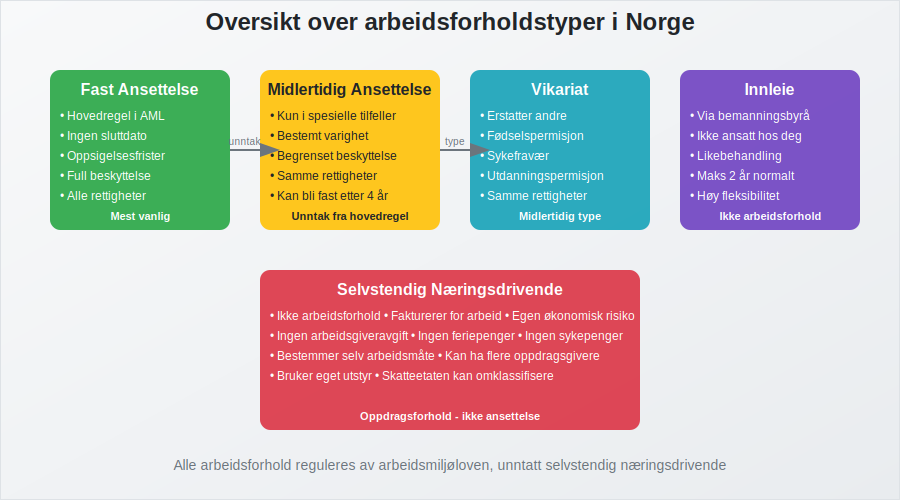
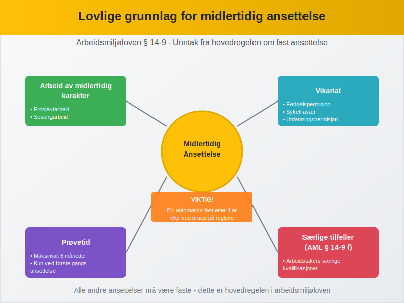
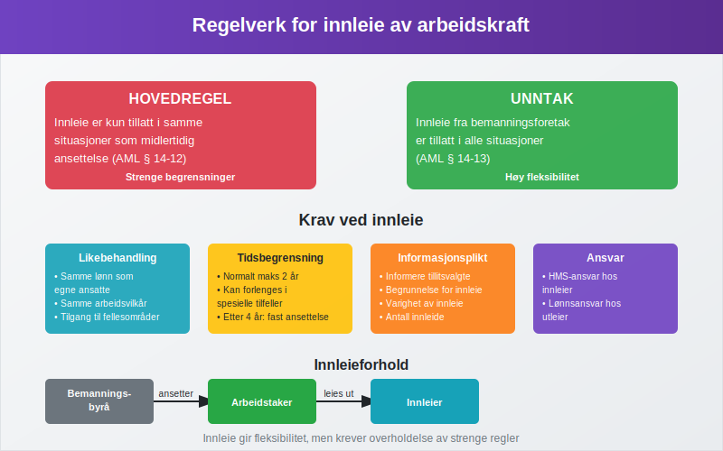
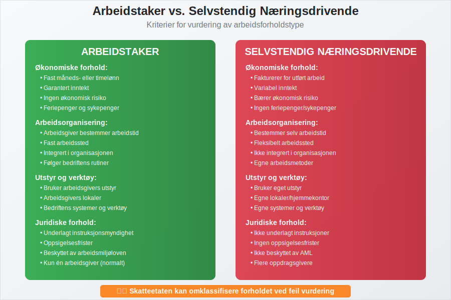
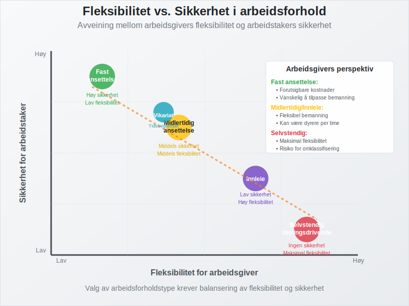

**Arbeidsforholdstype** refererer til den juridiske og praktiske rammen som definerer forholdet mellom [arbeidsgiver](/blogs/regnskap/arbeidsgiver "Arbeidsgiver") og arbeidstaker. I Norge reguleres arbeidsforhold hovedsakelig av arbeidsmiljøloven, og valg av arbeidsforholdstype har betydelige konsekvenser for både juridiske rettigheter, økonomiske forpliktelser og regnskapsføring.

*Les mer om krav til **arbeidskontrakt** i artikkelen [Arbeidskontrakten](/blogs/regnskap/arbeidskontrakten "Arbeidskontrakten").*

Arbeidsforholdstypen bestemmer alt fra oppsigelsesfrister og feriepenger til hvordan lønnskostnader skal behandles i [regnskapet](/blogs/regnskap/hva-er-regnskap "Hva er regnskap?") og rapporteres gjennom [a-meldingen](/blogs/regnskap/hva-er-a-melding "Hva er a-melding?").

I tillegg spiller [Arbeidsmiljøutvalg (AMU)](/blogs/regnskap/amu "AMU (Arbeidsmiljøutvalg) – Komplett Guide til Arbeidsmiljøutvalg i Norge") en viktig rolle i å styrke samarbeidet om **HMS** i virksomheter.

## Hovedtyper av arbeidsforhold i Norge

I norsk arbeidsliv skiller vi mellom flere grunnleggende arbeidsforholdstyper, hver med sine særskilte kjennetegn og juridiske rammer.

### 1. Fast ansettelse

**Fast ansettelse** er den vanligste og mest beskyttede formen for arbeidsforhold i Norge. Dette er hovedregelen i arbeidsmiljøloven, og gir arbeidstakeren størst trygghet og rettigheter.

#### Kjennetegn ved fast ansettelse:

* Ingen forhåndsbestemt sluttdato
* Full beskyttelse mot usaklig oppsigelse
* Rett til feriepenger, sykepenger og andre lovpålagte ytelser
* Oppsigelsesfrister fra 1-6 måneder avhengig av ansettelsestid
* Rett til permisjon ved fødsel, adopsjon og omsorg

### 2. Midlertidig ansettelse

**Midlertidig ansettelse** kan kun benyttes i spesielle situasjoner som er uttrykkelig hjemlet i arbeidsmiljøloven. Dette er et unntak fra hovedregelen om fast ansettelse.

#### Lovlige grunnlag for midlertidig ansettelse:

* Arbeid av midlertidig karakter
* Vikariat for arbeidstaker med rett til å komme tilbake
* Prøvetid (maksimalt 6 måneder)
* Sesongarbeid
* Prosjektarbeid med avgrenset varighet

### 3. Vikariat

**Vikariat** er en spesiell form for midlertidig ansettelse hvor en person erstatter en annen arbeidstaker som har rett til å komme tilbake til stillingen.

#### Typiske vikariatsituasjoner:

* Fødselspermisjon og foreldrepermisjon
* Sykefravær av lengre varighet
* Utdanningspermisjon
* Velferdspermisjon
* Militærtjeneste

## Sammenligning av arbeidsforholdstyper

| Arbeidsforholdstype | Varighet | Oppsigelsesfrister | Feriepenger | Sykepenger |
|---------------------|----------|-------------------|-------------|------------|
| **Fast ansettelse** | Ubestemt | 1-6 måneder | Ja | Ja |
| **Midlertidig** | Bestemt periode | Ingen/korte | Ja | Ja |
| **Vikariat** | Til fast ansatt returnerer | Ingen/korte | Ja | Ja |
| **Innleie** | Variabel | Ingen | Via byrå | Via byrå |
| **Selvstendig** | Per oppdrag | Ingen | Nei | Nei |

## Innleie av arbeidskraft

**Innleie av arbeidskraft** innebærer at en bedrift leier inn personell fra et bemanningsbyrå eller lignende. Den innleide arbeidstakeren har arbeidsavtale med utleiebedriften, ikke med virksomheten hvor arbeidet utføres.

### Regelverk for innleie:

* Hovedregelen: Innleie er kun tillatt i samme situasjoner som midlertidig ansettelse
* Unntak: Innleie fra bemanningsforetak er tillatt i alle situasjoner
* Krav til likebehandling med egne ansatte
* Begrensninger på innleieperiode (normalt maksimalt 2 år)

## Selvstendig næringsdrivende vs. arbeidstaker

Skillet mellom **selvstendig næringsdrivende** og arbeidstaker er avgjørende for både juridiske rettigheter og skattemessige konsekvenser.

### Kriterier for vurdering:

#### Arbeidstaker-indikatorer:
* Fast måneds- eller timelønn
* Arbeidsgiver bestemmer arbeidstid og arbeidssted
* Integrert i virksomhetens organisasjon
* Bruker arbeidsgivers verktøy og utstyr
* Ikke økonomisk risiko

#### Selvstendig næringsdrivende-indikatorer:
* Fakturerer for utført arbeid
* Bestemmer selv hvordan arbeidet utføres
* Har flere oppdragsgivere
* Bruker eget utstyr
* Bærer økonomisk risiko

## Regnskapsføring av ulike arbeidsforholdstyper

Hvordan lønnskostnader regnskapsføres avhenger av arbeidsforholdstypen:

### Fast og midlertidig ansatte:
* Lønnskostnad føres som personalkostnad
* Arbeidsgiveravgift beregnes og føres
* Feriepengeavsetning gjøres
* Rapporteres via [a-meldingen](/blogs/regnskap/hva-er-a-melding "Hva er a-melding?")

### Innleide:
* Kostnaden føres som kjøp av tjenester
* Ingen arbeidsgiveravgift for innleier
* Bemanningsbyrået håndterer lønnsrapportering

### Selvstendig næringsdrivende:
* Kostnaden føres som kjøp av tjenester
* Behandles som enhver annen [faktura](/blogs/regnskap/hva-er-en-faktura "Hva er en faktura?")
* Ingen lønnsrapportering for oppdragsgiver

## Særlige hensyn ved valg av arbeidsforholdstype

### Juridisk sikkerhet:
Feil klassifisering av arbeidsforhold kan få alvorlige konsekvenser. Skatteetaten og Arbeidstilsynet kan omklassifisere forholdet, noe som kan medføre:

* Etterbetaling av arbeidsgiveravgift
* Krav om etterlevelse av arbeidsmiljøloven
* Bøter og sanksjoner

### Fleksibilitet vs. sikkerhet:
* **Fast ansettelse** gir høy sikkerhet for arbeidstaker, men mindre fleksibilitet for arbeidsgiver
* **Midlertidig ansettelse** gir mer fleksibilitet, men krever lovlig grunnlag
* **Innleie** gir høy fleksibilitet, men kan være kostbart
* **Selvstendig næringsdrivende** gir maksimal fleksibilitet, men krever klar avgrensning

## Endringer i arbeidsforholdstype

Et arbeidsforhold kan endre karakter over tid. Typiske overganger:

* Midlertidig til fast ansettelse (etter 4 år eller ved brudd på reglene)
* Prøvetid til fast ansettelse
* Vikariat til fast ansettelse (hvis den faste ansatte ikke returnerer)
* Selvstendig til arbeidstaker (ved endrede arbeidsforhold)

## Arbeidsforholdstype og [akkordlønn](/blogs/regnskap/hva-er-akkordlonn "Hva er akkordlønn?")

Uavhengig av arbeidsforholdstype kan lønnen organiseres på ulike måter. [Akkordlønn](/blogs/regnskap/hva-er-akkordlonn "Hva er akkordlønn?") kan for eksempel benyttes både for fast og midlertidig ansatte, men krever at det fortsatt foreligger et arbeidsforhold og ikke selvstendig næringsvirksomhet.

## Konklusjon

Valg av arbeidsforholdstype er en fundamental beslutning som påvirker både juridiske rettigheter, økonomiske forpliktelser og praktisk drift. Det er viktig å:

* Velge riktig type basert på arbeidsoppgavenes karakter
* Sikre at alle lovkrav overholdes
* Dokumentere grunnlaget for valget
* Regnskapsføre korrekt basert på arbeidsforholdstypen
* Vurdere både fleksibilitet og sikkerhet

For bedrifter er det essensielt å ha gode rutiner for håndtering av ulike arbeidsforholdstyper, både for å sikre regelverksetterlevelse og optimal ressursutnyttelse.
