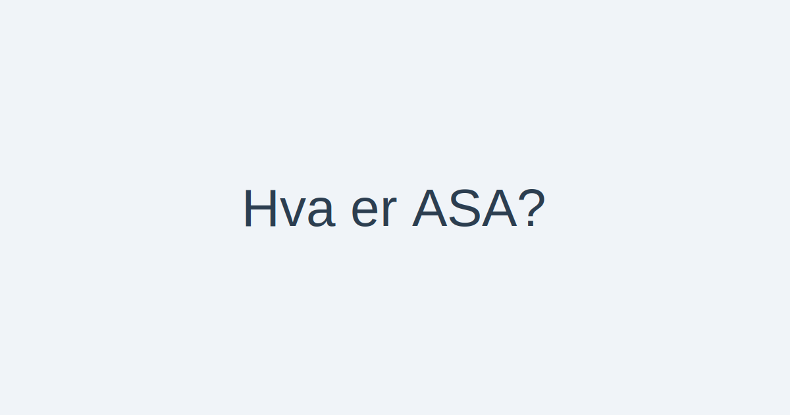

For en oversikt over ulike selskapsformer i Norge, se [Selskapsform](/blogs/regnskap/selskapsform "Selskapsform: Oversikt over selskapsformer i Norge").

En **allmennaksjeselskap (ASA)** er en selskapsform regulert av [Aksjeloven](/blogs/regnskap/hva-er-aksjeloven "Hva er Aksjeloven? Regler for Aksjeselskaper i Norge") med egne regler tilpasset **allmenn aksjeinnhenting**. Formen er designet for **store virksomheter** som ønsker tilgang til **offentlig kapital**, **børsnotering** og styrket **likviditet**. For en oversikt over aksjeselskap generelt, se [Hva er et Aksjeselskap?](/blogs/regnskap/hva-er-et-aksjeselskap "Hva er et Aksjeselskap (AS)?").

## Definisjon og Juridisk Rammeverk

Allmennaksjeselskap (ASA) er regulert av [Aksjeloven](/blogs/regnskap/hva-er-aksjeloven "Hva er Aksjeloven? Regler for Aksjeselskaper i Norge"), med egne krav til **kapital**, **styring** og **rapportering**. De sentrale kravene er:

*   **Offentlig Kapitalinnhenting:** Mulighet til å notere aksjer på børs og tilby aksjer til allmennheten.
*   **Minimum Aksjekapital:** **1 000 000 kroner**.
*   **Styresammensetning:** Minst **tre styremedlemmer**.
*   **Generalforsamling:** Strengere krav til deltakelse og annonsering.
*   **Revisor:** Obligatorisk revisjon av årsregnskapet.

## Historikk og Bakgrunn

Allmennaksjeselskap (ASA) ble innført i Norge i 1997 som en utvidelse av [Aksjeloven](/blogs/regnskap/hva-er-aksjeloven "Hva er Aksjeloven? Regler for Aksjeselskaper i Norge") for å tilpasse selskapsformen til behovet for offentlig kapitalinnhenting og børsnotering. Hensikten var å skille tydelig mellom private og allmenne aksjeforetak, og sikre høyere krav til eier‑spredning og transparens.

## Stiftelse og Registrering

For å etablere et ASA må følgende trinn følges:

*   **Stifter(e):** Minimum én stifter (person eller selskap) som tegner aksjer ved opprettelse.
*   **Vedtekter:** Selskapet må ha [vedtekter](/blogs/regnskap/hva-er-vedtekter-for-aksjeselskap "Hva er Vedtekter for Aksjeselskap?") som angir formål, aksjekapital og virksomhet.
*   **Registrering:** Innlevering av stiftelsesdokument, vedtekter og bekreftelse på aksjeinnbetaling til [Foretaksregisteret](/blogs/regnskap/hva-er-foretak "Hva er et Foretak? Komplett Guide til Foretaksformer i Norge").
*   **Aksjekapital:** Minimum aksjekapital på **1 000 000 kroner**.
*   **Aksjeklasser:** Aksjene må være fritt omsettelige, og selskapet kan opprette [ulike aksjeklasser](/blogs/regnskap/hva-er-aksjeklasser "Hva er Aksjeklasser? A-aksjer og B-aksjer Forklart") med forskjellige rettigheter.

## Krav til Aksjekapital, Styre, Generalforsamling og Revisjon

| Kravstype                   | Krav                            | Formål                                    |
|-----------------------------|---------------------------------|-------------------------------------------|
| **Minimum aksjekapital**    | 1 000 000 kr                    | Sikre en solid kapitalbase               |
| **Styre**                   | Minst 3 medlemmer               | Økt kontroll og tilsyn                   |
| **Generalforsamling**       | Offentlig innkalling og referat | Beskytte aksjonærers interesser           |
| **Revisjon**                | Obligatorisk                    | Økt troverdighet og transparens          |
| **Børsnotering**            | Tillatt                         | Kapitalinnhenting fra allmennheten       |

## Organisering og Ledelse

ASA har en struktur som sikrer god styring og ledelse gjennom følgende organer:

### Styret

*   **Minst tre styremedlemmer** valgt av generalforsamlingen.
*   **Ansvar** for overordnet strategi, risikostyring og kontroll.
*   **Rapporterer** til generalforsamlingen og kan ansette [daglig leder](/blogs/regnskap/hva-er-daglig-leder "Hva er Daglig Leder? Rolle, Ansvar og Regnskapsmessige Forpliktelser").

### Daglig Leder

*   **Valgfritt organ**, men vanlig i større ASA.
*   **Ansvar** for den daglige driften og rapportering til styret.

### Generalforsamling

*   **Øverste organ** der aksjonærene utøver sine rettigheter.
*   **Beslutninger** om årsregnskap, styrevalg, utbytte og vedtektsendringer.

### Aksjonæravtaler

Aksjonærer kan inngå [aksjonæravtaler](/blogs/regnskap/aksjonaeravtale "Hva er en Aksjonæravtale? En Omfattende Guide til Aksjonæravtaler i Norge") for å regulere rettigheter, plikter og overføring av aksjer.

## Børsnotering og Kapitalinnhenting

Gjennom børsnotering kan et ASA hente kapital direkte fra **investeringsmarkedet**. Dette gir:

*   **Økt synlighet og omdømme** hos investorer.
*   **Likviditet** i aksjene gjennom omsetning på børs.
*   **Mulighet for emisjoner og egenkapitalutvidelse**.

### Emisjonstyper

For å hente inn kapital kan et ASA benytte ulike emisjonstyper:

| Emisjonstype           | Beskrivelse                                        |
|------------------------|----------------------------------------------------|
| **Offentlig emisjon**     | Tilbud til allmennheten via børs                |
| **Rettet emisjon**        | Plassering til utvalgte investorer eller grupper |
| **Gratisemisjon**         | Tildeling av nye aksjer til eksisterende aksjonærer |
| **Fusjonsemisjon**        | Emisjon ved fusjon med annet selskap             |

## Regnskap og Revisjon

Et ASA er regnskapspliktig etter [Regnskapsloven](/blogs/regnskap/hva-er-regnskap "Hva er Regnskap? En komplett guide"), og underlagt obligatorisk revisjon for å sikre troverdighet og transparens i årsregnskapet.

## Skatt og Utbytte

Beskatning av utbytte i ASA følger [aksjonærmodellen](/blogs/regnskap/aksjonaermodellen "Aksjonærmodellen: Skattemodell for Utbytte og Gevinst") som kombinerer **skjermingsfradrag** og **alminnelig inntektsskatt** på utbytte. I tillegg gjelder [fritaksmetoden](/blogs/regnskap/hva-er-fritaksmetoden "Hva er Fritaksmetoden? Komplett Guide til Skattefritak for Utbytte") for konsernutbytte, som gir skattefritak mellom selskaper.

## Fordeler og Ulemper

| Fordeler                                        | Ulemper                                      |
|-------------------------------------------------|----------------------------------------------|
| **Tilgang til bred kapitalbase**                | **Strengere rapporteringskrav**              |
| **Økt omdømme og synlighet**                    | **Høyere kostnader til revisjon og juridisk bistand** |
| **Likviditet for aksjonærer**                   | **Krav om styresammensetning og generalforsamling** |
| **Beskyttelse av eiere gjennom begrenset ansvar** | **Økt offentlighet og innsyn**              |

## Sammenligning med AS

| Egenskap                | ASA                                            | AS                                             |
|-------------------------|------------------------------------------------|------------------------------------------------|
| Minimum aksjekapital    | 1 000 000 kr                                   | 30 000 kr                                      |
| Styresammensetning      | Minst 3 styremedlemmer                         | Minst 1 styremedlem                             |
| Børsnotering            | Tillatt                                        | Ikke tillatt uten ekstra prosesser             |
| Kapitalinnhenting       | Offentlig emisjon mot allmennheten             | Ofte rettet eller privat emisjon               |
| Rapportering og revisjon| Obligatorisk revisjon og strengere rapportkrav  | Revisjonsplikt avhengig av størrelse           |
| Eieransvar              | Begrenset til innskutt aksjekapital            | Begrenset til innskutt aksjekapital            |

For en detaljert gjennomgang av aksjeselskap (AS), se [Hva er et Aksjeselskap?](/blogs/regnskap/hva-er-et-aksjeselskap "Hva er et Aksjeselskap (AS)?").

## Oppsummering

Allmennaksjeselskap (ASA) er en **avansert selskapsform** for store virksomheter som ønsker tilgang til **offentlig kapital**, **børsnotering** og **langsiktig vekst**. Med høyere krav til kapital, styring, rapportering og revisjon gir ASA et robust rammeverk for å tiltrekke investorer, samtidig som det sikrer høy transparens og tillit i markedet.
