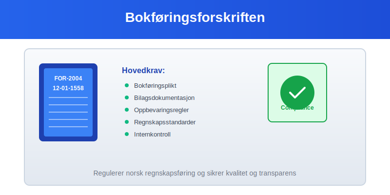
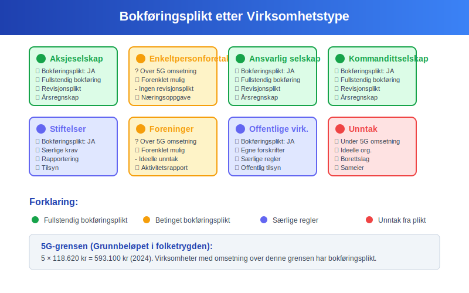
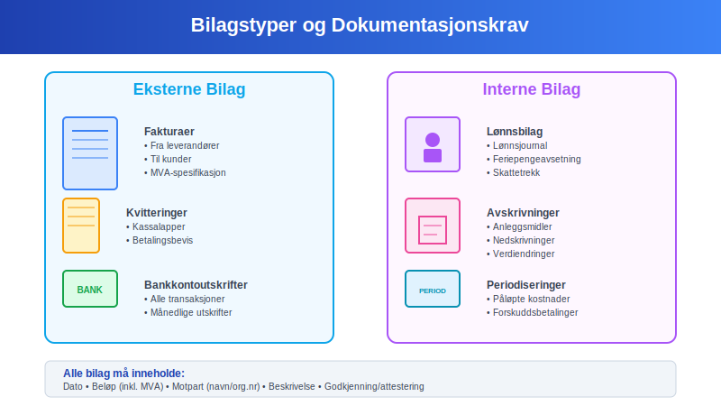
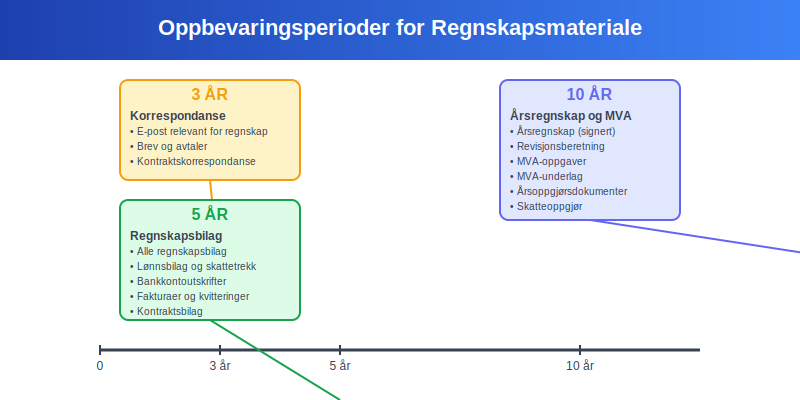
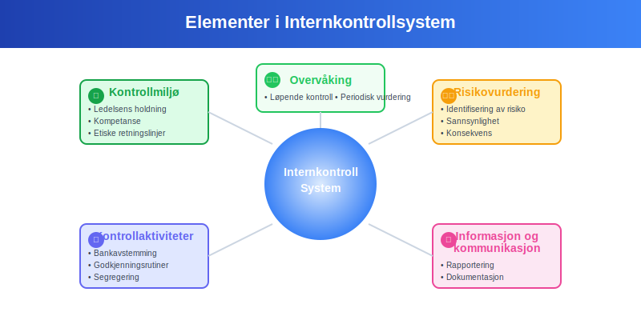
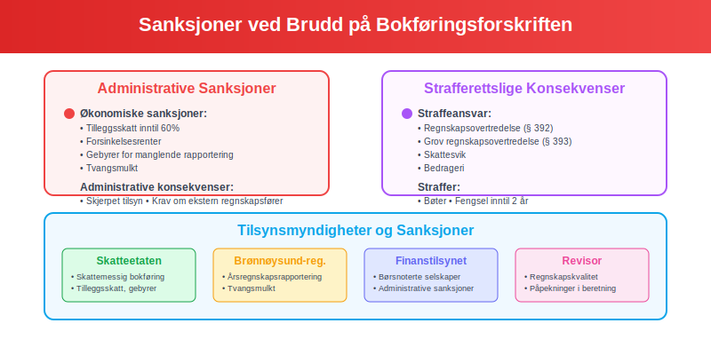
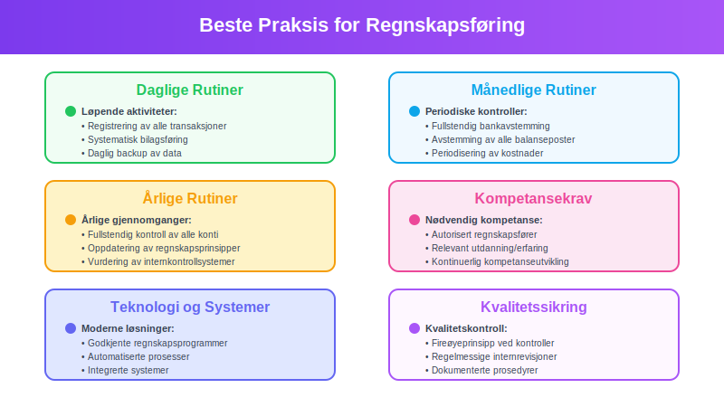

**Bokføringsforskriften** er det sentrale regelverket som regulerer hvordan norske virksomheter skal føre [regnskap](/blogs/regnskap/hva-er-regnskap "Hva er Regnskap? En komplett guide"). Forskriften fastsetter **detaljerte krav** til bokføringsplikt, [bilagsføring](/blogs/regnskap/hva-er-bilagsføring "Hva er Bilagsføring? Komplett Guide til Korrekt Registrering"), oppbevaring og regnskapsstandarder for å sikre **transparent** og **korrekt regnskapsføring**.

## Hva er Bokføringsforskriften?

Bokføringsforskriften (FOR-2004-12-01-1558) er en **forskrift** gitt med hjemmel i bokføringsloven og regnskapsloven. Den utdyper og presiserer kravene i disse lovene og gir **praktiske retningslinjer** for hvordan virksomheter skal:

* **Organisere** og **strukturere** regnskapsføringen
* **Dokumentere** alle forretningshendelser med [bilag](/blogs/regnskap/hva-er-bilag "Hva er Bilag i Regnskap? Typer, Krav og Oppbevaring")
* **Oppbevare** regnskapsmateriale på forskriftsmessig måte
* **Rapportere** finansiell informasjon til myndigheter
* **Sikre** sporbarhet og kontrollmuligheter

### Forskriftens Formål

Bokføringsforskriften har flere **hovedformål**:

- **Standardisere** regnskapspraksis på tvers av virksomheter
- **Sikre** at regnskapet gir et **rettvisende bilde** av virksomhetens økonomiske situasjon
- **Legge til rette** for effektiv **skatteinnkreving** og **tilsyn**
- **Beskytte** kreditorer, investorer og andre interessenter
- **Fremme** åpenhet og **tillit** i næringslivet

## Bokføringsplikt og Virkeområde

### Hvem har Bokføringsplikt?

Bokføringsforskriften gjelder for alle som er **bokføringspliktige** etter bokføringsloven:

| Virksomhetstype | Bokføringsplikt | Særlige krav |
|-----------------|-----------------|--------------|
| **Aksjeselskap** | Ja | Fullstendig bokføring |
| **Enkeltpersonforetak** | Ja (over 5G omsetning) | Forenklet mulig |
| **Ansvarlig selskap** | Ja | Fullstendig bokføring |
| **Kommandittselskap** | Ja | Fullstendig bokføring |
| **Stiftelser** | Ja | Særlige rapporteringskrav |
| **Foreninger** | Ja (over 5G omsetning) | Forenklet mulig |
| **Offentlige virksomheter** | Ja | Egne forskrifter |

### Unntak fra Bokføringsplikt

Følgende virksomheter er **unntatt** fra bokføringsplikt:

* **Enkeltpersonforetak** med omsetning under 5G (ca. 560.000 kr)
* **Ideelle organisasjoner** uten økonomisk virksomhet
* **Borettslag** og **sameier** (egne regler)
* **Offentlige myndigheter** (følger egne regelverk)

## Krav til Regnskapsføring

### Grunnleggende Prinsipper

Bokføringsforskriften bygger på flere **grunnleggende prinsipper**:

#### 1. Fullstendighetsprinsippet
- **Alle** forretningshendelser skal registreres
- **Ingen** transaksjoner skal utelates
- **Systematisk** registrering av alle økonomiske hendelser

#### 2. Nøyaktighetsprinsippet
- **Korrekte** beløp og datoer
- **Riktig** kontering og klassifisering
- **Dokumentert** grunnlag for alle posteringer

#### 3. Tidsriktighetsprinsippet
- **Løpende** registrering av transaksjoner
- **Riktig** periodisering av inntekter og kostnader
- **Månedlig** [avstemming](/blogs/regnskap/hva-er-avstemming "Hva er Avstemming i Regnskap? Prosess, Typer og Beste Praksis")

#### 4. Sporbarhetsprinsippet
- **Klar sammenheng** mellom bilag og bokføring
- **Entydig** referansesystem
- **Mulig** å følge transaksjoner fra bilag til regnskap

### Krav til Regnskapssystem

Bokføringsforskriften stiller **spesifikke krav** til regnskapssystemet:

* **Kronologisk** registrering av alle transaksjoner
* **Systematisk** kontoplan basert på [Norsk Standard Kontoplan](/blogs/regnskap/norsk-standard-kontoplan "Norsk Standard Kontoplan - Struktur og Anvendelse")
* **Sikker** lagring og **backup** av regnskapsdata
* **Tilgangskontroll** og **brukerrettigheter**
* **Revisjonsspor** for alle endringer

## Bilagskrav og Dokumentasjon

### Obligatoriske Bilag

Alle regnskapsføringer må være **dokumentert** med godkjente bilag:

#### Eksterne Bilag
- **Fakturaer** fra leverandører
- **Kvitteringer** og **kassalapper**
- **Bankkontoutskrifter**
- **Lønnslipper** og **skattetrekk**
- **Tollpapirer** og **[fraktbrev](/blogs/regnskap/hva-er-fraktbrev "Hva er Fraktbrev? Komplett Guide til Transportdokumenter og Regnskapsføring")**

#### Interne Bilag
- **Lønnsjournal** og **feriepengeavsetning**
- **[Avskrivninger](/blogs/regnskap/hva-er-avskrivning "Hva er Avskrivning i Regnskap? Metoder, Beregning og Praktiske Eksempler")** og **nedskrivninger**
- **Periodiseringer** og **avsetninger**
- **Interne overføringer**
- **Korreksjonsposteringer**

### Krav til Bilagsinnhold

Alle bilag må inneholde **minimum informasjon**:

| Opplysning | Krav | Eksempel |
|------------|------|----------|
| **Dato** | Transaksjonsdato | 15.03.2024 |
| **Beløp** | Inkl. MVA-spesifikasjon | 12.500 kr (10.000 + 2.500 MVA) |
| **Motpart** | Navn og org.nr | Leverandør AS (123456789) |
| **Beskrivelse** | Hva som er kjøpt/solgt | Kontorrekvisita mars 2024 |
| **Godkjenning** | Signatur/attestering | Signert av innkjøpsansvarlig |

## Oppbevaringsregler

### Oppbevaringsperioder

Bokføringsforskriften fastsetter **strenge krav** til oppbevaring av regnskapsmateriale:

| Dokumenttype | Oppbevaringsperiode | Særlige krav |
|--------------|-------------------|--------------|
| **Regnskapsbilag** | 5 år | Originaler eller godkjente kopier |
| **Årsregnskap** | 10 år | Signerte eksemplarer |
| **Revisjonsberetning** | 10 år | Originaldokument |
| **Lønnsbilag** | 5 år | Inkl. skattetrekk og avgifter |
| **MVA-oppgaver** | 10 år | Inkl. underlagsdokumentasjon |
| **Korrespondanse** | 3 år | Relevant for regnskapet |

### Krav til Oppbevaringsform

Dokumenter kan oppbevares i **ulike former**:

#### Fysisk Oppbevaring
- **Originaldokumenter** i **brannsikre** arkiv
- **Systematisk** organisering og **merking**
- **Tilgangskontroll** og **sikkerhet**

#### Digital Oppbevaring
- **Godkjente** skanning- og **arkiveringssystemer**
- **Uforanderlige** filformater (PDF/A)
- **Backup** og **gjenopprettingsrutiner**
- **Tilgjengelighet** gjennom hele oppbevaringsperioden

### Oppbevaringssted

Regnskapsmateriale skal oppbevares:

* **I Norge** (hovedregel)
* **Tilgjengelig** for norske myndigheter
* **Organisert** slik at det lett kan **fremfinnes**
* **Beskyttet** mot **ødeleggelse** og **uautorisert tilgang**

## Regnskapsstandarder og Prinsipper

### Anvendelige Standarder

Bokføringsforskriften henviser til **anerkjente regnskapsstandarder**:

#### For Store Foretak
- **IFRS** (International Financial Reporting Standards)
- **Norsk RegnskapsStandard** (NRS) som alternativ
- **Særlige krav** til **konsernregnskap**

#### [Små Foretak](/blogs/regnskap/sma-foretak "Små Foretak – Kriterier, Regnskapsstandard og Forenklinger")
- **Forenklet IFRS** for [små foretak](/blogs/regnskap/sma-foretak "Små Foretak – Kriterier, Regnskapsstandard og Forenklinger")
- **God regnskapsskikk** som grunnlag
- **Forenklede** rapporteringskrav

### Sentrale Regnskapsprinsipper

#### Transaksjonsprinsippet
- Registrering ved **faktisk gjennomføring**
- **Dokumentert** grunnlag for alle posteringer
- **Objektiv** verdsetting

#### Opptjeningsprinsippet
- **Inntekter** føres når de er **opptjent**
- **Kostnader** føres når de er **pådratt**
- **Periodisering** av inntekter og kostnader

#### Sammenstillingsprinsippet
- **Kostnader** matches mot tilhørende **inntekter**
- **Samme periode** for relaterte poster
- **Korrekt** resultatmåling

#### Forsiktighetsprinsippet
- **Konservativ** verdsetting av eiendeler
- **Umiddelbar** kostnadsføring av tap
- **Forsiktig** inntektsføring

## Kontroll og Tilsyn

### Internkontroll

Bokføringsforskriften krever **etablering** av internkontroll:

#### Kontrollmiljø
- **Ledelsens** holdning til regnskapskvalitet
- **Kompetanse** og **ansvarsfordeling**
- **Etiske** retningslinjer

#### Risikovurdering
- **Identifisering** av regnskapsrisiko
- **Vurdering** av **sannsynlighet** og **konsekvens**
- **Tiltak** for risikohåndtering

#### Kontrollaktiviteter
- **Månedlig** [bankavstemming](/blogs/regnskap/hva-er-bankavstemming "Hva er Bankavstemming? Prosess, Utfordringer og Beste Praksis")
- **Periodisk** [avstemming](/blogs/regnskap/hva-er-avstemming "Hva er Avstemming i Regnskap? Prosess, Typer og Beste Praksis") av alle konti
- **Godkjenningsrutiner** for transaksjoner
- **Segregering** av oppgaver

### Offentlig Tilsyn

Flere myndigheter fører **tilsyn** med overholdelse av bokføringsforskriften:

| Myndighet | Tilsynsområde | Sanksjoner |
|-----------|---------------|------------|
| **Skatteetaten** | Skattemessig bokføring | Tilleggsskatt, gebyrer |
| **Brønnøysundregistrene** | Årsregnskapsrapportering | Tvangsmulkt |
| **Finanstilsynet** | Børsnoterte selskaper | Administrative sanksjoner |
| **Revisor** | Regnskapskvalitet | Påpekninger i revisjonsberetning |

## Sanksjoner og Konsekvenser

### Administrative Sanksjoner

Brudd på bokføringsforskriften kan medføre **alvorlige konsekvenser**:

#### Økonomiske Sanksjoner
- **Tilleggsskatt** på inntil 60% av skatten
- **Forsinkelsesrenter** på utestående beløp
- **Gebyrer** for manglende rapportering
- **Tvangsmulkt** ved forsinkede innleveringer

#### Administrative Konsekvenser
- **Skjerpet tilsyn** fra skattemyndighetene
- **Krav** om ekstern regnskapsfører
- **Inndragelse** av autorisasjoner
- **Offentliggjøring** av overtredelser

### Strafferettslige Konsekvenser

Alvorlige brudd kan medføre **straffeansvar**:

* **Regnskapsovertredelse** (§ 392 i straffeloven)
* **Grov regnskapsovertredelse** (§ 393 i straffeloven)
* **Skattesvik** ved bevisst feilrapportering
* **Bedrageri** ved manipulasjon av regnskapet

## Digitalisering og Moderne Krav

### Elektronisk Regnskapsføring

Bokføringsforskriften er **tilpasset** moderne teknologi:

#### Krav til Regnskapssystemer
- **Godkjente** regnskapsprogrammer
- **Sikker** datalagring og **backup**
- **Revisjonsspor** for alle endringer
- **Tilgangskontroll** og **brukerrettigheter**

#### Elektroniske Bilag
- **Digitale fakturaer** (EHF-format)
- **Elektroniske** kvitteringer og **bilag**
- **Automatisk** [bilagsmottak](/blogs/regnskap/hva-er-bilagsmottak "Hva er Bilagsmottak? Digitalisering og Automatisering av Regnskapsbilag")
- **Integrerte** betalingsløsninger

### Automatisering og AI

Moderne regnskapsføring benytter **avansert teknologi**:

* **Automatisk** kontering av standardtransaksjoner
* **Maskinlæring** for bilagsgjenkjenning
* **Robotiserte** prosesser for rutineoppgaver
* **Sanntids**-rapportering og **dashboards**

## Beste Praksis og Anbefalinger

### Etablering av Gode Rutiner

For å sikre **overholdelse** av bokføringsforskriften:

#### Daglige Rutiner
- **Løpende** registrering av alle transaksjoner
- **Systematisk** [bilagsføring](/blogs/regnskap/hva-er-bilagsføring "Hva er Bilagsføring? Komplett Guide til Korrekt Registrering")
- **Daglig** backup av regnskapsdata
- **Kontroll** av banktransaksjoner

#### Månedlige Rutiner
- **Fullstendig** [bankavstemming](/blogs/regnskap/hva-er-bankavstemming "Hva er Bankavstemming? Prosess, Utfordringer og Beste Praksis")
- **Avstemming** av alle balanseposter
- **Gjennomgang** av åpne poster
- **Periodisering** av kostnader og inntekter

#### Årlige Rutiner
- **Fullstendig** gjennomgang av alle konti
- **Oppdatering** av regnskapsprinsipper
- **Vurdering** av internkontrollsystemer
- **Kompetanseutvikling** for regnskapspersonell

### Kompetansekrav

Bokføringsforskriften forutsetter **tilstrekkelig kompetanse**:

| Rolle | Kompetansekrav | Sertifisering |
|-------|----------------|---------------|
| **Regnskapsfører** | Autorisasjon fra Finanstilsynet | Obligatorisk |
| **Regnskapsmedarbeider** | Relevant utdanning/erfaring | Anbefalt |
| **Daglig leder** | Grunnleggende regnskapsforståelse | Nødvendig |
| **Styremedlemmer** | Finansiell kompetanse | Påkrevd |

## Fremtidige Utviklingstrekk

### Teknologiske Endringer

Bokføringsforskriften må **tilpasses** nye teknologier:

* **Blokkjede**-teknologi for **uforanderlige** regnskaper
* **Kunstig intelligens** for **automatisk** regnskapsanalyse
* **Sanntids**-rapportering til myndigheter
* **Integrerte** systemer på tvers av virksomheter

### Regulatoriske Endringer

Forventede **endringer** i regelverket:

- **Strengere** krav til **cybersikkerhet**
- **Utvidede** rapporteringskrav for **bærekraft**
- **Harmonisering** med **EU-regelverk**
- **Forenkling** for **små virksomheter**

## Konklusjon

Bokføringsforskriften er **fundamentet** for norsk regnskapsføring og sikrer **kvalitet**, **transparens** og **tillit** i næringslivet. Ved å følge forskriftens krav kan virksomheter:

* **Oppfylle** alle lovpålagte forpliktelser
* **Sikre** korrekt og **pålitelig** regnskapsinformasjon
* **Minimere** risiko for sanksjoner og **tilsynsreaksjoner**
* **Bygge** tillit hos **interessenter** og **myndigheter**
* **Legge grunnlag** for **god** forretningsstyring

**Regelmessig oppdatering** av kunnskap om bokføringsforskriften og **investering** i **kompetente** ressurser er **avgjørende** for å lykkes med regnskapsføringen i en **stadig** mer **kompleks** og **digitalisert** verden.

For virksomheter som ønsker å sikre **full overholdelse** av bokføringsforskriften, anbefales det å **etablere** robuste rutiner, **investere** i **moderne** regnskapssystemer og **sikre** tilstrekkelig **kompetanse** i organisasjonen.
