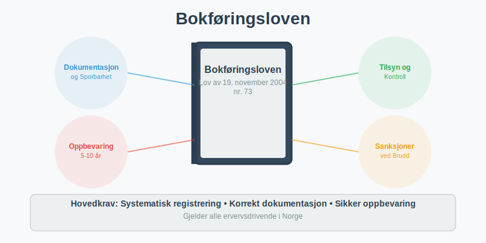
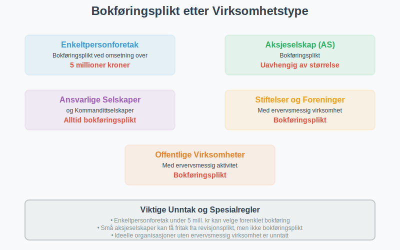
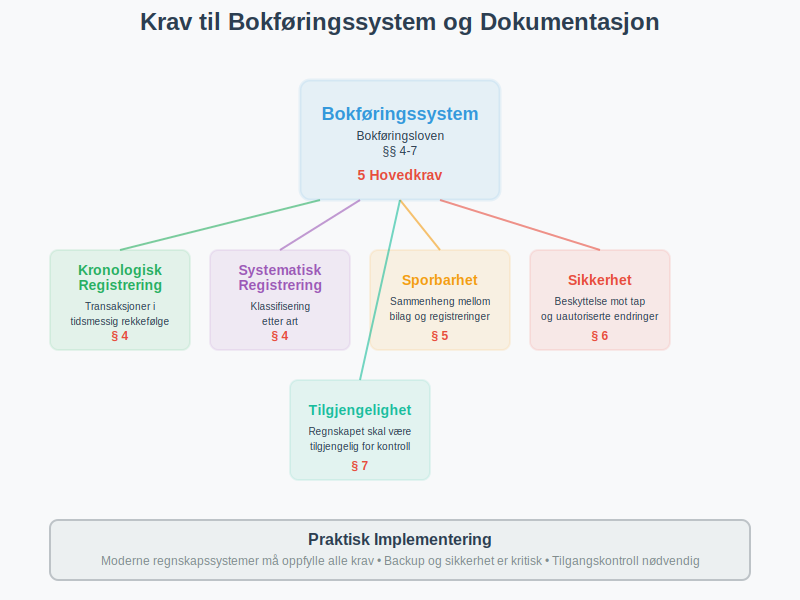
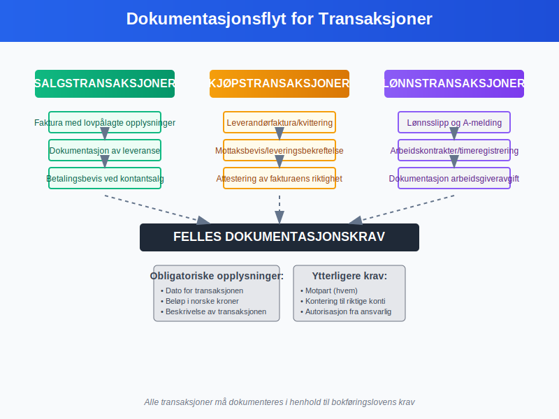
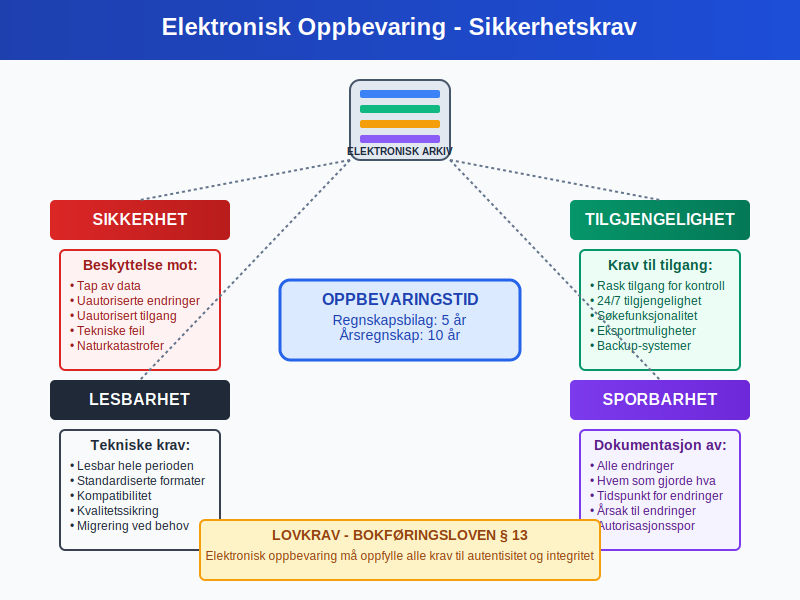
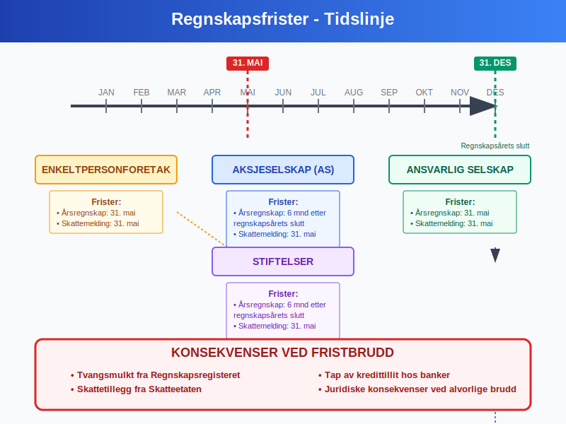
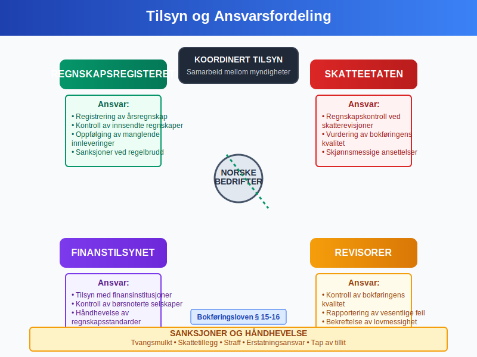
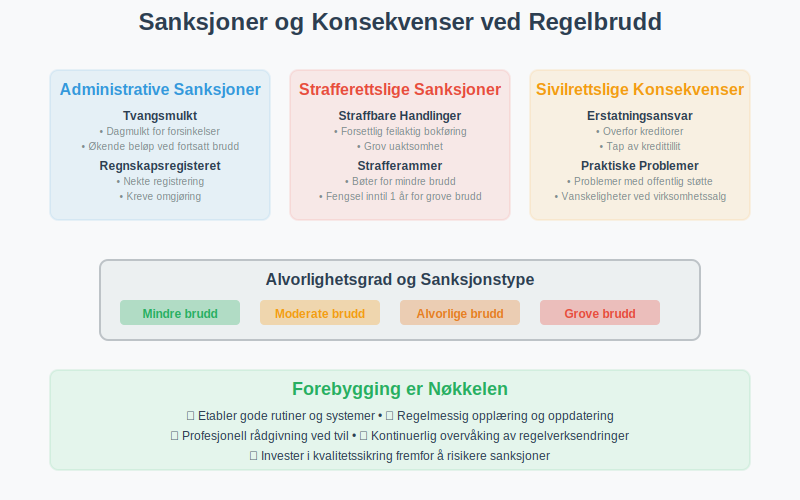
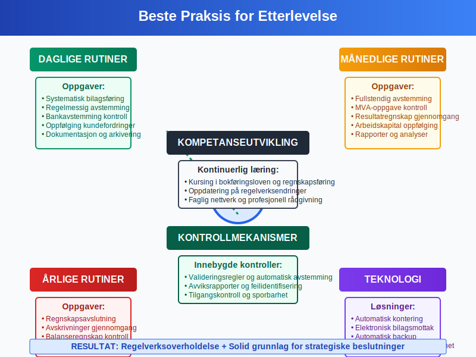
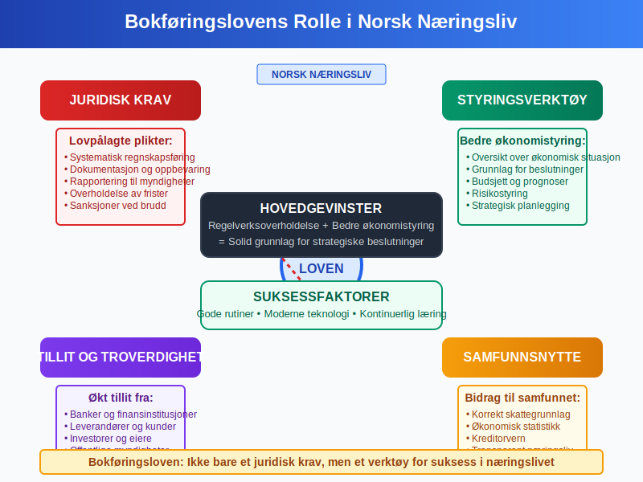

**Bokføringsloven** er det sentrale lovverket som regulerer hvordan norske bedrifter skal føre [regnskap](/blogs/regnskap/hva-er-regnskap "Hva er Regnskap? En komplett guide") og oppbevare regnskapsmateriale. Loven sikrer **transparent** og **korrekt regnskapsføring** gjennom detaljerte krav til [bokføring](/blogs/regnskap/hva-er-bokføring "Hva er Bokføring? Grunnleggende Prinsipper og Metoder"), dokumentasjon og rapportering.

For en oversikt over prioriteringen av ulike rettskilder i norsk regnskapslovgivning, se [Rettskildehierarkiet](/blogs/regnskap/rettskildehierarkiet "Rettskildehierarkiet i Norsk Regnskapsskikk").

## Bokføringslovens Formål og Virkeområde

Bokføringsloven av 19. november 2004 nr. 73 har som **hovedformål** å:

* **Sikre korrekt regnskapsføring** i norske bedrifter
* **Beskytte kreditorer** og andre interessenter
* **Legge til rette for skattekontroll** og offentlig tilsyn
* **Fremme tilliten** til norsk næringsliv
* **Standardisere regnskapspraksis** på tvers av bransjer

### Hvem Omfattes av Bokføringsloven?

Bokføringsloven gjelder for alle som driver **ervervsmessig virksomhet** i Norge:

* **Enkeltpersonforetak** med omsetning over 5 millioner kroner
* **Aksjeselskaper** ([AS](/blogs/regnskap/hva-er-et-aksjeselskap "Hva er et Aksjeselskap? Komplett Guide til AS")) uavhengig av størrelse
* **[Ansvarlige selskaper](/blogs/regnskap/ansvarlig-selskap "Ansvarlig Selskap (ANS): Komplett Guide til Norsk Regnskap og Ansvarsstruktur")** og **kommandittselskaper**
* **Stiftelser** og **foreninger** med ervervsmessig virksomhet
* **Offentlige virksomheter** som driver ervervsmessig aktivitet

## Hovedkrav i Bokføringsloven

### Bokføringsplikt og Grunnleggende Prinsipper

Bokføringsloven etablerer [**bokføringsplikten**](/blogs/regnskap/hva-er-bokføringsplikt "Hva er Bokføringsplikt i Norge? Hvem, Når og Hvordan?") for norske virksomheter og stiller **strenge krav** til hvordan regnskapet skal føres:

#### Grunnleggende Bokføringsprinsipper:

* **Fullstendighet:** Alle forretningshendelser skal registreres
* **Nøyaktighet:** Registreringer skal være korrekte og dokumenterte
* **Klarhet:** Regnskapet skal være forståelig og oversiktlig
* **Kontinuitet:** Samme prinsipper skal brukes fra år til år
* **Forsiktighet:** Usikkerhet skal håndteres konservativt

### Krav til Bokføringssystem

Bokføringsloven stiller spesifikke krav til **bokføringssystemet**:

| Krav | Beskrivelse | Lovhjemmel |
|------|-------------|------------|
| **Kronologisk registrering** | Alle transaksjoner skal registreres i tidsmessig rekkefølge | § 4 |
| **Systematisk registrering** | Transaksjoner skal klassifiseres etter art | § 4 |
| **Sporbarhet** | Klar sammenheng mellom [bilag](/blogs/regnskap/hva-er-bilag "Hva er Bilag i Regnskap? Typer, Krav og Håndtering") og registreringer | § 5 |
| **Sikkerhet** | Beskyttelse mot tap og uautoriserte endringer | § 6 |
| **Tilgjengelighet** | Regnskapet skal være tilgjengelig for kontroll | § 7 |

## Dokumentasjonskrav og Bilagsbehandling

### Bilagskrav

Bokføringsloven krever at alle regnskapsregistreringer skal være **dokumentert** med [bilag](/blogs/regnskap/hva-er-bilag "Hva er Bilag i Regnskap? Typer, Krav og Håndtering"):

#### Obligatoriske Opplysninger på Bilag:

* **Dato** for transaksjonen
* **Beløp** i norske kroner
* **Beskrivelse** av transaksjonen
* **Motpart** (hvem transaksjonen gjelder)
* **Kontering** til riktige konti
* **Autorisasjon** fra ansvarlig person

### Spesielle Dokumentasjonskrav

For ulike typer transaksjoner gjelder **spesifikke krav**:

#### Salgstransaksjoner:
* [Faktura](/blogs/regnskap/hva-er-en-faktura "Hva er en Faktura? En Guide til Norske Fakturakrav") med alle lovpålagte opplysninger
* Dokumentasjon av leveranse
* Betalingsbevis ved kontantsalg

#### Kjøpstransaksjoner:
* Leverandørfaktura eller kvittering
* Mottaksbevis eller leveringsbekreftelse
* [Attestering](/blogs/regnskap/hva-er-attestering "Hva er Attestering i Regnskap? Prosess og Kontrollrutiner") av fakturaens riktighet

#### Lønnstransaksjoner:
* Lønnsslipp og [A-melding](/blogs/regnskap/hva-er-a-melding "Hva er A-melding? Komplett Guide til Rapportering og Frister")
* Arbeidskontrakter og timeregistreringer
* Dokumentasjon av [arbeidsgiveravgift](/blogs/regnskap/hva-er-arbeidsgiveravgift "Hva er Arbeidsgiveravgift? Satser, Beregning og Regnskapsføring")

## Oppbevaringsregler

### Oppbevaringsplikt

Bokføringsloven krever **systematisk oppbevaring** av regnskapsmateriale:

#### Oppbevaringstid:

| Materiale | Oppbevaringstid | Lovhjemmel |
|-----------|-----------------|------------|
| **Regnskapsbilag** | 5 år | § 13 |
| **Årsregnskap** | 10 år | § 13 |
| **Revisjonsberetning** | 10 år | § 13 |
| **Dokumentasjon av bokføringssystem** | 5 år | § 13 |
| **Korrespondanse** | 5 år | § 13 |

For en omfattende guide til **[oppbevaring av regnskapsmateriale](/blogs/regnskap/oppbevaring-av-regnskapsmateriale "Oppbevaring av Regnskapsmateriale - Krav, Frister og Beste Praksis i Norge")**, inkludert detaljerte oppbevaringsfrister, digitale løsninger, sikkerhetskrav og praktiske implementeringsstrategier, se vår spesialiserte artikkel.

#### Oppbevaringsform:

* **Papirbasert:** Originaldokumenter i sikre arkiver
* **Elektronisk:** Digitale kopier med **autentisitet** og **integritet**
* **Mikrofilm:** Godkjent alternativ for eldre dokumenter
* **Kombinert:** Blanding av papir og elektroniske løsninger

### Krav til Elektronisk Oppbevaring

For **elektronisk oppbevaring** gjelder spesielle krav:

* **Lesbarhet:** Dokumenter skal kunne leses gjennom hele oppbevaringsperioden
* **Søkbarhet:** Effektiv gjenfinning av dokumenter
* **Sikkerhet:** Beskyttelse mot tap og uautoriserte endringer
* **Sporbarhet:** Dokumentasjon av alle endringer
* **Tilgjengelighet:** Rask tilgang for kontrollformål

## Regnskapsåret og Rapporteringsfrister

### Regnskapsåret

Bokføringsloven regulerer **regnskapsårets lengde** og **avslutning**:

#### Standard Regnskapsår:
* **Kalenderår:** 1. januar til 31. desember (mest vanlig)
* **Avvikende regnskapsår:** Tillatt med særskilt begrunnelse
* **Første regnskapsår:** Kan være kortere eller lengre enn 12 måneder

### Frister for Regnskapsavslutning

| Virksomhetstype | Frist for årsregnskap | Frist for skattemelding |
|-----------------|----------------------|------------------------|
| **Enkeltpersonforetak** | 31. mai | 31. mai |
| **Aksjeselskap** | 6 måneder etter regnskapsårets slutt | 31. mai |
| **[Ansvarlig selskap](/blogs/regnskap/ansvarlig-selskap "Ansvarlig Selskap (ANS): Komplett Guide til Norsk Regnskap og Ansvarsstruktur")** | 31. mai | 31. mai |
| **Stiftelser** | 6 måneder etter regnskapsårets slutt | 31. mai |

### Konsekvenser ved Fristbrudd

**Forsinkelser** kan medføre:

* **Tvangsmulkt** fra Regnskapsregisteret
* **Skattetillegg** fra Skatteetaten
* **Tap av kredittillit** hos banker og leverandører
* **Juridiske konsekvenser** ved alvorlige brudd

## Tilsyn og Kontroll

### Offentlig Tilsyn

Flere offentlige organer fører **tilsyn** med overholdelse av bokføringsloven:

#### Regnskapsregisteret:
* **Registrering** av årsregnskap
* **Kontroll** av innsendte regnskaper
* **Oppfølging** av manglende innleveringer
* **Sanksjoner** ved regelbrudd

#### Skatteetaten:
* **Regnskapskontroll** i forbindelse med skatterevisjoner
* **Vurdering** av bokføringens kvalitet
* **Krav** om dokumentasjon og forklaringer
* **Skjønnsmessige ansettelser** ved mangelfullt regnskap

#### Finanstilsynet:
* **Tilsyn** med finansinstitusjoner og børsnoterte selskaper
* **Kontroll** av regnskapsrapportering
* **Håndhevelse** av regnskapsstandarder

### Revisjonsplikt

For mange virksomheter er **revisjon** obligatorisk:

#### Revisjonsplikt gjelder for:
* **Aksjeselskaper** over visse størrelsesgrenser
* **Allmennaksjeselskaper** (ASA)
* **Stiftelser** med stor omsetning
* **Virksomheter** med offentlig støtte

#### Revisors Ansvar:
* **Kontroll** av bokføringens kvalitet
* **Vurdering** av regnskapsprinsipper
* **Rapportering** av vesentlige feil
* **Bekreftelse** av lovmessighet

## Sanksjoner og Konsekvenser

### Administrative Sanksjoner

Brudd på bokføringsloven kan medføre **administrative sanksjoner**:

#### Tvangsmulkt:
* **Dagmulkt** for forsinket innlevering av årsregnskap
* **Økende beløp** ved fortsatt manglende etterlevelse
* **Maksimalbeløp** fastsatt i forskrift

#### Regnskapsregisteret kan:
* **Nekte registrering** av mangelfulle regnskaper
* **Kreve omgjøring** av feilaktige regnskaper
* **Pålegge** utbedring av systemfeil
* **Rapportere** alvorlige brudd til påtalemyndigheten

### Strafferettslige Sanksjoner

**Alvorlige brudd** kan medføre straff:

#### Straffbare Handlinger:
* **Forsettlig** feilaktig bokføring
* **Grov uaktsomhet** i regnskapsføringen
* **Ødeleggelse** av regnskapsmateriale
* **Hindring** av offentlig kontroll

#### Strafferammer:
* **Bøter** for mindre alvorlige brudd
* **Fengsel** inntil 1 år for grove brudd
* **Inndragning** av økonomisk utbytte
* **Erstatningsansvar** overfor skadelidte

### Sivilrettslige Konsekvenser

Brudd kan også få **sivilrettslige konsekvenser**:

* **Erstatningsansvar** overfor kreditorer
* **Tap av kredittillit** hos finansinstitusjoner
* **Problemer** med offentlige tilskudd og støtte
* **Vanskeligheter** ved salg av virksomheten

## Praktiske Råd for Etterlevelse

### Etablering av Gode Rutiner

For å sikre **god etterlevelse** av bokføringsloven:

#### Daglige Rutiner:
* **Systematisk [bilagsføring](/blogs/regnskap/hva-er-bilagsføring "Hva er Bilagsføring? Prosess, Rutiner og Beste Praksis")** ved alle transaksjoner
* **Regelmessig [avstemming](/blogs/regnskap/hva-er-avstemming "Hva er Avstemming i Regnskap? Typer, Prosess og Beste Praksis")** av konti
* **Kontroll** av [bankavstemming](/blogs/regnskap/hva-er-bankavstemming "Hva er Bankavstemming? Prosess, Rutiner og Feilsøking")
* **Oppfølging** av [kundefordringer](/blogs/regnskap/hva-er-aktiva "Hva er Aktiva? Komplett Guide til Eiendeler i Balansen")

#### Månedlige Rutiner:
* **Fullstendig avstemming** av alle balanseposter
* **Kontroll** av [mva-oppgave](/blogs/regnskap/hva-er-avgiftsplikt-mva "Hva er Avgiftsplikt MVA? Regler, Satser og Praktisk Veiledning")
* **Gjennomgang** av resultatregnskap
* **Oppfølging** av [arbeidskapital](/blogs/regnskap/hva-er-arbeidskapital "Hva er Arbeidskapital? Beregning, Analyse og Optimalisering")

#### Årlige Rutiner:
* **Forberedelse** til regnskapsavslutning
* **Gjennomgang** av [avskrivninger](/blogs/regnskap/hva-er-avskrivning "Hva er Avskrivning i Regnskap? Metoder, Beregning og Praktiske Eksempler")
* **Kontroll** av [balanseregnskap](/blogs/regnskap/hva-er-balanseregnskap "Hva er Balanseregnskap? Struktur, Analyse og Praktisk Anvendelse")
* **Revisjon** av regnskapsprinsipper

### Teknologiske Løsninger

**Moderne regnskapssystemer** kan hjelpe med etterlevelse:

#### Automatisering:
* **Automatisk kontering** av standardtransaksjoner
* **Integrerte kontroller** for å fange opp feil
* **Elektronisk [bilagsmottak](/blogs/regnskap/hva-er-bilagsmottak "Hva er Bilagsmottak? Digitalisering og Effektiv Håndtering")**
* **Automatisk backup** og arkivering

#### Kontrollmekanismer:
* **Innebygde valideringsregler**
* **Automatisk avstemming** av konti
* **Rapporter** for avviksidentifisering
* **Tilgangskontroll** og sporbarhet

### Kompetanseutvikling

**Kontinuerlig læring** er viktig for god etterlevelse:

* **Kursing** i bokføringsloven og regnskapsføring
* **Oppdatering** på endringer i regelverket
* **Faglig nettverk** med andre regnskapsførere
* **Profesjonell rådgivning** ved komplekse spørsmål

## Endringer og Fremtidige Utviklingstrekk

### Digitalisering og Modernisering

Bokføringsloven tilpasses **digitale utviklingstrekk**:

#### Pågående Endringer:
* **Elektronisk fakturering** blir mer utbredt
* **Automatisert regnskapsføring** gjennom AI og maskinlæring
* **Sanntidsrapportering** til offentlige myndigheter
* **Blockchain-teknologi** for økt sporbarhet

#### Fremtidige Muligheter:
* **Standardiserte API-er** for datautveksling
* **Automatisk skatteberegning** og -rapportering
* **Prediktiv analyse** for bedre økonomistyring
* **Integrerte kontrollsystemer** på tvers av myndigheter

### Internasjonale Standarder

Norge tilpasser seg **internasjonale regnskapsstandarder**:

* **IFRS** for børsnoterte selskaper
* **Harmonisering** med EU-direktiver
* **Økt fokus** på bærekraftsrapportering
* **Standardisering** av regnskapspraksis

## Sammendrag og Konklusjon

**Bokføringsloven** er fundamentet for **transparent** og **pålitelig regnskapsføring** i Norge. Loven sikrer at:

### Hovedpunkter:
* **Alle ervervsdrivende** har plikt til å føre regnskap etter lovens krav
* **Systematisk dokumentasjon** og oppbevaring er obligatorisk
* **Offentlig tilsyn** sikrer etterlevelse og kvalitet
* **Sanksjoner** ved brudd kan være alvorlige
* **Gode rutiner** og moderne teknologi letter etterlevelsen

### Praktiske Anbefalinger:
* **Invester** i gode regnskapssystemer og rutiner
* **Hold deg oppdatert** på endringer i regelverket
* **Søk profesjonell rådgivning** ved tvil
* **Prioriter** regnskapskvalitet som grunnlag for god virksomhetsstyring

Bokføringsloven er ikke bare et **juridisk krav**, men også et **verktøy** for bedre økonomistyring og økt tillitt i næringslivet. Ved å følge lovens krav sikrer bedrifter både **regelverksoverholdelse** og **solid grunnlag** for strategiske beslutninger.

