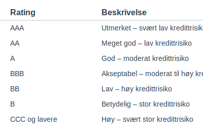

**Bonitet**, også kalt **kreditverdighet**, refererer til en virksomhets eller persons evne til å oppfylle finansielle forpliktelser. En god bonitet indikerer høy sannsynlighet for at gjeld betales tilbake i tide, og er avgjørende for tilgang til kreditt og finansiering i norsk næringsliv.

## Seksjon 1: Hva er bonitet og hvorfor det er viktig

Bonitet måler tilliten långivere, leverandører og investorer har til at en virksomhet eller person kan betjene gjeld. Begrepet henger nært sammen med [Hva er likviditet?](/blogs/regnskap/hva-er-likviditet "Hva er Likviditet? Komplett Guide til Likviditetsstyring og Analyse") og [Hva er betalingsevne?](/blogs/regnskap/hva-er-betalingsevne "Hva er Betalingsevne? En Komplett Guide til Likviditet og Soliditet"), men omfatter også forventet økonomisk adferd basert på kreditthistorikk, regnskapsdata og bransjeanalyse.

God bonitet kan gi **lavere lånerente**, **bedre kredittvilkår** og styrket **forretningspålitelighet**, mens svak bonitet øker risikoen for avslag på finansiering, høyere kostnader og kredittbegrensninger.

## Seksjon 2: Kredittvurderingsmodeller

Kredittvurdering utføres av banker, kredittopplysningsforetak og interne analyseteam. De mest brukte modellene inkluderer:

* **Statisk kredittscore:** Basert på historiske data som betalingsanmerkninger, betalingsmønster og økonomiske nøkkeltall.
* **Finansiell analyse:** Nøkkeltall som **gjeldsgrad**, **egenkapitalandel** og **rentabilitet** evalueres.
* **Poengmodeller:** Kombinerer kvantitative og kvalitative faktorer til en numerisk score.
* **Intern vurdering:** Spesialtilpassede modeller basert på bransje, selskapets størrelse og risikoprofil.

## Seksjon 3: Rating-skalaer og eksempler

Følgende tabell viser en vanlig rating-skala for bonitet:

| Rating | Beskrivelse |
| ------ | ----------- |
| AAA    | Utmerket – svært lav kredittrisiko |
| AA     | Meget god – lav kredittrisiko |
| A      | God – moderat kredittrisiko |
| BBB    | Akseptabel – moderat til høy kredittrisiko |
| BB     | Lav – høy kredittrisiko |
| B      | Betydelig – stor kredittrisiko |
| CCC og lavere | Høy – svært stor kredittrisiko |

## Seksjon 4: Bonitet i regnskapsmessig sammenheng

I regnskap og kredittrisikoanalyser brukes bonitet for å vurdere tapsrisiko på fordringer og krav om sikkerhet. Viktige sammenhenger inkluderer:

* **Kundefordringer:** Vurder kredittrisiko før salg ved å sjekke kundens bonitet.
* **Leverandørgjeld:** Bonitet påvirker forhandlinger om betalingstid og rabatter.
* **Arbeidskapitalstyring:** Svak bonitet kan øke behovet for likviditetsbuffer.
* **Finansiering:** Bankenes rentevilkår og krav til egenkapital avhenger av bonitet.

## Seksjon 5: Hvordan styrke bonitet

Forbedring av bonitet krever målrettet arbeid:

1. **Betal i tide:** Unngå betalingsanmerkninger og inkasso.
2. **Reduser gjeldsgrad:** Betal ned lån og bruk kun nødvendige kreditter.
3. **Øk egenkapitalen:** Reinvester overskudd eller tilfør egenkapital fra eiere.
4. **Bygg historikk:** Oppretthold god kreditthistorikk over tid.
5. **God rapportering:** Sørg for korrekt og oppdatert regnskapsinformasjon.

## Oppsummering

Bonitet er en kjerneindikator for finansiell helse og kredittrisiko. Ved å forstå kredittvurderingsmodeller, rating-skalaer og gode hygienesrutiner kan virksomheter sikre seg bedre vilkår og redusere risiko i norsk regnskap og finans.
