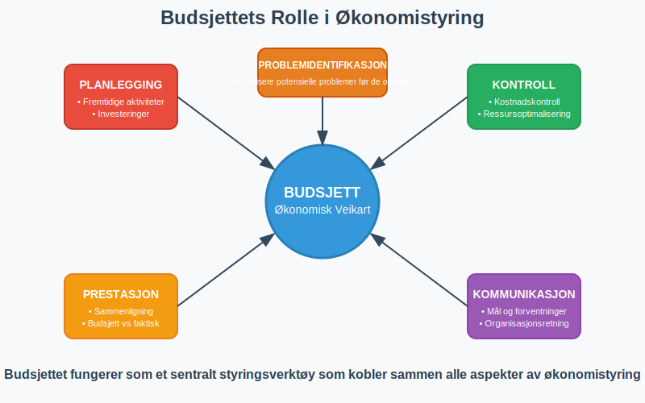
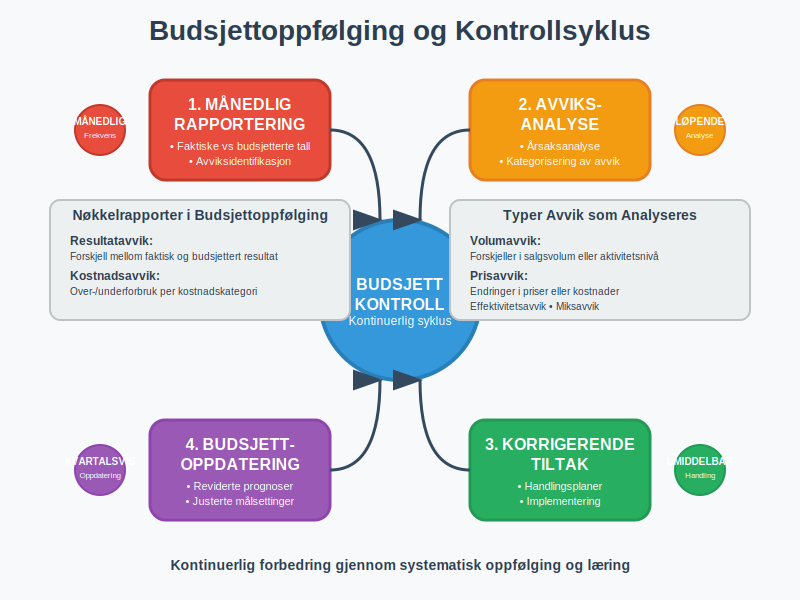
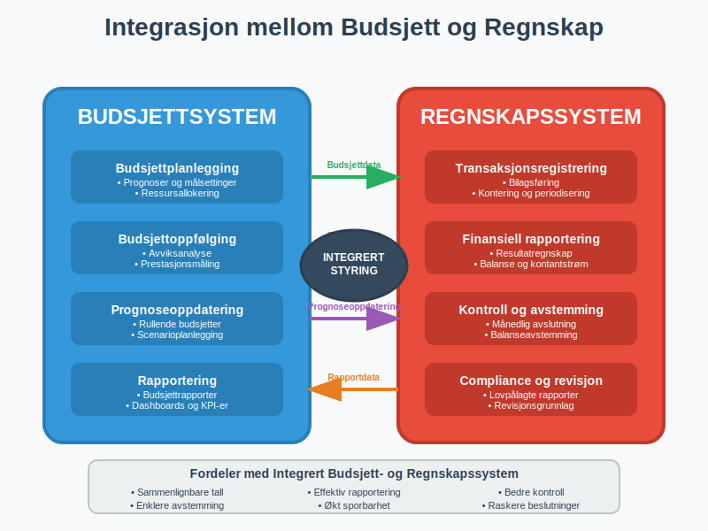
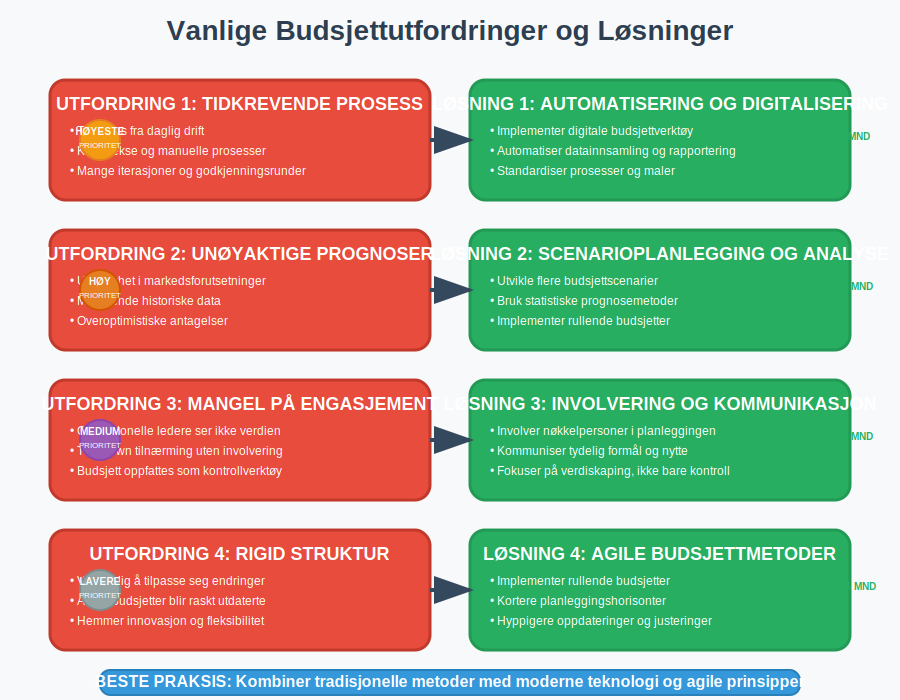

**Budsjettering** er en systematisk planleggingsprosess hvor bedrifter estimerer fremtidige inntekter, kostnader og kontantstrømmer for bestemte [terminer](/blogs/regnskap/hva-er-termin "Hva er Termin? Regnskapsperioder og Terminplanlegging"). Dette er et fundamentalt verktøy for økonomistyring som hjelper ledelsen med å sette mål, allokere ressurser og kontrollere den økonomiske utviklingen. Budsjettering er tett knyttet til [regnskapet](/blogs/regnskap/hva-er-regnskap "Hva er Regnskap? En Komplett Guide til Norsk Regnskapsføring") og er en sentral komponent i [internregnskap](/blogs/regnskap/hva-er-internregnskap "Hva er Internregnskap? Komplett Guide til Intern Finansiell Styring og Rapportering"), hvor det fungerer som et styringsverktøy for å oppnå bedriftens strategiske mål over ulike regnskapsperioder.

I budsjetteringsprosessen er det også essensielt å ta hensyn til **alternativkostnad**, som representerer hva bedriften gir avkall på ved å velge én ressursbruk fremfor en annen. Les mer om dette i vår artikkel om [alternativkostnad](/blogs/regnskap/alternativkostnad "Hva er Alternativkostnad? Komplett Guide til Alternativkostnad og Beslutningsanalyse").

I tillegg bør bedriften beregne sitt **kapitalbehov** for å sikre tilstrekkelig finansiering. Se vår guide om [Kapitalbehov](/blogs/regnskap/kapitalbehov "Hva er Kapitalbehov? Guide til Kapitalbehov og Finansieringsplan for Norske Bedrifter").

## Hva er et budsjett?

Les mer om grunnleggende konseptet i [Budsjett](/blogs/regnskap/budsjett "Budsjett: Hva er et budsjett? Innføring i budsjettets formål").

Et budsjett er en detaljert finansiell plan som viser forventede inntekter og utgifter for en fremtidig periode, vanligvis ett år. Det fungerer som en **økonomisk veikart** som hjelper bedriften med å:

* Planlegge fremtidige aktiviteter og investeringer
* Kontrollere kostnader og optimalisere ressursbruk
* Måle prestasjon gjennom sammenligning av faktiske tall mot budsjett
* Identifisere potensielle problemer før de oppstår
* Kommunisere mål og forventninger til organisasjonen

Budsjettering er nært knyttet til [avvikshåndtering](/blogs/regnskap/hva-er-avvikshåndtering "Hva er Avvikshåndtering i Regnskap? Prosess, Metoder og Beste Praksis"), hvor forskjeller mellom budsjetterte og faktiske tall analyseres og følges opp systematisk.

## Budsjetttyper og deres anvendelse

Det finnes flere typer budsjetter som tjener ulike formål i bedriftens økonomistyring. Valg av budsjetttype avhenger av bedriftens størrelse, bransje og strategiske behov.

### Driftsbudsjett

**Driftsbudsjettet** er kjernen i budsjettplanleggingen og dekker den løpende driften av bedriften. Det inkluderer:

* **Salgsbudsjett:** Forventede inntekter fra salg av varer og tjenester
* **Produksjonsbudsjett:** Kostnader knyttet til produksjon og vareinnkjøp
* **Personalkostnader:** Lønn, [arbeidsgiveravgift](/blogs/regnskap/hva-er-arbeidsgiveravgift "Hva er Arbeidsgiveravgift? Komplett Guide til Beregning og Regnskapsføring"), [feriepenger](/blogs/regnskap/hva-er-feriepenger "Hva er Feriepenger i Regnskap? Beregning, Regnskapsføring og Praktiske Eksempler") og andre personalkostnader
* **[Driftskostnader](/blogs/regnskap/hva-er-driftskostnader "Hva er Driftskostnader? Typer, Beregning og Regnskapsføring - Komplett Guide"):** Husleie, forsikring, markedsføring og andre løpende utgifter

Driftsbudsjettet er tett knyttet til [driftsregnskapet](/blogs/regnskap/hva-er-driftsregnskap "Hva er Driftsregnskap? Komplett Guide til Driftsregnskapet i Norge"), som viser de faktiske operative resultatene og brukes til å sammenligne budsjetterte tall med faktiske utfall for å analysere avvik og justere fremtidige budsjetter.

### Investeringsbudsjett

Investeringsbudsjettet planlegger større kapitalutgifter som:

* Kjøp av [anleggsmidler](/blogs/regnskap/hva-er-anleggsmidler "Hva er Anleggsmidler? Komplett Guide til Varige Driftsmidler") som maskiner og utstyr
* IT-systemer og programvare
* Bygninger og lokaler
* Forskning og utvikling

Investeringer påvirker både [balansen](/blogs/regnskap/hva-er-balanse "Hva er Balanse? Komplett Guide til Balanseoppstilling og Finansiell Posisjon") og fremtidige [avskrivninger](/blogs/regnskap/hva-er-avskrivning "Hva er Avskrivning? Metoder, Beregning og Regnskapsføring"). Ved evaluering av investeringsprosjekter brukes ofte [diskontering](/blogs/regnskap/hva-er-diskontering "Hva er Diskontering? Komplett Guide til Nåverdi og Diskonterte Kontantstrømmer") for å beregne nåverdien av fremtidige kontantstrømmer og vurdere lønnsomheten.

### Likviditetsbudsjett

**[Likviditetsbudsjettet](/blogs/regnskap/likviditetsbudsjett "Hva er Likviditetsbudsjett? Komplett Guide til Kontantstrømplanlegging")** fokuserer på kontantstrømmer og sikrer at bedriften har tilstrekkelig [arbeidskapital](/blogs/regnskap/hva-er-arbeidskapital "Hva er Arbeidskapital? Beregning og Betydning for Bedriftens Likviditet") til å møte sine forpliktelser. Dette budsjettet er kritisk for å opprettholde god [betalingsevne](/blogs/regnskap/hva-er-betalingsevne "Hva er Betalingsevne? Analyse av Likviditet og Finansiell Stabilitet").

For en dyptgående forståelse av likviditetsplanlegging, inkludert praktiske eksempler og beste praksis, se vår omfattende guide til [likviditetsbudsjett](/blogs/regnskap/likviditetsbudsjett "Hva er Likviditetsbudsjett? Komplett Guide til Kontantstrømplanlegging").

## Budsjettmetoder og tilnærminger

Valg av budsjettmetode påvirker både prosessen og resultatet av budsjettarbeidet. Ulike metoder egner seg for forskjellige typer virksomheter og situasjoner.

### Tradisjonell budsjettering

Den **tradisjonelle tilnærmingen** bygger på historiske tall og justerer disse basert på forventede endringer:

| Fordeler | Ulemper |
|----------|---------|
| Enkel å implementere | Kan videreføre ineffektivitet |
| Basert på kjente størrelser | Lite fleksibel |
| Rask prosess | Fokuserer på kostnader, ikke verdi |
| Lav ressursbruk | Kan hemme innovasjon |

### Nullbasert budsjettering

**Nullbasert budsjettering** starter fra null og krever begrunnelse for hver budsjettpost:

* Alle aktiviteter må begrunnes på nytt
* Fokus på verdiskaping og effektivitet
* Mer ressurskrevende prosess
* Egnet for organisasjoner som trenger omstilling

### Rullende budsjetter

**Rullende budsjetter** oppdateres kontinuerlig ved å legge til nye perioder når gamle perioder avsluttes:

* Alltid 12 måneder fremover i tid
* Mer fleksibel tilpasning til endringer
* Krever mer administrative ressurser
* Bedre for dynamiske markeder

## Budsjettplanlegging og implementering

En vellykket budsjettplanlegging krever systematisk tilnærming og involvering av relevante interessenter i organisasjonen.

### Fase 1: Strategisk planlegging

Budsjettarbeidet starter med å definere:

* **Strategiske mål** for budsjettperioden
* **Markedsforutsetninger** og konkurransesituasjon
* **Ressursbehov** og kapasitetsbegrensninger
* **Risikofaktorer** som kan påvirke resultatene, inkludert [konjunktursvingninger](/blogs/regnskap/hva-er-konjunktur "Hva er Konjunktur? En Komplett Guide til Økonomiske Sykluser")

En grundig [forretningsplan](/blogs/regnskap/hva-er-forretningsplan "Hva er Forretningsplan? Komplett Guide til Forretningsplanlegging og Regnskapsoppfølging") danner det strategiske grunnlaget for budsjettarbeidet og sikrer at budsjettene er i tråd med virksomhetens langsiktige mål og strategier.

### Fase 2: Detaljert budsjettutvikling

I denne fasen utarbeides detaljerte budsjetter for hver avdeling:

1. **Salgsbudsjett** basert på markedsanalyse og salgsprognoser
2. **Produksjonsbudsjett** tilpasset salgsvolum og lagerstrategier
3. **Kostnadsbudsjetter** for alle driftskostnader og investeringer
4. **Personalbudsjett** inkludert lønn, overtid og sosiale kostnader

Et viktig element i budsjettutvikling er å beregne [dekningspunkt](/blogs/regnskap/hva-er-dekningspunkt "Hva er Dekningspunkt? Komplett Guide til Break-Even Analyse") for å forstå minimum salgsvolum som kreves for å dekke alle kostnader. [Dekningsbidragsanalyse](/blogs/regnskap/hva-er-dekningsbidrag "Hva er Dekningsbidrag? Beregning, Analyse og Praktiske Eksempler") er også essensielt for å vurdere lønnsomheten av ulike produkter og tjenester i budsjettplanleggingen.

### Fase 3: Konsolidering og godkjenning

Alle delbudsjetter samles til et **hovedbudsjett** som inkluderer:

* Budsjettert resultatregnskap
* Budsjettert balanse
* Budsjettert kontantstrømoppstilling

## Budsjettoppfølging og kontroll

Etter at budsjettet er implementert, er kontinuerlig oppfølging essensielt for å sikre at målene nås og for å identifisere behov for korrigerende tiltak.

### Månedlig budsjettrapportering

**Månedlige budsjettrapporter** sammenligner faktiske tall med budsjetterte tall:

| Rapportelement | Beskrivelse | Frekvens |
|----------------|-------------|----------|
| Resultatavvik | Forskjell mellom faktisk og budsjettert resultat | Månedlig |
| Kostnadsavvik | Analyse av over-/underforbruk per kostnadskategori | Månedlig |
| Salgsavvik | Avvik i volum og pris sammenlignet med budsjett | Månedlig |
| Likviditetsavvik | Forskjeller i kontantstrøm og likviditetsbehov | Ukentlig |

### Avviksanalyse og korrigerende tiltak

Når det oppstår **betydelige avvik** mellom budsjett og faktiske tall, må disse analyseres grundig. [Differanseanalyse](/blogs/regnskap/hva-er-differanse "Hva er Differanse i Regnskap? Komplett Guide til Budsjettavvik og Skattemessige Forskjeller") er et sentralt verktøy for å forstå årsaker til budsjettavvik:

* **Volumavvik:** Forskjeller i salgsvolum eller aktivitetsnivå
* **Prisavvik:** Endringer i salgspriser eller innkjøpskostnader
* **Effektivitetsavvik:** Forskjeller i produktivitet eller ressursbruk
* **Miksavvik:** Endringer i produktmiks eller kundesammensetning

Systematisk [avvikshåndtering](/blogs/regnskap/hva-er-avvikshåndtering "Hva er Avvikshåndtering i Regnskap? Prosess, Metoder og Beste Praksis") sikrer at læring fra avvik brukes til å forbedre fremtidige budsjetter og driftsprosesser.

## Budsjettering og regnskapsintegrasjon

For at budsjettering skal være effektivt, må det integreres tett med bedriftens regnskapssystem og rapporteringsrutiner.

### Kontoplanstruktur

Budsjettstrukturen bør følge samme **kontoplan** som regnskapet for å sikre:

* Sammenlignbare tall mellom budsjett og regnskap
* Effektiv rapportering og analyse
* Enklere [avstemming](/blogs/regnskap/hva-er-avstemming "Hva er Avstemming? Komplett Guide til Regnskapsmessig Avstemming") av avvik
* Bedre sporbarhet og kontroll

### Periodisering og timing

Budsjettet må ta hensyn til regnskapsmessige prinsipper som:

* **Periodisering** av inntekter og kostnader
* **[Avskrivninger](/blogs/regnskap/hva-er-avskrivning "Hva er Avskrivning? Metoder, Beregning og Regnskapsføring")** av anleggsmidler
* **Avsetninger** for fremtidige forpliktelser
* **Merverdiavgift** og andre avgifter

## Digitale verktøy for budsjettering

Moderne bedrifter benytter digitale løsninger for å effektivisere budsjettarbeidet og forbedre nøyaktigheten i prognosene.

### Regnskapssystemer med budsjettfunksjonalitet

Mange regnskapssystemer tilbyr integrerte budsjettmoduler som:

* Automatisk import av historiske data
* Fleksible budsjettmaler og strukturer
* Sanntids sammenligning av budsjett og faktiske tall
* Automatiserte rapporter og dashboards

### Spesialiserte budsjettverktøy

For større organisasjoner kan dedikerte budsjettverktøy være nødvendig:

* **Avanserte prognosefunksjoner** med statistiske modeller
* **Scenarioplanlegging** for å teste ulike forutsetninger, inkludert [dekningspunkt-analyse](/blogs/regnskap/hva-er-dekningspunkt "Hva er Dekningspunkt? Komplett Guide til Break-Even Analyse") for ulike salgsvolum
* **Workflow-styring** for godkjenningsprosesser
* **Konsolidering** av budsjetter fra flere enheter

## Utfordringer og beste praksis

Budsjettering kan være utfordrende, men ved å følge etablerte beste praksis kan bedrifter maksimere verdien av budsjettarbeidet.

### Vanlige utfordringer

* **Tidkrevende prosess** som tar fokus fra daglig drift
* **Unøyaktige prognoser** på grunn av usikkerhet
* **Mangel på engasjement** fra operasjonelle ledere
* **Rigid struktur** som ikke tilpasser seg endringer

### Beste praksis for vellykket budsjettering

1. **Involver nøkkelpersoner** i budsjettplanleggingen
2. **Bruk realistiske forutsetninger** basert på markedsanalyse
3. **Implementer fleksible budsjetter** som kan justeres underveis
4. **Fokuser på verdiskaping**, ikke bare kostnadskontroll
5. **Etabler klare roller** og ansvar i budsjettorganisasjonen

### Måling av budsjetteffektivitet

For å vurdere kvaliteten på budsjettarbeidet, bør bedrifter måle:

| Nøkkeltall | Beskrivelse | Målsetting |
|------------|-------------|------------|
| Budsjettavvik | Gjennomsnittlig avvik mellom budsjett og faktisk | < 5% |
| Prognosenøyaktighet | Hvor treffsikre prognosene er over tid | > 90% |
| Budsjettaktualitet | Hvor ofte budsjetter oppdateres | [Kvartalsvis](/blogs/regnskap/regnskapskvartaler-q1-q4 "Q1-Q4 Regnskapskvartaler - Komplett Guide til Kvartalsstyring") |
| Prosesseffektivitet | Tid brukt på budsjettarbeid | < 2% av arbeidstid |

## Budsjettering i ulike bransjer

Budsjettmetoder og fokusområder varierer betydelig mellom bransjer, avhengig av forretningsmodell og markedsdynamikk.

### Produksjonsbedrifter

Produksjonsbedrifter fokuserer på:

* **Kapasitetsplanlegging** og produksjonsvolum
* **Råvarekostnader** og leverandørstyring
* **Lager- og logistikkostnader**
* **Kvalitetskostnader** og svinn

### Tjenestebedrifter

Tjenestebedrifter prioriterer:

* **Personalkostnader** som ofte utgjør størstedelen av kostnadene
* **Kapasitetsutnyttelse** og fakturerbare timer
* **Kundetilfredshet** og gjenkjøp
* **Teknologi- og systemkostnader**

### Handelsbedrifter

Handelsbedrifter konsentrerer seg om:

* **Innkjøpspriser** og leverandørforhandlinger
* **Lageromsetning** og kapitalbinding
* **Markedsføring** og kundeakkvisisjon
* **Lokalkostnader** og logistikk

## Fremtiden for budsjettering

Budsjettering utvikler seg kontinuerlig med nye teknologier og endrede forretningsbehov.

### Kunstig intelligens og maskinlæring

**AI-drevne budsjettverktøy** kan:

* Analysere store datamengder for bedre prognoser
* Identifisere mønstre og trender automatisk
* Tilpasse budsjetter basert på sanntidsdata
* Redusere manuelt arbeid og feilkilder

### Agile budsjettering

**Agile budsjettmetoder** fokuserer på:

* Kortere planleggingshorisonter
* Hyppigere oppdateringer og justeringer
* Økt fleksibilitet og tilpasningsevne
* Tettere kobling til strategisk planlegging

### Integrert rapportering

Fremtidens budsjettering vil være tettere integrert med:

* **Bærekraftsrapportering** og ESG-målinger
* **Risikostyring** og scenarioplanlegging
* **Strategisk planlegging** og målstyring
* **Operasjonell rapportering** og KPI-er

Budsjettering forblir et kritisk verktøy for økonomistyring, men metodene og teknologiene vil fortsette å utvikle seg for å møte fremtidens forretningsbehov. Ved å kombinere tradisjonell finansiell planlegging med moderne teknologi og agile metoder, kan bedrifter skape mer verdifulle og handlingsorienterte budsjetter.
