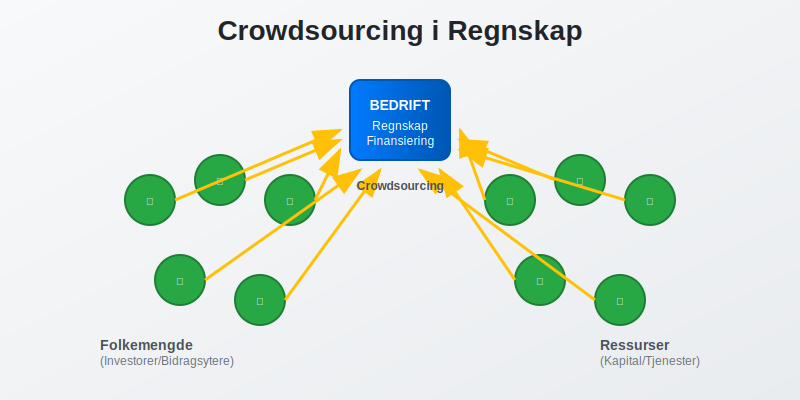
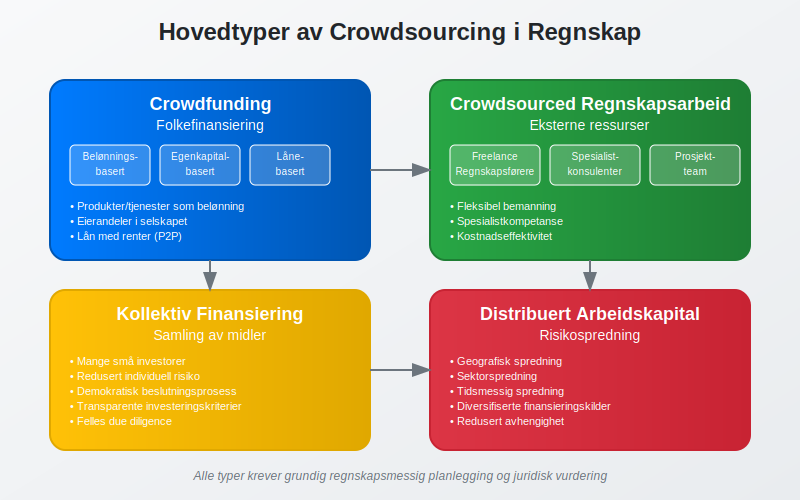
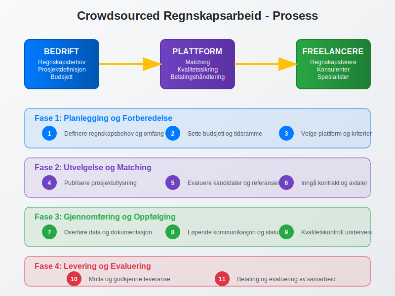
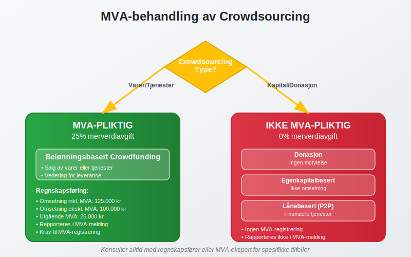
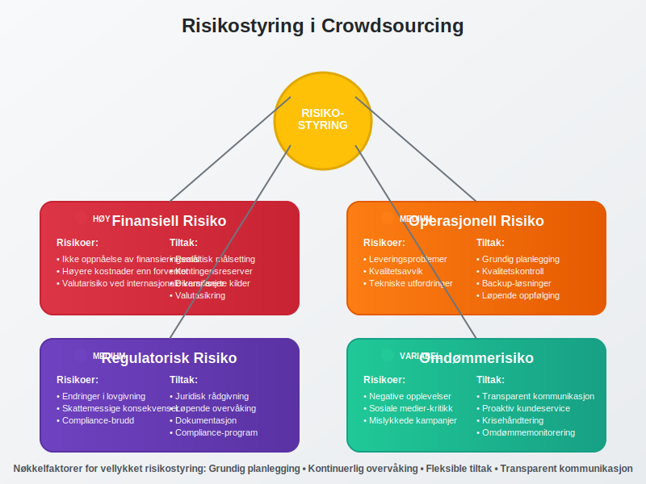

**Crowdsourcing** i regnskapssammenheng refererer til hvordan bedrifter kan bruke **folkefinansiering** og eksterne ressurser for å finansiere prosjekter og operasjoner. Dette konseptet har revolusjonert måten selskaper skaffer [arbeidskapital](/blogs/regnskap/hva-er-arbeidskapital "Hva er Arbeidskapital? Beregning og Betydning for Bedriftens Likviditet") og finansierer sine aktiviteter på.



## Hva er Crowdsourcing?

**Crowdsourcing** kombinerer ordene "crowd" (folkemengde) og "sourcing" (innhenting), og beskriver prosessen med å **samle ressurser** fra en stor gruppe mennesker, vanligvis via internett. I regnskapssammenheng omfatter dette:

* **Crowdfunding** - [folkefinansiering](/blogs/regnskap/hva-er-crowdfunding "Hva er Crowdfunding? Komplett Guide til Folkefinansiering") av prosjekter og bedrifter
* **Crowdsourced regnskapsarbeid** - bruk av eksterne regnskapsførere og konsulenter
* **Kollektiv finansiering** - samling av midler fra mange små investorer
* **Distribuert arbeidskapital** - spredning av finansieringsrisiko

### Hovedtyper av Crowdsourcing i Regnskap



## Crowdfunding og Regnskapsføring

**Crowdfunding** er den mest kjente formen for crowdsourcing i finansiell sammenheng. Det finnes flere modeller som påvirker regnskapsføringen forskjellig:

### Belønningsbasert Crowdfunding

Ved **belønningsbasert crowdfunding** mottar bidragsytere produkter eller tjenester i stedet for finansiell avkastning.

**Regnskapsføring:**
- Innsamlede midler regnskapsføres som **forskuddsbetaling fra kunder**
- Inntektsføring skjer når produktet leveres eller tjenesten utføres
- [Bilagsføring](/blogs/regnskap/hva-er-bilagsføring "Hva er Bilagsføring? Komplett Guide til Korrekt Dokumentasjon") må dokumentere alle transaksjoner

| Fase | Regnskapspost | Debet | Kredit |
|------|---------------|-------|--------|
| Innsamling | Bank | 100.000 | |
| | Forskudd fra kunder | | 100.000 |
| Levering | Forskudd fra kunder | 100.000 | |
| | Salgsinntekt | | 100.000 |

### Egenkapitalbasert Crowdfunding

**Egenkapitalbasert crowdfunding** innebærer at investorer får eierandeler i selskapet.

**Regnskapsføring:**
- Økning i [aksjekapital](/blogs/regnskap/hva-er-aksjekapital "Hva er Aksjekapital? Beregning, Innskudd og Regnskapsføring") eller egenkapital
- Må følge [aksjeloven](/blogs/regnskap/hva-er-aksjeloven "Hva er Aksjeloven? Regler for Aksjeselskap i Norge") sine bestemmelser
- Registrering i [aksjonærregisteret](/blogs/regnskap/hva-er-aksjonaerregisteret "Hva er Aksjonærregisteret? Opprettelse og Vedlikehold")

### Lånebasert Crowdfunding (Peer-to-Peer)

Ved **lånebasert crowdfunding** låner bedriften penger fra mange små långivere. Dette er også kjent som **[crowdlending](/blogs/regnskap/hva-er-crowdlending "Hva er Crowdlending i Regnskap? P2P Utlån, Regnskapsføring og Skattemessige Konsekvenser")** eller peer-to-peer utlån.

**Regnskapsføring:**
- Regnskapsføres som **langsiktig gjeld** eller **kortsiktig gjeld**
- Rentekostnader må periodiseres korrekt
- Krav til dokumentasjon og [attestering](/blogs/regnskap/hva-er-attestering "Hva er Attestering? Prosess, Krav og Beste Praksis")

## Crowdsourced Regnskapsarbeid

**Crowdsourced regnskapsarbeid** innebærer å bruke eksterne regnskapsførere og konsulenter på prosjektbasis.



### Fordeler med Crowdsourced Regnskap

* **Kostnadseffektivitet** - lavere faste kostnader
* **Fleksibilitet** - skalering etter behov
* **Spesialistkompetanse** - tilgang til eksperter
* **Redusert administrativt arbeid** - mindre personaladministrasjon

### Utfordringer og Risikoer

* **Kvalitetskontroll** - sikring av korrekt [bokføring](/blogs/regnskap/hva-er-bokføring "Hva er Bokføring? Grunnleggende Prinsipper og Metoder")
* **Datasikkerhet** - beskyttelse av sensitive [bilag](/blogs/regnskap/hva-er-bilag "Hva er Bilag? Typer, Krav og Oppbevaring i Regnskap")
* **Kontinuitet** - sikring av konsistent regnskapsføring
* **Compliance** - overholdelse av [bokføringsloven](/blogs/regnskap/hva-er-bokføringsloven "Hva er Bokføringsloven? Regler og Krav til Regnskapsføring")

## Regnskapsføring av Crowdsourcing-kostnader

### Plattformkostnader

**Crowdsourcing-plattformer** tar vanligvis en prosentandel av innsamlede midler:

```
Eksempel: Crowdfunding-kampanje
Innsamlet beløp: 500.000 kr
Plattformgebyr (5%): 25.000 kr
Netto mottatt: 475.000 kr
```

**Regnskapsføring:**
- Plattformgebyret regnskapsføres som **markedsføringskostnad** eller **finanskostnad**
- Må dokumenteres med [faktura](/blogs/regnskap/hva-er-en-faktura "Hva er en Faktura? En Guide til Norske Fakturakrav") fra plattformen

### Belønninger og Incentiver

Kostnader til belønninger for bidragsytere:

| Type belønning | Regnskapsføring | Konto |
|----------------|-----------------|-------|
| Produkter | Varekostnad | 3000-3999 |
| Tjenester | Tjenestekostnad | 4000-4999 |
| Markedsføringsmateriell | Markedsføringskostnad | 6100-6199 |
| Frakt og levering | Distribusjonskostnad | 6300-6399 |

## Skattemessige Konsekvenser

### Inntektsskatt

**Crowdfunding-inntekter** kan ha ulike skattemessige konsekvenser:

* **Belønningsbasert:** Skattepliktig som ordinær omsetning
* **Donasjon:** Kan være skattefri under visse betingelser
* **Egenkapital:** Ikke skattepliktig inntekt for selskapet
* **Lån:** Ikke skattepliktig, men rentekostnader er fradragsberettiget (se [crowdlending](/blogs/regnskap/hva-er-crowdlending "Hva er Crowdlending i Regnskap?") for detaljert informasjon)

### Merverdiavgift (MVA)



**MVA-plikt** avhenger av crowdsourcing-typen:

| Type | MVA-pliktig | Begrunnelse |
|------|-------------|-------------|
| Belønningsbasert | Ja | Salg av varer/tjenester |
| Donasjon | Nei | Ikke vederlag |
| Egenkapital | Nei | Ikke omsetning |
| Lån | Nei | Finansielle tjenester |

## Juridiske Aspekter

### Regulatoriske Krav

**Crowdsourcing** må følge relevante lover og forskrifter:

* **[Bokføringsloven](/blogs/regnskap/hva-er-bokføringsloven "Hva er Bokføringsloven? Regler og Krav til Regnskapsføring")** - krav til dokumentasjon og regnskapsføring
* **Verdipapirlovgivning** - ved egenkapitalbasert crowdfunding
* **Forbrukerkjøpsloven** - ved salg til forbrukere
* **Personvernlovgivning** - håndtering av persondata

### Kontraktuelle Forhold

Viktige kontraktuelle elementer:

* **Tydelige vilkår** for crowdsourcing-kampanjer
* **Leveringsfrister** og forpliktelser
* **Refusjonsregler** ved manglende oppnåelse av mål
* **Immaterielle rettigheter** og eierskap

## Beste Praksis for Crowdsourcing

### Planlegging og Forberedelse

* **Grundig [budsjettering](/blogs/regnskap/hva-er-budsjettering "Hva er Budsjettering? Metoder, Prosess og Beste Praksis")** av prosjektet
* **Realistiske mål** og tidsfrister
* **Klar kommunikasjonsstrategi** overfor bidragsytere
* **Juridisk gjennomgang** av vilkår og betingelser

### Regnskapsmessig Oppfølging

* **Løpende registrering** av alle transaksjoner
* **Månedlig [avstemming](/blogs/regnskap/hva-er-avstemming "Hva er Avstemming? Bankavstemming og Kontroll i Regnskap")** av crowdsourcing-kontoer
* **Dokumentasjon** av alle kostnader og inntekter
* **Rapportering** til interessenter og myndigheter

### Risikostyring



**Identifisering av risikoer:**

* **Finansiell risiko** - ikke oppnåelse av finansieringsmål
* **Operasjonell risiko** - leveringsproblemer
* **Regulatorisk risiko** - endringer i lovgivning
* **Omdømmerisiko** - negative opplevelser for bidragsytere

## Fremtidige Trender

### Teknologisk Utvikling

**Nye teknologier** påvirker crowdsourcing:

* **Blockchain** - økt transparens og sikkerhet
* **Kunstig intelligens** - automatisert matching og vurdering
* **Mobile plattformer** - enklere tilgang og deltakelse
* **Integrerte regnskapssystemer** - automatisk regnskapsføring

### Regulatorisk Utvikling

**Forventede endringer:**

* Strengere krav til **investor-beskyttelse**
* Økt fokus på **transparens** og rapportering
* Harmonisering av **internasjonale regler**
* Nye krav til **digitale plattformer**

## Konklusjon

**Crowdsourcing** representerer en viktig finansieringsform som krever grundig forståelse av regnskapsmessige og juridiske aspekter. Bedrifter som vurderer crowdsourcing bør:

* **Planlegge grundig** og forstå alle implikasjoner
* **Sikre korrekt regnskapsføring** fra start
* **Overholde alle juridiske krav** og forskrifter
* **Implementere god risikostyring** og kontroll

Ved riktig implementering kan crowdsourcing være et kraftfullt verktøy for å skaffe [arbeidskapital](/blogs/regnskap/hva-er-arbeidskapital "Hva er Arbeidskapital? Beregning og Betydning for Bedriftens Likviditet") og realisere forretningsideer, samtidig som det skaper verdi for både bedriften og bidragsyterne.

**Viktig:** Konsulter alltid med regnskapsførere og juridiske rådgivere før du starter crowdsourcing-aktiviteter for å sikre korrekt håndtering av alle aspekter.
