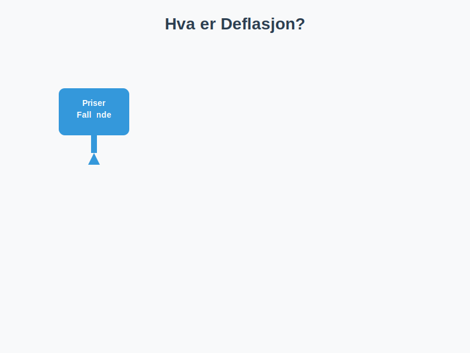

**Deflasjon** er den generelle nedgangen i prisnivået på varer og tjenester over tid, som resulterer i økt kjøpekraft for penger. Dette fenomenet er motstykket til [inflasjon](/blogs/regnskap/hva-er-inflasjon "Hva er Inflasjon? Komplett Guide til Inflasjon i Regnskap og Økonomi"), og har viktige implikasjoner for [regnskap](/blogs/regnskap/hva-er-regnskap "Hva er Regnskap? Komplett Guide til Regnskapsføring"), [investeringer](/blogs/regnskap/hva-er-avkastning "Hva er Avkastning? Komplett Guide til Investeringsavkastning og Beregning") og bedriftsdrift.
For en helhetlig oversikt over de makroøkonomiske kreftene som ligger til grunn for prisutvikling, se **[Makroøkonomi](/blogs/regnskap/makrookonomi "Makroøkonomi: Prinsipper og Betydning for Norsk Regnskap")**.

## Hva er Deflasjon?

Deflasjon oppstår når den generelle prisen på varer og tjenester faller over tid. Dette betyr at **samme mengde penger kjøper mer** enn før. Deflasjon måles vanligvis som en prosentvis endring i konsumprisindeksen (KPI).

### Grunnleggende Formel for Deflasjonsrate

**Deflasjonsrate (%) = ((KPI i fjor - KPI i år) / KPI i fjor) × 100**

## Årsaker til Deflasjon

1. **Etterspørselsdrevet deflasjon:** Når samlet etterspørsel i økonomien synker, for eksempel ved lavere forbruk eller redusert offentlige utgifter.
2. **Kostnadsdrevet deflasjon:** Synkende produksjonskostnader, for eksempel reduserte råvarepriser eller teknologiske effektiviseringer.
3. **Innskjerpet pengepolitikk:** Høyere renter og trangere kredittløsninger som demper låne- og forbruksvilje.

## Typer Deflasjon og Relaterte Begreper

| **Type**                       | **Beskrivelse**                                                                                   |
|--------------------------------|--------------------------------------------------------------------------------------------------|
| Etterspørselsdrevet deflasjon  | Lavere total etterspørsel fører til prisfall                                                     |
| Kostnadsdrevet deflasjon       | Redusert produksjonskostnad gir lavere sluttpriser                                               |
| Innebygd deflasjon             | Forventninger om prisfall blir selvoppfyllende på grunn av lønns- og prisindeksering             |

## Påvirkning på Regnskap og Bedriftsdrift

* **Historisk kost-prinsippet:** Deflasjon kan føre til at bokførte verdier overestimerer reell verdi på eiendeler som [anleggsmidler](/blogs/regnskap/hva-er-anleggsmidler "Hva er Anleggsmidler? Komplett Guide til Varige Driftsmidler").
* **Varelager:** Lavere prisnivå gjør at eldre lagerverdier ikke reflekterer dagens markedspriser.
* **Resultatmarginer:** Fallet i salgspriser kan presse marginene hvis kostnadene ikke justeres tilsvarende.
* **Gjeldsbyrde:** Deflasjon øker realverdien av nominell gjeld, noe som kan belaste balansens passivaside.

## Forskjell mellom Inflasjon og Deflasjon

| **Aspekt**     | **Inflasjon**                                                | **Deflasjon**                                               |
|----------------|--------------------------------------------------------------|-------------------------------------------------------------|
| Prisnivå       | Generell prisøkning over tid                                 | Generell prisnedgang over tid                               |
| Kjøpekraft     | Reduseres                                                    | Økes                                                        |
| Gjeld          | Redusert reell gjeldsbyrde                                   | Økt reell gjeldsbyrde                                       |
| Regnskapseffekt| Bokførte verdier underestimerer reell kostnad                | Bokførte verdier overestimerer reell verdi                  |

## Praktiske Eksempler

Et selskap som produserer elektronikk opplever at **KPI** faller fra 105 til 100 i løpet av ett år:

| **År**      | **KPI** |
|------------|---------|
| Fjoråret   | 105     |
| Dette året | 100     |

**Deflasjonsrate = ((105 - 100) / 105) × 100 ≈ 4,76%**

## Håndtering i Regnskapspraksis

I land med vedvarende deflasjon kan man bruke justerte regnskapsprinsipper:

* **Nedskrivning av eiendeler:** For å unngå oververdsetting ved historisk kost.
* **Riktig vurdering av varelager:** Jevnlig verdivurdering til virkelig verdi.
* **Noteopplysninger:** Transparens om deflasjonspåvirkning i noter til regnskapet.

## Videre Lesning

* [Hva er Inflasjon?](/blogs/regnskap/hva-er-inflasjon "Hva er Inflasjon? Komplett Guide til Inflasjon i Regnskap og Økonomi")
* [Hva er BNP-deflator?](/blogs/regnskap/hva-er-bnp-deflator "Hva er BNP-deflator? Forklaring og bruk i makro og regnskap")
* [Hva er Konjunktur?](/blogs/regnskap/hva-er-konjunktur "Hva er Konjunktur? En Komplett Guide til Økonomiske Sykluser")
