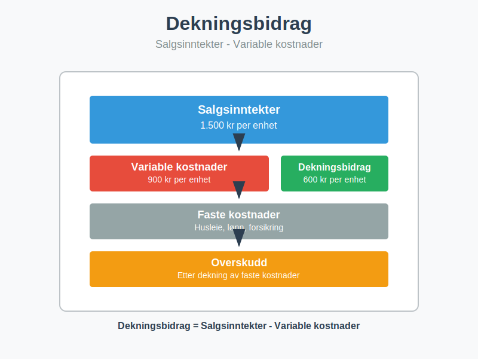
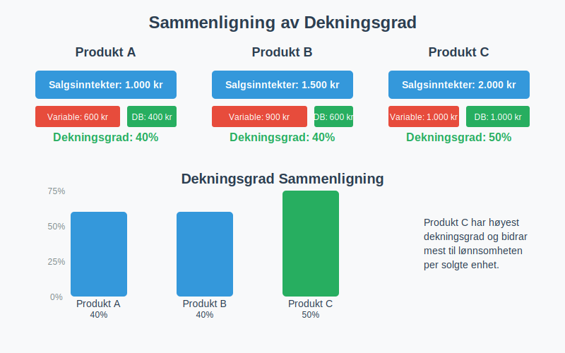
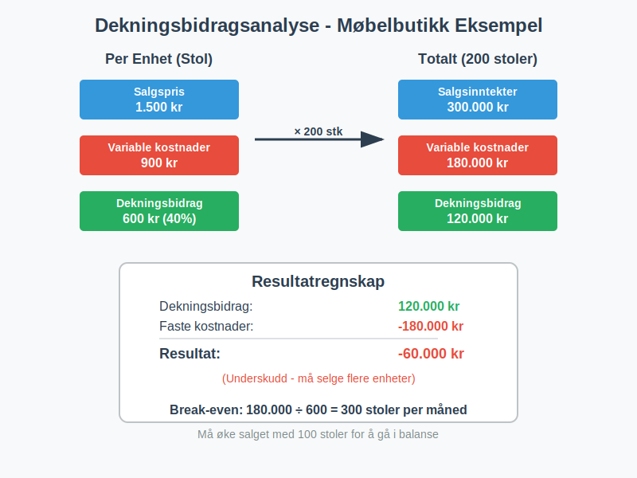
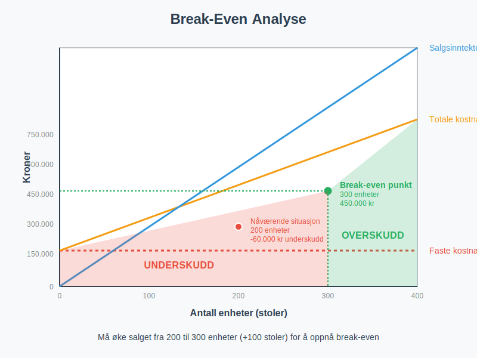
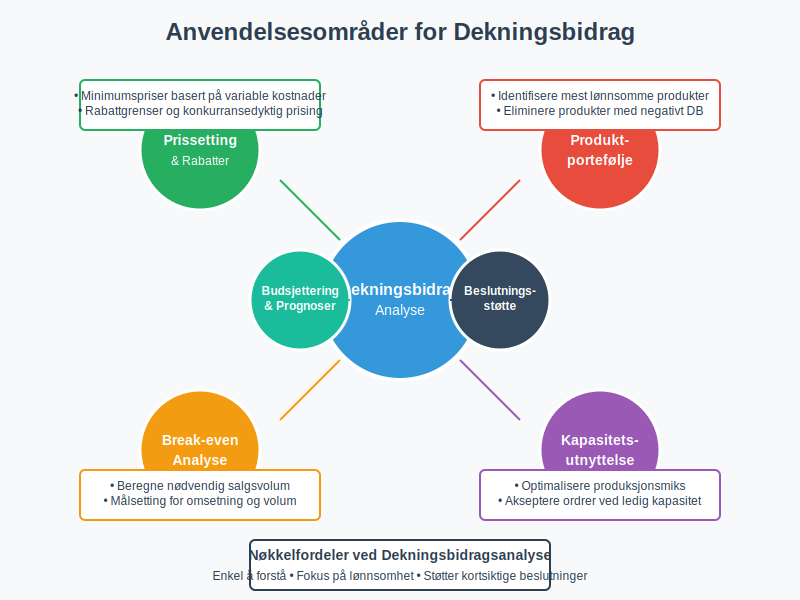
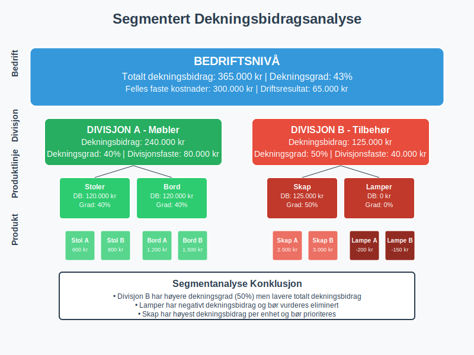

**Dekningsbidrag** er differansen mellom [salgsinntekter](/blogs/regnskap/hva-er-driftsinntekter "Hva er Driftsinntekter? Komplett Guide til Driftsinntekter i Regnskap") og **variable kostnader**. Det viser hvor mye hver solgte enhet bidrar til å dekke faste kostnader og generere overskudd, og er et grunnleggende verktøy for **lønnsomhetsanalyse** i [regnskapet](/blogs/regnskap/hva-er-regnskap "Hva er Regnskap? En komplett guide").



## Hva er Dekningsbidrag?

Dekningsbidrag er en **nøkkelindikator** som viser hvor mye inntekt som gjenstår etter at variable kostnader er trukket fra. Dette beløpet skal dekke:

* **Faste kostnader** som husleie, lønn og forsikring. For mer om faste kostnader, se [Faste kostnader](/blogs/regnskap/faste-kostnader "Hva er Faste kostnader? Definisjon og Eksempler").
* **Overskudd** som gir avkastning til eierne
* **Investeringer** i fremtidig vekst og utvikling

### Grunnleggende Formel

```
Dekningsbidrag = Salgsinntekter - Variable kostnader
```

### Dekningsgrad (Dekningsbidragsprosent)

**Dekningsgraden** uttrykker dekningsbidraget som en prosentandel av salgsinntektene:

```
Dekningsgrad = (Dekningsbidrag ÷ Salgsinntekter) × 100%
```



## Variable vs. Faste Kostnader

For å beregne dekningsbidrag korrekt, må vi skille mellom **variable** og **faste kostnader**.

### Variable Kostnader

Variable kostnader endrer seg **proporsjonalt** med produksjons- eller salgsvolum og utgjør en viktig del av [driftskostnadene](/blogs/regnskap/hva-er-driftskostnader "Hva er Driftskostnader? Typer, Beregning og Regnskapsføring - Komplett Guide") og [kostprisen](/blogs/regnskap/hva-er-kostpris "Hva er Kostpris? Kostnadsberegning og Lønnsomhetsanalyse"):

* **Råvarer og materialer**
* **Direkte lønn** (timelønn for produksjon)
* **Provisjoner** til selgere
* **Frakt** og leveringskostnader
* **Emballasje** og pakking

### Faste Kostnader

Faste kostnader forblir **konstante** uavhengig av volum på kort sikt og utgjør en betydelig del av [driftskostnadene](/blogs/regnskap/hva-er-driftskostnader "Hva er Driftskostnader? Typer, Beregning og Regnskapsføring - Komplett Guide"):

* **Husleie** og eiendomskostnader
* **Fast lønn** til administrasjon
* **Forsikringer** og avgifter
* **[Avskrivninger](/blogs/regnskap/hva-er-avskrivning "Hva er Avskrivning i Regnskap? Metoder, Beregning og Praktiske Eksempler")** på utstyr
* **Lisenser** og abonnementer

## Praktisk Eksempel: Dekningsbidragsberegning

La oss se på et praktisk eksempel med en bedrift som selger møbler:

### Grunndata
* **Salgspris per stol:** 1.500 kr
* **Variable kostnader per stol:** 900 kr
* **Månedlige faste kostnader:** 180.000 kr
* **Solgte stoler per måned:** 200 stk

### Beregning

| Element | Per enhet | Totalt (200 stk) |
|---------|-----------|------------------|
| **Salgsinntekter** | 1.500 kr | 300.000 kr |
| **Variable kostnader** | 900 kr | 180.000 kr |
| **Dekningsbidrag** | 600 kr | 120.000 kr |
| **Dekningsgrad** | 40% | 40% |

**Resultatregnskap:**
* Dekningsbidrag: 120.000 kr
* Faste kostnader: 180.000 kr
* **Resultat:** -60.000 kr (underskudd)



## Break-Even Analyse

**Break-even punktet** (også kalt [dekningspunkt](/blogs/regnskap/hva-er-dekningspunkt "Hva er Dekningspunkt? Komplett Guide til Break-Even Analyse")) viser hvor mange enheter som må selges for å dekke alle kostnader.

### Break-Even Formel

```
Break-even volum = Faste kostnader ÷ Dekningsbidrag per enhet
```

### Eksempel: Break-Even Beregning

Med data fra eksemplet over:
* Faste kostnader: 180.000 kr
* Dekningsbidrag per stol: 600 kr

**Break-even volum:** 180.000 ÷ 600 = **300 stoler per måned**

### Break-Even i Kroner

```
Break-even omsetning = Faste kostnader ÷ Dekningsgrad
```

**Break-even omsetning:** 180.000 ÷ 0,40 = **450.000 kr per måned**

For en mer detaljert analyse av [nullpunktsomsetning](/blogs/regnskap/hva-er-nullpunktsomsetning "Hva er Nullpunktsomsetning (Break-Even Omsetning)?"), se vår omfattende guide som dekker beregningsmetoder, optimalisering og praktiske anvendelser.



## Dekningsbidragsanalyse for Flere Produkter

Når bedriften selger flere produkter, må dekningsbidraget beregnes for hvert produkt separat.

### Eksempel: Møbelbutikk med Tre Produkter

| Produkt | Salgspris | Variable kostnader | Dekningsbidrag | Dekningsgrad | Solgt volum | Totalt dekningsbidrag |
|---------|-----------|-------------------|----------------|--------------|-------------|----------------------|
| **Stoler** | 1.500 kr | 900 kr | 600 kr | 40% | 200 stk | 120.000 kr |
| **Bord** | 3.000 kr | 1.800 kr | 1.200 kr | 40% | 100 stk | 120.000 kr |
| **Skap** | 5.000 kr | 2.500 kr | 2.500 kr | 50% | 50 stk | 125.000 kr |
| **Totalt** | - | - | - | 43% | - | **365.000 kr** |

### Produktmiks Analyse

Selv om stoler og bord har samme dekningsgrad (40%), bidrar skap mest til lønnsomheten med:
* **Høyest dekningsbidrag per enhet:** 2.500 kr
* **Høyest dekningsgrad:** 50%

## Anvendelse av Dekningsbidrag

### 1. Prissetting

Dekningsbidrag hjelper med å sette **riktige priser**:

* **Minimumspris** = Variable kostnader + ønsket dekningsbidrag
* **Konkurransedyktig prising** basert på dekningsgrad
* **Rabattgrenser** uten å gå under variable kostnader

### 2. Produktportefølje Beslutninger

Dekningsbidragsanalyse viser hvilke produkter som:
* **Bidrar mest** til lønnsomheten
* **Bør prioriteres** i markedsføring
* **Kan elimineres** hvis dekningsbidraget er negativt

### 3. Kapasitetsutnyttelse

Ved **ledig kapasitet** kan bedriften:
* Akseptere ordrer til priser over variable kostnader
* Fokusere på produkter med høyest dekningsbidrag per flaskehals
* Optimalisere produksjonsmiksen

### 4. [Budsjettering](/blogs/regnskap/hva-er-budsjettering "Hva er Budsjettering? Typer, Prosess og Praktiske Eksempler") og Prognoser

Dekningsbidrag brukes til:
* **Resultatprognoser** ved ulike salgsvolum
* **Scenarioanalyser** for best/verst case
* **Målsetting** for salgsvolum og omsetning



## Begrensninger ved Dekningsbidragsanalyse

### 1. Kostnadskategorisering

* **Blandet kostnader** kan være vanskelige å klassifisere
* **Trinnvise kostnader** endrer seg ved visse volumnivåer
* **Tidshorisont** påvirker om kostnader er faste eller variable

### 2. Forutsetninger

Dekningsbidragsanalyse forutsetter:
* **Lineære sammenhenger** mellom volum og kostnader
* **Konstante priser** og kostnader per enhet
* **Uendret produktmiks** ved volumendringer

### 3. Kortsiktig Perspektiv

* Fokuserer på **kortsiktige beslutninger**
* Tar ikke hensyn til **langsiktige konsekvenser**
* Kan føre til **underinvestering** i faste kostnader

## Dekningsbidrag vs. [Bruttofortjeneste](/blogs/regnskap/hva-er-bruttofortjeneste "Hva er Bruttofortjeneste? Beregning og Analyse av Lønnsomhet")

| Aspekt | Dekningsbidrag | Bruttofortjeneste |
|--------|----------------|-------------------|
| **Definisjon** | Inntekter - Variable kostnader | Inntekter - Varekostnader |
| **Fokus** | Kostnadsadferd (fast/variabel) | Handelsmarginer |
| **Anvendelse** | Lønnsomhetsanalyse, break-even | Handelsbedrifter, marginer |
| **Kostnader** | Alle variable kostnader | Kun direkte varekostnader |

## Regnskapsføring og Rapportering

### Intern Rapportering

Dekningsbidrag brukes primært i **intern rapportering**:

* **Månedlige resultatrapporter** per produktlinje
* **Lønnsomhetsanalyser** per kunde eller marked
* **Beslutningsunderlag** for ledelsen

### Eksempel: Dekningsbidragsregnskap

```
RESULTATREGNSKAP - DEKNINGSBIDRAGSFORMAT

Salgsinntekter                     1.000.000 kr
Variable kostnader:
  - Råvarer                         -300.000 kr
  - Direkte lønn                    -200.000 kr
  - Provisjoner                      -50.000 kr
  - Frakt                            -30.000 kr
Totale variable kostnader           -580.000 kr
                                   -----------
DEKNINGSBIDRAG                       420.000 kr
Dekningsgrad                             42%

Faste kostnader:
  - Lønn administrasjon             -150.000 kr
  - Husleie                          -80.000 kr
  - Avskrivninger                    -40.000 kr
  - Andre faste kostnader            -50.000 kr
Totale faste kostnader              -320.000 kr
                                   -----------
DRIFTSRESULTAT                       100.000 kr
```

## Avanserte Dekningsbidragskonsepter

### 1. Dekningsbidrag per Flaskehals

Når produksjonskapasiteten er begrenset:

```
Dekningsbidrag per flaskehals = Dekningsbidrag ÷ Tid på flaskehals
```

### 2. Kumulativt Dekningsbidrag

For produkter med **felles faste kostnader**:

* Beregn dekningsbidrag per produkt
* Ranger produkter etter dekningsgrad
* Akkumuler dekningsbidrag til faste kostnader er dekket

### 3. Segmentert Dekningsbidragsanalyse

Analyser dekningsbidrag på ulike nivåer:
* **Produktnivå:** Individuelle produkter
* **Produktlinjenivå:** Grupper av relaterte produkter  
* **Divisjonsnivå:** Forretningsområder
* **Bedriftsnivå:** Hele organisasjonen



## Digitale Verktøy for Dekningsbidragsanalyse

### Excel og Regneark

* **Dynamiske modeller** med scenarioanalyse
* **Grafisk fremstilling** av break-even punkter
* **Sensitivitetsanalyse** for nøkkelvariabler

### ERP-systemer

Moderne [regnskapssystemer](/blogs/regnskap/hva-er-regnskap "Hva er Regnskap? En komplett guide") tilbyr:
* **Automatisk kostnadskategorisering**
* **Sanntids dekningsbidragsrapporter**
* **Integrert budsjett- og prognosefunksjonalitet**

### Business Intelligence

* **Dashboards** med nøkkeltall
* **Trendanalyser** over tid
* **Komparativ analyse** mellom produkter/perioder

## Konklusjon

**Dekningsbidrag** er et fundamentalt verktøy for lønnsomhetsanalyse som gir verdifull innsikt i:

* **Produktlønnsomhet** og prissetting
* **[Break-even analyse](/blogs/regnskap/hva-er-dekningspunkt "Hva er Dekningspunkt? Komplett Guide til Break-Even Analyse")** og volumkrav
* **Kapasitetsutnyttelse** og produksjonsmiks
* **Kortsiktige beslutninger** om ordreaksept

Ved å forstå sammenhengen mellom **variable kostnader**, **faste kostnader** og **dekningsbidrag**, kan bedrifter ta mer informerte beslutninger om prissetting, produktportefølje og ressursallokering.

For optimal anvendelse bør dekningsbidragsanalyse kombineres med andre regnskapsverktøy som [bruttofortjeneste](/blogs/regnskap/hva-er-bruttofortjeneste "Hva er Bruttofortjeneste? Beregning og Analyse av Lønnsomhet"), [budsjettering](/blogs/regnskap/hva-er-budsjettering "Hva er Budsjettering? Typer, Prosess og Praktiske Eksempler") og [avskrivningsanalyse](/blogs/regnskap/hva-er-avskrivning "Hva er Avskrivning i Regnskap? Metoder, Beregning og Praktiske Eksempler") for å gi et helhetlig bilde av bedriftens økonomiske situasjon.
