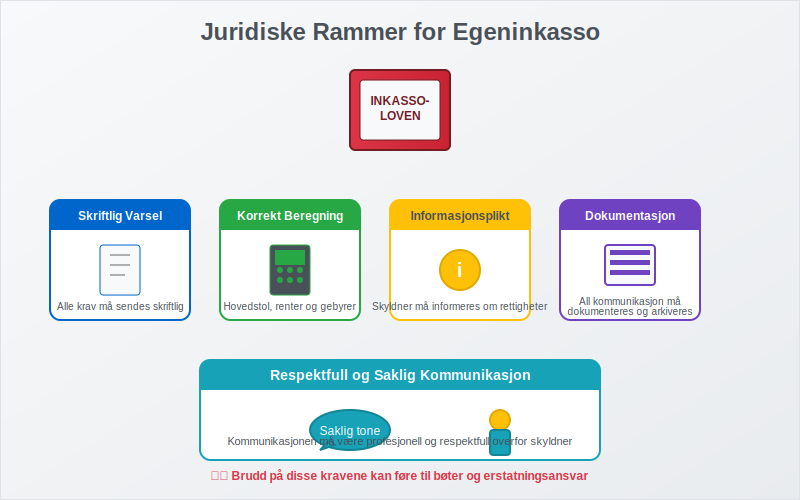
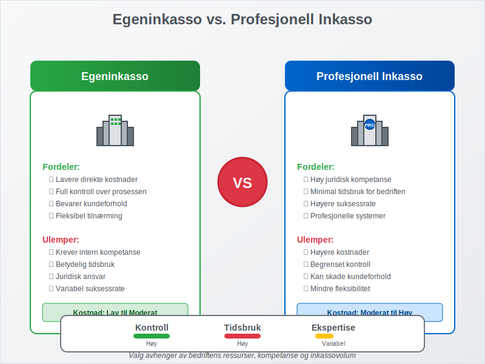

**Egeninkasso** er når en kreditor selv driver inkassovirksomhet for å kreve inn forfalte fordringer, i stedet for å overlate oppgaven til et profesjonelt inkassoselskap. Dette er en lovlig og ofte kostnadseffektiv metode for bedrifter som ønsker å beholde kontrollen over [kundeoppfølging](/blogs/regnskap/hva-er-ansattreskontro "Hva er Ansattreskontro? Komplett Guide til Kundeoppfølging og Fordringsstyring") og inkassoprosessen. Egeninkasso krever imidlertid grundig kunnskap om juridiske rammer og korrekte prosedyrer.

## Seksjon 1: Juridiske Rammer for Egeninkasso

Egeninkasso er regulert av **inkassoloven** og **forbrukerkjøpsloven**, og må følge strenge regler for å være lovlig. Bedrifter som driver egeninkasso må overholde de samme kravene som profesjonelle inkassoselskaper når det gjelder kommunikasjon med skyldnere.

### Lovpålagte Krav til Egeninkasso

For at egeninkasso skal være lovlig, må følgende krav oppfylles:

* **Skriftlig varsel:** Alle inkassokrav må sendes skriftlig med tydelig informasjon
* **Korrekt beregning:** Hovedstol, renter og gebyrer må være korrekt beregnet
* **Informasjonsplikt:** Skyldner må informeres om sine rettigheter
* **Dokumentasjon:** All kommunikasjon må dokumenteres og arkiveres
* **Respektfull tone:** Kommunikasjonen må være saklig og respektfull

## Seksjon 2: Egeninkasso vs. Profesjonell Inkasso

Før en bedrift bestemmer seg for egeninkasso, er det viktig å forstå forskjellene mellom egeninkasso og profesjonell inkasso. Valget påvirker både kostnader, tidsbruk og suksessrate.

### Sammenligning av Inkassometoder

| Aspekt | Egeninkasso | Profesjonell Inkasso |
|--------|-------------|----------------------|
| **Kostnader** | Lavere direkte kostnader | Høyere gebyrer, men ingen internkostnader |
| **Tidsbruk** | Krever betydelig intern ressurs | Minimal tidsbruk for bedriften |
| **Juridisk ekspertise** | Krever intern kompetanse | Profesjonell juridisk kompetanse |
| **Suksessrate** | Varierer med intern kompetanse | Generelt høyere suksessrate |
| **Kontroll** | Full kontroll over prosessen | Begrenset kontroll |
| **Kundeforhold** | Kan påvirke kundeforhold direkte | Buffer mellom bedrift og kunde |

### Når Bør Du Velge Egeninkasso?

Egeninkasso er mest hensiktsmessig når:

* Bedriften har **juridisk kompetanse** internt
* Inkassovolumene er **moderate og håndterbare**
* Det er viktig å **bevare kundeforholdet**
* Bedriften ønsker **full kontroll** over prosessen
* **Kostnadskontroll** er kritisk

## Seksjon 3: Prosedyrer for Egeninkasso

En systematisk tilnærming til egeninkasso øker sannsynligheten for vellykket innkreving og sikrer overholdelse av juridiske krav. Prosessen starter vanligvis etter at normale [betalingsoppfordringer](/blogs/regnskap/hva-er-betalingsoppfordring "Betalingsoppfordring - Komplett Guide til Purring og Inkasso i Norge") ikke har ført til betaling.

### Trinn-for-Trinn Egeninkasso Prosess

#### Trinn 1: Forberedelse og Dokumentasjon

Før egeninkasso starter, må bedriften sikre at:

* Den opprinnelige [fakturaen](/blogs/regnskap/hva-er-en-faktura "Hva er en Faktura? En Guide til Norske Fakturakrav") er korrekt og juridisk bindende
* Alle [betalingsoppfordringer](/blogs/regnskap/hva-er-betalingsoppfordring "Betalingsoppfordring - Komplett Guide til Purring og Inkasso i Norge") er sendt og dokumentert
* Skyldnerens kontaktinformasjon er oppdatert og korrekt
* Alle relevante avtaler og dokumenter er tilgjengelige

#### Trinn 2: Første Inkassokrav

Det første inkassokravet må inneholde:

* **Tydelig identifikasjon** av kreditor og skyldner
* **Detaljert oversikt** over hovedstol, renter og gebyrer
* **Betalingsfrist** (minimum 14 dager)
* **Informasjon om konsekvenser** ved manglende betaling
* **Kontaktinformasjon** for henvendelser

#### Trinn 3: Oppfølging og Eskalering

Hvis første inkassokrav ikke fører til betaling:

* **Andre inkassokrav** med strengere tone
* **Telefonisk kontakt** for å avklare situasjonen
* **Forhandling** om betalingsordning hvis aktuelt
* **Vurdering** av videre rettslige skritt

### Beregning av Inkassokostnader

Ved egeninkasso kan bedriften kreve de samme gebyrene som profesjonelle inkassoselskaper:

| Type Gebyr | Beløp | Hjemmel |
|------------|-------|---------|
| **Første inkassokrav** | Inntil kr 200 | Inkassoforskriften § 4 |
| **Andre inkassokrav** | Inntil kr 400 | Inkassoforskriften § 4 |
| **Forsinkelsesrenter** | 8,5% p.a. (2024) | Forsinkelsesrenteloven |
| **Saksomkostninger** | Faktiske kostnader | Tvisteloven |

For en detaljert gjennomgang av hvordan [inkassosalær](/blogs/regnskap/hva-er-inkassosalaer "Hva er Inkassosalær? Komplett Guide til Inkassohonorar og Gebyrer i Norge") beregnes og reguleres, inkludert prosentbaserte honorarer og bransjespesifikke satser, se vår omfattende guide.

## Seksjon 4: Regnskapsføring av Egeninkasso

Korrekt regnskapsføring av egeninkassoaktiviteter er essensielt for å opprettholde oversikt over fordringer og kostnader. Dette påvirker både [driftsresultatet](/blogs/regnskap/hva-er-driftsresultat "Hva er Driftsresultat? Beregning, Analyse og Betydning for Bedriften") og [betalingsevnen](/blogs/regnskap/hva-er-betalingsevne "Hva er Betalingsevne? Analyse av Likviditet og Finansiell Stabilitet").

### Kontering av Inkassoaktiviteter

#### Inkassokostnader og Gebyrer

Når bedriften sender inkassokrav, skal gebyrene konteres som:

* **Debet:** Kundefordringer (økning av fordring)
* **Kredit:** Andre driftsinntekter (gebyr som inntekt)

#### Forsinkelsesrenter

Påløpte forsinkelsesrenter konteres som:

* **Debet:** Kundefordringer
* **Kredit:** Renteinntekter

#### Tap på Fordringer

Hvis inkasso ikke lykkes, må fordringen eventuelt [avskrives](/blogs/regnskap/hva-er-avskrivning "Hva er Avskrivning? Metoder, Regler og Regnskapsføring") som tap:

* **Debet:** Tap på fordringer
* **Kredit:** Kundefordringer

## Seksjon 5: Utfordringer og Risikofaktorer

Egeninkasso medfører flere utfordringer som bedrifter må være oppmerksomme på for å unngå juridiske problemer og ineffektiv ressursbruk.

### Vanlige Fallgruver ved Egeninkasso

#### Juridiske Risikofaktorer

* **Brudd på inkassoloven:** Kan føre til bøter og erstatningsansvar
* **Ulovlig trusler:** Kan resultere i straffereaksjoner
* **Feil beregninger:** Kan undergrave hele inkassokravet
* **Manglende dokumentasjon:** Svekker saken ved eventuell rettslig behandling

#### Operasjonelle Utfordringer

* **Tidsbruk:** Egeninkasso krever betydelige interne ressurser
* **Kompetansekrav:** Krever juridisk og administrativ kompetanse
* **Kundeforhold:** Kan skade langsiktige kundeforhold
* **Suksessrate:** Ofte lavere enn profesjonell inkasso

### Når Bør Du Overlate til Profesjonell Inkasso?

Det er tid å vurdere profesjonell inkasso når:

* **Egeninkasso ikke gir resultater** etter 2-3 forsøk
* **Skyldner bestrider kravet** og det kreves juridisk ekspertise
* **Beløpet er høyt** og rettferdigheter kostnadene
* **Bedriften mangler ressurser** til oppfølging
* **Kundeforholdet allerede er ødelagt**

## Seksjon 6: Digitale Verktøy for Egeninkasso

Moderne teknologi kan effektivisere egeninkassoprosessen betydelig. Mange regnskapssystemer og CRM-løsninger tilbyr integrerte funksjoner for inkassohåndtering.

### Automatisering av Inkassoprosessen

#### Systemintegrasjon

Effektiv egeninkasso drar nytte av integrasjon mellom:

* **Regnskapssystem:** For automatisk oppfølging av forfalte [fakturaer](/blogs/regnskap/hva-er-en-faktura "Hva er en Faktura? En Guide til Norske Fakturakrav")
* **CRM-system:** For kundehistorikk og kommunikasjonssporing
* **E-postautomatisering:** For systematisk utsendelse av inkassokrav
* **Betalingsløsninger:** For enkel betaling direkte fra inkassokrav

#### Digitale Inkassoverktøy

Moderne bedrifter kan benytte:

* **Automatiske påminnelser** basert på forfallsdatoer
* **Malbaserte inkassokrav** som sikrer juridisk korrekthet
* **Sporingsverktøy** for å følge opp kommunikasjon
* **Rapporteringsverktøy** for å analysere inkassoeffektivitet

## Seksjon 7: Beste Praksis for Egeninkasso

Suksessful egeninkasso krever en balansert tilnærming som kombinerer juridisk korrekthet med praktisk effektivitet og bevaring av kundeforhold.

### Kommunikasjonsstrategi

#### Profesjonell og Respektfull Tone

* **Saklig språk:** Unngå emosjonelle eller truende formuleringer
* **Tydelig informasjon:** Presenter alle fakta klart og strukturert
* **Løsningsorientert:** Tilby betalingsordninger når det er hensiktsmessig
* **Dokumentasjon:** Arkiver all kommunikasjon systematisk

#### Timing og Oppfølging

* **Konsekvent oppfølging:** Følg opp systematisk etter fastsatte frister
* **Fleksibilitet:** Vær åpen for dialog og alternative løsninger
* **Eskalering:** Ha en klar plan for når saken skal overføres til profesjonell inkasso

### Organisatoriske Forutsetninger

For å drive effektiv egeninkasso bør bedriften ha:

* **Dedikerte ressurser:** Personer med ansvar for inkassooppfølging
* **Juridisk kompetanse:** Intern eller ekstern juridisk rådgivning
* **Systemer og rutiner:** Etablerte prosedyrer og verktøy
* **Ledelsesforankring:** Støtte fra ledelsen for inkassoaktiviteter

## Seksjon 8: Økonomiske Konsekvenser av Egeninkasso

Egeninkasso påvirker bedriftens økonomi på flere måter, både direkte gjennom kostnader og indirekte gjennom påvirkning på [kontantstrøm](/blogs/regnskap/hva-er-arbeidskapital "Hva er Arbeidskapital? Beregning, Analyse og Optimalisering") og kundeforhold.

### Kostnads-Nytte Analyse

#### Direkte Kostnader ved Egeninkasso

* **Personalkostnader:** Tid brukt på inkassoaktiviteter
* **Systemkostnader:** Investering i inkassoverktøy og systemer
* **Administrasjonskostnader:** Porto, telefon og andre kommunikasjonskostnader
* **Juridiske kostnader:** Rådgivning og eventuell rettslig behandling

#### Potensielle Inntekter

* **Inkassogebyrer:** Lovlige gebyrer som kan kreves fra skyldner
* **Forsinkelsesrenter:** Renter på forfalte beløp
* **Innkrevde fordringer:** Hovedstolen som ellers kunne blitt tapt

### Påvirkning på Kontantstrøm

Effektiv egeninkasso kan forbedre bedriftens [betalingsevne](/blogs/regnskap/hva-er-betalingsevne "Hva er Betalingsevne? Analyse av Likviditet og Finansiell Stabilitet") ved å:

* **Redusere kundefordringer** gjennom raskere innkreving
* **Forbedre betalingsmoral** hos eksisterende kunder
* **Minimere tap på fordringer** gjennom proaktiv oppfølging
* **Øke forutsigbarhet** i kontantstrømmen

## Konklusjon

Egeninkasso kan være en kostnadseffektiv og kontrollerbar metode for å håndtere forfalte fordringer, men krever grundig planlegging, juridisk kunnskap og systematisk gjennomføring. Bedrifter som vurderer egeninkasso må veie fordelene mot ulempene og sikre at de har nødvendige ressurser og kompetanse.

**Nøkkelfaktorer for suksessful egeninkasso:**

* **Juridisk etterlevelse:** Følg alle lovkrav og forskrifter nøye
* **Systematisk tilnærming:** Etabler klare rutiner og prosedyrer
* **Profesjonell kommunikasjon:** Oppretthold respektfull og saklig tone
* **Teknologisk støtte:** Benytt digitale verktøy for effektivisering
* **Kontinuerlig evaluering:** Vurder regelmessig om egeninkasso er den beste løsningen

For bedrifter som ikke har ressurser eller kompetanse til egeninkasso, kan det være mer hensiktsmessig å benytte profesjonelle inkassotjenester. Det viktigste er å ha en proaktiv tilnærming til [kundeoppfølging](/blogs/regnskap/hva-er-ansattreskontro "Hva er Ansattreskontro? Komplett Guide til Kundeoppfølging og Fordringsstyring") og inkassohåndtering for å minimere tap på fordringer og opprettholde god [betalingsevne](/blogs/regnskap/hva-er-betalingsevne "Hva er Betalingsevne? Analyse av Likviditet og Finansiell Stabilitet").
