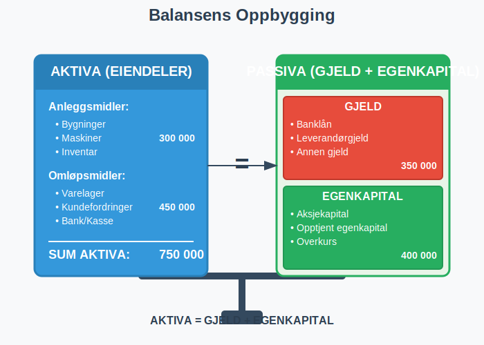
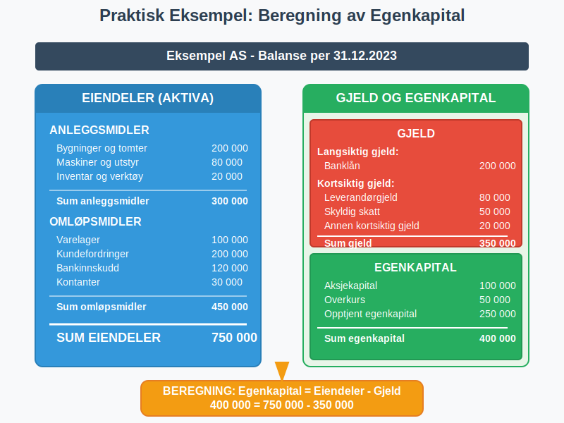

**Egenkapital** er den delen av et selskaps totale [kapital](/blogs/regnskap/hva-er-kapital "Hva er Kapital? Komplett Guide til Kapitaltyper i Regnskap og Økonomi") som tilhører eierne. Som en fundamental form for [finanskapital](/blogs/regnskap/hva-er-finanskapital "Hva er Finanskapital? Definisjon, Typer og Betydning i Regnskap"), representerer egenkapital eiernes netto formue i selskapet og beregnes som forskjellen mellom selskapets [eiendeler (aktiva)](/blogs/regnskap/hva-er-aktiva "Hva er Aktiva? Komplett Guide til Eiendeler i Regnskapet") og gjeld (passiva). Egenkapital er et grunnleggende begrep i [regnskap](/blogs/regnskap/hva-er-regnskap "Hva er Regnskap? En komplett guide") og finansiell analyse. [Styret](/blogs/regnskap/hva-er-styre "Hva er Styre? Ansvar, Rolle og Oppgaver i Aksjeselskap") har ansvaret for å sikre forsvarlig egenkapital og likviditet i selskapet.

 
 For en fullstendig oversikt over finansieringsformer, se [Hva er Finansiering?](/blogs/regnskap/hva-er-finansiering "Hva er Finansiering? Komplett Guide til Bedriftsfinansiering og Finansieringsformer").

### Definisjon og Grunnleggende Forståelse

Egenkapital kan defineres på flere måter:

#### Regnskapsmessig Definisjon
Egenkapital = **Eiendeler (Aktiva) - Gjeld (Passiva)**

Dette er den mest grunnleggende formelen som viser at egenkapital er det som blir igjen når alle forpliktelser er trukket fra alle eiendeler.

#### Økonomisk Perspektiv
Fra et økonomisk perspektiv representerer egenkapital:
- Eiernes investering i selskapet
- Akkumulert overskudd som ikke er utbetalt som utbytte
- Selskapets **[netto formue](/blogs/regnskap/hva-er-formue "Hva er Formue i Regnskap? Beregning, Typer og Analyse av Nettoformue")**
- Eiernes krav på selskapets eiendeler

### Egenkapitalens Komponenter

Egenkapital består av flere hovedkomponenter som vises i [balansen](/blogs/regnskap/hva-er-balanse "Hva er Balanse? Komplett Guide til Balanseregnskap"):

#### 1. Aksjekapital
For [aksjeselskaper](/blogs/regnskap/hva-er-et-aksjeselskap "Hva er et Aksjeselskap? Komplett Guide til Selskapsformen") er [aksjekapital](/blogs/regnskap/hva-er-aksjekapital "Hva er Aksjekapital? Krav og Forklaring") den grunnleggende komponenten:
- **Innskutt kapital** fra aksjonærene
- Minimum 30 000 kr for AS
- Representerer eiernes direkte investering

#### 2. Opptjent Egenkapital
For en grundig gjennomgang av **opptjent egenkapital**, se vår egen artikkel [Opptjent egenkapital](/blogs/regnskap/opptjent-egenkapital "Opptjent egenkapital – Guide til tilbakeholdt overskudd og akkumulert resultat").

#### 3. Overkurs
- Beløp betalt **utover pålydende** ved aksjeemisjoner
- Oppstår når aksjer selges til høyere pris enn pålydende verdi
- Viser markedets verdsetting av selskapet

#### 4. Andre Egenkapitalposter
- [**Fond for vurderingsforskjeller**](/blogs/kontoplan/2040-fond-for-vurderingsforskjeller "Konto 2040 - Fond for vurderingsforskjeller: Fond for vurderingsforskjeller i Norsk Standard Kontoplan")
- **Gavefond**
- **Annen innskutt egenkapital**

### Beregning av Egenkapital

La oss se på praktiske eksempler på hvordan egenkapital beregnes:

#### Eksempel 1: Enkelt Aksjeselskap

| **Balanseposter** | **Beløp (NOK)** |
|-------------------|-----------------|
| **EIENDELER (AKTIVA)** | |
| Kontanter | 150 000 |
| Kundefordringer | 200 000 |
| Varelager | 100 000 |
| Maskiner og utstyr | 300 000 |
| **Sum eiendeler** | **750 000** |
| | |
| **GJELD (PASSIVA)** | |
| Leverandørgjeld | 80 000 |
| Banklån | 200 000 |
| Annen kortsiktig gjeld | 70 000 |
| **Sum gjeld** | **350 000** |
| | |
| **EGENKAPITAL** | |
| Aksjekapital | 100 000 |
| Opptjent egenkapital | 300 000 |
| **Sum egenkapital** | **400 000** |
| | |
| **Sum gjeld og egenkapital** | **750 000** |

**Beregning:** Egenkapital = 750 000 - 350 000 = **400 000 NOK**

### Egenkapitalandel og Nøkkeltall

#### Egenkapitalandel
**Egenkapitalandel** er et viktig nøkkeltall som viser hvor stor andel av selskapets totale kapital som kommer fra eierne:

**Egenkapitalandel = (Egenkapital / Sum eiendeler) × 100%**

I eksemplet over: (400 000 / 750 000) × 100% = **53,3%**

#### Vurdering av Egenkapitalandel

| **Egenkapitalandel** | **Vurdering** | **Betydning** |
|---------------------|---------------|---------------|
| Over 40% | Meget god | Høy finansiell stabilitet |
| 30-40% | God | Akseptabel soliditet |
| 20-30% | Middels | Noe risiko, bør overvåkes |
| 10-20% | Svak | Høy gjeldsgrad, finansiell risiko |
| Under 10% | Kritisk | Meget høy risiko for konkurs |

### Forskjellen mellom Egenkapital og Fremmedkapital

Det er viktig å forstå forskjellen mellom **egenkapital** og **fremmedkapital**:

#### Egenkapital
- Tilhører **eierne**
- Ingen fast forpliktelse til tilbakebetaling
- Eierne bærer **risikoen** for tap
- Gir rett til utbytte når selskapet går med overskudd
- Permanent kapital

#### [Fremmedkapital](/blogs/regnskap/hva-er-fremmedkapital "Hva er Fremmedkapital? Komplett Guide til Gjeld og Lånefinansiering") ([Gjeld](/blogs/regnskap/hva-er-gjeld "Hva er Gjeld i Regnskap? Komplett Guide til Forpliktelser og Gjeldstyper"))
- Tilhører **kreditorer**
- Fast forpliktelse til tilbakebetaling
- Kreditorene har **prioritet** ved konkurs
- Fast rente eller avkastning
- Tidsbegrenset kapital

For en detaljert gjennomgang av gjeldsbegrepet, se vår omfattende artikkel [Hva er gjeld?](/blogs/regnskap/hva-er-gjeld "Hva er Gjeld i Regnskap? Komplett Guide til Forpliktelser og Gjeldstyper").

### Egenkapitalens Rolle i Ulike Selskapsformer

#### Aksjeselskap (AS)
- Egenkapital delt inn i [aksjer](/blogs/regnskap/hva-er-en-aksje "Hva er en Aksje? En Enkel Forklaring")
- Minimum 30 000 kr i [aksjekapital](/blogs/regnskap/hva-er-aksjekapital "Hva er Aksjekapital? Krav og Forklaring")
- Begrenset ansvar for aksjonærene
- Kan ha ulike [aksjeklasser](/blogs/regnskap/hva-er-aksjeklasser "Hva er Aksjeklasser? A-aksjer og B-aksjer Forklart")

#### Enkeltpersonforetak
- Egenkapital = eierens personlige investering
- Ubegrenset personlig ansvar
- Enklere struktur enn aksjeselskap

#### [Ansvarlig Selskap (ANS)](/blogs/regnskap/ansvarlig-selskap-delt-ansvar "Ansvarlig Selskap og Delt Ansvar: Komplett Guide til ANS")
- Egenkapital fordelt mellom deltakerne
- Solidarisk ansvar for alle deltakere
- Mer kompleks enn enkeltpersonforetak

### Faktorer som Påvirker Egenkapital

#### Positive Faktorer (Øker Egenkapital)
- **Overskudd** fra driften
- **Kapitalinnskudd** fra eierne
- **Verdiøkning** på eiendeler
- **Overkurs** ved aksjeemisjoner

#### Negative Faktorer (Reduserer Egenkapital)
- **Underskudd** fra driften
- **Utbytteutbetalinger** til eierne (begrenset av [maskimalt utbytte](/blogs/regnskap/maskimalt-utbytte "Maskimalt Utbytte - Komplett Guide til Utbytteregler og Beregning"))
- **Verdifall** på eiendeler
- **Tap** på investeringer

### Egenkapital og Finansiering

#### Egenfinansiering
[Selvfinansiering](/blogs/regnskap/hva-er-selvfinansiering "Hva er Selvfinansiering? Komplett Guide til Intern Finansiering og Kapitaloppbygging") skjer når selskapet finansierer vekst og investeringer med:
- **Tilbakeholdt overskudd**
- **Avskrivninger** som ikke krever kontantutbetaling
- **Salg av eiendeler**

#### Fordeler med Høy Egenkapital
- **Finansiell stabilitet** og lavere risiko
- **Større handlingsrom** i vanskelige tider
- **Bedre lånemuligheter** fra banker
- **Lavere finanskostnader**
- **Større investeringskapasitet**

#### Ulemper med Høy Egenkapital
- **Lavere avkastning** på egenkapital (ROE)
- **Mindre gearing-effekt**
- **Potensielt ineffektiv** kapitalbruk

### Egenkapital i Regnskapsanalyse

#### Viktige Nøkkeltall

**1. Avkastning på Egenkapital (ROE)**
[Egenkapitalrentabilitet](/blogs/regnskap/hva-er-egenkapitalrentabilitet "Hva er Egenkapitalrentabilitet? Komplett Guide til ROE Beregning") måler hvor effektivt selskapet bruker eiernes kapital til å generere overskudd:
ROE = (Årsresultat / Gjennomsnittlig egenkapital) × 100%

**2. Egenkapitalandel**
Egenkapitalandel = (Egenkapital / Sum eiendeler) × 100%

**3. Gjeldsgrad**
Gjeldsgrad = [Gjeld](/blogs/regnskap/hva-er-gjeld "Hva er Gjeld i Regnskap? Komplett Guide til Forpliktelser og Gjeldstyper") / Egenkapital

**4. Soliditetsgrad**
Soliditetsgrad = Egenkapital / Sum eiendeler

#### Analyse av Egenkapitalutvikling

Ved analyse av egenkapital bør man se på:
- **Utviklingen over tid** - øker eller synker egenkapitalen?
- **Sammenligning med bransjen** - hvordan står selskapet i forhold til konkurrentene?
- **Årsaker til endringer** - kommer endringene fra drift eller finansiering?

### Egenkapital og Skatt

#### Skattemessige Aspekter
- **Utbytte** fra egenkapital beskattes som kapitalinntekt
- **Gevinst ved salg** av aksjer beskattes som kapitalinntekt
- **Tap ved salg** kan trekkes fra i kapitalinntekt

#### Utbytteskatt
- **22% skatt** på utbytte over skjermingsfradrag
- [**Skjermingsfradrag**](/blogs/regnskap/hva-er-skjermingsfradrag "Hva er Skjermingsfradrag? Skattefradrag for Alternativkostnad ved Aksjeinvestering") basert på aksjekapital og risikofri rente
- Gunstigere enn lønnsskatt for høye inntekter

### Praktiske Råd for Egenkapitalstyring

#### For Gründere og Små Bedrifter
1. **Start med tilstrekkelig kapital** - ikke bare minimum
2. **Reinvester overskudd** for å bygge egenkapital
3. **Overvåk egenkapitalandelen** regelmessig
4. **Planlegg kapitalinnhenting** i god tid

#### For Etablerte Selskaper
1. **Balancer** mellom utbytte og reinvestering (innenfor [maskimalt utbytte](/blogs/regnskap/maskimalt-utbytte "Maskimalt Utbytte - Komplett Guide til Utbytteregler og Beregning"))
2. **Vurder** emisjoner ved store investeringer
3. **Optimaliser** kapitalstrukturen
4. **Kommuniser** egenkapitalstrategi til investorer

### Egenkapital og Konkursrisiko

For en grundig gjennomgang av akkumulerte tap som ikke er dekket av egenkapital (udekket tap), se artikkelen [Udekket tap](/blogs/regnskap/udekket-tap "Udekket tap – Hva betyr udekket tap i regnskap og hvordan håndtere?").

#### Negativ Egenkapital
Når gjeld overstiger eiendeler, oppstår **negativ egenkapital**:

- Selskapet er **teknisk konkurs**
- Styret må vurdere **fortsatt drift**
- Kan kreve **kapitalinnhenting** eller **avvikling**

#### Varslingsplikter
Ved lav egenkapital har styret plikt til å:
- **Innkalle generalforsamling**
- **Vurdere selskapets situasjon**
- **Iverksette tiltak** for å bedre situasjonen

### Moderne Finansieringsformer og Egenkapital

#### Crowdfunding og Egenkapital
[Crowdfunding](/blogs/regnskap/hva-er-crowdfunding "Hva er Crowdfunding i Regnskap? Regnskapsføring, Skatt og Juridiske Krav") kan påvirke egenkapital på ulike måter:
- **Equity crowdfunding** øker egenkapital direkte
- **Reward-based crowdfunding** kan gi inntekter som styrker egenkapital
- **Debt crowdfunding** øker gjeld, ikke egenkapital

#### Alternative Finansieringskilder
- **[Crowdlending](/blogs/regnskap/hva-er-crowdlending "Hva er Crowdlending i Regnskap? P2P Utlån, Regnskapsføring og Skattemessige Konsekvenser")** - lån som øker gjeld
- **Venturekapital** - egenkapitalinvestering
- **[Aksjonærlån](/blogs/regnskap/hva-er-aksjonaerlan-til-as "Hva er Aksjonærlån til AS? Finansiering, Skatt og Praktiske Råd")** - fleksibel finansiering

### Egenkapital i Ulike Bransjer

#### Kapitalintensive Bransjer
- **Industri og produksjon:** Høyere egenkapitalkrav
- **Eiendom:** Ofte lavere egenkapitalandel
- **Teknologi:** Varierende, avhengig av vekstfase

#### Servicebransjer
- **Konsulentvirksomhet:** Ofte høy egenkapitalandel
- **Handel:** Middels egenkapitalkrav
- **Transport:** Varierende avhengig av kapitalintensitet

### Internasjonale Perspektiver

#### IFRS vs. Norske Regnskapsregler
- **IFRS:** Mer detaljerte krav til egenkapitalrapportering
- **Norske regler:** Enklere for små og mellomstore bedrifter
- **Sammenlignbarhet:** Viktig ved internasjonal virksomhet

#### Egenkapitalkrav i Ulike Land
- **Norge:** Minimum 30 000 kr for AS
- **Sverige:** 25 000 SEK for AB
- **Danmark:** 40 000 DKK for ApS

### Fremtidige Trender

#### Digitalisering og Egenkapital
- **Automatisert rapportering** gjør egenkapitaloppfølging enklere
- **Sanntidsdata** gir bedre kontroll
- **AI-basert analyse** kan forutsi egenkapitalutvikling

#### Bærekraft og ESG
- **ESG-faktorer** påvirker investorers vurdering av egenkapital
- **Bærekraftige investeringer** kan kreve høyere egenkapital
- **Rapporteringskrav** øker for bærekraftsinformasjon, inkludert [SFDR-regulering](/blogs/regnskap/hva-er-sfdr "Hva er SFDR? Guide til Sustainable Finance Disclosure Regulation") for finansmarkedsdeltakere

### Relaterte Begreper og Konsepter

For å forstå egenkapital fullt ut, bør du også sette deg inn i:

- **[Aktiva](/blogs/regnskap/hva-er-aktiva "Hva er Aktiva? Komplett Guide til Eiendeler i Regnskapet")** - Selskapets eiendeler
- **[Balanse](/blogs/regnskap/hva-er-balanse "Hva er Balanse? Komplett Guide til Balanseregnskap")** - Oversikt over eiendeler, gjeld og egenkapital
- **[Formuesverdi](/blogs/regnskap/hva-er-formuesverdi "Formuesverdi - Komplett Guide til Verdivurdering og Formuesvurdering")** - Verdivurdering av eiendeler og netto formue
- **[Aksjekapital](/blogs/regnskap/hva-er-aksjekapital "Hva er Aksjekapital? Krav og Forklaring")** - Grunnleggende egenkapital i aksjeselskaper
- **[Aksjeselskap](/blogs/regnskap/hva-er-et-aksjeselskap "Hva er et Aksjeselskap? Komplett Guide til Selskapsformen")** - Selskapsform med aksjebasert egenkapital
- **[Aksjer](/blogs/regnskap/hva-er-en-aksje "Hva er en Aksje? En Enkel Forklaring")** - Eierandeler som representerer egenkapital
- **[Avkastning](/blogs/regnskap/hva-er-avkastning "Hva er Avkastning? Komplett Guide til Investeringsavkastning og Beregning")** - Avkastning på egenkapital
- **[Egenkapitalrentabilitet](/blogs/regnskap/hva-er-egenkapitalrentabilitet "Hva er Egenkapitalrentabilitet? Komplett Guide til ROE Beregning")** - Måling av avkastning på egenkapital
- **[Egenfinansiering](/blogs/regnskap/hva-er-egenfinansiering "Hva er Egenfinansiering? Komplett Guide til Intern Finansiering")** - Finansiering med egenkapital
- **[Sysselsatt kapital](/blogs/regnskap/hva-er-sysselsatt-kapital "Hva er Sysselsatt Kapital? Komplett Guide til ROCE og Kapitaleffektivitet")** - Total kapital aktivt brukt i virksomheten
- **[Regnskap](/blogs/regnskap/hva-er-regnskap "Hva er Regnskap? En komplett guide")** - Regnskapssystem som viser egenkapital

Egenkapital er et fundamentalt begrep som påvirker alle aspekter av bedriftsdrift og finansiell planlegging. En solid forståelse av egenkapital er essensielt for alle som driver eller planlegger å drive virksomhet.
