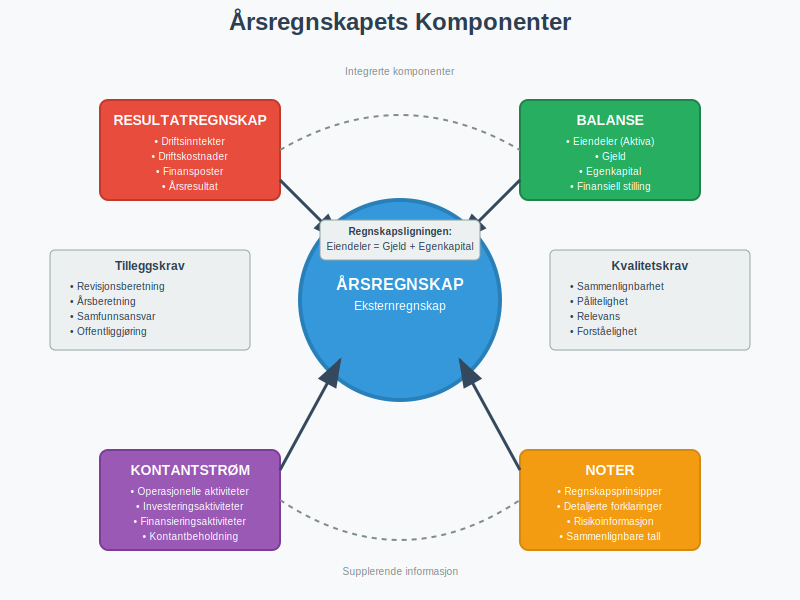
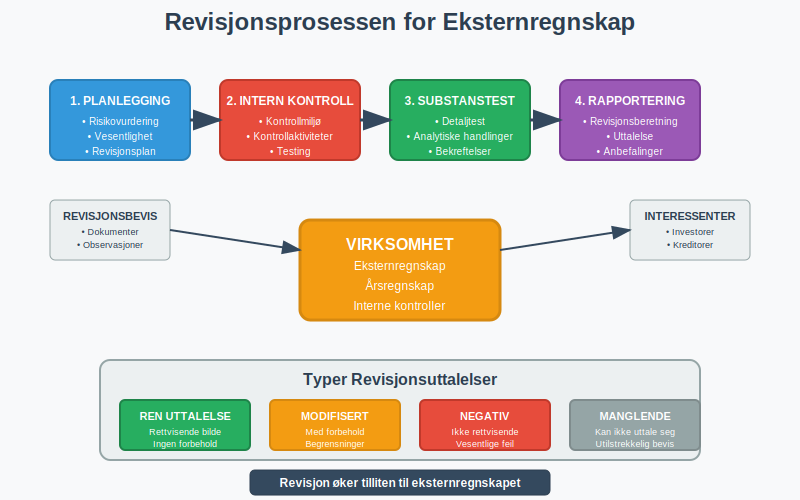

**Eksternregnskap** er finansiell rapportering som er utarbeidet primært for **eksterne interessenter** som investorer, kreditorer, myndigheter, kunder og leverandører. Dette står i motsetning til internregnskap, som er rettet mot ledelsen og interne beslutningstagere. Eksternregnskapet følger strenge regnskapsstandarder og lovkrav for å sikre **transparens**, **sammenlignbarhet** og **pålitelighet** i finansiell rapportering.

## Seksjon 1: Grunnleggende om Eksternregnskap

Eksternregnskap er fundamentet for **finansiell kommunikasjon** mellom virksomheter og deres eksterne interessenter. Det gir et standardisert og regulert bilde av virksomhetens økonomiske stilling og resultater.

### 1.1 Definisjon og Formål

**Eksternregnskap** kan defineres som:
> *Et systematisk og regulert system for registrering, måling og kommunikasjon av finansiell informasjon til eksterne brukere for å støtte deres økonomiske beslutninger.*

Hovedformålene med eksternregnskap inkluderer:

* **Informasjonsformidling**: Gi relevant og pålitelig finansiell informasjon
* **Ansvarlighet**: Vise hvordan ledelsen har forvaltet virksomhetens ressurser
* **Beslutningsstøtte**: Hjelpe eksterne brukere med investeringsbeslutninger
* **Regulatorisk overholdelse**: Oppfylle lovkrav og regnskapsstandarder

### 1.2 Hovedkarakteristika ved Eksternregnskap

| Karakteristikk | Beskrivelse | Betydning |
|---|---|---|
| **Standardisert** | Følger IFRS/GAAP standarder | Sikrer sammenlignbarhet |
| **Historisk** | Basert på faktiske transaksjoner | Gir objektiv informasjon |
| **Periodisk** | Rapporteres kvartalsvis/årlig | Strukturert rapportering |
| **Revidert** | Undergår ekstern revisjon | Øker troverdighet |
| **Offentlig** | Tilgjengelig for alle interessenter | Sikrer transparens |

## Seksjon 2: Regnskapsstandarder og Rammeverk

Eksternregnskap er strengt regulert gjennom internasjonale og nasjonale regnskapsstandarder som sikrer **konsistens** og **sammenlignbarhet** på tvers av virksomheter og land.

### 2.1 Internasjonale Regnskapsstandarder

#### IFRS (International Financial Reporting Standards)
**IFRS** er den dominerende globale standarden for finansiell rapportering, utviklet av International Accounting Standards Board (IASB). I Norge er IFRS obligatorisk for:

* Børsnoterte selskaper
* Finansinstitusjoner
* Forsikringsselskaper
* Store konsern (frivillig)

#### Sentrale IFRS-prinsipper:
* **Substans over form**: Økonomisk realitet prioriteres over juridisk form
* **Forsiktighetsprinsippet**: Konservativ tilnærming til usikkerhet
* **Sammenlignbarhet**: Konsistent anvendelse over tid og mellom enheter
* **Vesentlighet**: Fokus på informasjon som påvirker beslutninger

### 2.2 Norske Regnskapsstandarder

For virksomheter som ikke følger IFRS, gjelder **Regnskapsloven** og **God regnskapsskikk** (GRS). Dette omfatter de fleste små og mellomstore bedrifter i Norge.

**Regnskapsloven** setter krav til:
* [Bokføringsplikt](/blogs/regnskap/hva-er-bokforingsplikt "Hva er Bokføringsplikt? Komplett Guide til Norsk Bokføringspraksis") for alle virksomheter
* Årsregnskapets innhold og struktur
* Revisjonsplikt for større virksomheter
* Offentliggjøring av årsregnskap

For en dyptgående forståelse av det norske regnskapsrammeverket, se vår guide til [bokføringsloven](/blogs/regnskap/hva-er-bokforingsloven "Hva er Bokføringsloven? Komplett Guide til Norsk Bokføringslovgivning").

## Seksjon 3: Årsregnskapets Komponenter

**Årsregnskapet** er kjernen i eksternregnskapet og består av flere integrerte komponenter som sammen gir et helhetlig bilde av virksomhetens økonomiske situasjon.

### 3.1 Resultatregnskap

**Resultatregnskapet** viser virksomhetens inntekter, kostnader og resultat for regnskapsperioden. Det følger en standardisert struktur:

| Post | Beskrivelse | Formål |
|---|---|---|
| **Driftsinntekter** | Inntekter fra kjernevirksomhet | Vise operasjonell ytelse |
| **Driftskostnader** | Kostnader knyttet til drift | Måle operasjonell effektivitet |
| **Driftsresultat** | Resultat fra kjernevirksomhet | Indikere lønnsomhet |
| **Finansposter** | Renter, utbytte, valutagevinst/-tap | Vise finansiell påvirkning |
| **Skattekostnad** | Beregnet skatt på årets resultat | Vise skattemessig belastning |
| **Årsresultat** | Netto resultat etter skatt | Måle total lønnsomhet |

For en detaljert forklaring av driftsregnskapet, se vår artikkel om [driftsregnskap](/blogs/regnskap/hva-er-driftsregnskap "Hva er Driftsregnskap? Komplett Guide til Driftsregnskapet i Norge").

### 3.2 Balanse

**Balansen** viser virksomhetens finansielle stilling på et bestemt tidspunkt og følger den grunnleggende [regnskapsligningen](/blogs/regnskap/hva-er-regnskap "Hva er Regnskap? En Dybdeanalyse for Norge"):

**Eiendeler = Gjeld + Egenkapital**

#### Eiendeler (Aktiva)
* **Anleggsmidler**: Langsiktige investeringer som [anleggsmidler](/blogs/regnskap/hva-er-anleggsmidler "Hva er Anleggsmidler? Komplett Guide til Varige Driftsmidler")
* **Omløpsmidler**: Kortsiktige eiendeler som kontanter, kundefordringer og varelager

#### Gjeld og Egenkapital (Passiva)
* **Langsiktig gjeld**: Forpliktelser med forfallstid over ett år
* **Kortsiktig gjeld**: Forpliktelser med forfallstid innen ett år
* **Egenkapital**: Eiernes andel av virksomheten

For en grundig forståelse av balansens oppbygging, se vår guide til [balanse](/blogs/regnskap/hva-er-balanse "Hva er Balanse i Regnskap? Komplett Guide til Balansens Oppbygging og Funksjon").

### 3.3 Kontantstrømoppstilling

**Kontantstrømoppstillingen** viser hvordan kontanter strømmer inn og ut av virksomheten, kategorisert i tre hovedområder:

1. **Kontantstrøm fra operasjonelle aktiviteter**
   - Kontantstrøm fra kjernevirksomheten
   - Justert for endringer i [arbeidskapital](/blogs/regnskap/hva-er-arbeidskapital "Hva er Arbeidskapital? En Komplett Guide til Working Capital")

2. **Kontantstrøm fra investeringsaktiviteter**
   - Kjøp og salg av anleggsmidler
   - Investeringer i andre virksomheter

3. **Kontantstrøm fra finansieringsaktiviteter**
   - Låneopptak og nedbetaling
   - Egenkapitaltransaksjoner og utbytte

### 3.4 Noter til Regnskapet

**Notene** er en integrert del av årsregnskapet og gir:
* Detaljerte forklaringer til regnskapstall
* Informasjon om regnskapsprinsipper
* Tilleggsopplysninger om risiko og usikkerhet
* Sammenlignbare tall fra foregående år

## Seksjon 4: Revisjonsplikt og Kvalitetssikring

**Revisjon** er en kritisk komponent i eksternregnskapet som sikrer **troverdighet** og **pålitelighet** i finansiell rapportering.

### 4.1 Revisjonsplikt i Norge

Revisjonsplikt gjelder for virksomheter som oppfyller **to av tre** følgende kriterier:

| Kriterium | Grenseverdi |
|---|---|
| **Salgsinntekt** | Over 70 millioner kroner |
| **Balansesum** | Over 35 millioner kroner |
| **Gjennomsnittlig antall ansatte** | Over 50 [årsverk](/blogs/regnskap/arsverk "Årsverk") |

### 4.2 Revisjonsberetningen

**Revisjonsberetningen** er revisors konklusjon og inneholder:

* **Uttalelse om årsregnskapet**: Ren, modifisert eller negativ uttalelse
* **Uttalelse om forvaltning**: Vurdering av ledelsens forvaltning
* **Øvrige opplysninger**: Tilleggskommentarer og anbefalinger

### 4.3 Intern Kontroll og Kvalitetssikring

Virksomheter må etablere **interne kontrollsystemer** for å sikre:
* Korrekt regnskapsføring og [bilagsbehandling](/blogs/regnskap/hva-er-bilag "Hva er Bilag i Regnskap? Komplett Guide til Regnskapsbilag og Dokumentasjon")
* Forebygging av feil og misligheter
* Overholdelse av lover og forskrifter
* Effektiv [avstemming](/blogs/regnskap/hva-er-avstemming "Hva er Avstemming i Regnskap? Komplett Guide til Regnskapsavstemming") av regnskapsdata

## Seksjon 5: Eksternregnskap vs. Internregnskap

Forståelsen av forskjellene mellom **eksternregnskap** og **internregnskap** er avgjørende for å forstå deres respektive roller i virksomhetsstyring.

### 5.1 Sammenligning av Hovedkarakteristika

| Aspekt | Eksternregnskap | Internregnskap |
|---|---|---|
| **Primære brukere** | Investorer, kreditorer, myndigheter | Ledelse, avdelingsledere |
| **Rapporteringsfrekvens** | Årlig, kvartalsvis | Daglig, ukentlig, månedlig |
| **Reguleringer** | Strenge standarder (IFRS/GAAP) | Fleksible, tilpasset behov |
| **Tidshorisont** | Historisk fokus | Fremtidsrettet |
| **Detaljeringsnivå** | Aggregert, høyt nivå | Detaljert, operasjonelt |
| **Verifikasjon** | Ekstern revisjon | Intern kontroll |

### 5.2 Komplementære Roller

Selv om ekstern- og internregnskap har forskjellige formål, **komplementerer** de hverandre:

* **Eksternregnskap** gir det regulatoriske rammeverket og tillitsgrunnlaget
* **[Internregnskap](/blogs/regnskap/hva-er-internregnskap "Hva er Internregnskap? Komplett Guide til Intern Finansiell Styring og Rapportering")** gir detaljert styringsinformasjon for operasjonelle beslutninger
* Begge bidrar til **helhetlig virksomhetsstyring** og **strategisk planlegging**

For en dyptgående forståelse av internregnskap og hvordan det skiller seg fra eksternregnskap, se vår omfattende guide til [internregnskap](/blogs/regnskap/hva-er-internregnskap "Hva er Internregnskap? Komplett Guide til Intern Finansiell Styring og Rapportering").

## Seksjon 6: Digitalisering og Fremtidige Trender

**Digitalisering** transformerer eksternregnskapet gjennom automatisering, kunstig intelligens og sanntidsrapportering.

### 6.1 Teknologiske Innovasjoner

#### Automatisert Bokføring
* **Elektronisk fakturering** som [e-faktura](/blogs/regnskap/hva-er-efaktura "Hva er E-faktura? Komplett Guide til Elektronisk Fakturering i Norge")
* Automatisk [bilagsregistrering](/blogs/regnskap/hva-er-bilagsregistrere "Hva er Bilagsregistrering? Komplett Guide til Digital Bilagsbehandling")
* Integrerte [ERP-systemer](/blogs/regnskap/hva-er-erp-system "Hva er ERP-system? Komplett Guide til Enterprise Resource Planning")

#### Kunstig Intelligens og Maskinlæring
* **Automatisk kategorisering** av transaksjoner
* **Anomalideteksjon** for kvalitetskontroll
* **Prediktiv analyse** for prognoser og budsjetter

### 6.2 Regulatoriske Endringer

#### XBRL og Strukturert Rapportering
**XBRL** (eXtensible Business Reporting Language) standardiserer finansiell rapportering:
* Maskinlesbar finansiell informasjon
* Automatisert datavalidering
* Forbedret sammenlignbarhet

#### Sanntidsrapportering
Fremtidige krav kan inkludere:
* **Kontinuerlig revisjon** gjennom automatiserte kontroller
* **Sanntids finansiell rapportering** til myndigheter
* **Blockchain-basert** regnskapsføring for økt transparens

## Seksjon 7: Praktiske Aspekter og Implementering

### 7.1 Etablering av Eksternregnskapssystem

For å etablere et effektivt eksternregnskapssystem må virksomheter:

1. **Velge regnskapsstandarder**
   - Vurdere IFRS vs. norsk GAAP
   - Konsultere med regnskapseksperter

2. **Implementere kontrollsystemer**
   - Etablere [bokføringsrutiner](/blogs/regnskap/hva-er-bokforing "Hva er Bokføring? En Komplett Guide til Norsk Bokføringspraksis")
   - Sikre korrekt [dokumentasjon](/blogs/regnskap/hva-er-dokumentasjon-regnskap-bokforing "Hva er Dokumentasjon i Regnskap og Bokføring? Komplett Guide til Regnskapsdokumentasjon")

3. **Velge teknologiløsninger**
   - Integrerte regnskapssystemer
   - Automatiserte rapporteringsverktøy

### 7.2 Kvalitetssikring og Compliance

#### Månedlige Kontrollrutiner
* **Kontoavstemming** og [bankavstemming](/blogs/regnskap/hva-er-bankavstemming "Hva er Bankavstemming? Komplett Guide til Bankavstemming i Regnskap")
* Gjennomgang av **periodiseringer** og **avsetninger**
* Kontroll av **mellomregninger** og **kundefordringer**

#### Årlige Prosedyrer
* Forberedelse til **ekstern revisjon**
* Utarbeidelse av **årsregnskap** og **noter**
* **Offentliggjøring** i henhold til lovkrav

## Seksjon 8: Utfordringer og Beste Praksis

### 8.1 Vanlige Utfordringer

#### Kompleksitet i Regnskapsstandarder
* **Tolkningsutfordringer** ved nye standarder
* **Implementeringskostnader** for systemendringer
* **Kompetansekrav** for regnskapspersonell

#### Teknologiske Utfordringer
* **Systemintegrasjon** mellom ulike plattformer
* **Datasikkerhet** og **personvern**
* **Endringsledelse** ved digitalisering

### 8.2 Beste Praksis for Eksternregnskap

1. **Proaktiv standardoppfølging**
   - Følg med på endringer i regnskapsstandarder
   - Delta i faglige nettverk og kurs

2. **Robust intern kontroll**
   - Implementer **fire-øyne-prinsippet**
   - Etabler klare **ansvarslinjer** og **godkjennelsesnivåer**

3. **Kontinuerlig forbedring**
   - Gjennomfør regelmessige **prosessevalueringer**
   - Invester i **kompetanseutvikling**

4. **Stakeholder-kommunikasjon**
   - Oppretthold **åpen dialog** med revisorer
   - Gi **tydelig informasjon** til eksterne interessenter

## Konklusjon

**Eksternregnskap** er fundamentet for finansiell transparens og tillit i næringslivet. Det sikrer at eksterne interessenter får pålitelig og sammenlignbar informasjon om virksomheters økonomiske stilling og resultater. Gjennom strenge regnskapsstandarder, revisjonsplikt og kvalitetssikring bidrar eksternregnskapet til:

* **Effektive kapitalmarkeder** gjennom bedre informasjonsgrunnlag
* **Økt tillit** mellom virksomheter og deres interessenter  
* **Bedre beslutningsgrunnlag** for investorer og kreditorer
* **Regulatorisk compliance** og samfunnsansvar

I en stadig mer digitalisert verden vil eksternregnskapet fortsette å utvikle seg, med økt fokus på **sanntidsrapportering**, **automatisering** og **forbedret datakvalitet**. Virksomheter som investerer i moderne regnskapssystemer og kompetanse vil være best posisjonert for fremtidens krav til finansiell rapportering.

For virksomheter som ønsker å etablere eller forbedre sitt eksternregnskapssystem, er det avgjørende å forstå både de regulatoriske kravene og de praktiske aspektene ved implementering. Ved å følge beste praksis og investere i riktig teknologi og kompetanse, kan eksternregnskapet bli en strategisk ressurs som skaper verdi for alle interessenter.
