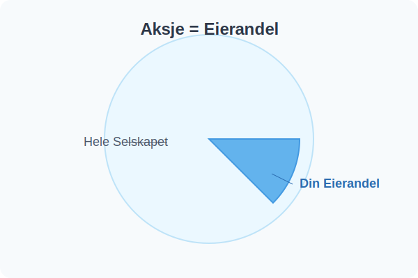
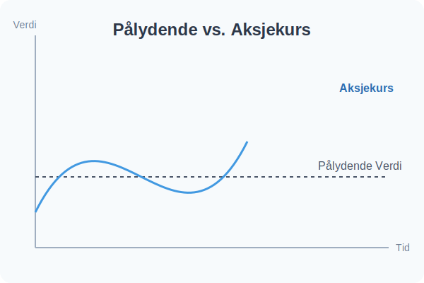

En **aksje** er en eierandel i et [aksjeselskap (AS)](/blogs/regnskap/hva-er-et-aksjeselskap "Hva er et Aksjeselskap? Komplett Guide til Selskapsformen"). Når du eier en aksje, eier du en liten del av selskapet, og dette eierskapet dokumenteres formelt gjennom et [**aksjebevis**](/blogs/regnskap/hva-er-et-aksjebevis "Hva er et Aksjebevis? En Komplett Guide"). Alle aksjene i et selskap har i utgangspunktet samme verdi, kjent som **pålydende verdi**.

*Se også: [VPS-konto](/blogs/regnskap/vps-konto "VPS-konto - Oppbevaring av aksjer og verdipapirer i VPS")*

### Aksjekapital og Pålydende Verdi

**[Aksjekapitalen](/blogs/regnskap/hva-er-aksjekapital "Hva er Aksjekapital? Krav og Forklaring")** er den totale pålydende verdien av alle aksjene i et selskap. Den beregnes enkelt ved å multiplisere antall aksjer med pålydende verdi per aksje.

`Aksjekapital = Antall aksjer × Pålydende verdi`

For eksempel, hvis et [aksjeselskap](/blogs/regnskap/hva-er-et-aksjeselskap "Hva er et Aksjeselskap? Komplett Guide til Selskapsformen") har 1000 aksjer med en pålydende verdi på 100 kroner per aksje, er aksjekapitalen 100 000 kroner. Dette er en del av selskapets grunnleggende [regnskap](/blogs/regnskap/hva-er-regnskap "Hva er Regnskap? En komplett guide").

### Aksjekurs: Markedsverdien av en Aksje

Det er viktig å skille mellom pålydende verdi og **aksjekurs**. Mens pålydende verdi er en fast, nominell verdi, er aksjekursen den prisen en aksje handles for i markedet. Aksjekursen bestemmes av tilbud og etterspørsel, og påvirkes av faktorer som:

*   Selskapets lønnsomhet og fremtidsutsikter
*   Generelle markedsforhold
*   Bransjespesifikke trender
*   Handelsmekanismer på [børsen](/blogs/regnskap/bors "Hva er Børs? En Guide til Norsk Børs og Aksjehandel") påvirker **likviditet** og prisdannelse.

Kursen kan derfor være både høyere og lavere enn den pålydende verdien.

### Hvilke Rettigheter Gir en Aksje?

Å eie aksjer gir deg visse **administrative** og **økonomiske** rettigheter i selskapet som er regulert av [aksjeloven](/blogs/regnskap/hva-er-aksjeloven "Hva er Aksjeloven? Regler for Aksjeselskaper i Norge"). Omfanget av disse rettighetene avhenger av hvor stor eierandel du har.

*   **Økonomiske rettigheter:** Den viktigste økonomiske retten er muligheten til å motta **utbytte**. Hvis selskapet går med overskudd, kan generalforsamlingen beslutte å dele ut hele eller deler av overskuddet til aksjonærene. Som aksjonær kan du også tjene penger på **kursstigning** - når aksjekursen øker over tid. Når du selger aksjer for mer enn du betalte, oppstår [kapitalgevinst](/blogs/regnskap/hva-er-kapitalgevinst "Hva er Kapitalgevinst? Komplett Guide til Skatt og Regnskapsføring") som er skattepliktig inntekt. Samlet utgjør utbytte og kursstigning din totale [avkastning](/blogs/regnskap/hva-er-avkastning "Hva er Avkastning? Komplett Guide til Investeringsavkastning og Beregning") på aksjeinvesteringen. Aksjonærer kan også under visse omstendigheter få [lån fra selskapet](/blogs/regnskap/hva-er-aksjonaerlan-fra-as "Hva er Aksjonærlån fra AS? Regler, Skatt og Praktiske Råd") med markedsmessige vilkår, eller motsatt - [låne penger til selskapet](/blogs/regnskap/hva-er-aksjonaerlan-til-as "Hva er Aksjonærlån til AS? Finansiering, Skatt og Praktiske Råd") for å tilføre kapital.
    For mer detaljert analyse av aksjer med regelmessige utbytteutbetalinger, se [Utbytteaksjer](/blogs/regnskap/utbytteaksjer "Utbytteaksjer – Guide til utbytteaksjer og utbytteavkastning").

For å forstå hvordan utbytte og aksjegevinster beskattes, og hvordan du kan optimalisere din skattebyrde som aksjeeier, se vår [Aksjonærmodellen - Komplett Guide til Norsk Aksjebeskatning](/blogs/regnskap/aksjonaermodellen-guide "Aksjonærmodellen - Komplett Guide til Norsk Aksjebeskatning").
*   **Administrative rettigheter:** Som [aksjonær](/blogs/regnskap/hva-er-en-aksjonaer "Hva er en Aksjonær? En Komplett Guide") har du rett til å delta og stemme på **generalforsamlingen**, som er selskapets øverste organ. Én aksje gir vanligvis én stemme, så jo flere aksjer du eier, jo mer innflytelse har du. Ditt eierskap registreres i det offentlige [aksjonærregisteret](/blogs/regnskap/hva-er-aksjonaerregisteret "Hva er Aksjonærregisteret? Komplett Guide til Norges Aksjonærregister"), som gir transparens om hvem som eier norske selskaper.

### Aksjeklasser

Et selskap kan velge å dele aksjene sine inn i ulike **[aksjeklasser](/blogs/regnskap/hva-er-aksjeklasser "Hva er Aksjeklasser? A-aksjer og B-aksjer Forklart")**, ofte kalt A-aksjer og B-aksjer. Disse klassene har forskjellige rettigheter. For eksempel kan **A-aksjer** gi full stemmerett, mens **B-aksjer** kan ha begrenset eller ingen stemmerett, men kanskje en fortrinnsrett på utbytte. Dette gjøres for å hente inn kapital uten å vanne ut kontrollen for de opprinnelige eierne. Selskapet kan også gjennomføre en **[aksjespleis](/blogs/regnskap/hva-er-aksjespleis "Hva er Aksjespleis? En Detaljert Guide")** for å redusere antall aksjer og øke aksjekursen, eller en **[aksjesplitt](/blogs/regnskap/hva-er-aksjesplitt "Hva er en Aksjesplitt? En Komplett Guide")** for å øke antallet aksjer og senke kursen.

Les mer om [aksjeklasser og hvordan de fungerer i praksis](/blogs/regnskap/hva-er-aksjeklasser "Hva er Aksjeklasser? A-aksjer og B-aksjer Forklart").
