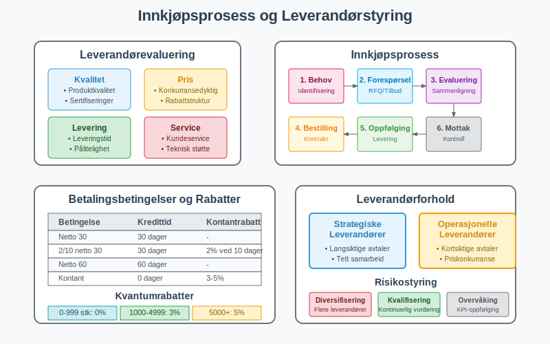

**Engroshandel** er salg av varer i store kvanta til andre virksomheter, typisk [detaljhandel](/blogs/regnskap/hva-er-detaljhandel "Hva er Detaljhandel? Regnskap og Økonomistyring for Butikker") eller andre grossister, for videresalg til sluttforbrukere. Dette er en kompleks virksomhetstype som krever spesialisert [regnskapsføring](/blogs/regnskap/hva-er-regnskap "Hva er Regnskap? En komplett guide") på grunn av store transaksjoner, omfattende lagerstyring og komplekse leverandør- og kunderelationer.

## Hva er Engroshandel?

Engroshandel omfatter alle former for **salg til andre virksomheter** som skal selge varene videre, inkludert:

* **Tradisjonelle grossister** - fysiske lager og distribusjon
* **Importører** - innførsel av varer fra utlandet
* **Agenter og meglere** - formidling uten eget lager
* **Cash & Carry** - selvbetjening for mindre detaljister
* **B2B e-handel** - digitale grossistplattformer

### Kjennetegn ved Engroshandel

Engroshandelsvirksomheter har flere unike karakteristikker som påvirker regnskapsføringen:

* **Store transaksjoner** med færre, men større salg
* **Omfattende lagerstyring** med høye lagerverdier
* **Kredittbehandling** og kundeoppfølging
* **Komplekse leverandørforhold** og innkjøpsavtaler
* **Sesongvariasjoner** og markedssykluser
* **Logistikk og distribusjon** som kritisk suksessfaktor

## Regnskapsføring i Engroshandel

### Grunnleggende Regnskapsprinsipper

Engroshandel følger standard regnskapsprinsipper, men med spesiell fokus på:

#### Viktige Regnskapsområder:

| Område | Beskrivelse | Utfordringer |
|--------|-------------|--------------|
| **Lagerstyring** | Store lagerverdier og kompleks logistikk | Ukurans, sesongvariasjoner, lagerkostnader |
| **Kundefordringer** | Kredittbehandling og oppfølging | Kredittrisiko, inkasso, aldersfordeling |
| **Leverandørgjeld** | Innkjøp og betalingsbetingelser | Kontantrabatter, kredittider, valutarisiko |
| **Moms** | Kompleks moms-håndtering | Ulike satser, eksport/import, omvendt avgiftsplikt |
| **Logistikk** | Transport og lagerkostnader (dokumentert med [fraktbrev](/blogs/regnskap/hva-er-fraktbrev "Hva er Fraktbrev? Komplett Guide til Transportdokumenter og Regnskapsføring")) | Kostnadsallokering, effektivitetsmåling |

### Lagerstyring og Varebeholdning

**Lagerstyring** er kritisk i engroshandel og representerer ofte den største posten i [balansen](/blogs/regnskap/hva-er-balanse "Hva er Balanse? Komplett Guide til Balansen i Regnskap").

#### Lagerverdsettelse

Engroshandel bruker typisk følgende metoder:

* **FIFO** (First In, First Out) - mest vanlig for daterte varer
* **Gjennomsnittskost** - for homogene råvarer
* **Standardkost** - for produksjonsindustri
* **Spesifikk identifikasjon** - for unike/dyre varer med [GTIN/EAN-koder](/blogs/regnskap/hva-er-gtin-ean "Hva er GTIN/EAN? Komplett Guide til Globale Produktkoder i Regnskap")

#### Lagerkostnader og ABC-analyse

Engroshandel må håndtere omfattende lagerkostnader:

* **Innkjøpskost** - direkte varekostnad
* **Lagerholdskost** - renter, forsikring, svinn
* **Bestillingskost** - administrasjon og transport (dokumentert med [fraktbrev](/blogs/regnskap/hva-er-fraktbrev "Hva er Fraktbrev? Komplett Guide til Transportdokumenter og Regnskapsføring"))
* **Mangekost** - tapte salg ved utsolgte varer

#### ABC-klassifisering av Lager:

| Kategori | Andel av verdi | Andel av antall | Styringsfokus |
|----------|----------------|-----------------|---------------|
| **A-varer** | 70-80% | 10-20% | Tett oppfølging, hyppig telling |
| **B-varer** | 15-25% | 20-30% | Moderat oppfølging, periodisk telling |
| **C-varer** | 5-10% | 50-70% | Enkel oppfølging, årlig telling |

### Kundefordringer og Kredittbehandling

Engroshandel opererer typisk med **kredittbehandling** som krever omfattende oppfølging:

#### Kredittbehandling

* **Kredittvurdering** av nye kunder
* **Kredittgrenser** og overvåking
* **Betalingsbetingelser** - typisk 30-90 dager
* **Kontantrabatter** for tidlig betaling
* **Inkassohåndtering** ved forsinket betaling

#### Aldersfordeling av Kundefordringer

| Aldersgruppe | Risikofaktor | Oppfølging |
|--------------|--------------|------------|
| **0-30 dager** | Lav | Rutineoppfølging |
| **31-60 dager** | Moderat | Purring og kontakt |
| **61-90 dager** | Høy | Aktiv oppfølging |
| **Over 90 dager** | Meget høy | Inkasso/avskrivning |

### Leverandørforhold og Innkjøp

Effektiv leverandørstyring er kritisk for suksess i engroshandel. For en omfattende guide til alle aspekter av **[leverandørstyring](/blogs/regnskap/hva-er-leverandor "Hva er Leverandør? Komplett Guide til Leverandørstyring og Leverandørforhold")**, inkludert strategisk kategorisering, risikostyring, digitalisering og beste praksis, se vår detaljerte artikkel om leverandører.

#### Strategisk Innkjøp

Engroshandel må håndtere komplekse leverandørforhold:

* **Leverandørevaluering** og kvalifisering
* **Forhandling** av priser og betingelser
* **Kontraktsstyring** og rammeavtaler
* **Leverandørdiversifisering** for risikospredning
* **Kvalitetssikring** og leveransepålitelighet

#### Innkjøpsbetingelser

Typiske betingelser i engroshandel:

* **Betalingsbetingelser** - 30-60 dager kreditt
* **Kontantrabatter** - 2-5% ved tidlig betaling
* **Kvantumrabatter** - volumberegnet prising
* **Årsrabatter** - bonus basert på totalt innkjøp
* **Returrett** og reklamasjonsordninger

## Moms i Engroshandel

### Utgående Moms

Engroshandel må håndtere **utgående moms** på salg til registrerte virksomheter:

| Vare/Tjeneste | Moms-sats | Særlige forhold |
|---------------|-----------|-----------------|
| **Vanlige varer** | 25% | Standard sats |
| **Næringsmidler** | 15% | Matvarer til videresalg |
| **Bøker/aviser** | 0% | Trykte publikasjoner |
| **Eksport** | 0% | Salg til utlandet |

### Inngående Moms

Grossister kan trekke fra **inngående moms** på:

* **Vareinnkjøp** til videresalg
* **Driftskostnader** som lager, transport
* **Investeringer** i lager- og logistikkutstyr
* **Tjenester** som regnskap og IT-systemer

### Omvendt Avgiftsplikt

Ved import og enkelte tjenester gjelder **omvendt avgiftsplikt**:

* **Import fra tredjeland** - moms beregnes ved innførsel
* **Tjenester fra utlandet** - kjøper beregner moms
* **Byggetjenester** - spesielle regler
* **Elektroniske tjenester** - nye EU-regler

## Økonomistyring i Engroshandel

### Nøkkeltall og KPI-er

Engroshandel bruker spesialiserte nøkkeltall:

#### Lønnsomhetsmål:
* **Bruttomargin** = (Salg - Varekostnad) / Salg × 100%
* **Netto margin** = Resultat / Salg × 100%
* **Lageromløpshastighet** = Varekostnad / Gjennomsnittlig lager
* **Kapitalomløpshastighet** = Salg / Gjennomsnittlig totalkapital

#### Effektivitetsmål:
* **Lagerdager** = (Gjennomsnittlig lager / Varekostnad) × 365
* **Kundefordringsdager** = (Gjennomsnittlig kundefordringer / Salg) × 365
* **Leverandørgjelddager** = (Gjennomsnittlig leverandørgjeld / Innkjøp) × 365
* **Kontantkonverteringssyklus** = Lagerdager + Kundefordringsdager - Leverandørgjelddager

### Arbeidskapitalstyring

Engroshandel krever aktiv **arbeidskapitalstyring**:

#### Komponenter av Arbeidskapital:
* **Varelager** - optimalisering av lagernivå
* **Kundefordringer** - kredittbehandling og oppfølging
* **Leverandørgjeld** - utnyttelse av kredittider
* **Kontanter** - likviditetsstyring

#### Optimalisering av Arbeidskapital:

| Område | Tiltak | Effekt |
|--------|--------|--------|
| **Lager** | ABC-analyse, JIT-levering | Redusert kapitalbinding |
| **Fordringer** | Bedre kredittbehandling | Raskere innbetaling |
| **Gjeld** | Forhandling av betingelser | Bedre kontantstrøm |
| **Kontanter** | Cash pooling, prognoser | Optimalisert likviditet |

### Budsjettering og Prognoser

Engroshandel krever detaljert [budsjettering](/blogs/regnskap/hva-er-budsjettering "Hva er Budsjettering? Komplett Guide til Budsjettplanlegging") på grunn av:

* **Markedssykluser** - konjunkturvariasjoner
* **Sesongvariasjoner** - høy- og lavsesong
* **Leverandørforhold** - prisendringer og tilgjengelighet
* **Konkurransesituasjon** - markedsandel og prising
* **Valutarisiko** - for importører

## Teknologi og Digitalisering

### Integrerte Systemer

Moderne engroshandel bruker integrerte systemer:

* **ERP-system** (Enterprise Resource Planning)
* **WMS** (Warehouse Management System)
* **CRM-system** (Customer Relationship Management)
* **EDI** (Electronic Data Interchange)
* **B2B e-handelplattform**

### Automatisering av Regnskapsføring

Teknologi muliggjør automatisering av:

* **Ordrebehandling** fra kunder
* **Lageroppdateringer** ved salg og innkjøp
* **Fakturabehandling** med OCR-teknologi
* **Betalingsoppfølging** og purring
* **Rapportering** og nøkkeltall

### Digitale Trender

* **B2B e-handel** - selvbetjening for kunder
* **Kunstig intelligens** - for prognoser og optimalisering
* **IoT** (Internet of Things) - smart lagerstyring
* **Blockchain** - for sporbarhet og sikkerhet
* **Robotisering** - automatiserte lager

## Utfordringer i Engroshandel

### Operasjonelle Utfordringer

* **Markedsvolatilitet** - prissvingninger og etterspørsel
* **Leverandørrisiko** - avhengighet av nøkkelleverandører
* **Logistikkompleksitet** - transport og distribusjon
* **Teknologiutvikling** - digitalisering og automatisering

### Regnskapsmessige Utfordringer

* **Lagerverdsettelse** - store verdier og kompleksitet
* **Kredittrisiko** - kundefordringer og avskrivninger
* **Valutarisiko** - for importører og eksportører
* **Moms-kompleksitet** - ulike satser og regler

### Finansielle Utfordringer

* **Kapitalbinding** - høye lagerverdier
* **Kontantstrøm** - lange kredittider
* **Finansiering** - behov for arbeidskapital
* **Risikostyring** - marked, kreditt og operasjonell risiko

## Compliance og Regulering

Engroshandel må forholde seg til:

* **[Bokføringsloven](/blogs/regnskap/hva-er-bokforingsloven "Bokføringsloven - Komplett Guide til Norsk Bokføringslovgivning")** - dokumentasjon og oppbevaring
* **Tollregelverk** - for importører
* **Produktansvarsloven** - kvalitet og sikkerhet
* **Konkurranseloven** - prising og markedsadferd
* **GDPR** - behandling av kundedata

## Beste Praksis for Engroshandel

### Daglige Rutiner

* **Ordrebehandling** og leveringsplanlegging
* **Lageroppdatering** og disponering
* **Kundeoppfølging** og kredittovervåking
* **Leverandørkommunikasjon** og innkjøpsplanlegging

### Ukentlige Oppgaver

* **Lageranalyse** og bestillingsforslag
* **Kundefordringer** aldersfordeling
* **Kontantstrøm** prognose
* **Nøkkeltall** oppfølging

### Månedlige Oppgaver

* **Fullstendig lageranalyse** og verdsettelse
* **Leverandøravstemming** og fakturagjennomgang
* **Moms-oppgave** forberedelse og levering
* **Resultatanalyse** og budsjettoppfølging

### Kvartalsvise Aktiviteter

* **Kredittgjennomgang** og risikovurdering
* **Leverandørevaluering** og forhandlinger
* **Markedsanalyse** og konkurranseovervåking
* **Strategisk planlegging** og budsjettjustering

## Fremtiden for Engroshandel

### Digitale Trender

* **B2B markedsplasser** - digitale økosystemer
* **Prediktiv analyse** - AI-drevet prognoser
* **Automatiserte lager** - robotisering og AI
* **Bærekraftig handel** - miljøfokus og sirkulærøkonomi

### Regnskapsmessige Implikasjoner

* **Sanntidsrapportering** - kontinuerlig oppdatering
* **Automatisert compliance** - regelverkshåndtering
* **Integrert risikostyring** - helhetlig tilnærming
* **Prediktiv økonomiledelse** - fremtidsrettet analyse

## Konklusjon

Engroshandel representerer en kompleks og kapitalkrevende virksomhetstype som krever spesialisert kunnskap innen regnskapsføring og økonomistyring. Suksess avhenger av:

* **Effektiv lagerstyring** og arbeidskapitaloptimalisering
* **Profesjonell kredittbehandling** og risikostyring
* **Strategiske leverandørforhold** og innkjøpsoptimalisering
* **Teknologisk modernisering** for konkurranseevne

Ved å implementere beste praksis innen regnskapsføring, investere i moderne teknologi og fokusere på kontinuerlig forbedring kan engroshandelsvirksomheter oppnå både operasjonell effektivitet og finansiell kontroll som grunnlag for bærekraftig vekst i et stadig mer konkurranseutsatt marked.
