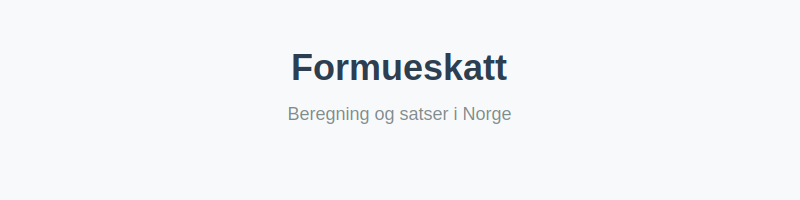
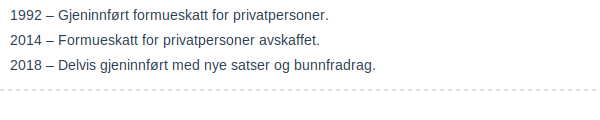
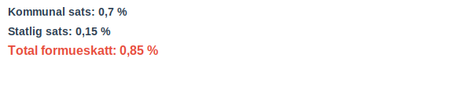
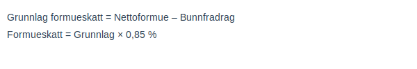

**Formueskatt** er en skatt på **nettoformue** som ilegges privatpersoner med formue over et fastsatt **bunnfradrag**. Skatten beregnes av differansen mellom nettoformue og bunnfradraget og uttrykkes som en prosentandel.

## Definisjon av Formueskatt

Formueskatt er en direkte skatt som pålegges privatpersoners nettoformue over et fastsatt bunnfradrag. Nettoformue defineres som **sum eiendeler** fratrukket **sum gjeld** slik det fremkommer under [Hva er Formue?](/blogs/regnskap/hva-er-formue "Hva er Formue? Nettoformue og Egenkapital i Regnskap"), og omtales som [ligningsverdi](/blogs/regnskap/ligningsverdi "Ligningsverdi – Definisjon, Beregning og Betydning i Norsk Regnskap") i skattemessige beregninger.

## Historikk for Formueskatt

Formueskatt har en lang historie i Norge:

* **1992** – Gjeninnført formueskatt for privatpersoner.
* **2014** – Formueskatt for privatpersoner avskaffet.
* **2018** – Delvis gjeninnført med nye satser og bunnfradrag.

## Bunnfradrag og skattepliktig formue

Bunnfradraget er det beløpet av nettoformuen som er skjermet fra formueskatt. For 2023 er bunnfradraget:

| Kategori | Bunnfradrag (NOK) |
|----------|-------------------|
| Enslige privatpersoner | 1 700 000 |
| Samboere/ektefeller (felles bunnfradrag) | 3 400 000 |

Skattepliktig formue beregnes som **nettoformue minus bunnfradrag**.

## Satser for Formueskatt

Formueskatt består av en kommunal sats og en statlig sats. Gjeldende satser (2023) er:

| Skattekomponent | Sats |
|-----------------|------|
| Kommunal formueskatt | 0,7 % |
| Statlig formueskatt | 0,15 % |
| **Total formueskatt** | **0,85 %** |

## Beregningseksempel

La oss beregne formueskatt for en privatperson med nettoformue på 5 000 000 NOK:

| Beskrivelse | Beløp (NOK) |
|-------------|-------------|
| Nettoformue | 5 000 000 |
| Bunnfradrag | – 1 700 000 |
| **Grunnlag formueskatt** | **3 300 000** |
| Formueskatt (0,85 %) | **28 050** |

## Unntak og reduksjoner

Visse eiendeler og personer er delvis eller helt unntatt fra formueskatt:

* **Primærbolig** – Verdsettes til 25 % av markedsverdi, noe som reduserer skattegrunnlaget.
* **Landbrukseiendom** – Unntak eller særskilte verdsettingsregler for gårdsbruk.
* **Bærekraftsbedrifter** – Redusert formuesverdi ved investering i visse miljøfond.

## Rapportering og frister

Formuesopplysninger rapporteres i [skattemeldingen](/blogs/regnskap/hva-er-skattemelding "Hva er Skattemelding? Guide til selvangivelse og formuesoppgave"). Frist for innsending av skattemelding er normalt **30. april** påfølgende år.

## Relevante artikler

- [Hva er Formue?](/blogs/regnskap/hva-er-formue "Hva er Formue? Nettoformue og Egenkapital i Regnskap")
- [Hva er Formuesverdi?](/blogs/regnskap/hva-er-formuesverdi "Hva er Formuesverdi? Verdivurdering av eiendeler")
- [Hva er Skatt?](/blogs/regnskap/hva-er-skatt "Hva er Skatt? Oversikt over skatteregler i Norge")
- [Hva er Skattemelding?](/blogs/regnskap/hva-er-skattemelding "Hva er Skattemelding? Guide til selvangivelse og formuesoppgave")
