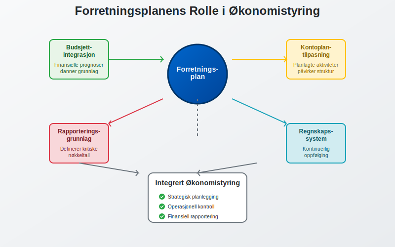
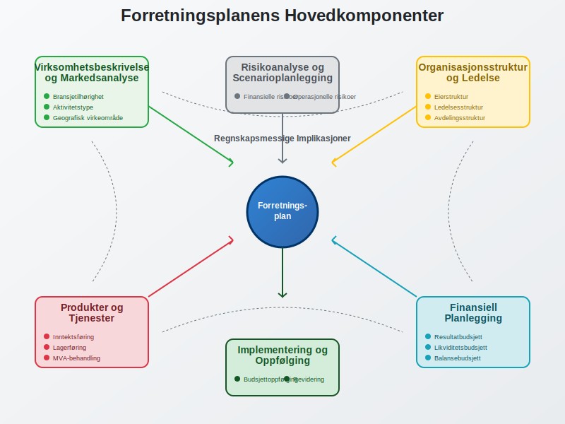
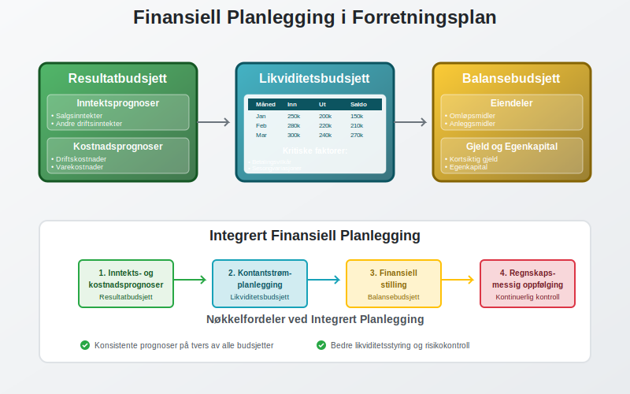
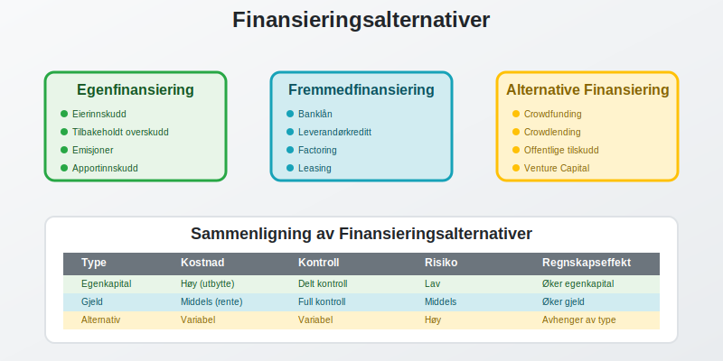
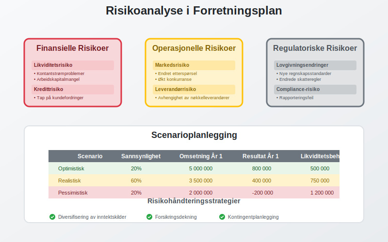
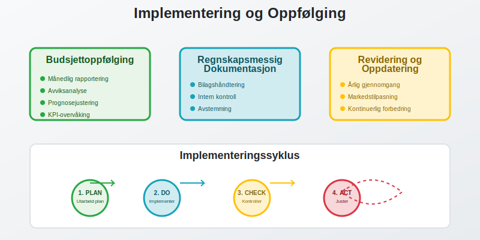
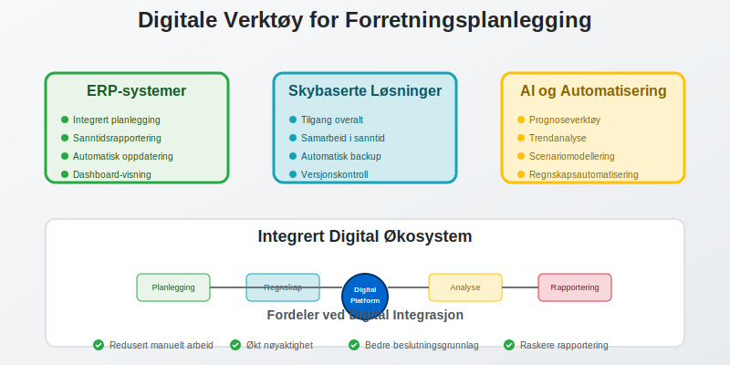

En **forretningsplan** er et omfattende dokument som beskriver en virksomhets mål, strategier og finansielle prognoser. For regnskapsførere og bedriftseiere er forretningsplanen et kritisk verktøy som ikke bare fungerer som en veikart for virksomheten, men også som grunnlag for [finansiell planlegging](/blogs/regnskap/hva-er-finansiering "Hva er Finansiering? Komplett Guide til Finansieringsformer og Kapitalstruktur"), [budsjettering](/blogs/regnskap/hva-er-budsjettering "Hva er Budsjettering? En Komplett Guide til Budsjettplanlegging og Økonomistyring") og regnskapsmessig oppfølging.

For å bygge en effektiv forretningsplan er det viktig først å utvikle en tydelig [forretningsmodell](/blogs/regnskap/hva-er-forretningsmodell "Hva er forretningsmodell? Komplett guide til utforming og evaluering av forretningsmodell for regnskap og virksomhetsstyring").

Før du utarbeider en forretningsplan, bør du først ha en klar [forretningsidé](/blogs/regnskap/hva-er-forretningside "Hva er forretningsidé? Komplett Guide til Utvikling og Evaluering av Forretningsidéer") som definerer virksomhetens kjernekonsept og verdiforslag.

I mange virksomheter er **innovasjon** en sentral driver for vekst. Utforsk dette nærmere i vår artikkel [Innovasjon](/blogs/regnskap/innovasjon "Innovasjon i Regnskap: En Komplett Guide til Innovasjon i Regnskap og Utviklingskostnader").

## Seksjon 1: Forretningsplanens Rolle i Regnskapssammenheng

En forretningsplan er fundamentet for all økonomisk styring og regnskapsføring i en virksomhet. Den etablerer de finansielle rammene som [regnskapet](/blogs/regnskap/hva-er-regnskap "Hva er Regnskap? En Dybdeanalyse for Norge") senere skal måles mot.

### 1.1 Sammenheng med Regnskapssystemet

Forretningsplanen integreres direkte med virksomhetens regnskapssystem på flere nivåer:

* **Budsjettintegrasjon:** Planens finansielle prognoser danner grunnlag for [budsjettplanlegging](/blogs/regnskap/hva-er-budsjettering "Hva er Budsjettering? En Komplett Guide til Budsjettplanlegging og Økonomistyring")
* **Kontoplantilpasning:** Planlagte aktiviteter påvirker valg av kontostruktur i [bokføringen](/blogs/regnskap/hva-er-bokforing "Hva er Bokføring? En Komplett Guide til Norsk Bokføringspraksis")
* **Rapporteringsgrunnlag:** Planen definerer hvilke nøkkeltall og rapporter som er kritiske for oppfølging

### 1.2 Juridiske og Regnskapsmessige Krav

For visse selskapsformer er forretningsplaner påkrevd eller sterkt anbefalt:

| Selskapsform | Krav til Forretningsplan | Regnskapsmessige Implikasjoner |
|--------------|-------------------------|--------------------------------|
| [Aksjeselskap (AS)](/blogs/regnskap/hva-er-et-aksjeselskap "Hva er et Aksjeselskap? Komplett Guide til AS i Norge") | Anbefalt ved stiftelse | Grunnlag for [aksjekapital](/blogs/regnskap/hva-er-aksjekapital "Hva er Aksjekapital? Regler, Krav og Regnskapsføring") og egenkapitalplanlegging |
| [Enkeltpersonforetak](/blogs/regnskap/hva-er-enkeltpersonforetak "Hva er Enkeltpersonforetak? Komplett Guide til ENK") | Ikke påkrevd | Viktig for skille mellom privat og næring |
| [Ansvarlig selskap](/blogs/regnskap/ansvarlig-selskap-delt-ansvar "Ansvarlig Selskap med Delt Ansvar - Komplett Guide") | Anbefalt | Grunnlag for ansvarsfordeling og kapitalkontoer |

## Seksjon 2: Forretningsplanens Hovedkomponenter

En komplett forretningsplan består av flere integrerte deler som alle har regnskapsmessige implikasjoner.

### 2.1 Virksomhetsbeskrivelse og Markedsanalyse

**Virksomhetsbeskrivelsen** danner grunnlaget for regnskapsmessig klassifisering og rapportering:

* **Bransjetilhørighet:** Påvirker valg av regnskapsstandarder og bransjespecifikke krav
* **Aktivitetstype:** Bestemmer om virksomheten driver [detaljhandel](/blogs/regnskap/hva-er-detaljhandel "Hva er Detaljhandel? Komplett Guide til Detaljhandelsregnskap"), [engroshandel](/blogs/regnskap/hva-er-engroshandel "Hva er Engroshandel? Komplett Guide til Engroshandelsregnskap") eller tjenesteyting
* **Geografisk virkeområde:** Påvirker MVA-behandling og internasjonale regnskapskrav

### 2.2 Organisasjonsstruktur og Ledelse

Organisasjonsstrukturen har direkte innvirkning på regnskapsføringen:

* **Eierstruktur:** Påvirker [egenkapital](/blogs/regnskap/hva-er-egenkapital "Hva er Egenkapital? Komplett Guide til Egenkapitalens Rolle i Regnskap")soppstilling
* **Ledelsesstruktur:** Definerer ansvar for regnskapsføring og intern kontroll
* **Avdelingsstruktur:** Grunnlag for eventuell [avdelingsregnskap](/blogs/regnskap/hva-er-avdelingsregnskap "Hva er Avdelingsregnskap? Komplett Guide til Segmentrapportering")

### 2.3 Produkter og Tjenester

Beskrivelsen av produkter og tjenester påvirker flere regnskapsmessige områder:

* **Inntektsføring:** Bestemmer når og hvordan inntekter skal [bokføres](/blogs/regnskap/hva-er-bokforing "Hva er Bokføring? En Komplett Guide til Norsk Bokføringspraksis")
* **Lagerføring:** Påvirker verdivurdering og regnskapsføring av varelager
* **MVA-behandling:** Bestemmer MVA-sats og [avgiftsplikt](/blogs/regnskap/hva-er-avgiftsplikt-mva "Hva er Avgiftsplikt MVA? Komplett Guide til Merverdiavgift i Norge")

## Seksjon 3: Finansiell Planlegging og Prognoser

Den finansielle delen av forretningsplanen er kjernen for all regnskapsmessig oppfølging.

### 3.1 Resultatbudsjett

Resultatbudsjettet er en prognose for virksomhetens [driftsresultat](/blogs/regnskap/hva-er-driftsresultat "Hva er Driftsresultat? Beregning, Analyse og Betydning") over planperioden:

**Inntektsprognoser:**
* Salgsinntekter fra kjernevirksomhet
* Andre [driftsinntekter](/blogs/regnskap/hva-er-driftsinntekter "Hva er Driftsinntekter? Komplett Guide til Driftsinntekter i Regnskap")
* Finansinntekter

**Kostnadsprognoser:**
* [Driftskostnader](/blogs/regnskap/hva-er-driftskostnader "Hva er Driftskostnader? Typer, Beregning og Regnskapsføring - Komplett Guide") (lønn, husleie, markedsføring)
* Varekostnader og innkjøp
* Finanskostnader

### 3.2 Likviditetsbudsjett

Likviditetsbudsjettet planlegger kontantstrømmen og er kritisk for daglig drift:

| Måned | Inngående likviditet | Innbetalinger | Utbetalinger | Utgående likviditet |
|-------|---------------------|---------------|--------------|-------------------|
| Januar | 100 000 | 250 000 | 200 000 | 150 000 |
| Februar | 150 000 | 280 000 | 220 000 | 210 000 |
| Mars | 210 000 | 300 000 | 240 000 | 270 000 |

**Kritiske faktorer for likviditet:**
* Kunders betalingsvilkår og [debitor](/blogs/regnskap/hva-er-debitor "Hva er Debitor? Komplett Guide til Kundefordringer og Debitorhåndtering")håndtering
* Leverandørers betalingsvilkår
* Sesongvariasjoner i salg og innkjøp
* Investeringer i [anleggsmidler](/blogs/regnskap/hva-er-anleggsmidler "Hva er Anleggsmidler? Komplett Guide til Anleggsmidler i Regnskap")

### 3.3 Balansebudsjett

Balansebudsjettet viser planlagt finansiell stilling ved periodens slutt:

**Eiendeler:**
* Omløpsmidler (kontanter, kundefordringer, varelager)
* [Anleggsmidler](/blogs/regnskap/hva-er-anleggsmidler "Hva er Anleggsmidler? Komplett Guide til Anleggsmidler i Regnskap") (bygninger, maskiner, immaterielle eiendeler)

**Gjeld og egenkapital:**
* Kortsiktig gjeld (leverandørgjeld, skyldige offentlige avgifter)
* Langsiktig gjeld (banklån, obligasjoner)
* [Egenkapital](/blogs/regnskap/hva-er-egenkapital "Hva er Egenkapital? Komplett Guide til Egenkapitalens Rolle i Regnskap") (innskutt og opptjent kapital)

## Seksjon 4: Finansieringsplan og Kapitalstruktur

Finansieringsplanen beskriver hvordan virksomheten skal finansieres og har direkte innvirkning på regnskapsføringen.

### 4.1 Egenfinansiering

[Egenfinansiering](/blogs/regnskap/hva-er-egenfinansiering "Hva er Egenfinansiering? Komplett Guide til Egenkapitalfinansiering") omfatter kapital fra eiere og tilbakeholdt overskudd:

* **Eierinnskudd:** Kontantinnskudd eller apportinnskudd av eiendeler
* **Tilbakeholdt overskudd:** Reinvestering av tidligere års resultat
* **Emisjoner:** Utstedelse av nye aksjer eller andeler

### 4.2 Fremmedfinansiering

Fremmedfinansiering omfatter alle former for lånt kapital:

* **Banklån:** Tradisjonelle bedriftslån med fast eller variabel rente
* **Leverandørkreditt:** Utsatt betaling til leverandører
* **[Factoring](/blogs/regnskap/hva-er-factoring "Hva er Factoring? Komplett Guide til Factoringfinansiering"):** Salg av kundefordringer for øyeblikkelig likviditet
* **Leasing:** Operasjonell eller finansiell leasing av eiendeler

### 4.3 Alternative Finansieringsformer

Moderne virksomheter har tilgang til innovative finansieringsløsninger:

* **[Crowdfunding](/blogs/regnskap/hva-er-crowdfunding "Hva er Crowdfunding? Komplett Guide til Folkefinansiering"):** Innsamling av kapital fra mange små investorer
* **[Crowdlending](/blogs/regnskap/hva-er-crowdlending "Hva er Crowdlending? Komplett Guide til Peer-to-Peer Utlån"):** Lån fra private investorer via digitale plattformer
* **Offentlige tilskudd:** Støtte fra Innovasjon Norge og andre offentlige organer

## Seksjon 5: Risikoanalyse og Scenarioplanlegging

En grundig risikoanalyse er essensielt for robust finansiell planlegging og regnskapsmessig oppfølging.

For en strukturert metode for å vurdere interne og eksterne faktorer, se [SWOT-analyse](/blogs/regnskap/swot-analyse "SWOT-analyse: Guide for norske bedrifter").
### 5.1 Finansielle Risikoer

**Likviditetsrisiko:**
* Risiko for at virksomheten ikke kan møte sine kortsiktige forpliktelser
* Påvirker [arbeidskapital](/blogs/regnskap/hva-er-arbeidskapital "Hva er Arbeidskapital? En Komplett Guide til Working Capital")styring og kontantstrømplanlegging

**Kredittrisiko:**
* Risiko for tap på kundefordringer
* Krever systematisk [debitor](/blogs/regnskap/hva-er-debitor "Hva er Debitor? Komplett Guide til Kundefordringer og Debitorhåndtering")oppfølging og avsetninger for tap

**Valutarisiko:**
* Relevant for virksomheter med internasjonal handel
* Påvirker regnskapsføring av utenlandske transaksjoner

### 5.2 Operasjonelle Risikoer

**Markedsrisiko:**
* Endringer i etterspørsel og konkurransesituasjon
* Påvirker inntektsprognoser og verdivurdering av eiendeler

**Leverandørrisiko:**
* Avhengighet av kritiske leverandører
* Påvirker kostnadsprognoser og lagerplanlegging

**Regulatorisk risiko:**
* Endringer i lover og forskrifter
* Kan påvirke regnskapsstandarder og rapporteringskrav

### 5.3 Scenarioplanlegging

Utvikling av ulike scenarier hjelper med å forstå potensielle utfall:

| Scenario | Sannsynlighet | Omsetning År 1 | Resultat År 1 | Likviditetsbehov |
|----------|---------------|----------------|---------------|------------------|
| Optimistisk | 20% | 5 000 000 | 800 000 | 500 000 |
| Realistisk | 60% | 3 500 000 | 400 000 | 750 000 |
| Pessimistisk | 20% | 2 000 000 | -200 000 | 1 200 000 |

## Seksjon 6: Implementering og Oppfølging

En forretningsplan er kun verdifull hvis den implementeres og følges opp systematisk gjennom regnskapet.

### 6.1 Budsjettoppfølging

**Månedlig rapportering:**
* Sammenligning av faktiske tall mot budsjett
* Analyse av avvik og årsaker
* Justering av prognoser basert på nye erkjennelser

**Nøkkeltall og [KPI-er](/blogs/regnskap/hva-er-kpi "Hva er KPI? Key Performance Indicators i Regnskap og Bedriftsstyring"):**
* [Dekningsbidrag](/blogs/regnskap/hva-er-dekningsbidrag "Hva er Dekningsbidrag? Beregning, Analyse og Anvendelse") per produkt/tjeneste
* [Egenkapitalrentabilitet](/blogs/regnskap/hva-er-egenkapitalrentabilitet "Hva er Egenkapitalrentabilitet? Beregning og Analyse av ROE")
* Likviditetsgrad og [arbeidskapital](/blogs/regnskap/hva-er-arbeidskapital "Hva er Arbeidskapital? En Komplett Guide til Working Capital")

### 6.2 Regnskapsmessig Dokumentasjon

**Bilagshåndtering:**
* Systematisk [bilagsføring](/blogs/regnskap/hva-er-bilagsforing "Hva er Bilagsføring? Komplett Guide til Bilagsbehandling i Regnskap") av alle transaksjoner
* Kobling mellom planlagte og faktiske aktiviteter
* [Dokumentasjon](/blogs/regnskap/hva-er-dokumentasjon-regnskap-bokforing "Hva er Dokumentasjon i Regnskap og Bokføring? Krav, Regler og Beste Praksis") som støtter regnskapsføringen

**Intern kontroll:**
* [Avstemming](/blogs/regnskap/hva-er-avstemming "Hva er Avstemming i Regnskap? Komplett Guide til Regnskapsavstemming") av kontoer mot eksterne kilder
* [Avvikshåndtering](/blogs/regnskap/hva-er-avvikshåndtering "Hva er Avvikshåndtering i Regnskap? Prosess, Metoder og Beste Praksis") ved uoverensstemmelser
* Regelmessig gjennomgang av regnskapskvalitet

### 6.3 Revidering og Oppdatering

**Årlig gjennomgang:**
* Evaluering av planens nøyaktighet og relevans
* Oppdatering basert på markedsendringer og erfaringer
* Justering av finansielle mål og strategier

**Kontinuerlig forbedring:**
* Læring fra avvik mellom plan og virkelighet
* Forbedring av prognosemetoder og planleggingsprosesser
* Tilpasning til nye regnskapsstandarder og krav

## Seksjon 7: Digitale Verktøy og Teknologi

Moderne forretningsplanlegging drar nytte av digitale løsninger som integrerer med regnskapssystemer.

### 7.1 Integrerte Planleggingsverktøy

**ERP-systemer:**
* Integrering mellom forretningsplan og [ERP-system](/blogs/regnskap/hva-er-erp-system "Hva er ERP-system? Komplett Guide til Enterprise Resource Planning")
* Automatisk oppdatering av prognoser basert på faktiske data
* Sanntidsrapportering og dashboards

**Skybaserte løsninger:**
* Tilgang til plandata fra hvor som helst
* Samarbeid mellom flere brukere
* Automatisk backup og versjonskontroll

### 7.2 Automatisering og AI

**Prognoseverktøy:**
* Maskinlæring for forbedrede salgsprognoser
* Automatisk identifikasjon av trender og mønstre
* Scenariomodellering basert på historiske data

**Regnskapsautomatisering:**
* Automatisk [bilagsmottak](/blogs/regnskap/hva-er-bilagsmottak "Hva er Bilagsmottak? Komplett Guide til Digital Bilagsbehandling") og -behandling
* [Elektronisk fakturering](/blogs/regnskap/hva-er-elektronisk-fakturering "Hva er Elektronisk Fakturering? Komplett Guide til E-faktura") og [EHF](/blogs/regnskap/hva-er-ehf "Hva er EHF? Komplett Guide til Elektronisk Handelsformat")
* Automatisk [bankavstemming](/blogs/regnskap/hva-er-bankavstemming "Hva er Bankavstemming? Komplett Guide til Bankavstemming i Regnskap")

## Seksjon 8: Juridiske og Regulatoriske Aspekter

Forretningsplaner må ta hensyn til gjeldende lover og forskrifter som påvirker regnskapsføringen.

### 8.1 Bokføringsloven og Regnskapsregler

**Grunnleggende krav:**
* Overholdelse av [bokføringsloven](/blogs/regnskap/hva-er-bokforingsloven "Hva er Bokføringsloven? Komplett Guide til Norsk Bokføringslovgivning") og [bokføringsforskriften](/blogs/regnskap/hva-er-bokforingsforskriften "Hva er Bokføringsforskriften? Detaljert Guide til Forskrift om Bokføring")
* [Bokføringsplikt](/blogs/regnskap/hva-er-bokforingsplikt "Hva er Bokføringsplikt? Komplett Guide til Bokføringspliktige og Unntak") for ulike virksomhetstyper
* Krav til [dokumentasjon](/blogs/regnskap/hva-er-dokumentasjon-regnskap-bokforing "Hva er Dokumentasjon i Regnskap og Bokføring? Krav, Regler og Beste Praksis") og oppbevaring

**Rapporteringskrav:**
* Årlig innlevering av regnskap til Regnskapsregisteret
* [A-melding](/blogs/regnskap/hva-er-a-melding "Hva er A-melding? Komplett Guide til A-ordningen") for lønn og arbeidsgiveravgift
* MVA-rapportering og [skatteoppgjør](/blogs/regnskap/skatteoppgjor "Skatteoppgjør Guide: Prosess, Tidslinje og Viktige Frister")

### 8.2 Sektorspesifikke Krav

**Finansielle tjenester:**
* Særlige kapitalkrav og soliditetsregler
* Rapportering til Finanstilsynet
* Krav til risikostyring og intern kontroll

**Offentlige anskaffelser:**
* Krav til [anskaffelser](/blogs/regnskap/hva-er-anskaffelser "Hva er Anskaffelser? Komplett Guide til Offentlige og Private Anskaffelser") over visse beløpsgrenser
* Dokumentasjon av [anskaffelseskost](/blogs/regnskap/hva-er-anskaffelseskost "Hva er Anskaffelseskost? Beregning og Regnskapsføring av Anskaffelseskost")
* Transparens og etiske retningslinjer

## Seksjon 9: Internasjonale Aspekter

For virksomheter med internasjonal virksomhet må forretningsplanen adressere komplekse regnskapsmessige utfordringer.

### 9.1 Valutahåndtering

**Transaksjonsvaluta:**
* Regnskapsføring av transaksjoner i fremmed valuta
* Kurssikring og derivatinstrumenter
* Påvirkning på likviditet og resultat

**Rapporteringsvaluta:**
* Omregning av utenlandske datterselskaper
* Konsolideringsutfordringer
* Valutaeffekter i konsernregnskapet

### 9.2 Transfer Pricing

**Internprising:**
* Prissetting av transaksjoner mellom konsernselskaper
* Dokumentasjonskrav og compliance
* Skattemessige implikasjoner

## Konklusjon

En **forretningsplan** er langt mer enn et dokument for å skaffe finansiering - det er et levende verktøy som integrerer strategisk planlegging med praktisk regnskapsføring. For regnskapsførere og bedriftseiere representerer en velutarbeidet forretningsplan grunnlaget for:

* **Systematisk økonomistyring** gjennom integrert budsjett- og regnskapsoppfølging
* **Risikohåndtering** ved å identifisere og planlegge for potensielle utfordringer
* **Strategisk beslutningsstøtte** basert på finansielle analyser og prognoser
* **Compliance og rapportering** i henhold til gjeldende lover og forskrifter

Ved å følge prinsippene og metodene beskrevet i denne artikkelen, kan virksomheter utvikle forretningsplaner som ikke bare oppfyller eksterne krav, men også fungerer som kraftige verktøy for intern styring og regnskapsmessig kontroll. Den kontinuerlige oppfølgingen og revideringen av planen sikrer at den forblir relevant og verdifull gjennom hele virksomhetens livssyklus.

Husk at en forretningsplan aldri er ferdig - den må kontinuerlig oppdateres og tilpasses endringer i marked, regulering og virksomhetens egen utvikling. Dette gjør den til et dynamisk verktøy som støtter både kortsiktig drift og langsiktig vekst.
