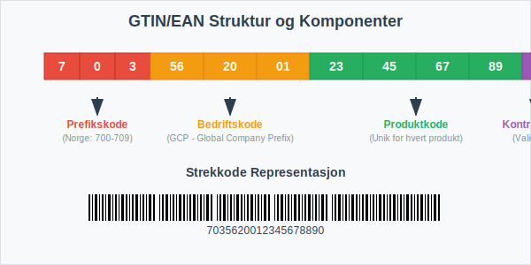
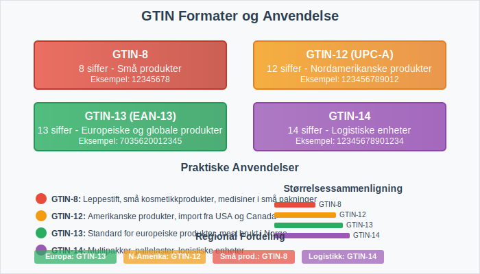
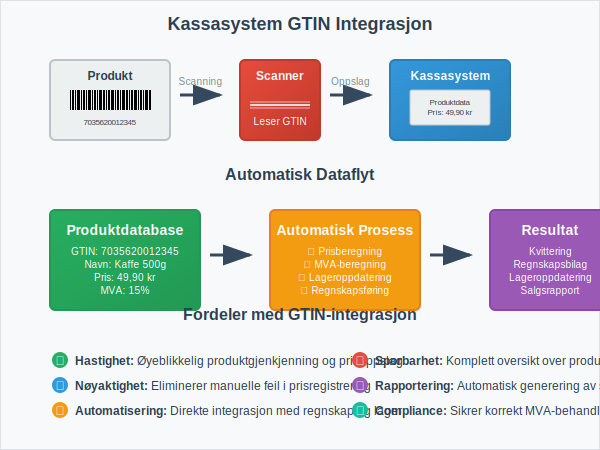
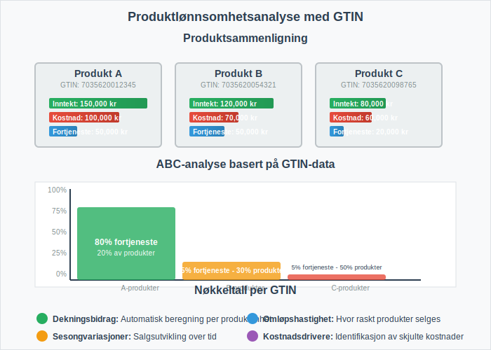

**GTIN (Global Trade Item Number)** og **EAN (European Article Number)** er globale standarder for produktidentifikasjon som spiller en kritisk rolle i moderne regnskapsføring og forretningsdrift. Disse kodene muliggjør automatisk identifikasjon av produkter gjennom hele verdikjeden, fra produksjon til salg, og er essensielle for effektiv [lagerstyring](/blogs/regnskap/hva-er-anleggsmidler "Hva er Anleggsmidler? Komplett Guide til Varige Driftsmidler og Avskrivninger"), [fakturabehandling](/blogs/regnskap/hva-er-en-faktura "Hva er en Faktura? En Guide til Norske Fakturakrav") og regnskapsautomatisering.

For entydig identifikasjon av logistikkpartnere og lagringssteder anbefales det også å bruke [GLN-nummer](/blogs/regnskap/hva-er-gln-nummer "Hva er GLN-nummer? Komplett Guide til Global Location Number i Norge").

## Seksjon 1: Hva er GTIN og EAN?

**GTIN (Global Trade Item Number)** er en internasjonal standard for unik identifikasjon av handelsvarer. EAN er den europeiske varianten av denne standarden, som nå er integrert i det globale GTIN-systemet. Disse kodene sikrer at hvert produkt har en unik identifikator som kan gjenkjennes globalt, noe som er avgjørende for moderne [detaljhandel](/blogs/regnskap/hva-er-detaljhandel "Hva er Detaljhandel? Komplett Guide til Varehandel og Regnskapsføring") og [engroshandel](/blogs/regnskap/hva-er-engroshandel "Hva er Engroshandel? Komplett Guide til B2B-handel og Regnskapsføring").

### Hovedformål med GTIN/EAN:

* **Unik produktidentifikasjon** på tvers av alle markeder og systemer
* **Automatisering** av lagerstyring og salgsregistrering
* **Standardisering** av produktdata mellom handelspartnere
* **Effektivisering** av [bilagsføring](/blogs/regnskap/hva-er-bilagsforing "Hva er Bilagsføring? Komplett Guide til Regnskapsbilag og Dokumentasjon") og regnskapsføring
* **Forbedret sporbarhet** gjennom hele verdikjeden

## Seksjon 2: GTIN-formater og Struktur

GTIN-systemet består av flere formater avhengig av produkttype og anvendelsesområde. Alle GTIN-koder følger en strukturert oppbygging som sikrer global unikhet og automatisk validering.

### Oversikt over GTIN-formater:

| Format | Lengde | Anvendelse | Eksempel |
|--------|--------|------------|----------|
| GTIN-8 | 8 siffer | Små produkter med begrenset plass | 12345678 |
| GTIN-12 (UPC-A) | 12 siffer | Nordamerikanske produkter | 123456789012 |
| GTIN-13 (EAN-13) | 13 siffer | Europeiske og globale produkter | 1234567890123 |
| GTIN-14 | 14 siffer | Logistiske enheter og multipakker | 12345678901234 |

### Strukturelle Komponenter:

1. **Prefikskode:** Identifiserer landet eller regionen (Norge: 700-709)
2. **Bedriftskode:** Unik identifikator for produsenten
3. **Produktkode:** Spesifikk kode for det enkelte produktet
4. **Kontrollsiffer:** Matematisk validering av kodens korrekthet

## Seksjon 3: Implementering i Regnskapssystemer

For bedrifter som håndterer fysiske varer er integrering av GTIN/EAN-koder i regnskapssystemet avgjørende for effektiv drift. Dette påvirker direkte hvordan [bilag](/blogs/regnskap/hva-er-bilag "Hva er Bilag? Komplett Guide til Regnskapsbilag og Dokumentasjon") behandles og hvordan [lagerverdier](/blogs/regnskap/hva-er-anleggsmidler "Hva er Anleggsmidler? Komplett Guide til Varige Driftsmidler og Avskrivninger") registreres i regnskapet.

### Integrasjon med Kassasystemer

Moderne [datakasser](/blogs/regnskap/hva-er-datakasse "Hva er Datakasse? Komplett Guide til Kassasystem, Krav og Regnskapsføring") er helt avhengige av GTIN/EAN-koder for å fungere effektivt. Når en strekkode scannes ved salg, henter systemet automatisk:

* Produktnavn og beskrivelse
* Salgspris inkludert MVA
* Lagerstatus og tilgjengelighet
* Regnskapskonto for automatisk [bokføring](/blogs/regnskap/hva-er-bokforing "Hva er Bokføring? Komplett Guide til Regnskapsføring i Norge")

### Automatisk Fakturabehandling

GTIN/EAN-koder muliggjør betydelig automatisering av [fakturabehandling](/blogs/regnskap/hva-er-fakturatolk "Hva er Fakturatolk? Automatisk Fakturabehandling og OCR-teknologi"). Når leverandørfakturaer inneholder GTIN-koder, kan systemet automatisk:

* Matche fakturalinjer mot bestillinger
* Validere priser mot avtaler
* Kontere transaksjoner til riktige kontoer
* Oppdatere lagersaldo automatisk

## Seksjon 4: Regnskapsmessige Implikasjoner

Bruk av GTIN/EAN-koder har flere viktige regnskapsmessige konsekvenser som påvirker både [internregnskap](/blogs/regnskap/hva-er-eksternregnskap "Hva er Eksternregnskap? Forskjell fra Internregnskap og Rapporteringskrav") og ekstern rapportering.

### Lagervurdering og Sporbarhet

GTIN-koder muliggjør presis sporing av individuelle produkter gjennom lageret, noe som er kritisk for:

* **FIFO/LIFO-beregninger:** Nøyaktig kostnadstildeling basert på innkjøpstidspunkt
* **Nedskrivninger:** Identifikasjon av produkter med redusert verdi
* **Svinn og tyveri:** Presis registrering av lageravvik
* **Holdbarhetsdatoer:** Automatisk identifikasjon av produkter som nærmer seg utløp

### MVA-håndtering

For bedrifter som selger varer med ulike MVA-satser, kan GTIN-koder knyttes til korrekt MVA-behandling:

| Produktkategori | MVA-sats | GTIN-prefiks eksempel |
|----------------|----------|----------------------|
| Matvarer | 15% | 700-701 |
| Bøker | 0% | 702 |
| Elektronikk | 25% | 703-704 |
| Medisiner | 0% | 705 |

Dette sikrer automatisk korrekt [MVA-behandling](/blogs/regnskap/hva-er-avgiftsplikt-mva "Hva er Avgiftsplikt (MVA)? Komplett Guide til Merverdiavgift i Norge") ved salg og innkjøp.

## Seksjon 5: Kostnadsanalyse og Lønnsomhet

GTIN/EAN-koder muliggjør detaljert kostnadsanalyse på produktnivå, noe som er essensielt for å beregne [dekningsbidrag](/blogs/regnskap/hva-er-dekningsbidrag "Hva er Dekningsbidrag? Beregning, Analyse og Praktiske Eksempler") og [avanse](/blogs/regnskap/hva-er-avanse "Hva er Avanse? Forskuddsbetaling, Regnskapsføring og Praktiske Råd") for individuelle produkter.

### Produktlønnsomhetsanalyse

Med GTIN-basert sporing kan bedrifter analysere:

* **Direkte produktkostnader:** Innkjøpspris, frakt, toll
* **Indirekte kostnader:** Lagring, håndtering, svinn
* **Salgsinntekter:** Brutto- og nettosalg per produkt
* **Marginer:** Bruttofortjeneste og [dekningsbidrag](/blogs/regnskap/hva-er-dekningsbidrag "Hva er Dekningsbidrag? Beregning, Analyse og Praktiske Eksempler") per enhet

### ABC-analyse

GTIN-data muliggjør sofistikert ABC-analyse av produktporteføljen:

* **A-produkter:** Høy omsetning, høy margin (20% av produkter, 80% av fortjeneste)
* **B-produkter:** Moderat omsetning og margin (30% av produkter, 15% av fortjeneste)
* **C-produkter:** Lav omsetning eller margin (50% av produkter, 5% av fortjeneste)

## Seksjon 6: Implementering og Beste Praksis

Vellykket implementering av GTIN/EAN-koder krever systematisk planlegging og integrering med eksisterende forretningsprosesser.

### Implementeringstrinn

1. **Registrering hos GS1 Norge**
   * Søk om bedriftskode (GCP - Global Company Prefix)
   * Betal årlig lisensavgift basert på bedriftsstørrelse
   * Få tilgang til GS1-verktøy og støtte

2. **Systemintegrasjon**
   * Oppgrader [ERP-system](/blogs/regnskap/hva-er-erp-system "Hva er ERP-system? Komplett Guide til Enterprise Resource Planning") for GTIN-støtte
   * Konfigurer automatisk GTIN-generering
   * Integrer med leverandørers systemer

3. **Datavedlikehold**
   * Etabler rutiner for produktdatavedlikehold
   * Sikre konsistent bruk av GTIN på tvers av kanaler
   * Implementer kvalitetskontroll av produktdata

### Vanlige Utfordringer og Løsninger

| Utfordring | Løsning | Regnskapsmessig påvirkning |
|------------|---------|---------------------------|
| Duplikate GTIN-koder | Implementer validering og kontroll | Unngår feil i lagerregistrering |
| Manglende GTIN på fakturaer | Krev GTIN fra leverandører | Forbedrer automatisering av [bilagsføring](/blogs/regnskap/hva-er-bilagsforing "Hva er Bilagsføring? Komplett Guide til Regnskapsbilag og Dokumentasjon") |
| Inkonsistent datavedlikehold | Etabler faste rutiner og ansvar | Sikrer pålitelig regnskapsdata |
| Høye implementeringskostnader | Gradvis utrulling og ROI-fokus | Bedre kostnadskontroll og [budsjettoppfølging](/blogs/regnskap/hva-er-budsjettering "Hva er Budsjettering? Komplett Guide til Budsjettplanlegging og Oppfølging") |

## Seksjon 7: Juridiske og Regulatoriske Aspekter

I Norge er det ingen lovkrav om bruk av GTIN/EAN-koder, men de er ofte nødvendige for å handle med store detaljhandelskjeder og for eksport til EU-land.

### Bokføringsforskriften og GTIN

Selv om [bokføringsforskriften](/blogs/regnskap/hva-er-bokforingsforskriften "Hva er Bokføringsforskriften? Komplett Guide til Norske Bokføringsregler") ikke spesifikt krever GTIN-koder, støtter de opp under flere av forskriftens krav:

* **§ 5-1 Bilag:** GTIN sikrer entydig identifikasjon av varer på bilag
* **§ 5-2 Registrering:** Automatisk registrering reduserer feilrisiko
* **§ 5-3 Oppbevaring:** Digital lagring av GTIN-data sikrer sporbarhet

### Personvernhensyn

Ved bruk av GTIN-koder må bedrifter være oppmerksomme på:

* **Kundedata:** Kobling mellom GTIN og kundeidentitet
* **Konkurransesensitiv informasjon:** Salgsdata og produktmix
* **GDPR-compliance:** Riktig håndtering av personopplysninger

## Seksjon 8: Fremtidige Utviklingstrender

GTIN/EAN-systemet utvikler seg kontinuerlig for å møte nye forretningsbehov og teknologiske muligheter.

### Digitale Produktpass

EU arbeider med krav om **digitale produktpass** som vil være koblet til GTIN-koder og inneholde:

* Bærekraftsinformasjon og karbonavtrykk
* Reparasjonsinstruksjoner og reservedelstilgang
* Resirkuleringsdata og materialsammensetning
* Leverandørkjedeinformasjon og opprinnelse

### Blockchain og Sporbarhet

Integrering av GTIN med blockchain-teknologi muliggjør:

* **Uforanderlig sporbarhet** gjennom hele verdikjeden
* **Automatiske smart contracts** basert på produktidentifikasjon
* **Forbedret kvalitetssikring** og tilbakekalling av produkter
* **Redusert svindel** og forfalskning av produkter

### AI og Prediktiv Analyse

Kombinasjon av GTIN-data med kunstig intelligens muliggjør:

* **Prediktiv lagerstyring** basert på historiske salgsmønstre
* **Automatisk prissetting** basert på markedsdata
* **Kvalitetsprediksjon** og forebyggende vedlikehold
* **Personaliserte produktanbefalinger** til kunder

## Konklusjon

GTIN/EAN-koder representerer ryggraden i moderne produktidentifikasjon og er uunnværlige for effektiv regnskapsføring i varehandel. De muliggjør automatisering av kritiske forretningsprosesser, fra [kassaregistrering](/blogs/regnskap/hva-er-datakasse "Hva er Datakasse? Komplett Guide til Kassasystem, Krav og Regnskapsføring") til [fakturabehandling](/blogs/regnskap/hva-er-fakturatolk "Hva er Fakturatolk? Automatisk Fakturabehandling og OCR-teknologi"), og gir grunnlag for detaljert lønnsomhetsanalyse og strategisk beslutningsstøtte.

For bedrifter som håndterer fysiske varer er investering i GTIN/EAN-implementering ikke bare en teknisk oppgradering, men en strategisk satsing som påvirker alle aspekter av regnskapsføringen - fra daglig [bilagsbehandling](/blogs/regnskap/hva-er-bilag "Hva er Bilag? Komplett Guide til Regnskapsbilag og Dokumentasjon") til årlig [regnskapsavslutning](/blogs/regnskap/hva-er-avslutningsbalanse "Hva er Avslutningsbalanse? Komplett Guide til Regnskapsavslutning").

Med den kontinuerlige digitaliseringen av handel og økte krav til sporbarhet og bærekraft, vil betydningen av GTIN/EAN-koder bare øke i årene som kommer. Bedrifter som implementerer disse standardene tidlig vil ha et betydelig konkurransefortrinn gjennom forbedret effektivitet, reduserte kostnader og bedre beslutningsgrunnlag.
