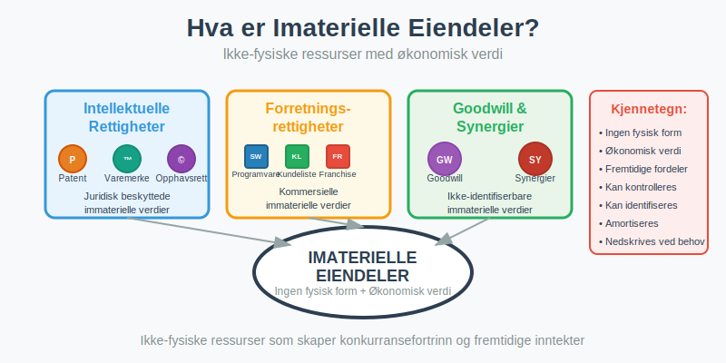
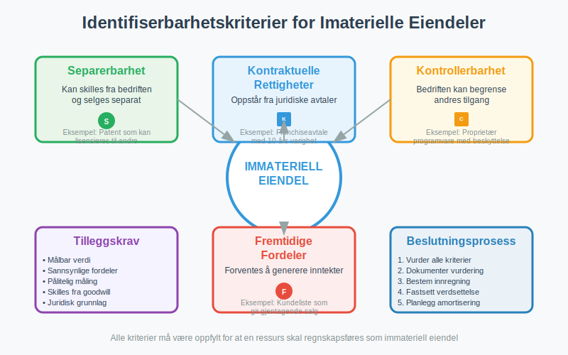
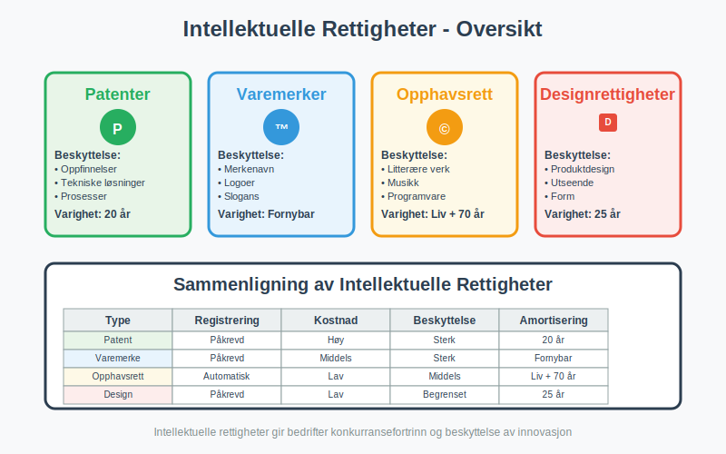
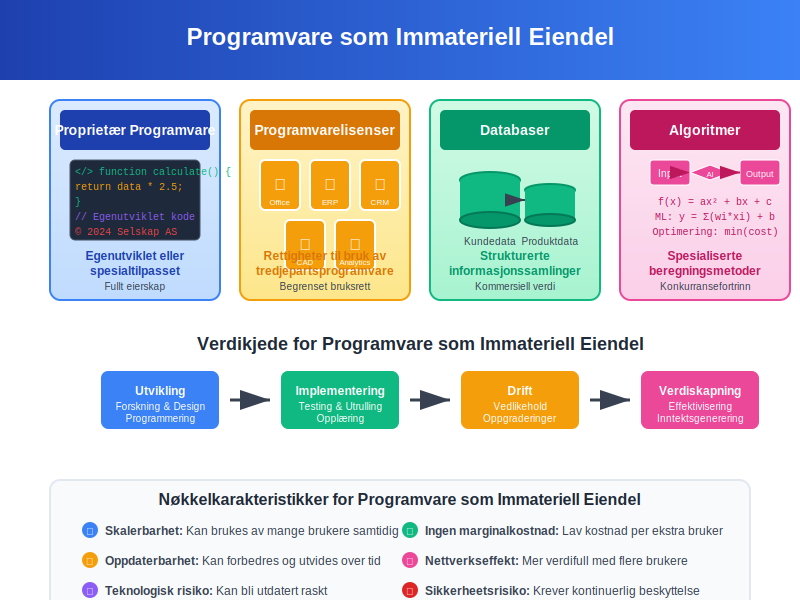
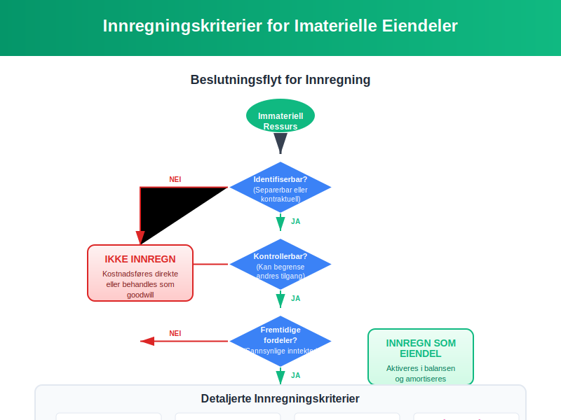

**Imaterielle eiendeler** er [eiendeler](/blogs/regnskap/hva-er-eiendel "Hva er Eiendel? Komplett Guide til Eiendom og Verdier") som mangler fysisk form, men som likevel har betydelig økonomisk verdi for bedriften. I motsetning til materielle eiendeler som maskiner og bygninger, består imaterielle eiendeler av rettigheter, kunnskap og andre ikke-fysiske ressurser som kan generere fremtidige inntekter. Korrekt identifisering, verdsettelse og [regnskapsføring](/blogs/regnskap/hva-er-bokforing "Hva er Bokføring? En Komplett Guide til Norsk Bokføringspraksis") av imaterielle eiendeler er avgjørende for å gi et riktig bilde av bedriftens totale verdi og konkurranseevne.

For en dypere forståelse av de juridiske aspektene knyttet til immaterielle rettigheter, se [Hva er immaterielle rettigheter?](/blogs/regnskap/hva-er-imaterielle-rettigheter "Hva er Imaterielle Rettigheter? Komplett Guide til Immaterielle Rettigheter i Regnskap").

## Seksjon 1: Definisjon og Karakteristikker

### 1.1 Hva er Imaterielle Eiendeler?

**Imaterielle eiendeler** er ikke-fysiske ressurser som:

* **Mangler fysisk substans** - kan ikke berøres eller sees
* **Har økonomisk verdi** som kan måles og verdsettes
* **Gir fremtidige økonomiske fordeler** gjennom bruk eller salg
* **Kan identifiseres og kontrolleres** av bedriften
* **Kan skilles fra [goodwill](/blogs/regnskap/hva-er-goodwill "Hva er Goodwill? Komplett Guide til Goodwill og Immaterielle Eiendeler")**

### 1.2 Identifiserbarhetskriterier

For at en immateriell ressurs skal regnskapsføres som eiendel, må den oppfylle spesifikke kriterier:

| Kriterium | Beskrivelse | Praktisk Eksempel |
|:----------|:------------|:------------------|
| **Separerbarhet** | Kan skilles fra bedriften og selges | Patent som kan lisensieres til andre |
| **Kontraktuelle rettigheter** | Oppstår fra juridiske avtaler | Franchiseavtale med 10 års varighet |
| **Kontrollerbarhet** | Bedriften kan begrense andres tilgang | Proprietær programvare med kopibeskyttelse |
| **Fremtidige fordeler** | Forventes å generere inntekter | Kundeliste som gir gjentagende salg |

## Seksjon 2: Typer Imaterielle Eiendeler

### 2.1 Intellektuelle Rettigheter

**Intellektuelle rettigheter** utgjør kjernen av mange bedrifters immaterielle eiendeler:

Intellektuelle rettigheter omfatter en bred kategori av juridiske beskyttelser, inkludert [konsesjoner](/blogs/kontoplan/1020-konsesjoner "Konto 1020 - Konsesjoner") som gir selskaper rettigheter til å drive spesifikke aktiviteter eller bruke offentlige ressurser.

#### Patenter
* **Definisjon:** Enrettigheter til oppfinnelser og tekniske løsninger
* **Varighet:** Vanligvis 20 år fra søknadsdato
* **Verdsettelse:** Basert på utviklingskostnader eller markedsverdi
* **Eksempler:** Medisinpatenter, teknologipatenter, prosesspatenter
* **Regnskapsføring:** Aktiveres på [konto 1030 - Patenter](/blogs/kontoplan/1030-patenter "Konto 1030 - Patenter")

#### Varemerker og Merkenavn
* **Definisjon:** Registrerte merker som identifiserer produkter eller tjenester. Se [Hva er varemerke?](/blogs/regnskap/hva-er-varemerke "Hva er Varemerke? Guide til Immaterielle Eiendeler i Regnskap").
* **Varighet:** Kan fornyes på ubestemt tid
* **Verdsettelse:** Ofte basert på merkeverdi og markedsposisjon
* **Eksempler:** Coca-Cola, Nike, Apple
* **Regnskapsføring:** Aktiveres på [konto 1050 - Varemerker](/blogs/kontoplan/1050-varemerker "Konto 1050 - Varemerker") (se [Hva er varemerke?](/blogs/regnskap/hva-er-varemerke "Hva er Varemerke? Guide til Immaterielle Eiendeler i Regnskap"))

#### Opphavsrettigheter
* **Definisjon:** Rettigheter til kreative og litterære verk
* **Varighet:** Vanligvis forfatterens levetid + 70 år
* **Verdsettelse:** Basert på forventede royalty-inntekter
* **Eksempler:** Programvare, musikk, litterære verk, filmer

* **Domenenavn:** Rett til bruk og registrering av unike internettdomener for bedriftens merkevare. Se [Domenenavn i Regnskap – Behandling og Klassifisering](/blogs/regnskap/domenenavn "Domenenavn i Regnskap – Behandling og Klassifisering").

#### Designrettigheter
* **Definisjon:** Beskyttelse av produkters utseende og form
* **Varighet:** Opptil 25 år med fornyelser
* **Verdsettelse:** Knyttet til produktets kommersielle suksess
* **Eksempler:** Møbeldesign, bildesign, emballasjedesign

### 2.2 Forretningsrelaterte Imaterielle Eiendeler

#### Kundelister og Kunderelasjoner
**Kundelister** representerer verdifulle kommersielle ressurser:

* **Aktive kundelister:** Kunder med pågående handelsforhold
* **Historiske kundelister:** Tidligere kunder med potensial for reaktivering
* **Segmenterte lister:** Kunder kategorisert etter verdi og potensial
* **Kontraktsfestede relasjoner:** Kunder med langsiktige avtaler

#### Franchiserettigheter
* **Definisjon:** Rett til å drive virksomhet under etablert merkenavn
* **Komponenter:** Merkerettigheter, driftsmanualer, opplæringssystemer
* **Verdsettelse:** Basert på franchiseavgifter og forventet lønnsomhet
* **Eksempler:** McDonald's, 7-Eleven, Subway

#### Programvare og Teknologi
**Programvare** som immateriell eiendel omfatter:

* **Proprietær programvare:** Egenutviklet eller spesialtilpasset
* **Lisenser:** Rettigheter til bruk av tredjepartsprogramvare
* **Databaser:** Strukturerte informasjonssamlinger
* **Algoritmer:** Spesialiserte beregningsmetoder

### 2.3 Goodwill - Den Spesielle Immaterielle Eiendelen

**[Goodwill](/blogs/regnskap/hva-er-goodwill "Hva er Goodwill? Komplett Guide til Goodwill og Immaterielle Eiendeler")** oppstår ved oppkjøp og representerer merverdien utover identifiserbare eiendeler. I norsk kontoplan registreres goodwill på [konto 1080](/blogs/kontoplan/1080-goodwill "Konto 1080 - Goodwill"):

#### Komponenter av Goodwill
* **Synergier:** Forventede kostnadsbesparelser og inntektsøkninger
* **Markedsposisjon:** Etablert omdømme og markedsandel
* **Menneskelige ressurser:** Kompetent arbeidsstyrke og ledelse
* **Ikke-identifiserbare immaterielle eiendeler:** Verdier som ikke kan skilles ut

## Seksjon 3: Verdsettelse av Imaterielle Eiendeler

### 3.1 Verdsettelsesmetoder

Verdsettelse av imaterielle eiendeler krever spesialiserte metoder:

#### Kostnadstilnærming
* **Historisk kost:** Faktiske utviklings- og anskaffelseskostnader
* **Gjenanskaffelseskost:** Kostnad for å erstatte eiendelen
* **Reproduksjonskost:** Kostnad for å skape identisk eiendel

#### Markedstilnærming
* **Sammenlignbare transaksjoner:** Priser på lignende eiendeler
* **Børsnoterte selskaper:** Markedsverdier for sammenlignbare bedrifter
* **Lisensroyalties:** Markedsrenter for lignende rettigheter

#### Inntektstilnærming
* **Diskonterte kontantstrømmer:** Nåverdi av fremtidige inntekter
* **Royalty-metoden:** Kapitalisering av forventede lisensavgifter
* **Overskuddsmetoden:** Isolering av inntekter fra den immaterielle eiendelen

### 3.2 Verdsettelsesutfordringer

| Utfordring | Beskrivelse | Løsningsmetode |
|:-----------|:------------|:---------------|
| **Mangel på marked** | Få sammenlignbare transaksjoner | Bruk av inntektsbaserte metoder |
| **Usikre kontantstrømmer** | Vanskelig å forutsi fremtidige inntekter | Scenarioanalyse og sensitivitetstesting |
| **Teknologisk utvikling** | Rask foreldelse av teknologi | Kortere amortiseringsperioder |
| **Juridisk usikkerhet** | Uklare rettigheter eller beskyttelse | Juridisk due diligence |

## Seksjon 4: Regnskapsføring og Amortisering

### 4.1 Innregning av Imaterielle Eiendeler

**Innregningskriterier** for imaterielle eiendeler i [balansen](/blogs/regnskap/hva-er-balanse "Hva er Balanse? Komplett Guide til Balanseregnskap og Finansiell Stilling"):

#### Internt Utviklede Eiendeler
* **Forskningsfase:** Kostnader kostnadsføres direkte
* **Utviklingsfase:** Kan aktiveres hvis kriterier oppfylles (se [konto 1000 - Forskning og utvikling](/blogs/kontoplan/1000-forskning-og-utvikling "Hva er Konto 1000 - Forskning og utvikling?"))
* **Teknisk gjennomførbarhet:** Må være demonstrert
* **Kommersielt potensial:** Sannsynlige fremtidige økonomiske fordeler

#### Ervervede Eiendeler
* **Enkeltvis erverv:** Verdsettes til anskaffelseskost
* **Virksomhetsoppkjøp:** Verdsettes til virkelig verdi på oppkjøpstidspunkt
* **Identifiserbarhet:** Må kunne skilles fra goodwill

### 4.2 Amortisering av Imaterielle Eiendeler

**[Amortisering](/blogs/regnskap/hva-er-amortisering "Hva er Amortisering? En Komplett Guide til Avskrivninger")** er den systematiske fordelingen av kostnad over eiendelens brukstid:

#### Amortiseringsperioder
| Eiendeltype | Typisk Periode | Begrunnelse |
|:------------|:---------------|:------------|
| **Patenter** | 20 år eller kortere | Juridisk beskyttelsesperiode |
| **Varemerker** | Ubestemt eller 10-20 år | Avhenger av fornyelsesmulighet |
| **Programvare** | 3-10 år | Teknologisk utvikling |
| **Kundelister** | 5-15 år | Kunderelasjoners varighet |
| **Goodwill** | Ikke amortisert | Nedskrivningstesting årlig |

#### Amortiseringsmetoder
* **Lineær metode:** Lik kostnad hvert år
* **Degressiv metode:** Høyere kostnad i begynnelsen
* **Produksjonsbasert:** Basert på faktisk bruk eller produksjon

### 4.3 Nedskrivning av Imaterielle Eiendeler

**Nedskrivning** blir aktuelt når bokført verdi overstiger gjenvinnbar verdi:

#### Nedskrivningsindikatorer
* **Eksterne faktorer:** Markedsendringer, teknologisk utvikling
* **Interne faktorer:** Dårligere ytelse enn forventet
* **Juridiske endringer:** Tap av rettigheter eller beskyttelse

#### Nedskrivningsprosess
1. **Identifisering:** Vurdering av nedskrivningsindikatorer
2. **Måling:** Beregning av gjenvinnbar verdi
3. **Regnskapsføring:** Nedskrivning til gjenvinnbar verdi
4. **Oppfølging:** Vurdering av reversering i senere perioder

## Seksjon 5: Praktiske Eksempler og Casestudier

### 5.1 Case: Teknologiselskap med Patentportefølje

**Situasjon:** Et teknologiselskap har utviklet og patentert en ny produksjonsteknologi.

#### Regnskapsbehandling
* **Utviklingskostnader:** 15 millioner kroner aktivert som immateriell eiendel
* **Amortiseringsperiode:** 10 år (kortere enn patentets 20-årige beskyttelse)
* **Årlig amortisering:** 1,5 millioner kroner
* **Nedskrivningsvurdering:** Årlig testing basert på markedsutsikter

### 5.2 Case: Oppkjøp med Betydelig Goodwill

**Situasjon:** Et selskap kjøper en konkurrent for 100 millioner kroner.

#### Kjøpsprisallokering
| Komponent | Verdi (mill. kr) | Behandling |
|:----------|:-----------------|:-----------|
| **Identifiserbare eiendeler** | 60 | Verdsettes til virkelig verdi |
| **Kundelister** | 15 | Amortiseres over 10 år |
| **Varemerker** | 10 | Amortiseres over 15 år |
| **Goodwill** | 15 | Nedskrivningstesting årlig |

### 5.3 Case: Programvareutvikling

**Situasjon:** Et selskap utvikler proprietær [ERP-system](/blogs/regnskap/hva-er-erp-system "Hva er ERP-system? Komplett Guide til Enterprise Resource Planning").

#### Kostnadsfordeling
* **Forskningsfase:** 5 millioner kroner kostnadsført
* **Utviklingsfase:** 12 millioner kroner aktivert
* **Implementering:** 3 millioner kroner kostnadsført
* **Amortisering:** 5 år basert på teknologisk levetid

## Seksjon 6: Regulatoriske Krav og Standarder

### 6.1 Norske Regnskapsregler

**Regnskapsloven** og **God regnskapsskikk** regulerer behandling av imaterielle eiendeler:

#### Hovedprinsipper
* **Forsiktighetsprinsippet:** Konservativ verdsettelse og innregning
* **Sammenstillingsprinsippet:** Kostnader matches mot relaterte inntekter
* **Konsistensprinsippet:** Ensartet behandling over tid

#### Spesielle Krav
* **Aktivering av utviklingskostnader:** Strenge kriterier må oppfylles
* **Goodwill-behandling:** Maksimal amortiseringsperiode 20 år
* **Opplysningskrav:** Detaljert noteinformasjon kreves

### 6.2 Internasjonale Standarder (IFRS)

For selskaper som følger **[IFRS](/blogs/regnskap/hva-er-ifrs "Hva er IFRS? Komplett Guide til Internasjonale Regnskapsstandarder")**:

#### IAS 38 - Immaterielle Eiendeler
* **Definisjon:** Mer detaljerte innregningskriterier
* **Måling:** Valgfrihet mellom kostmodell og revalueringsmodell
* **Amortisering:** Basert på brukstid, ubestemt hvis ikke kan bestemmes

#### Forskjeller fra Norske Regler
| Aspekt | Norske Regler | IFRS |
|:-------|:--------------|:-----|
| **Goodwill** | Amortiseres over maks 20 år | Nedskrivningstesting, ikke amortisering |
| **Revaluering** | Ikke tillatt | Tillatt hvis aktivt marked |
| **Utviklingskostnader** | Restriktiv aktivering | Mer liberal aktivering |

## Seksjon 7: Strategiske Aspekter og Verdiskapning

### 7.1 Imaterielle Eiendeler som Konkurransefortrinn

**Strategisk betydning** av imaterielle eiendeler i moderne økonomi:

#### Verdiskapningsmekanismer
* **Monopollignende posisjoner:** Patenter og varemerker skaper markedsmakt
* **Nettverkseffekter:** Programvare og plattformer blir mer verdifulle med flere brukere
* **Skalerbarhet:** Immaterielle eiendeler kan brukes uten marginale kostnader
* **Kundelojalitet:** Sterke merker skaper gjenkjøp og premiumprising

### 7.2 Risikostyring for Imaterielle Eiendeler

**Risikoer** knyttet til imaterielle eiendeler krever aktiv styring:

#### Hovedrisikoer
* **Teknologisk foreldelse:** Rask utvikling kan gjøre eiendeler verdiløse
* **Juridiske utfordringer:** Patentkonflikter og rettighetsbrudd
* **Markedsendringer:** Endrede kundepreferanser påvirker merkeverdi
* **Nøkkelpersonavhengighet:** Tap av kritisk kompetanse

#### Risikomitigering
* **Diversifisering:** Bred portefølje av immaterielle eiendeler
* **Juridisk beskyttelse:** Aktiv patentforvaltning og merkeregistrering
* **Kontinuerlig innovasjon:** Investering i forskning og utvikling
* **Kompetansesikring:** Retensjon av nøkkelpersonell

## Seksjon 8: Fremtidige Trender og Utvikling

### 8.1 Digitalisering og Nye Eiendeltyper

**Digitale transformasjon** skaper nye kategorier av imaterielle eiendeler:

#### Emerging Technologies
* **Kunstig intelligens:** Algoritmer og maskinlæringsmodeller
* **Blockchain:** Kryptovalutaer og digitale tokens
* **Data som eiendel:** Strukturerte datasett med kommersiell verdi
* **Digitale tvillinger:** Virtuelle representasjoner av fysiske systemer

### 8.2 Regulatoriske Utviklingstrekk

**Fremtidige endringer** i regnskapsbehandling:

#### Forventede Endringer
* **Utvidet definisjon:** Inkludering av flere digitale eiendeler
* **Forbedret måling:** Nye verdsettelsesmetoder for teknologi
* **Økt transparens:** Mer detaljerte opplysningskrav
* **Harmonisering:** Tilnærming mellom nasjonale og internasjonale standarder

## Konklusjon

**Imaterielle eiendeler** representerer en stadig viktigere del av moderne bedrifters verdi og konkurranseevne. Fra tradisjonelle patenter og varemerker til nye digitale eiendeler som data og algoritmer, krever disse ressursene spesialisert kunnskap for korrekt identifisering, verdsettelse og regnskapsføring.

Nøkkelen til suksess ligger i å:

* **Identifisere** alle immaterielle verdier i virksomheten
* **Verdsette** dem korrekt basert på anerkjente metoder
* **Beskytte** rettighetene gjennom juridiske mekanismer
* **Forvalte** dem strategisk for maksimal verdiskapning
* **Rapportere** dem transparent i henhold til gjeldende regelverk

For bedrifter som ønsker å maksimere verdien av sine immaterielle eiendeler, er det essensielt å ha en helhetlig tilnærming som kombinerer regnskapsmessig korrekthet med strategisk forretningsstyring. Dette krever tett samarbeid mellom regnskaps-, juridiske og strategiske funksjoner i organisasjonen.

Ved å forstå og aktivt forvalte imaterielle eiendeler kan bedrifter ikke bare sikre korrekt finansiell rapportering, men også bygge bærekraftige konkurransefortrinn som driver langsiktig verdiskapning og vekst.
