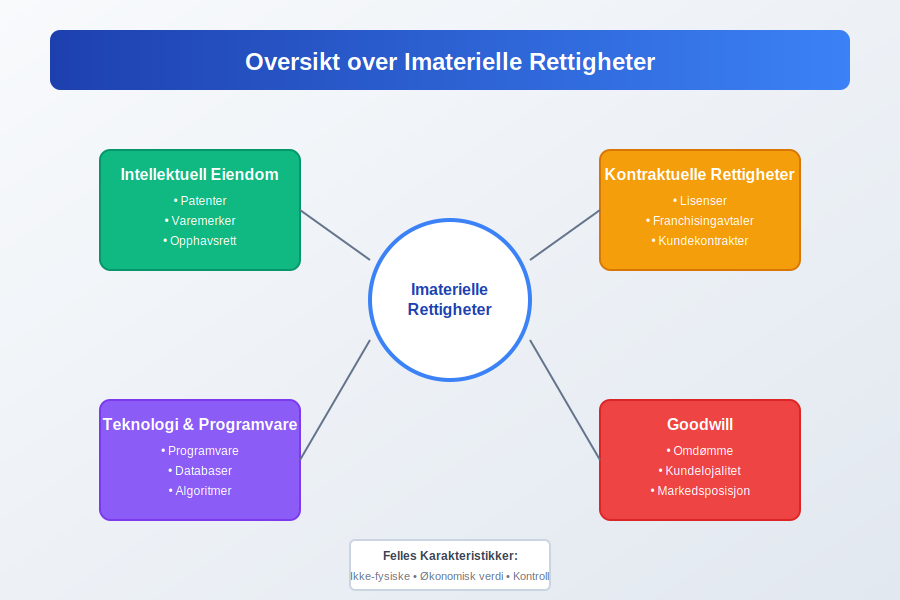
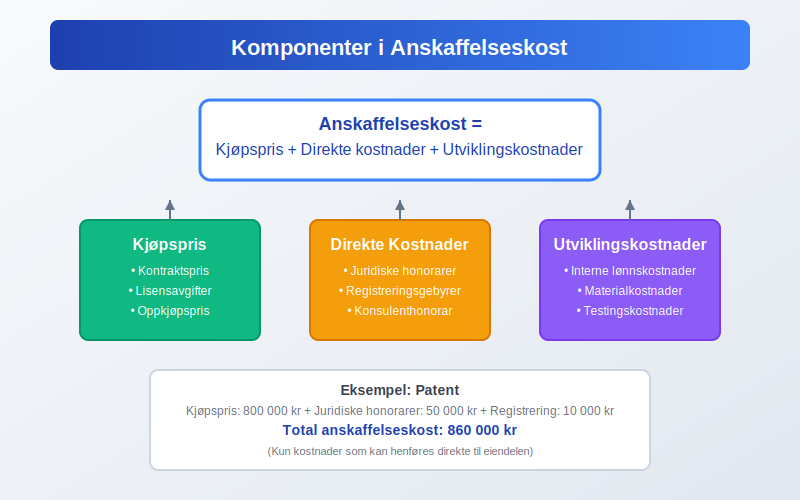
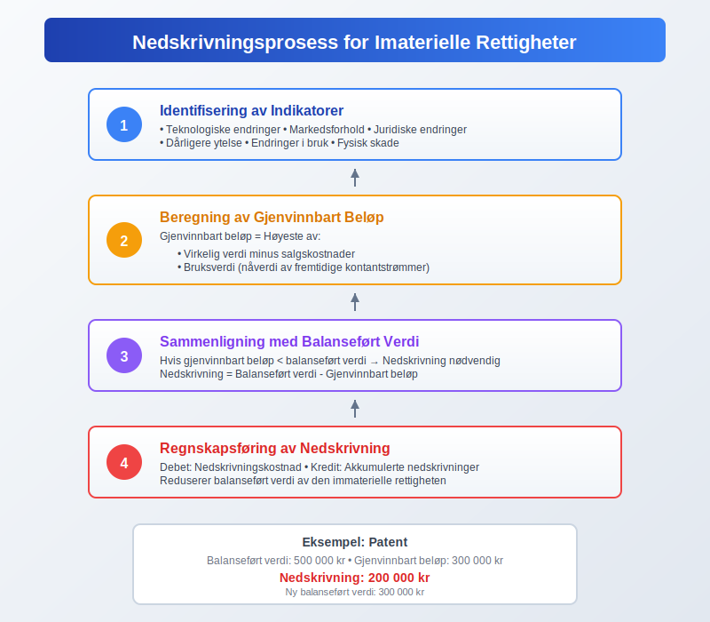
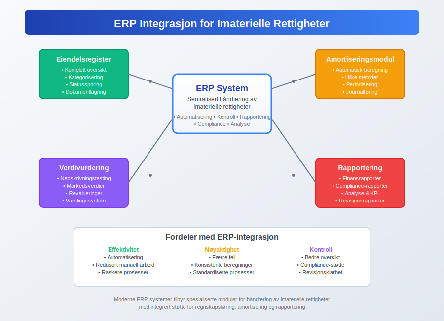

**Imaterielle rettigheter** er ikke-fysiske eiendeler som har økonomisk verdi for en virksomhet. Disse eiendelene representerer intellektuell eiendom, juridiske rettigheter og andre verdifulle ressurser som ikke kan berøres fysisk, men som likevel bidrar betydelig til en bedrifts verdi og konkurranseevne. I regnskapssammenheng klassifiseres imaterielle rettigheter som [anleggsmidler](/blogs/regnskap/hva-er-anleggsmidler "Hva er Anleggsmidler? Komplett Guide til Varige Driftsmidler og Investeringer") og behandles som en viktig del av virksomhetens totale [eiendeler](/blogs/regnskap/hva-er-eiendel "Hva er Eiendel? Komplett Guide til Eiendeler i Regnskap og Balanse").

For en mer helhetlig forståelse av immaterielle eiendeler i regnskap, se [Hva er imaterielle eiendeler?](/blogs/regnskap/hva-er-imaterielle-eiendeler "Hva er Imaterielle Eiendeler? Komplett Guide til Immaterielle Verdier i Regnskap").

For å sikre korrekt regnskapsføring av imaterielle rettigheter, er det essensielt å følge [god regnskapsskikk](/blogs/regnskap/god-regnskapsskikk "God Regnskapsskikk - Prinsipper, Standarder og Beste Praksis i Norge") og gjeldende standarder for verdivurdering og [amortisering](/blogs/regnskap/hva-er-amortisering "Hva er Amortisering? En Komplett Guide til Avskrivninger").

## Seksjon 1: Typer Imaterielle Rettigheter

Imaterielle rettigheter kan kategoriseres i flere hovedgrupper, hver med sine unike karakteristikker og regnskapsmessige behandling.

### 1.1 Intellektuell Eiendom

**Intellektuell eiendom** omfatter kreative og innovative verk som er beskyttet av lov:

* **Patenter:** Eksklusive rettigheter til oppfinnelser og teknologiske løsninger
* **Varemerker:** Beskyttede merker, logoer og handelsnavn
* **[Opphavsrett](/blogs/regnskap/aandsverkloven "Åndsverkloven - Komplett Guide til Opphavsrett i Norge")**: Rettigheter til litterære, kunstneriske og musikalske verk
* **Designrettigheter:** Beskyttelse av estetisk utforming av produkter
* **Forretningshemmeligheter:** Konfidensielle forretningsmetoder og prosesser

### 1.2 Kontraktuelle Rettigheter

Disse rettighetene oppstår fra juridiske avtaler og kontrakter:

* **Lisenser:** Rettigheter til å bruke andres intellektuelle eiendom
* **Franchisingavtaler:** Rettigheter til å drive virksomhet under etablerte merkevarer
* **Ikke-konkurranseklausuler:** Avtaler som begrenser konkurranse
* **Kundekontrakter:** Langsiktige avtaler med kunder
* **Royaltyavtaler:** Avtaler om løpende vederlag basert på bruk av immaterielle rettigheter. Se [Royalty](/blogs/regnskap/royalty "Royalty i regnskap – Guide til avtaler og regnskapsføring av vederlag").

### 1.3 Teknologi og Programvare

I den digitale tidsalderen utgjør teknologiske eiendeler en betydelig del av imaterielle rettigheter:

* **Programvare:** Utviklede eller kjøpte programvareløsninger
* **Databaser:** Strukturerte samlinger av informasjon
* **Algoritmer:** Proprietære beregningsmetoder
* **Domenenavn:** Internettadresser og digitale identiteter

### 1.4 Goodwill

[Goodwill](/blogs/regnskap/hva-er-goodwill "Hva er Goodwill? Komplett Guide til Goodwill i Regnskap og Oppkjøp") er en spesiell kategori av immateriell rettighet som oppstår ved oppkjøp av virksomheter. Den representerer verdien av faktorer som omdømme, kundelojalitet, ansattes kompetanse og andre ikke-identifiserbare eiendeler.

## Seksjon 2: Regnskapsføring av Imaterielle Rettigheter

Regnskapsføring av imaterielle rettigheter følger spesifikke prinsipper og standarder som sikrer korrekt presentasjon i [finansregnskapet](/blogs/regnskap/hva-er-finansregnskap "Hva er Finansregnskap? En Komplett Guide til Ekstern Finansiell Rapportering").

### 2.1 Innregningskriterier

For at en immateriell rettighet skal kunne innregnes i [balansen](/blogs/regnskap/hva-er-balanse "Hva er Balanse i Regnskap? Komplett Guide til Balansens Oppbygging og Funksjon"), må følgende kriterier være oppfylt:

| Kriterium | Beskrivelse | Eksempel |
|-----------|-------------|----------|
| **Identifiserbarhet** | Eiendelen må være separerbar eller oppstå fra kontraktuelle rettigheter | Patent som kan selges separat |
| **Kontroll** | Virksomheten må ha kontroll over fremtidige økonomiske fordeler | Eksklusiv lisens til teknologi |
| **Fremtidige fordeler** | Eiendelen må forventes å gi økonomiske fordeler | Varemerke som genererer salg |
| **Pålitelig måling** | [Anskaffelseskost](/blogs/regnskap/hva-er-anskaffelseskost "Hva er Anskaffelseskost? Komplett Guide til Kostpris og Verdivurdering") må kunne måles pålitelig | Dokumentert kjøpspris |

### 2.2 Innregning ved Anskaffelse

Imaterielle rettigheter innregnes til [anskaffelseskost](/blogs/regnskap/hva-er-anskaffelseskost "Hva er Anskaffelseskost? Komplett Guide til Kostpris og Verdivurdering"), som inkluderer:

* **Kjøpspris:** Beløp betalt for rettigheten
* **Direkte kostnader:** Juridiske honorarer, registreringsgebyrer
* **Utviklingskostnader:** Interne kostnader for utvikling (under visse betingelser)

### 2.3 Etterfølgende Måling

Etter innregning kan imaterielle rettigheter måles etter to modeller:

**Kostmodellen:**
* Anskaffelseskost minus akkumulerte [avskrivninger](/blogs/regnskap/hva-er-avskrivning "Hva er Avskrivning? Komplett Guide til Avskrivninger av Anleggsmidler") og nedskrivninger

**Revalueringsmodellen:**
* Virkelig verdi på revalueringstidspunktet minus etterfølgende avskrivninger og nedskrivninger

## Seksjon 3: Amortisering og Avskrivning

[Amortisering](/blogs/regnskap/hva-er-amortisering "Hva er Amortisering? En Komplett Guide til Avskrivninger") av imaterielle rettigheter følger systematiske prinsipper basert på eiendelens nyttbare levetid.

### 3.1 Bestemmelse av Nyttbar Levetid

Nyttbar levetid kan være:

* **Begrenset:** Basert på juridisk beskyttelse, kontraktuelle avtaler eller økonomiske faktorer
* **Ubegrenset:** Når det ikke er noen forutsigbar grense for perioden eiendelen vil generere kontantstrømmer

### 3.2 Amortiseringsmetoder

| Metode | Beskrivelse | Anvendelse |
|--------|-------------|------------|
| **Lineær** | Lik amortisering hvert år | Mest vanlig for patenter og lisenser |
| **Produksjonsbasert** | Basert på faktisk bruk eller produksjon | Programvare med bruksbaserte lisenser |
| **Degressiv** | Høyere amortisering i begynnelsen | Teknologi med rask utvikling |

### 3.3 Praktiske Eksempler på Amortisering

**Eksempel 1: Patent**
* Anskaffelseskost: 1 000 000 kr
* Juridisk beskyttelse: 20 år
* Årlig amortisering: 50 000 kr

**Eksempel 2: Programvarelisens**
* Anskaffelseskost: 500 000 kr
* Kontraktslengde: 5 år
* Årlig amortisering: 100 000 kr

## Seksjon 4: Verdivurdering og Nedskrivning

Regelmessig vurdering av imaterielle rettigheters verdi er kritisk for korrekt regnskapsføring.

### 4.1 Nedskrivningstesting

Imaterielle rettigheter med ubegrenset levetid og goodwill må testes for nedskrivning minst årlig. Eiendeler med begrenset levetid testes når det er indikasjoner på verdifall.

### 4.2 Indikatorer på Verdifall

* **Eksterne faktorer:**
  - Teknologiske endringer
  - Markedsforhold
  - Juridiske endringer

* **Interne faktorer:**
  - Dårligere ytelse enn forventet
  - Endringer i bruk
  - Fysisk skade på underliggende eiendeler

### 4.3 Beregning av Nedskrivning

Nedskrivning beregnes som forskjellen mellom balanseført verdi og gjenvinnbart beløp:

**Gjenvinnbart beløp = Høyeste av:**
* Virkelig verdi minus salgskostnader
* Bruksverdi (nåverdi av fremtidige kontantstrømmer)

## Seksjon 5: Spesielle Regnskapsområder

### 5.1 Forskning og Utvikling

Kostnader til forskning og utvikling behandles forskjellig:

* **Forskningskostnader:** Kostnadsføres når de påløper
* **Utviklingskostnader:** Kan [aktiveres](/blogs/regnskap/hva-er-aktivering "Hva er Aktivering i Regnskap?") hvis strenge kriterier er oppfylt

### 5.2 Internt Genererte Imaterielle Rettigheter

Spesielle regler gjelder for internt utviklede eiendeler:

| Type | Regnskapsbehandling | Begrunnelse |
|------|-------------------|-------------|
| **Varemerker** | Kostnadsføres | Vanskelig å skille fra goodwill |
| **Kundelister** | Kostnadsføres | Ikke separerbare |
| **Programvare** | Kan aktiveres | Hvis teknisk og kommersiell gjennomførbarhet |

### 5.3 Immaterielle Rettigheter i Oppkjøp

Ved virksomhetsoppkjøp må imaterielle rettigheter identifiseres og verdsettes separat fra [goodwill](/blogs/regnskap/hva-er-goodwill "Hva er Goodwill? Komplett Guide til Goodwill i Regnskap og Oppkjøp"):

* **Identifiserbare eiendeler:** Verdsettes til virkelig verdi
* **Ikke-identifiserbare eiendeler:** Inngår i goodwill

## Seksjon 6: Praktisk Implementering

### 6.1 Dokumentasjon og Kontroll

Effektiv håndtering av imaterielle rettigheter krever:

* **Register:** Komplett oversikt over alle rettigheter
* **Dokumentasjon:** Kontrakter, registreringer, verdivurderinger
* **Overvåking:** Regelmessig oppfølging av verdier og rettigheter

### 6.2 Integrasjon med ERP-systemer

Moderne [ERP-systemer](/blogs/regnskap/hva-er-erp-system "Hva er ERP-system? Komplett Guide til Enterprise Resource Planning") tilbyr spesialiserte moduler for håndtering av imaterielle rettigheter:

* Automatisk amortiseringsberegning
* Nedskrivningstesting
* Rapportering og analyse

### 6.3 Skattemessige Konsekvenser

Skattemessig behandling av imaterielle rettigheter kan avvike fra regnskapsmessig behandling:

* **Avskrivningssatser:** Kan være forskjellige fra regnskapsmessig amortisering
* **Fradragsrett:** Ikke alle kostnader er fradragsberettigede
* **Gevinst/tap:** Spesielle regler ved salg

For en grundig forståelse av skattemessige [fradrag](/blogs/regnskap/hva-er-fradrag "Hva er fradrag i regnskap? Komplett Guide til Skattefradrag og Regnskapsføring") knyttet til imaterielle rettigheter, se vår omfattende guide.

## Seksjon 7: Bransjespesifikke Betraktninger

### 7.1 Teknologisektoren

I teknologiselskaper utgjør imaterielle rettigheter ofte majoriteten av selskapets verdi:

* **Programvare:** Både utviklet og kjøpt
* **Patenter:** Teknologiske innovasjoner
* **Databaser:** Kundedata og algoritmer

### 7.2 Farmasøytisk Industri

Spesielle utfordringer i farmasøytisk sektor:

* **Lange utviklingsperioder:** Høye forskningskostnader
* **Regulatoriske godkjenninger:** Verdifulle rettigheter
* **Patentutløp:** Betydelig verdifall

### 7.3 Mediebransjen

Kreative industrier har unike imaterielle rettigheter:

* **Opphavsrett:** Musikk, filmer, bøker
* **Merkevarer:** Karakterer og franchiser
* **Distribusjonrettigheter:** Geografiske og tidsmessige rettigheter

## Seksjon 8: Fremtidige Utviklingstrender

### 8.1 Digitalisering og Nye Teknologier

Teknologisk utvikling skaper nye kategorier av imaterielle rettigheter:

* **Kunstig intelligens:** Algoritmer og maskinlæringsmodeller
* **Blockchain:** Kryptovalutaer og smarte kontrakter
* **Data:** Persondata og big data-analyser

### 8.2 Regulatoriske Endringer

Utviklingen i regnskapsstandarder påvirker behandlingen av imaterielle rettigheter:

* **IFRS-oppdateringer:** Nye standarder for måling og rapportering
* **Skattelovgivning:** Endringer i fradragsregler
* **Personvernlovgivning:** Påvirker verdien av databaser

### 8.3 ESG og Bærekraft

[ESG-faktorer](/blogs/regnskap/hva-er-esg "Hva er ESG? Komplett Guide til Environmental, Social og Governance") påvirker også imaterielle rettigheter:

* **Miljøsertifiseringer:** Verdifulle rettigheter i grønne markeder
* **Sosial lisens:** Omdømme og samfunnsansvar
* **Governance:** Etiske standarder og compliance

## Konklusjon

Imaterielle rettigheter representerer en stadig viktigere del av moderne virksomheters verdi. Korrekt regnskapsføring, verdivurdering og håndtering av disse eiendelene er avgjørende for:

* **Finansiell rapportering:** Rettvisende presentasjon av virksomhetens verdi
* **Strategisk planlegging:** Forståelse av konkurransefortrinn
* **Risikostyring:** Identifisering og håndtering av verdirisikoer
* **Compliance:** Overholdelse av regnskaps- og skatteregler

Ved å følge etablerte prinsipper for [bokføring](/blogs/regnskap/hva-er-bokforing "Hva er Bokføring? En Komplett Guide til Norsk Bokføringspraksis") og regnskapsføring, samt holde seg oppdatert på utviklingen innen standarder og regulering, kan virksomheter sikre optimal håndtering av sine imaterielle rettigheter.

For virksomheter som ønsker å optimalisere sin regnskapsføring av imaterielle rettigheter, anbefales det å konsultere med kvalifiserte regnskapsførere og revisorer som har spesialkompetanse på området.
