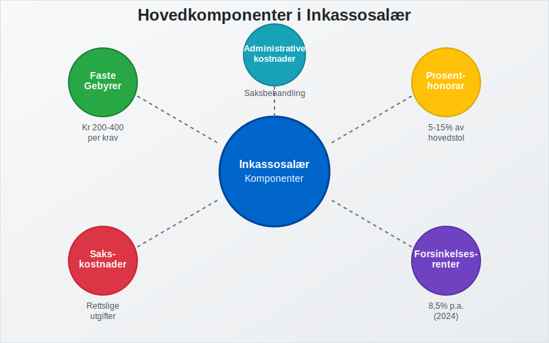
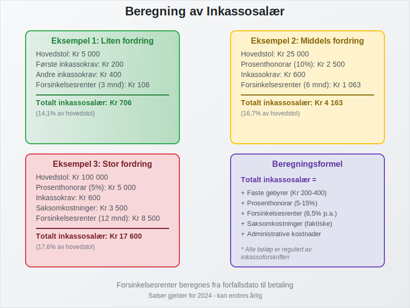
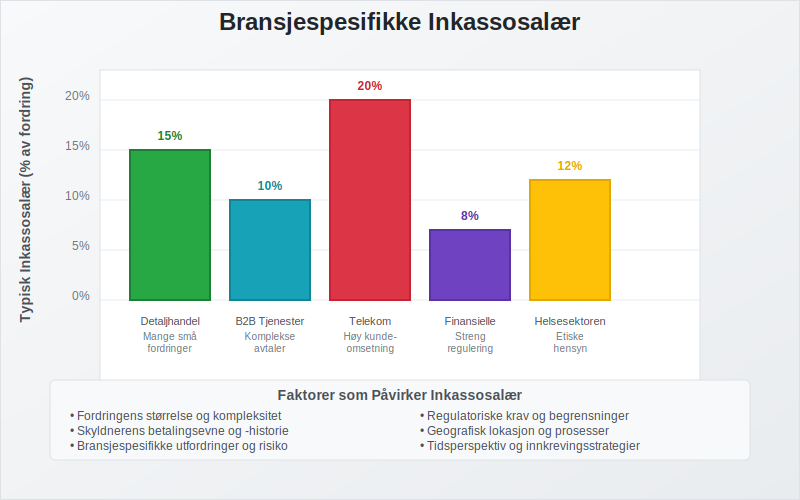
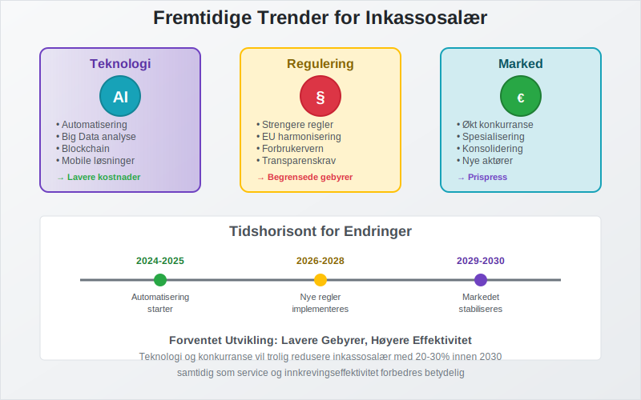

**Inkassosalær** er den kompensasjonen som inkassoselskaper og advokater mottar for å drive inn forfalte fordringer på vegne av kreditorer. Dette omfatter både faste gebyrer og prosentbaserte honorarer som er regulert av norsk lov. Forståelse av inkassosalær er viktig for både bedrifter som bruker inkassotjenester og skyldnere som mottar inkassokrav.

## Seksjon 1: Hva er Inkassosalær?

Inkassosalær er den **økonomiske kompensasjonen** som inkassoselskaper og advokater mottar for å utføre inkassovirksomhet. Dette inkluderer alle former for honorarer, gebyrer og kostnader som påløper i forbindelse med innkreving av forfalte fordringer.

### Hovedkomponenter i Inkassosalær

Inkassosalær består av flere elementer:

* **Faste gebyrer:** Standardiserte beløp for spesifikke inkassotjenester
* **Prosentbaserte honorarer:** Andel av den innkrevde summen
* **Saksomkostninger:** Faktiske utgifter til rettslige prosesser
* **Forsinkelsesrenter:** Renter på forfalte beløp
* **Administrative kostnader:** Kostnader for saksbehandling og oppfølging

### Lovgrunnlag for Inkassosalær

Inkassosalær er regulert av flere lover og forskrifter:

* **[Inkassoloven](/blogs/regnskap/hva-er-inkassoloven "Hva er Inkassoloven? Komplett Guide til Norsk Inkassolovgivning og Regler"):** Hovedregulering av inkassovirksomhet
* **Inkassoforskriften:** Detaljerte regler for gebyrer og prosedyrer
* **Domstolloven:** Regler for saksomkostninger ved rettslige prosesser
* **Forsinkelsesrenteloven:** Regulering av forsinkelsesrenter

## Seksjon 2: Typer Inkassosalær og Beregning

Inkassosalær varierer avhengig av type sak, beløpsstørrelse og hvilken fase inkassoprosessen befinner seg i. Det skilles mellom **utomrettslig inkasso** og **rettslig inkasso**.

### Utomrettslig Inkasso Gebyrer

For utomrettslig inkasso gjelder følgende maksimalgebyrer (2024-satser):

| Type Krav | Maksimalt Gebyr | Hjemmel |
|-----------|-----------------|---------|
| **Første inkassokrav** | Kr 200 | Inkassoforskriften § 4 |
| **Andre inkassokrav** | Kr 400 | Inkassoforskriften § 4 |
| **Betalingsoppfordring** | Kr 70 | Inkassoforskriften § 3 |
| **Telefonisk purring** | Kr 30 per samtale | Inkassoforskriften § 5 |

### Prosentbaserte Honorarer

For større fordringer kan inkassoselskaper kreve prosentbaserte honorarer:

* **Fordringer under kr 10 000:** Maksimalt 15% av hovedstolen
* **Fordringer kr 10 000 - 50 000:** Maksimalt 10% av hovedstolen
* **Fordringer over kr 50 000:** Maksimalt 5% av hovedstolen

### Rettslig Inkasso Kostnader

Ved rettslige prosesser kommer ytterligere kostnader:

| Type Kostnad | Beløp | Beskrivelse |
|--------------|-------|-------------|
| **Stevningsgebyr** | Kr 1 020 - 16 310 | Avhenger av kravets størrelse |
| **Advokathonorar** | Varierer | Basert på medgått tid og kompleksitet |
| **Vitnegebyr** | Faktiske kostnader | Reise og tapt arbeidsfortjeneste |
| **Sakkyndiggebyr** | Faktiske kostnader | Ved behov for ekspertuttalelser |

## Seksjon 3: Regulering og Kontroll av Inkassosalær

Inkassosalær er strengt regulert for å beskytte skyldnere mot urimelige kostnader. **Finanstilsynet** fører tilsyn med inkassoselskaper og deres gebyrpraksis.

### Krav til Inkassoselskaper

Inkassoselskaper må:

* **Være registrert** hos Finanstilsynet
* **Følge gebyrregulativet** nøye
* **Dokumentere** alle kostnader og honorarer
* **Informere** skyldnere om gebyrgrunnlag
* **Opptre** profesjonelt og etisk

### Skyldneres Rettigheter

Skyldnere har rett til:

* **Innsyn** i gebyrberegninger og kostnadsgrunnlag
* **Klage** på urimelige eller ulovlige gebyrer
* **Betalingsordninger** ved betalingsproblemer
* **Juridisk bistand** ved tvister om inkassosalær

## Seksjon 4: Inkassosalær for Ulike Bransjer

Inkassosalær kan variere mellom bransjer avhengig av kompleksitet og risiko. Noen bransjer har spesielle utfordringer som påvirker inkassokostnadene.

### Bransjeoversikt

| Bransje | Typisk Inkassosalær | Særlige Utfordringer |
|---------|-------------------|---------------------|
| **Detaljhandel** | 10-15% av fordring | Mange små fordringer |
| **B2B Tjenester** | 5-10% av fordring | Komplekse avtaler |
| **Telekom** | 15-20% av fordring | Høy kundeomsetning |
| **Finansielle tjenester** | 5-8% av fordring | Streng regulering |
| **Helsesektoren** | 8-12% av fordring | Etiske hensyn |

### Faktorer som Påvirker Inkassosalær

Flere faktorer påvirker størrelsen på inkassosalær:

* **Fordringens størrelse:** Større fordringer gir lavere prosentsats
* **Skyldnerens betalingsevne:** Påvirker innkrevingsstrategien
* **Sakens kompleksitet:** Juridiske utfordringer øker kostnadene
* **Geografisk lokasjon:** Kan påvirke prosess- og reisekostnader
* **Tidsperspektiv:** Eldre fordringer er vanskeligere å kreve inn

## Seksjon 5: Regnskapsføring av Inkassosalær

For bedrifter som bruker inkassotjenester er korrekt regnskapsføring av inkassosalær viktig for å opprettholde oversikt over kostnader og [driftskostnader](/blogs/regnskap/hva-er-driftskostnader "Hva er Driftskostnader? Komplett Guide til Kostnadstyper og Regnskapsføring").

### Kontering av Inkassokostnader

#### For Kreditor (Oppdragsgiver)

Når bedriften engasjerer inkassoselskap:

* **Debet:** Inkassokostnader (driftskostnad)
* **Kredit:** Leverandørgjeld (skyld til inkassoselskap)

#### Når Inkasso Lykkes

Ved vellykket innkreving:

* **Debet:** Bank (innbetalt beløp minus inkassosalær)
* **Debet:** Inkassokostnader (hvis ikke tidligere ført)
* **Kredit:** Kundefordringer (opprinnelig fordring)

### Skattemessige Aspekter

Inkassosalær har flere skattemessige implikasjoner:

* **Fradragsrett:** Inkassokostnader er fradragsberettigede driftskostnader
* **Merverdiavgift:** Inkassotjenester er MVA-pliktige
* **Dokumentasjon:** Krav til dokumentasjon av kostnader

## Seksjon 6: Alternativer til Tradisjonell Inkasso

Moderne teknologi og endrede forretningsmodeller har skapt alternativer til tradisjonell inkasso som kan påvirke inkassosalær-strukturen.

### Digitale Inkassoløsninger

Nye teknologier endrer inkassobransjen:

* **Automatiserte systemer:** Reduserer manuelle kostnader
* **AI-basert risikovurdering:** Forbedrer innkrevingsstrategier
* **Digitale betalingsløsninger:** Forenkler betalingsprosessen
* **Chatbots og selvbetjening:** Reduserer kundeservicekostnader

### Alternative Finansieringsmodeller

* **Factoring:** Salg av fordringer til [finansieringsselskaper](/blogs/regnskap/hva-er-factoring "Hva er Factoring? Komplett Guide til Fordringssalg og Finansiering")
* **Inkassoforsikring:** Forsikring mot tap på fordringer
* **Betalingsgarantier:** Tredjepartsgarantier for betalinger

## Seksjon 7: Fremtidige Trender for Inkassosalær

Inkassobransjen er i endring, og dette påvirker hvordan inkassosalær struktureres og beregnes.

### Teknologiske Endringer

* **Automatisering:** Reduserer manuelle kostnader og kan føre til lavere gebyrer
* **Big Data:** Forbedrer risikovurdering og innkrevingsstrategier
* **Blockchain:** Kan forbedre transparens i gebyrberegninger
* **Mobile løsninger:** Forenkler betalingsprosesser

### Regulatoriske Endringer

* **Strengere regulering:** Kan begrense gebyrøkninger
* **Europeisk harmonisering:** Påvirker norske regler
* **Forbrukerbeskyttelse:** Økt fokus på skyldneres rettigheter

### Markedstrender

* **Økt konkurranse:** Kan presse gebyrene nedover
* **Spesialisering:** Nisjeselskaper med spesialiserte tjenester
* **Konsolidering:** Færre, men større aktører i markedet

## Konklusjon

Inkassosalær er en kompleks del av det norske inkassosystemet som balanserer behovet for effektiv innkreving med beskyttelse av skyldneres rettigheter. For bedrifter er det viktig å forstå kostnadsstrukturen ved [egeninkasso](/blogs/regnskap/hva-er-egeninkasso "Hva er Egeninkasso? Komplett Guide til Selvinkasso og Fordringshåndtering") versus profesjonell inkasso.

### Viktige Punkter å Huske

* **Inkassosalær er regulert** av norsk lov og kan ikke overstige maksimalgrenser
* **Transparens er påkrevet** - alle gebyrer må være dokumenterte og rimelige
* **Skyldnere har rettigheter** til innsyn og klageadgang
* **Teknologiske endringer** påvirker fremtidens gebyrstrukturer
* **Korrekt regnskapsføring** av inkassokostnader er viktig for bedrifter

Ved valg av inkassopartner bør bedrifter vurdere både kostnadsnivå, service og etisk praksis for å sikre en balansert tilnærming til [fordringshåndtering](/blogs/regnskap/hva-er-ansattreskontro "Hva er Ansattreskontro? Komplett Guide til Kundeoppfølging og Fordringsstyring").
