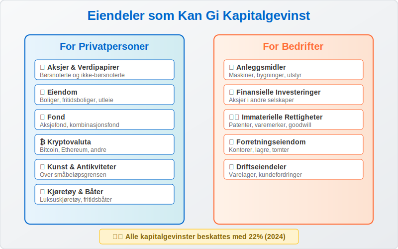
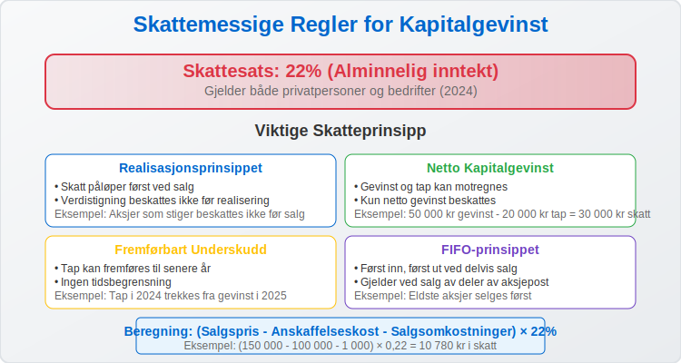
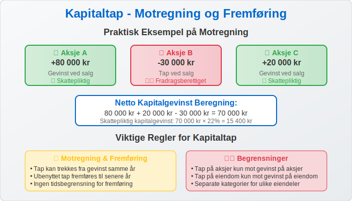
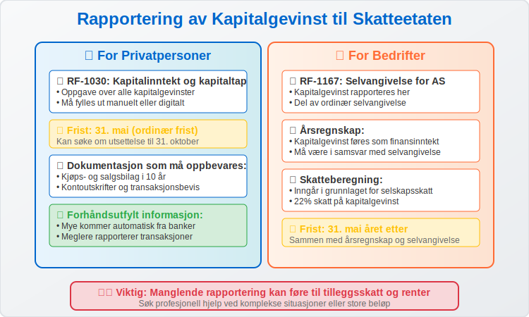

**Kapitalgevinst** er den positive differansen mellom salgsprisen og [anskaffelseskostnaden](/blogs/regnskap/hva-er-anskaffelseskost "Hva er Anskaffelseskost? Beregning, Komponenter og Regnskapsføring") når du selger en [eiendel](/blogs/regnskap/hva-er-eiendel "Hva er Eiendel? Komplett Guide til Eiendeler i Regnskap og Balanse"). I Norge er kapitalgevinst skattepliktig inntekt som må rapporteres til Skatteetaten, men det finnes viktige fritak og særregler som kan påvirke skattebetalingen betydelig.
For aksjeinvesteringer gjelder spesielle skatteordninger som skjermingsfradrag og fritaksmetoden. Se vår [Aksjonærmodellen - Komplett Guide til Norsk Aksjebeskatning](/blogs/regnskap/aksjonaermodellen-guide "Aksjonærmodellen - Komplett Guide til Norsk Aksjebeskatning") for detaljert informasjon om beskatning av aksjegevinster.

For en oversikt over skatteregler spesifikt for aksjegevinster, se også vår [Skatt på aksjegevinst](/blogs/regnskap/skatt-pa-aksjegevinst "Skatt på aksjegevinst – Guide til beskatning av aksjegevinster i Norge").

Grunnlaget («inngangsverdi») for gevinstberegningen tilsvarer den opprinnelige kostprisen; se [Inngangsverdi](/blogs/regnskap/inngangsverdi "Inngangsverdi: Kostpris, Beregning og Skattegrunnlag i Norsk Regnskap") for mer informasjon.

## Hva er Kapitalgevinst?

Kapitalgevinst oppstår når du selger en eiendel for mer enn det du opprinnelig betalte for den, justert for eventuelle påkostninger og [avskrivninger](/blogs/regnskap/hva-er-avskrivning "Hva er Avskrivning i Regnskap? Metoder, Beregning og Praktiske Eksempler").


### Grunnleggende Formel:

**Kapitalgevinst = Salgspris - Anskaffelseskost - Salgsomkostninger**

### Eksempel:
- Kjøpte aksjer for 100 000 kr
- Solgte aksjer for 150 000 kr  
- Salgsomkostninger (meglerprovision): 1 000 kr
- **Kapitalgevinst: 150 000 - 100 000 - 1 000 = 49 000 kr**

## Typer Eiendeler som Kan Gi Kapitalgevinst

Kapitalgevinst kan oppstå ved salg av mange forskjellige typer eiendeler, både for privatpersoner og bedrifter.



### For Privatpersoner:

* **Aksjer og verdipapirer:** Børsnoterte og ikke-børsnoterte [aksjer](/blogs/regnskap/hva-er-en-aksje "Hva er en Aksje? Komplett Guide til Aksjer, Rettigheter og Verdivurdering")
* **Eiendom:** Boliger, fritidsboliger, utleieeiendommer
* **Fond:** Aksjefond, kombinasjonsfond, indeksfond
* **Kryptovaluta:** Bitcoin, Ethereum og andre digitale valutaer
* **Kunst og antikviteter:** Verdifulle gjenstander over visse beløpsgrenser
* **Båter og kjøretøy:** Luksuskjøretøy og fritidsbåter

### For Bedrifter:

* **[Anleggsmidler](/blogs/regnskap/hva-er-anleggsmidler "Hva er Anleggsmidler? Komplett Guide til Faste Eiendeler i Regnskap"):** Maskiner, bygninger, utstyr
* **Finansielle investeringer:** Aksjer i andre selskaper
* **[Immaterielle rettigheter](/blogs/regnskap/hva-er-imaterielle-rettigheter "Hva er Imaterielle Rettigheter? Komplett Guide til Regnskapsføring og Verdivurdering"):** Patenter, varemerker, goodwill
* **Eiendom:** Forretningseiendommer og tomter

## Skattemessige Regler for Kapitalgevinst

Kapitalgevinst beskattes som [**alminnelig inntekt**](/blogs/regnskap/alminnelig-inntekt "Alminnelig inntekt – Komplett guide til skattemessig resultat og beregning") med en skattesats på **22%** for 2024. Dette gjelder både for privatpersoner og bedrifter.



### Viktige Skatteprinsipp:

| Prinsipp | Beskrivelse | Eksempel |
|----------|-------------|----------|
| **Realisasjonsprinsippet** | Skatt påløper først ved salg | Aksjer som stiger i verdi beskattes ikke før salg |
| **Netto kapitalgevinst** | Gevinst og tap kan motregnes | Gevinst 50 000 kr - tap 20 000 kr = skattepliktig 30 000 kr |
| **Fremførbart underskudd** | Tap kan fremføres til senere år | Tap i 2024 kan trekkes fra gevinst i 2025 |
| **FIFO-prinsippet** | Først inn, først ut ved delvis salg | Ved salg av deler av aksjepost |

### Beregning av Skattepliktig Kapitalgevinst:

```
Skattepliktig kapitalgevinst = (Salgspris - Anskaffelseskost - Salgsomkostninger) × 22%
```

## Fritak og Særregler

Det finnes flere viktige fritak og særregler som kan redusere eller eliminere skatten på kapitalgevinst.


### Aksjesparekonto (ASK)

* **Innskuddsramme:** 300 000 kr (2024)
* **Skattefritak:** Gevinst og utbytte er skattefritt innenfor kontoen
* **Uttaksskatt:** 22% ved uttak av overskudd

### Boligsalg - Skattefritak

**Hovedregel:** Gevinst ved salg av egen bolig er skattefri hvis:

* Du har **eid** boligen i minst **2 år**
* Du har **bodd** i boligen i minst **1 år** av de siste **2 årene**
* Boligen har vært din **hovedbolig**

### Fritidsbolig

* **Skattefritak:** Inntil 10 000 kr per år
* **Over grensen:** 22% skatt på beløp over 10 000 kr
* **Eierperiode:** Må eies i minst 5 år for full skattefrihet

### Småbeløpsgrensen

* **Grense:** 1 000 kr per år
* **Gjelder:** Salg av [løsøre](/blogs/regnskap/hva-er-losore "Hva er Løsøre? En Guide til Løsøre i Norsk Regnskap"), kunst, antikviteter
* **Skattefritt:** Gevinst under 1 000 kr beskattes ikke

## Regnskapsføring av Kapitalgevinst

For bedrifter må kapitalgevinst regnskapsføres korrekt i henhold til [god regnskapsskikk](/blogs/regnskap/god-regnskapsskikk "God Regnskapsskikk: Prinsipper, Regler og Praktisk Anvendelse i Norge").


### Bokføringseksempel - Salg av Anleggsmiddel:

**Opprinnelig anskaffelse (maskin for 500 000 kr):**
```
Debet: Maskiner og utstyr        500 000
Kredit: Bank                     500 000
```

**Akkumulerte avskrivninger (200 000 kr):**
```
Debet: Avskrivninger             200 000
Kredit: Akk. avskrivninger       200 000
```

**Salg for 400 000 kr (bokført verdi 300 000 kr):**
```
Debet: Bank                      400 000
Debet: Akk. avskrivninger        200 000
Kredit: Maskiner og utstyr       500 000
Kredit: Gevinst ved salg         100 000
```

**Kapitalgevinst:** 400 000 - 300 000 = **100 000 kr**

## Kapitaltap - Motregning og Fremføring

Når du selger eiendeler med tap, kan dette brukes til å redusere skattepliktig kapitalgevinst.



### Regler for Kapitaltap:

* **Motregning:** Tap kan trekkes fra gevinst samme år
* **Fremføring:** Ubenyttet tap fremføres til senere år
* **Tidsbegrensning:** Ingen tidsbegrensning for fremføring
* **Begrensninger:** Tap på aksjer kan kun motregnes mot gevinst på aksjer

### Eksempel på Motregning:

| Transaksjon | Beløp | Resultat |
|-------------|-------|----------|
| Solgte Aksje A | +80 000 kr | Gevinst |
| Solgte Aksje B | -30 000 kr | Tap |
| Solgte Aksje C | +20 000 kr | Gevinst |
| **Netto kapitalgevinst** | **70 000 kr** | **Skattepliktig** |

## Praktiske Eksempler

La oss se på konkrete eksempler på hvordan kapitalgevinst beregnes og beskattes i ulike situasjoner.


### Eksempel 1: Aksjesalg

**Situasjon:** Privatperson selger aksjer utenfor ASK

**Detaljer:**
- Kjøpt 1000 aksjer à 150 kr = 150 000 kr
- Solgt 1000 aksjer à 200 kr = 200 000 kr  
- Meglerprovision: 500 kr (kjøp) + 800 kr (salg) = 1 300 kr

**Beregning:**
- Kapitalgevinst: 200 000 - 150 000 - 1 300 = **48 700 kr**
- Skatt (22%): 48 700 × 0,22 = **10 714 kr**

### Eksempel 2: Boligsalg (Ikke Skattefri)

**Situasjon:** Salg av utleiebolig

**Detaljer:**
- Kjøpspris: 3 000 000 kr
- Påkostninger: 200 000 kr
- Salgspris: 4 500 000 kr
- Salgsomkostninger: 150 000 kr

**Beregning:**
- Anskaffelseskost: 3 000 000 + 200 000 = 3 200 000 kr
- Kapitalgevinst: 4 500 000 - 3 200 000 - 150 000 = **1 150 000 kr**
- Skatt (22%): 1 150 000 × 0,22 = **253 000 kr**

### Eksempel 3: Bedrift Selger Anleggsmiddel

**Situasjon:** [Aksjeselskap](/blogs/regnskap/hva-er-et-aksjeselskap "Hva er et Aksjeselskap? Komplett Guide til AS i Norge") selger maskin

**Detaljer:**
- Opprinnelig kostpris: 800 000 kr
- Akkumulerte avskrivninger: 500 000 kr
- Bokført verdi: 300 000 kr
- Salgspris: 450 000 kr

**Beregning:**
- Kapitalgevinst: 450 000 - 300 000 = **150 000 kr**
- Skatt (22%): 150 000 × 0,22 = **33 000 kr**

## Rapportering til Skatteetaten

Kapitalgevinst må rapporteres korrekt i selvangivelsen eller [årsregnskapet](/blogs/regnskap/hva-er-regnskap "Hva er Regnskap? Komplett Guide til Regnskapsføring i Norge").



### For Privatpersoner:

* **RF-1030:** Oppgave over kapitalinntekt og kapitaltap
* **Frist:** 31. mai (ordinær frist)
* **Dokumentasjon:** Oppbevar kjøps- og salgsbilag i 10 år
* **Forhåndsutfylt:** Mye informasjon kommer automatisk fra banker/meglere

### For Bedrifter:

* **RF-1167:** Selvangivelse for aksjeselskap
* **Årsregnskap:** Kapitalgevinst føres som [finansinntekt](/blogs/regnskap/hva-er-inntekter "Hva er Inntekter? Komplett Guide til Inntektsføring og Regnskapsregler")
* **Skatteberegning:** Inngår i grunnlaget for selskapsskatt

## Strategier for Skatteoptimalisering

Det finnes lovlige metoder for å optimalisere skatten på kapitalgevinst.


### Lovlige Strategier:

* **Aksjesparekonto:** Maksimer bruken av ASK-rammen
* **Tap og gevinst:** Realiser tap og gevinst strategisk
* **Tidspunkt:** Vurder tidspunkt for salg (årsskifte)
* **Boligsalg:** Sørg for å oppfylle kravene til skattefritak
* **Gave/arv:** Vurder overføring til familie

### Viktige Advarsler:

* **Proforma-transaksjoner:** Unngå kunstige transaksjoner
* **Skatteunngåelse:** Hold deg innenfor lovens rammer
* **Rådgivning:** Søk profesjonell hjelp ved komplekse situasjoner

## Internasjonale Forhold

Ved salg av utenlandske eiendeler eller for personer bosatt i utlandet gjelder særlige regler.

### Skatteavtaler:

* **Dobbeltbeskatning:** Norge har skatteavtaler med mange land
* **Kildeskatt:** Kan påløpe i utlandet
* **Fradrag:** Utenlandsk skatt kan gi fradrag i Norge

### Rapporteringsplikt:

* **Utenlandske aksjer:** Må rapporteres hvis verdi over 200 000 kr
* **Utenlandsk eiendom:** Særlige rapporteringskrav
* **Kontrolloppgave:** Banker rapporterer automatisk til Skatteetaten

## Fremtidige Endringer og Utviklingstrekk

Regelverket for kapitalgevinst endres jevnlig, og det er viktig å holde seg oppdatert.


### Aktuelle Utviklingstrekk:

* **Digitalisering:** Mer automatisk rapportering
* **Kryptovaluta:** Klarere regler under utvikling
* **EU-direktiver:** Påvirker norske regler
* **Bærekraft:** ESG-faktorer kan påvirke beskatning

### Forslag Under Vurdering:

* **ASK-ramme:** Mulig økning av innskuddsrammen
* **Fritidsbolig:** Endringer i fritaksreglene
* **Arv og gave:** Nye regler for generasjonsskifte

## Konklusjon

**Kapitalgevinst** er et viktig skattemessig begrep som påvirker både privatpersoner og bedrifter. Med en skattesats på 22% kan skatten bli betydelig, men gjennom kunnskap om fritak, særregler og lovlige optimaliseringsstrategier kan du minimere skattebelastningen.

### Viktigste Punkter å Huske:

* Kapitalgevinst beskattes som [alminnelig inntekt](/blogs/regnskap/alminnelig-inntekt "Alminnelig inntekt – Komplett guide til skattemessig resultat og beregning") (22%)
* Flere fritak finnes, spesielt for boligsalg og ASK
* Tap kan motregnes mot gevinst
* Korrekt dokumentasjon er avgjørende
* Søk profesjonell rådgivning ved komplekse situasjoner

Ved å forstå reglene for kapitalgevinst kan du ta informerte beslutninger om investeringer og salg av eiendeler, samtidig som du sikrer korrekt rapportering til Skatteetaten.

For aksjeinvesteringer anbefaler vi at du også setter deg inn i [Aksjonærmodellen - Komplett Guide til Norsk Aksjebeskatning](/blogs/regnskap/aksjonaermodellen-guide "Aksjonærmodellen - Komplett Guide til Norsk Aksjebeskatning") for å få full oversikt over alle skatteordninger som kan påvirke din skattebyrde ved aksjegevinster.
