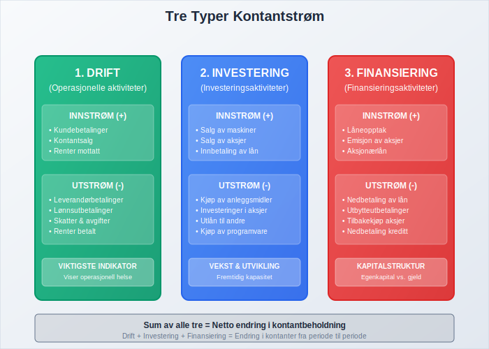
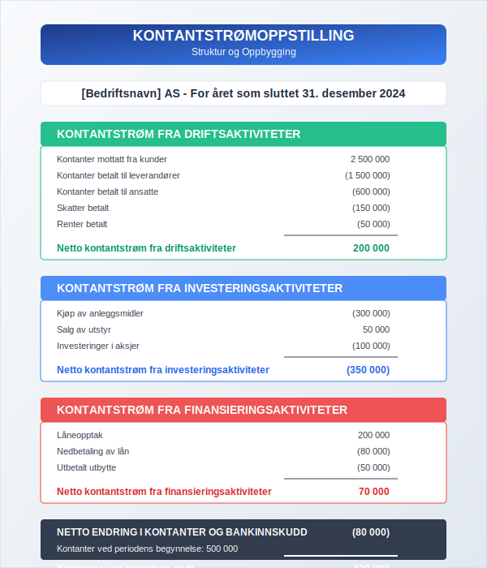
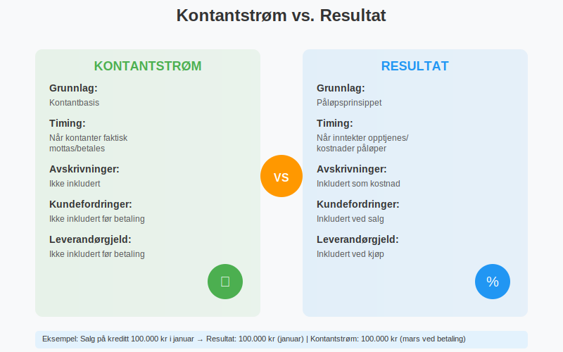
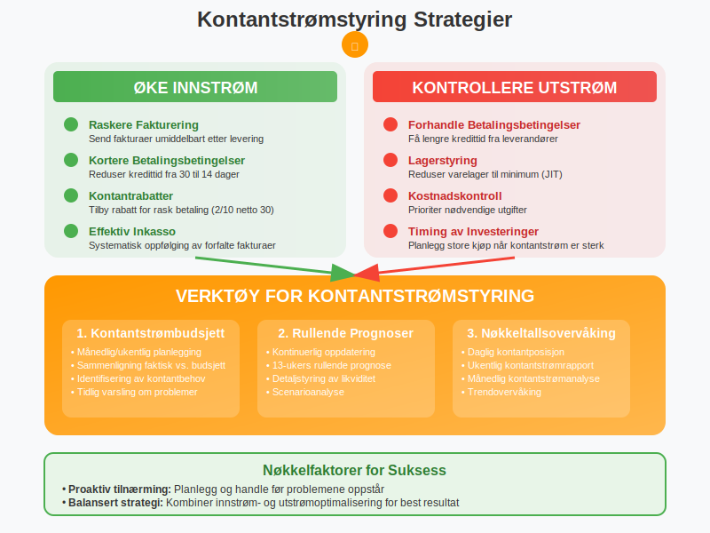
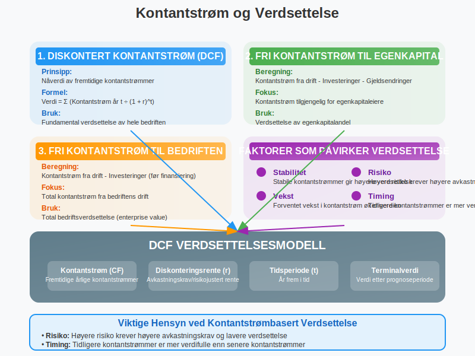

**Kontantstrøm** (cash flow) er bevegelsen av kontanter inn og ut av en bedrift over en bestemt periode. Det er et av de viktigste målene på bedriftens **finansielle helse** og evne til å opprettholde drift, betale regninger og investere i vekst. Kontantstrøm skiller seg fra [resultatregnskap](/blogs/regnskap/hva-er-regnskap "Hva er Regnskap? Komplett Guide til Norsk Regnskapsføring") ved at det fokuserer på faktiske kontantbevegelser, ikke påløpte inntekter og kostnader.

## Hva er Kontantstrøm?

Kontantstrøm representerer den faktiske bevegelsen av [kontanter](/blogs/regnskap/hva-er-kassebeholdning "Hva er Kassebeholdning? Komplett Guide til Kontantstyring") og [bankinnskudd](/blogs/regnskap/hva-er-bankinnskudd "Hva er Bankinnskudd i Regnskap? Typer, Regnskapsføring og Forvaltning") i en bedrift. Det viser hvor mye kontanter som kommer inn (innstrøm) og hvor mye som går ut (utstrøm) i løpet av en periode. Kontanter oppbevares ofte i en [kontantkasse](/blogs/regnskap/kontantkasse "Kontantkasse") før de settes inn i bank.

### Viktige Kjennetegn ved Kontantstrøm:

* **Faktiske transaksjoner:** Kun reelle kontantbevegelser registreres
* **Tidsbasert:** Måles over spesifikke perioder (månedlig, kvartalsvis, årlig)
* **Likviditetsfokus:** Viser bedriftens evne til å møte kortsiktige forpliktelser og opprettholde [likviditet](/blogs/regnskap/hva-er-likviditet "Hva er Likviditet? Komplett Guide til Likviditetsstyring og Analyse"). Effektiv [likviditetsstyring](/blogs/regnskap/hva-er-likviditetsstyring "Hva er Likviditetsstyring i Regnskap? Kontantstrøm, Arbeidskapital og Finansiell Planlegging") krever systematisk overvåking og planlegging av kontantstrømmer
* **Operasjonell indikator:** Reflekterer den faktiske driftseffektiviteten
* **Kontantkjøp:** Utbetalinger for varer og tjenester betalt kontant påvirker kontantstrømmen; se [Kontantkjøp](/blogs/regnskap/kontantkjop "Kontantkjøp – Guide til Regnskapsføring av Kontantkjøp").

## Typer Kontantstrøm

Kontantstrøm deles inn i tre hovedkategorier som hver gir innsikt i ulike aspekter av bedriftens aktiviteter.

### 1. Kontantstrøm fra Driftsaktiviteter

Dette er kontantstrømmen fra bedriftens **kjernevirksomhet** og den viktigste indikatoren på operasjonell helse.

**Innstrøm fra drift:**
* Kontantbetalinger fra kunder
* Renter mottatt
* Utbytte mottatt fra investeringer

**Utstrøm fra drift:**
* Betalinger til leverandører
* Lønnsutbetalinger
* Skatter og avgifter
* Renter betalt

### 2. Kontantstrøm fra Investeringsaktiviteter

Kontantstrømmer knyttet til kjøp og salg av [anleggsmidler](/blogs/regnskap/hva-er-anleggsmidler "Hva er Anleggsmidler? Komplett Guide til Faste Eiendeler") og langsiktige investeringer.

**Innstrøm fra investeringer:**
* Salg av maskiner og utstyr
* Salg av aksjer og obligasjoner
* Innbetaling av lån gitt til andre

**Utstrøm fra investeringer:**
* Kjøp av [anleggsmidler](/blogs/regnskap/hva-er-anleggsmidler "Hva er Anleggsmidler? Komplett Guide til Faste Eiendeler")
* Investeringer i aksjer og obligasjoner
* Utlån til andre selskaper

### 3. Kontantstrøm fra Finansieringsaktiviteter

Kontantstrømmer fra endringer i bedriftens [egenkapital](/blogs/regnskap/hva-er-egenkapital "Hva er Egenkapital i Regnskap? Beregning, Typer og Betydning") og [gjeld](/blogs/regnskap/hva-er-gjeld "Hva er Gjeld i Regnskap? Typer, Klassifisering og Regnskapsføring").

**Innstrøm fra finansiering:**
* Låneopptak
* Emisjon av nye aksjer
* [Aksjonærlån til AS](/blogs/regnskap/hva-er-aksjonaerlan-til-as "Hva er Aksjonærlån til AS? Regler, Regnskapsføring og Skattemessige Konsekvenser")

**Utstrøm fra finansiering:**
* Nedbetaling av lån
* Utbytteutbetalinger
* Tilbakekjøp av egne aksjer

## Kontantstrømoppstilling

For en mer detaljert gjennomgang av hvordan man utarbeider og analyserer en **kontantstrømoppstilling**, se [Hva er Kontantstrømoppstilling? En Komplett Guide til Kontantstrømoppstilling i Norge](/blogs/regnskap/hva-er-kontantstromoppstilling "Hva er Kontantstrømoppstilling? En Komplett Guide til Kontantstrømoppstilling i Norge").
**Kontantstrømoppstillingen** er en av de tre hovedrapportene i [finansregnskapet](/blogs/regnskap/hva-er-finansregnskap "Hva er Finansregnskap? Komplett Guide til Eksternregnskap"), sammen med [balansen](/blogs/regnskap/hva-er-balanse "Hva er Balanse i Regnskap? Komplett Guide til Balanseoppstilling") og resultatregnskapet.

### Eksempel på Kontantstrømoppstilling:

| Kontantstrømoppstilling | År 1 | År 2 |
|------------------------|------|------|
| **DRIFTSAKTIVITETER** | | |
| Kontanter fra kunder | 2 500 000 | 2 800 000 |
| Kontanter til leverandører | (1 500 000) | (1 650 000) |
| Kontanter til ansatte | (600 000) | (650 000) |
| Skatter betalt | (150 000) | (180 000) |
| **Netto kontantstrøm fra drift** | **250 000** | **320 000** |
| | | |
| **INVESTERINGSAKTIVITETER** | | |
| Kjøp av maskiner | (200 000) | (100 000) |
| Salg av utstyr | 50 000 | 30 000 |
| **Netto kontantstrøm fra investering** | **(150 000)** | **(70 000)** |
| | | |
| **FINANSIERINGSAKTIVITETER** | | |
| Låneopptak | 100 000 | 0 |
| Nedbetaling av lån | (80 000) | (90 000) |
| Utbetalt utbytte | (50 000) | (75 000) |
| **Netto kontantstrøm fra finansiering** | **(30 000)** | **(165 000)** |
| | | |
| **NETTO ENDRING I KONTANTER** | **70 000** | **85 000** |
| Kontanter ved periodens start | 150 000 | 220 000 |
| **Kontanter ved periodens slutt** | **220 000** | **305 000** |

## Kontantstrøm vs. Resultat

En av de viktigste forskjellene i regnskap er mellom **kontantstrøm** og **resultat**. Mange bedrifter kan vise [fortjeneste](/blogs/regnskap/hva-er-fortjeneste "Hva er Fortjeneste i Regnskap? Beregning, Typer og Skattemessige Konsekvenser") men likevel ha negativ kontantstrøm.

### Hovedforskjeller:

| Aspekt | Kontantstrøm | Resultat |
|--------|-------------|----------|
| **Grunnlag** | Kontantbasis | [Påløpsprinsippet](/blogs/regnskap/god-regnskapsskikk "God Regnskapsskikk - Prinsipper og Praksis i Norsk Regnskap") |
| **Timing** | Når kontanter faktisk mottas/betales | Når inntekter opptjenes/kostnader påløper |
| **[Avskrivninger](/blogs/regnskap/hva-er-avskrivning "Hva er Avskrivning i Regnskap? Metoder, Beregning og Praktiske Eksempler")** | Ikke inkludert | Inkludert som kostnad |
| **Kundefordringer** | Ikke inkludert før betaling | Inkludert ved salg |
| **Leverandørgjeld** | Ikke inkludert før betaling | Inkludert ved kjøp |

### Eksempel på Forskjellen:

**Scenario:** En bedrift selger varer for 100 000 kr på kreditt i januar, men får betalt i mars.

* **Resultatregnskap:** Viser 100 000 kr i inntekt i januar
* **Kontantstrøm:** Viser 100 000 kr innstrøm i mars

## Kontantstrømanalyse

**Kontantstrømanalyse** er prosessen med å evaluere bedriftens kontantstrømmer for å vurdere finansiell helse og operasjonell effektivitet.

### Viktige Nøkkeltall for Kontantstrømanalyse:

#### 1. Operasjonell Kontantstrømmargin
**Formel:** (Kontantstrøm fra drift ÷ Omsetning) × 100

**Tolkning:** Viser hvor mye av hver salgskrone som blir til kontanter fra drift.

#### 2. Kontantstrøm per Aksje
**Formel:** Kontantstrøm fra drift ÷ Antall utestående aksjer

**Tolkning:** Sammenlignbart med resultat per aksje, men basert på kontantstrøm.

#### 3. Kontantkonverteringsratio
**Formel:** Kontantstrøm fra drift ÷ Nettoresultat

**Tolkning:** Viser hvor godt bedriften konverterer resultat til kontanter.

### Analyse av Kontantstrømmønstre:

| Mønster | Drift | Investering | Finansiering | Tolkning |
|---------|-------|-------------|--------------|----------|
| **Vekstfase** | + | - | + | Positiv drift, investerer, henter kapital |
| **Moden bedrift** | + | - | - | Positiv drift, moderate investeringer, betaler utbytte |
| **Nedgangsfase** | - | + | + | Negativ drift, selger eiendeler, henter kapital |
| **Restrukturering** | - | + | - | Negativ drift, selger eiendeler, betaler ned gjeld |

## Kontantstrømprognose

**Kontantstrømprognose** er et verktøy for å forutsi fremtidige kontantbehov og planlegge [likviditetsstyring](/blogs/regnskap/hva-er-likviditet "Hva er Likviditet? Komplett Guide til Likviditetsstyring og Analyse"). Effektiv kontantstrømprognose er grunnleggende for god [arbeidskapitalstyring](/blogs/regnskap/hva-er-arbeidskapital "Hva er Arbeidskapital? Beregning, Analyse og Styring av Working Capital").

### Komponenter i Kontantstrømprognose:

#### Kortsiktig Prognose (1-12 måneder):
* **Detaljert månedlig/ukentlig planlegging**
* Basert på konkrete kontrakter og avtaler
* Inkluderer sesongvariasjoner
* Fokus på [arbeidskapitalstyring](/blogs/regnskap/hva-er-arbeidskapital "Hva er Arbeidskapital? Beregning, Analyse og Styring av Working Capital")

#### Langsiktig Prognose (1-5 år):
* **Strategisk planlegging**
* Basert på budsjetter og forretningsplaner
* Inkluderer store investeringsprosjekter
* Fokus på finansieringsbehov

### Eksempel på Månedlig Kontantstrømprognose:

| Måned | Jan | Feb | Mar | Apr | Mai | Jun |
|-------|-----|-----|-----|-----|-----|-----|
| **INNSTRØM** | | | | | | |
| Kontantsalg | 200 000 | 220 000 | 250 000 | 230 000 | 240 000 | 260 000 |
| Kundefordringer | 150 000 | 180 000 | 200 000 | 190 000 | 200 000 | 210 000 |
| **Total innstrøm** | **350 000** | **400 000** | **450 000** | **420 000** | **440 000** | **470 000** |
| | | | | | | |
| **UTSTRØM** | | | | | | |
| Leverandører | 180 000 | 200 000 | 220 000 | 210 000 | 220 000 | 230 000 |
| Lønn | 120 000 | 120 000 | 120 000 | 120 000 | 120 000 | 120 000 |
| Husleie | 25 000 | 25 000 | 25 000 | 25 000 | 25 000 | 25 000 |
| Andre kostnader | 15 000 | 18 000 | 20 000 | 17 000 | 19 000 | 21 000 |
| **Total utstrøm** | **340 000** | **363 000** | **385 000** | **372 000** | **384 000** | **396 000** |
| | | | | | | |
| **Netto kontantstrøm** | **10 000** | **37 000** | **65 000** | **48 000** | **56 000** | **74 000** |
| Akkumulert saldo | 10 000 | 47 000 | 112 000 | 160 000 | 216 000 | 290 000 |

## Kontantstrømstyring

Effektiv **kontantstrømstyring** er kritisk for bedriftens overlevelse og vekst. Det handler om å optimalisere innstrøm og kontrollere utstrøm.

### Strategier for å Forbedre Kontantstrøm:

#### Øke Innstrøm:
* **Raskere fakturering:** Send fakturaer umiddelbart etter levering
* **Kortere betalingsbetingelser:** Reduser [kredittid](/blogs/regnskap/hva-er-en-faktura "Hva er en Faktura? En Guide til Norske Fakturakrav") fra 30 til 14 dager
* **Kontantrabatter:** Tilby rabatt for rask betaling
* **Effektiv [inkasso](/blogs/regnskap/hva-er-inkasso "Hva er Inkasso? Prosess, Regler og Kostnader i Norge"):** Følg opp forfalte fakturaer systematisk
* **[Factoring](/blogs/regnskap/hva-er-factoring "Hva er Factoring? Fordeler, Ulemper og Praktisk Bruk"):** Selg kundefordringer for umiddelbar kontant

#### Kontrollere Utstrøm:
* **Forhandle betalingsbetingelser:** Få lengre kredittid fra leverandører
* **Lagerstyring:** Reduser [varelager](/blogs/regnskap/hva-er-arbeidskapital "Hva er Arbeidskapital? Beregning, Analyse og Styring av Working Capital") til minimum
* **Kostnadskontroll:** Prioriter nødvendige utgifter
* **Timing av investeringer:** Planlegg store kjøp når kontantstrømmen er sterk

### Verktøy for Kontantstrømstyring:

#### 1. Kontantstrømbudsjett
* Månedlig/ukentlig planlegging
* Sammenligning av faktisk vs. budsjett
* Identifisering av kontantbehov på forhånd

#### 2. Rullende Prognoser
* Kontinuerlig oppdatering av prognoser
* 13-ukers rullende prognose for detaljstyring
* Tidlig varsling om likviditetsproblemer

#### 3. Nøkkeltallsovervåking
* Daglig kontantposisjon
* Ukentlig kontantstrømrapport
* Månedlig kontantstrømanalyse

## Kontantstrøm og Arbeidskapital

[Arbeidskapital](/blogs/regnskap/hva-er-arbeidskapital "Hva er Arbeidskapital? Beregning, Analyse og Styring av Working Capital") har direkte påvirkning på kontantstrøm. Endringer i arbeidskapitalkomponenter påvirker kontantstrømmen fra drift.

### Sammenheng mellom Arbeidskapital og Kontantstrøm:

| Arbeidskapitalendring | Effekt på Kontantstrøm | Forklaring |
|----------------------|------------------------|------------|
| **Økning i kundefordringer** | Negativ | Mer penger bundet opp i fordringer |
| **Reduksjon i kundefordringer** | Positiv | Innkreving av fordringer gir kontanter |
| **Økning i varelager** | Negativ | Mer kapital bundet i lager |
| **Reduksjon i varelager** | Positiv | Salg av lager uten erstatningskjøp |
| **Økning i leverandørgjeld** | Positiv | Utsetter kontantutbetaling |
| **Reduksjon i leverandørgjeld** | Negativ | Betaling av gjeld reduserer kontanter |

### Optimalisering av Arbeidskapital for Bedre Kontantstrøm:

#### Kundefordringer:
* Implementer effektive kredittvurderingsprosedyrer
* Automatiser fakturering og oppfølging
* Vurder [factoring](/blogs/regnskap/hva-er-factoring "Hva er Factoring? Fordeler, Ulemper og Praktisk Bruk") for store fordringer

#### Varelager:
* Implementer just-in-time lagerstyring
* Forbedre etterspørselsprognoser
* Reduser antall produktvarianter

#### Leverandørgjeld:
* Forhandle bedre betalingsbetingelser
* Utnytt kontantrabatter når det er lønnsomt
* Planlegg betalinger for optimal kontantstrøm

## Kontantstrøm i Ulike Bransjer

Kontantstrømmønstre varierer betydelig mellom bransjer, og det er viktig å forstå disse forskjellene for korrekt analyse.

### Bransjekarakteristika:

#### Detaljhandel:
* **Høy omsetningshastighet** på varelager
* **Sesongvariasjoner** i kontantstrøm
* **Kontantsalg** gir umiddelbar innstrøm
* Utfordring: Lagerstyring og sesongplanlegging

#### Produksjon:
* **Lange produksjonssykluser** påvirker timing
* **Store investeringer** i maskiner og utstyr
* **Arbeidskapitalintensiv** drift
* Utfordring: Balansere produksjon og etterspørsel

#### Tjenesteyting:
* **Lav kapitalbinding** i varelager
* **Høy andel faste kostnader** (lønn)
* **Variabel innstrøm** avhengig av prosjekter
* Utfordring: Jevne ut kontantstrømvariasjoner

#### Bygg og anlegg:
* **Prosjektbasert** kontantstrøm
* **Lange betalingsbetingelser** fra kunder
* **[Avanse](/blogs/regnskap/hva-er-avanse "Hva er Avanse i Regnskap? Forskuddsbetaling, Regnskapsføring og MVA")** fra kunder
* Utfordring: Finansiere prosjekter før betaling

## Digitale Verktøy for Kontantstrømstyring

Moderne teknologi tilbyr mange verktøy for å forbedre kontantstrømstyring og -analyse.

### Kategorier av Digitale Verktøy:

#### 1. [ERP-systemer](/blogs/regnskap/hva-er-erp-system "Hva er ERP-system? Komplett Guide til Enterprise Resource Planning")
* Integrert kontantstrømrapportering
* Automatisk oppdatering fra alle moduler
* Sanntids kontantposisjon

#### 2. Regnskapssystemer
* Automatisk kontantstrømoppstilling
* Integrering med bankkontoer
* Prognosefunksjonalitet

#### 3. Spesialiserte Kontantstrømverktøy
* Avanserte prognosealgoritmeer
* Scenarioanalyse
* Risikostyring

#### 4. [API-integrasjoner](/blogs/regnskap/api-integrasjon-automatisering-regnskap "API-integrasjon og Automatisering i Regnskap")
* Automatisk datainnhenting fra banker
* Integrasjon med kundesystemer
* Sanntids oppdateringer

### Fordeler med Digitalisering:

* **Sanntids innsikt** i kontantposisjon
* **Automatiserte prognoser** basert på historiske data
* **Varslingssystemer** for lav likviditet
* **Integrerte rapporter** på tvers av systemer
* **Redusert manuelt arbeid** og feilrisiko

## Kontantstrøm og Finansiering

Kontantstrømanalyse er grunnleggende for å vurdere [finansieringsbehov](/blogs/regnskap/hva-er-finansiering "Hva er Finansiering? Typer, Kilder og Strategier for Bedrifter") og -muligheter.

### Finansieringsalternativer basert på Kontantstrøm:

#### Kortsiktig Finansiering:
* **Kassekreditt:** For å dekke midlertidige underskudd
* **[Factoring](/blogs/regnskap/hva-er-factoring "Hva er Factoring? Fordeler, Ulemper og Praktisk Bruk"):** Selge kundefordringer
* **Leverandørkreditt:** Forhandle betalingsutsettelse

#### Langsiktig Finansiering:
* **Banklån:** Basert på fremtidig kontantstrømkapasitet
* **Obligasjoner:** For store finansieringsbehov
* **Egenkapitalfinansiering:** Når kontantstrøm ikke dekker vekstbehov

### Lånekapasitet basert på Kontantstrøm:

**Gjeldsdekning (Debt Service Coverage Ratio):**
Kontantstrøm fra drift ÷ (Renter + Avdrag)

* **Over 1,25:** God lånekapasitet
* **1,00-1,25:** Akseptabel lånekapasitet
* **Under 1,00:** Begrenset lånekapasitet

## Kontantstrøm og Skatt

Kontantstrøm påvirkes av skattemessige forhold, og god planlegging kan optimalisere kontanteffekten av skatt.

### Skattemessige Faktorer:

#### Timing av Skattebetalinger:
* **[Forskuddsskatt](/blogs/regnskap/hva-er-forskuddstrekk "Hva er Forskuddstrekk? Beregning, Satser og Praktisk Håndtering"):** Påvirker månedlig kontantstrøm
* **Restskatt:** Kan skape store utbetalinger
* **MVA-oppgjør:** Månedlige/toårige utbetalinger

#### Skatteoptimalisering:
* **Timing av investeringer:** Utnytte [avskrivninger](/blogs/regnskap/hva-er-avskrivning "Hva er Avskrivning i Regnskap? Metoder, Beregning og Praktiske Eksempler")
* **Forskuddsbetaling av kostnader:** Fremskynde fradrag
* **Utsettelse av inntekter:** Når mulig og lovlig

## Vanlige Utfordringer med Kontantstrøm

Mange bedrifter opplever typiske kontantstrømutfordringer som kan håndteres med riktig planlegging og styring.

### Typiske Utfordringer:

#### 1. Sesongvariasjoner
**Problem:** Store svingninger i kontantstrøm gjennom året
**Løsning:** 
* Sesongbasert budsjetting
* Oppbygging av kontantreserver
* Fleksible finansieringsavtaler

#### 2. Lange Betalingsbetingelser
**Problem:** Kunder betaler sent, leverandører krever rask betaling
**Løsning:**
* Strengere kredittvurdering
* Kontantrabatter for rask betaling
* [Factoring](/blogs/regnskap/hva-er-factoring "Hva er Factoring? Fordeler, Ulemper og Praktisk Bruk") av kundefordringer

#### 3. Vekstfinansiering
**Problem:** Vekst krever investeringer før inntektene kommer
**Løsning:**
* Detaljert vekstplanlegging
* Stegvis ekspansjon
* Ekstern finansiering

#### 4. Uforutsette Utgifter
**Problem:** Akutte reparasjoner, erstatninger eller bøter
**Løsning:**
* Kontantreserver for uforutsette utgifter
* Forsikringsdekning
* Fleksible kredittlinjer

## Beste Praksis for Kontantstrømstyring

Implementering av beste praksis kan betydelig forbedre bedriftens kontantstrømstyring og finansielle stabilitet.

### Anbefalte Praksiser:

#### Daglig Styring:
* **Daglig kontantrapport:** Overvåk kontantposisjon hver dag
* **Ukentlig prognose:** Oppdater 13-ukers rullende prognose
* **Månedlig analyse:** Sammenlign faktisk vs. budsjett

#### Strategisk Planlegging:
* **Årlig kontantstrømbudsjett:** Detaljert planlegging for kommende år
* **Scenarioanalyse:** Planlegg for beste/verste/mest sannsynlige utfall
* **Stresstesting:** Test bedriftens motstandskraft mot kontantstrømsjokk

#### Organisatoriske Tiltak:
* **Tydelig ansvar:** Utnevn ansvarlig for kontantstrømstyring
* **Regelmessig rapportering:** Månedlige rapporter til ledelsen
* **Kontinuerlig forbedring:** Evaluer og forbedre prosesser regelmessig

### Nøkkeltall for Overvåking:

| Nøkkeltall | Formel | Målsetting |
|------------|--------|------------|
| **Kontantstrømmargin** | (Kontantstrøm fra drift ÷ Omsetning) × 100 | > 10% |
| **Kontantkonverteringsratio** | Kontantstrøm fra drift ÷ Nettoresultat | > 0,8 |
| **Dager med kontantdekning** | Kontantbeholdning ÷ (Daglige driftskostnader) | > 30 dager |
| **Arbeidskapitalomløp** | Omsetning ÷ Gjennomsnittlig arbeidskapital | Bransjetilpasset |

## Kontantstrøm og Verdsettelse

Kontantstrøm er grunnlaget for de fleste moderne verdsettelsesmetoder og er kritisk for å vurdere bedriftens verdi.

### Verdsettelsesmetoder basert på Kontantstrøm:

#### 1. Diskontert Kontantstrøm (DCF)
**Prinsipp:** Nåverdi av fremtidige kontantstrømmer
**Formel:** Verdi = Σ (Kontantstrøm år t ÷ (1 + diskonteringsrente)^t)

#### 2. Fri Kontantstrøm til Egenkapital
**Beregning:** Kontantstrøm fra drift - Investeringer - Gjeldsendringer
**Bruk:** Verdsettelse av egenkapitalandel

#### 3. Fri Kontantstrøm til Bedriften
**Beregning:** Kontantstrøm fra drift - Investeringer (før finansiering)
**Bruk:** Total bedriftsverdsettelse

### Faktorer som Påvirker Verdsettelse:

* **Stabilitet:** Stabile kontantstrømmer gir høyere verdsettelse
* **Vekst:** Forventet vekst i kontantstrøm øker verdien
* **Risiko:** Høyere risiko krever høyere avkastningskrav
* **Timing:** Tidligere kontantstrømmer er mer verdifulle

## Konklusjon

**Kontantstrøm** er et av de viktigste målene på bedriftens finansielle helse og operasjonelle effektivitet. God kontantstrømstyring krever:

### Nøkkelelementer for Suksess:

* **Systematisk overvåking** av alle kontantstrømkomponenter
* **Proaktiv planlegging** gjennom detaljerte prognoser
* **Balansert tilnærming** til innstrøm- og utstrømoptimalisering
* **Integrert styring** med [arbeidskapital](/blogs/regnskap/hva-er-arbeidskapital "Hva er Arbeidskapital? Beregning, Analyse og Styring av Working Capital") og finansiering
* **Kontinuerlig forbedring** av prosesser og systemer

Ved å implementere disse prinsippene kan bedrifter oppnå bedre likviditet, redusert finansiell risiko og økt verdi for eiere og interessenter. Kontantstrømstyring er ikke bare et regnskapsteknisk verktøy, men en strategisk kapabilitet som kan gi varig konkurransefortrinn.

Husk at kontantstrøm er **livsnerven** i enhver bedrift - uten tilstrekkelig kontantstrøm kan selv lønnsomme bedrifter gå konkurs. Derfor bør kontantstrømstyring være en prioritet for alle bedriftsledere og regnskapsansvarlige.
