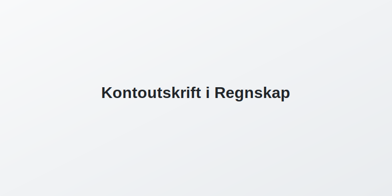

**Kontoutskrift** er en **dokumentasjon av alle transaksjoner** på en bankkonto i en gitt periode. Den viser dato, beskrivelse, beløp og saldo for hver post, og er et sentralt grunnlag for [bankavstemming](/blogs/regnskap/hva-er-bankavstemming "Hva er Bankavstemming i Regnskap? En komplett guide til bankavstemminger") og andre avstemmingsprosesser i regnskapet.

## Hva er Kontoutskrift?

En kontoutskrift gir en systematisk oversikt over alle bevegelser på en bankkonto, vanligvis per måned eller annen valgt periode. Hver transaksjon inneholder typisk følgende elementer:

* **Dato:** Transaksjonsdato
* **Tekst:** Beskrivelse av transaksjonen (for eksempel leverandørbetaling eller gebyr)
* **Beløp:** Debitert eller kreditert beløp
* **Saldo:** Kontoens løpende saldo etter hver postering
* **Transaksjonstype:** Type operasjon (innskudd, uttak, gebyr, rente, osv.)

### Typiske kolonner i en kontoutskrift

| Kolonne           | Beskrivelse                                            |
|-------------------|--------------------------------------------------------|
| Dato              | Transaksjonsdato                                       |
| Tekst             | Informasjon om transaksjonen                           |
| Beløp             | Beløpet som er kreditert eller debitert                |
| Saldo             | Løpende kontosaldo etter transaksjonen                 |
| Transaksjonstype  | Innskudd, uttak, gebyr, rente osv.                     |

## Bruk av Kontoutskrift i Regnskap

Kontoutskrift er et sentralt verktøy for flere regnskapsprosesser og internkontroll:

* **Bokføring:** Underlag for registrering av banktransaksjoner i regnskapssystemet
* **Avstemming:** Sikrer at kassabok eller reskontro stemmer med faktisk bankbeholdning
* **Revisjon:** Dokumentasjon for revisor ved årsavslutning og kontroller
* **Rapportering:** Grunnlag for kontantstrøm- og likviditetsanalyser
* **Internkontroll:** Del av kravene i [internkontrollforskriften](/blogs/regnskap/internkontrollforskriften "Hva er Internkontrollforskriften? Guide til internkontroll i regnskap")
* **Dataimport:** CSV-filer av kontoutskrift kan importeres for automatisering av bokføringen ([hva-er-csv-fil](/blogs/regnskap/hva-er-csv-fil "Hva er CSV-fil? Bruk i regnskap"))

| Bruksområde    | Beskrivelse                                                    |
|----------------|----------------------------------------------------------------|
| Bokføring      | Dokumenterer transaksjoner for korrekt regnskapsføring         |
| Avstemming     | Sammenligning med kassabok for å avdekke og forklare avvik     |
| Revisjon       | Bevis på autentiske banktransaksjoner og intern dokumentasjon  |
| Rapportering   | Underlag for kontantstrømoppstilling og likviditetsrapporter    |

## Typer Kontoutskrifter

Det finnes ulike formater og kanaler for kontoutskrift:

* **Papirkontoutskrift:** Tradisjonell månedlig utskrift fra banken
* **Elektronisk kontoutskrift:** PDF- eller CSV-filer tilgjengelig via nettbank
* **Daglig/ukentlig rapport:** Automatisk generert for løpende oppfølging
* **Leverandørkontoutskrift:** Oversikt fra leverandører ved avstemming av leverandørgjeld

## Oppsummering

Kontoutskrift er en **essensiell kilde** til informasjon om bankbevegelser og utgjør fundamentet for bokføring, avstemming og internkontroll i regnskap. Ved å forstå innholdet og strukturen i kontoutskriften kan bedrifter sikre nøyaktighet, oppdage feil og følge kravene til dokumentasjon.
