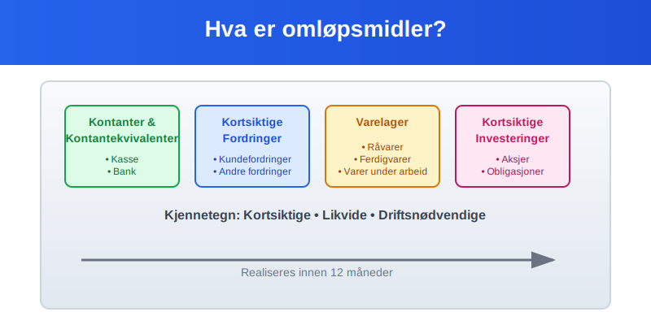
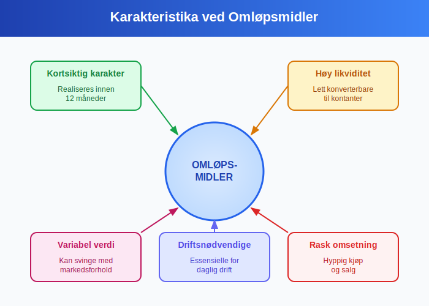
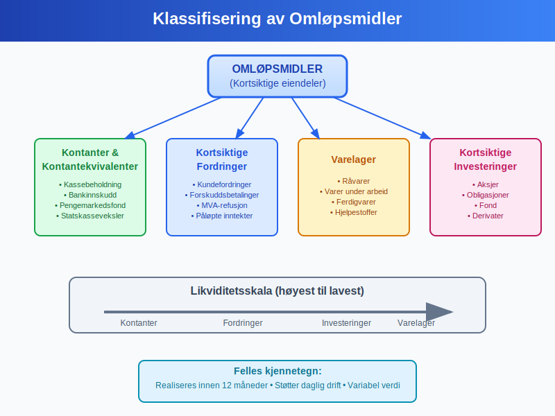
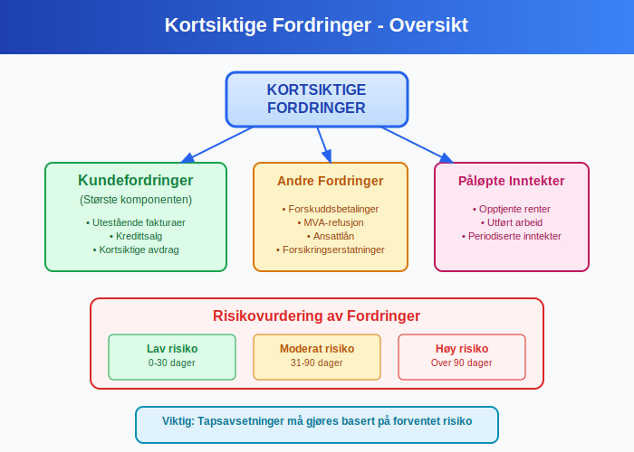
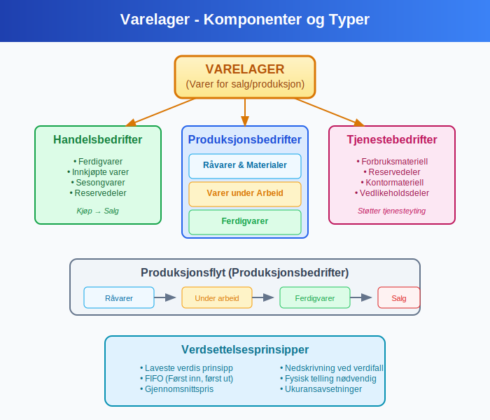
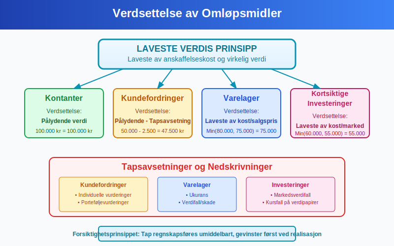
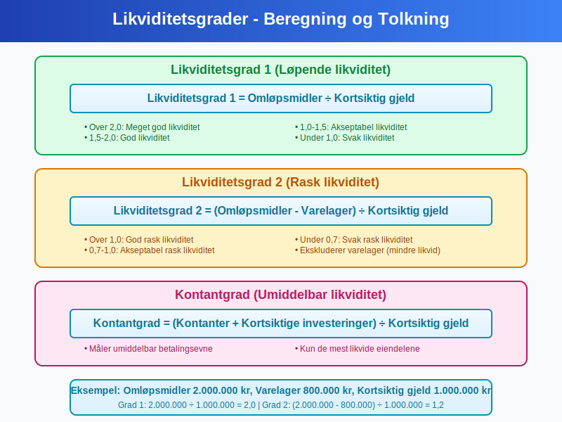
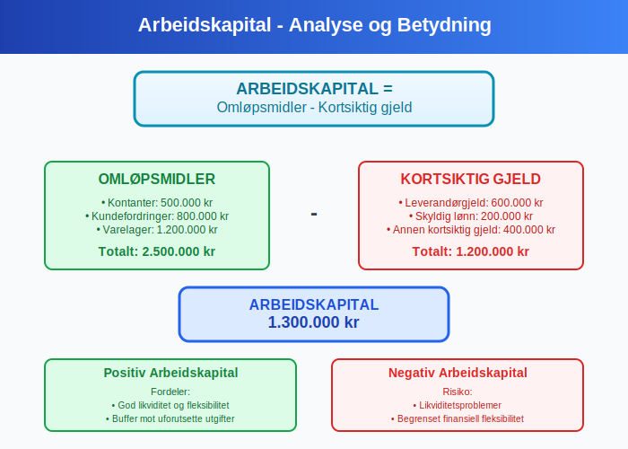
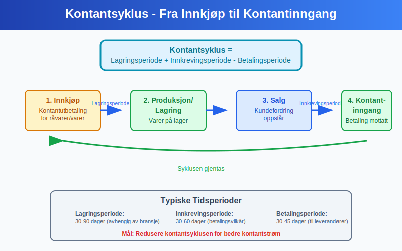

**Omløpsmidler** er **kortsiktige [eiendeler](/blogs/regnskap/hva-er-eiendel "Hva er Eiendel i Regnskap? Komplett Guide til Eiendom og Verdier")** som en bedrift forventer å konvertere til kontanter, selge eller forbruke innen ett år eller den normale driftssyklusen. Disse [eiendelene](/blogs/regnskap/hva-er-eiendel "Hva er Eiendel i Regnskap? Komplett Guide til Eiendom og Verdier") er avgjørende for bedriftens **likviditet** og daglige drift. Omløpsmidler skiller seg fra [anleggsmidler](/blogs/regnskap/hva-er-anleggsmidler "Hva er Anleggsmidler? Komplett Guide til Faste Eiendeler i Regnskap") ved at de er ment for kortsiktig bruk og rask konvertering til kontanter.

Omløpsmidler er en kategori av [driftsmidler](/blogs/regnskap/driftsmidler "Driftsmidler – Komplett guide til betydning, klassifisering og regnskapsbehandling").

## Seksjon 1: Definisjon og Karakteristika

### 1.1 Grunnleggende Definisjon

Omløpsmidler defineres som **eiendeler som**:

* **Holdes for salg** i den ordinære forretningsdriften
* **Holdes for produksjon** eller levering av varer og tjenester
* **Holdes for handel** eller kortsiktige investeringer
* **Forventes realisert innen ett år** eller den normale driftssyklusen
* **Inkluderer kontanter og kontantekvivalenter** – se [likvide midler](/blogs/regnskap/hva-er-likvide-midler "Hva er likvide midler? Definisjon, Eksempler og Regnskapsføring").

### 1.2 Kjennetegn ved Omløpsmidler

Omløpsmidler har flere distinkte egenskaper:

* **Kortsiktig karakter:** Realiseres innen 12 måneder
* **Høy likviditet:** Lett konverterbare til kontanter
* **Variabel verdi:** Kan svinge med markedsforhold
* **Driftsnødvendige:** Essensielle for daglig drift
* **Rask omsetning:** Hyppig kjøp og salg

## Seksjon 2: Klassifisering av Omløpsmidler

Omløpsmidler klassifiseres i fire hovedkategorier basert på deres likviditet og funksjon:

### 2.1 Kontanter og Kontantekvivalenter

**[Likvide midler](/blogs/regnskap/hva-er-likvide-midler "Hva er likvide midler? Definisjon, Eksempler og Regnskapsføring")** består av kontanter og kontantekvivalenter og er de mest likvide omløpsmidlene. De inkluderer [kassebeholdning](/blogs/regnskap/hva-er-kassebeholdning "Hva er Kassebeholdning? Guide til Kontanthåndtering i Regnskap") og [bankinnskudd](/blogs/regnskap/hva-er-bankinnskudd "Hva er Bankinnskudd? Typer, Renter og Regnskapsføring").

#### Kontanter

* **[Kassebeholdning](/blogs/regnskap/hva-er-kassebeholdning "Hva er Kassebeholdning? Guide til Kontanthåndtering i Regnskap"):** Fysiske kontanter i kassen
* **Småkasse:** Kontanter for mindre utgifter
* **Vekslepenger:** Kontanter for daglig drift

#### Bankinnskudd

* **Brukskonti:** Daglige driftskonti
* **Sparekonti:** Kortsiktige spareinnskudd
* **Termininnskudd:** Innskudd med kort bindingstid (under 1 år)

#### Kontantekvivalenter

* **Pengemarkedsfond:** Høylikvide investeringer
* **Statskasseveksler:** Kortsiktige statspapirer
* **Banksertifikater:** Kortsiktige bankinstrumenter

### 2.2 Kortsiktige Fordringer

**Kortsiktige fordringer** representerer penger som andre skylder bedriften og som forventes innbetalt innen ett år.

#### Kundefordringer

**[Kundefordringer](/blogs/regnskap/hva-er-kundefordring "Hva er Kundefordring? Guide til Håndtering av Utestående Fakturaer")** er den største komponenten av kortsiktige fordringer:

* **Utestående fakturaer:** Solgte varer/tjenester ikke betalt
* **Kredittsalg:** Salg på kreditt til kunder
* **Avdrag:** Kortsiktige avdrag på langsiktige salg

#### Andre Fordringer

* **Forskuddsbetalinger:** Betalinger til leverandører på forhånd
* **Mva-refusjon:** Utestående merverdiavgift fra staten
* **Ansattlån:** Kortsiktige lån til ansatte
* **Forsikringserstatninger:** Utestående erstatninger

#### Påløpte Inntekter

* **Opptjente renter:** Renter ikke mottatt ennå
* **Utført arbeid:** Arbeid utført men ikke fakturert
* **Periodiserte inntekter:** Inntekter som tilhører perioden

### 2.3 Varelager

**[Varelager](/blogs/regnskap/hva-er-lagerbeholdning "Hva er Lagerbeholdning? Guide til Lagerføring og Verdivurdering")** representerer varer som holdes for salg eller produksjon.

#### Handelsbedrifter

* **Ferdigvarer:** Varer klare for salg
* **Innkjøpte varer:** Varer kjøpt for videresalg gjennom [varekjøp](/blogs/regnskap/hva-er-varekjop "Hva er Varekjøp? Komplett Guide til Regnskapsføring og Innkjøpsstyring")
* **Sesongvarer:** Varer med sesongmessig salg

#### Produksjonsbedrifter

* **Råvarer:** Materialer for produksjon
* **Varer under arbeid:** Halvferdige produkter
* **Ferdigvarer:** Fullførte produkter klare for salg
* **Hjelpestoffer:** Materialer som støtter produksjonen

#### Tjenestebedrifter

* **Forbruksmateriell:** Materialer brukt i tjenesteyting
* **Reservedeler:** Deler for vedlikehold og reparasjon
* **Kontormateriell:** Papir, skrivesaker, etc.

### 2.4 Kortsiktige Investeringer

**Kortsiktige investeringer** er finansielle instrumenter som holdes for kortsiktig gevinst.

#### Verdipapirer

* **Aksjer:** Børsnoterte aksjer for kortsiktig handel
* **[Obligasjoner](/blogs/regnskap/hva-er-obligasjon "Hva er Obligasjon? Guide til Obligasjoner og Rentepapirer"):** Kortsiktige rentepapirer
* **Fond:** Aksjefond og rentefond

#### Derivater

* **Opsjoner:** Rettigheter til kjøp/salg
* **Terminer:** Avtaler om fremtidig levering
* **Valutakontrakter:** Sikring mot valutarisiko

## Seksjon 3: Verdsettelse og Regnskapsføring

### 3.1 Verdsettelsesprinsipper

Omløpsmidler verdsettes etter **laveste verdis prinsipp**:

| Omløpsmiddeltype | Verdsettelsesgrunnlag | Eksempel |
|:-----------------|:---------------------|:---------|
| Kontanter | Pålydende verdi | 100.000 kr = 100.000 kr |
| Kundefordringer | Pålydende minus tapsavsetning | 50.000 kr - 2.500 kr = 47.500 kr |
| Varelager | Laveste av kost og netto salgspris | Kost 80.000 kr, salg 75.000 kr = 75.000 kr |
| Kortsiktige investeringer | Laveste av kost og markedsverdi | Kost 60.000 kr, marked 55.000 kr = 55.000 kr |

### 3.2 Tapsavsetninger

**Tapsavsetninger** må gjøres for forventede tap:

#### Kundefordringer

* **Individuelle vurderinger:** Spesifikke kunder med betalingsproblemer
* **Porteføljevurderinger:** Statistiske tap basert på historikk
* **Aldersanalyse:** Økt tapsrisiko med økende alder

**Eksempel tapsavsetning:**

| Aldersgruppe | Beløp | Tapsprosent | Tapsavsetning |
|:-------------|:------|:------------|:--------------|
| 0-30 dager | 500.000 kr | 0,5% | 2.500 kr |
| 31-60 dager | 200.000 kr | 2% | 4.000 kr |
| 61-90 dager | 100.000 kr | 5% | 5.000 kr |
| Over 90 dager | 50.000 kr | 20% | 10.000 kr |
| **Totalt** | **850.000 kr** | **2,5%** | **21.500 kr** |

#### Varelager

* **Ukurans:** Varer som ikke kan selges
* **Verdifall:** Markedspris under kostpris
* **Skade:** Fysisk skadede varer

### 3.3 Periodisering

**Periodisering** sikrer at omløpsmidler føres i riktig periode:

* **Påløpte inntekter:** Inntekter opptjent men ikke mottatt
* **Forskuddsbetalte kostnader:** Kostnader betalt på forhånd
* **Periodeavgrensninger:** Korrekt fordeling mellom perioder

## Seksjon 4: Likviditetsanalyse

### 4.1 Likviditetsgrader

**Likviditetsgrader** måler bedriftens evne til å dekke kortsiktige forpliktelser:

#### Likviditetsgrad 1 (Løpende likviditet)

**Likviditetsgrad 1 = Omløpsmidler ÷ [Kortsiktig gjeld](/blogs/regnskap/kortsiktig-gjeld "Kortsiktig Gjeld: Definisjon, Typer og Regnskapsføring")**

* **Over 2,0:** Meget god likviditet
* **1,5-2,0:** God likviditet  
* **1,0-1,5:** Akseptabel likviditet
* **Under 1,0:** Svak likviditet

#### Likviditetsgrad 2 (Rask likviditet)

**Likviditetsgrad 2 = (Omløpsmidler - Varelager) ÷ [Kortsiktig gjeld](/blogs/regnskap/kortsiktig-gjeld "Kortsiktig Gjeld: Definisjon, Typer og Regnskapsføring")**

* **Over 1,0:** God rask likviditet
* **0,7-1,0:** Akseptabel rask likviditet
* **Under 0,7:** Svak rask likviditet

#### Kontantgrad

**Kontantgrad = (Kontanter + Kortsiktige investeringer) ÷ [Kortsiktig gjeld](/blogs/regnskap/kortsiktig-gjeld "Kortsiktig Gjeld: Definisjon, Typer og Regnskapsføring")**

### 4.2 Arbeidskapital

**[Arbeidskapital](/blogs/regnskap/hva-er-arbeidskapital "Hva er Arbeidskapital? Beregning og Betydning for Bedriftens Likviditet")** er forskjellen mellom omløpsmidler og kortsiktig gjeld:

**Arbeidskapital = Omløpsmidler - [Kortsiktig gjeld](/blogs/regnskap/kortsiktig-gjeld "Kortsiktig Gjeld: Definisjon, Typer og Regnskapsføring")**

#### Positiv Arbeidskapital

* **Fordeler:** God likviditet, fleksibilitet
* **Ulemper:** Kapital bundet opp, lavere avkastning

#### Negativ Arbeidskapital

* **Fordeler:** Effektiv kapitalbruk
* **Ulemper:** Likviditetsrisiko, begrenset fleksibilitet

### 4.3 Omløpshastighet

**Omløpshastighet** måler hvor raskt omløpsmidler konverteres til kontanter:

#### Kundefordringer

**Omløpshastighet kundefordringer = Kreditsalg ÷ Gjennomsnittlige kundefordringer**

**Innkrevingsperiode = 365 dager ÷ Omløpshastighet**

#### Varelager

**Lageromløpshastighet = [Kostpris](/blogs/regnskap/hva-er-kostpris "Hva er Kostpris? Beregning og Betydning i Regnskap") solgte varer ÷ Gjennomsnittlig varelager**

**Lagringsperiode = 365 dager ÷ Lageromløpshastighet**

## Seksjon 5: Kontantstrømstyring

### 5.1 Kontantsyklus

**Kontantsyklusen** viser tiden fra kontantutbetaling til kontantinnbetaling:

**Kontantsyklus = Lagringsperiode + Innkrevingsperiode - Betalingsperiode**

### 5.2 Optimalisering av Omløpsmidler

#### Kontantbeholdning

* **Minimumsbeholdning:** Dekke daglige behov
* **Maksimumsbeholdning:** Unngå overflødig likviditet
* **Kontantbudsjett:** Planlegge kontantbehov

#### Kundefordringer

* **Kredittvilkår:** Balansere salg og risiko
* **Kredittvurdering:** Vurdere kunders betalingsevne
* **Inkasso:** Effektiv oppfølging av forfalte fordringer

#### Varelager

* **Just-in-time:** Redusere lagerbinding
* **ABC-analyse:** Prioritere viktige varer
* **Sikkerhetslagre:** Balansere service og kostnader

## Seksjon 6: Praktiske Eksempler

### 6.1 Handelsbedrift Eksempel

**Norskebutikker AS** har følgende omløpsmidler:

| Omløpsmiddeltype | Beløp (NOK) | Andel |
|:-----------------|:------------|:------|
| Kontanter og bank | 150.000 | 10% |
| Kundefordringer | 300.000 | 20% |
| Varelager | 900.000 | 60% |
| Forskuddsbetalinger | 150.000 | 10% |
| **Totalt** | **1.500.000** | **100%** |

**Analyse:**
* **Høy lagerandel:** Typisk for handelsbedrift
* **Moderate kundefordringer:** Mye kontantsalg
* **Lav kontantbeholdning:** Effektiv kontantstyring

### 6.2 Tjenestebedrift Eksempel

**Konsulentpartner AS** har følgende omløpsmidler:

| Omløpsmiddeltype | Beløp (NOK) | Andel |
|:-----------------|:------------|:------|
| Kontanter og bank | 200.000 | 25% |
| Kundefordringer | 500.000 | 62,5% |
| Påløpte inntekter | 80.000 | 10% |
| Forskuddsbetalinger | 20.000 | 2,5% |
| **Totalt** | **800.000** | **100%** |

**Analyse:**
* **Høye kundefordringer:** Typisk for tjenestebedrift
* **Ingen varelager:** Tjenester har ikke fysiske varer
* **Påløpte inntekter:** Arbeid utført men ikke fakturert

### 6.3 Produksjonsbedrift Eksempel

**Møbelproduksjon AS** har følgende omløpsmidler:

| Omløpsmiddeltype | Beløp (NOK) | Andel |
|:-----------------|:------------|:------|
| Kontanter og bank | 100.000 | 5% |
| Kundefordringer | 400.000 | 20% |
| Råvarer | 600.000 | 30% |
| Varer under arbeid | 300.000 | 15% |
| Ferdigvarer | 500.000 | 25% |
| Andre fordringer | 100.000 | 5% |
| **Totalt** | **2.000.000** | **100%** |

**Analyse:**
* **Komplekst varelager:** Tre kategorier varer
* **Høy lagerbinding:** 70% av omløpsmidler
* **Produksjonssyklus:** Lang tid fra råvare til salg

## Seksjon 7: Regnskapsføring og Dokumentasjon

### 7.1 Bilagsføring

**Dokumentasjon** av omløpsmidler krever systematisk [bilagsføring](/blogs/regnskap/hva-er-bilagsforing "Hva er Bilagsføring? Guide til Systematisk Regnskapsføring"):

#### Kontanter

* **Kasseoppgjør:** Daglig telling og avstemming
* **Bankutskrifter:** Månedlig [bankavstemming](/blogs/regnskap/hva-er-bankavstemming "Hva er Bankavstemming? Guide til Kontroll av Banktransaksjoner")
* **Kvitteringer:** Alle kontanttransaksjoner

#### Kundefordringer

* **[Fakturaer](/blogs/regnskap/hva-er-en-faktura "Hva er en Faktura? En Guide til Norske Fakturakrav"):** Grunnlag for fordringer
* **Betalingsbekreftelser:** Dokumentasjon av innbetalinger
* **Kreditnotaer:** Reduksjon av fordringer

#### Varelager

* **Innkjøpsfakturaer:** Dokumentasjon av anskaffelser
* **Lagerrapporter:** Fysisk telling og verdsettelse
* **Produksjonsrapporter:** Kostnader i produksjon

### 7.2 Periodeavgrensninger

**Korrekt periodisering** sikrer at omløpsmidler føres i riktig periode:

* **Forskuddsbetalte kostnader:** Kostnader som gjelder fremtidige perioder
* **Påløpte inntekter:** Inntekter opptjent men ikke mottatt
* **Periodeavgrensninger:** Fordeling mellom regnskapsperioder

### 7.3 Internkontroll

**[Internkontroll](/blogs/regnskap/hva-er-internkontroll "Hva er Internkontroll? Guide til Risikostyring og Kontrollsystemer")** av omløpsmidler omfatter:

#### Kontanter

* **Funksjonsadskillelse:** Separate personer for håndtering og registrering
* **Daglige oppgjør:** Kontroll av kassebeholdning
* **Bankavstemming:** Månedlig avstemming av bankkonti

#### Kundefordringer

* **Kredittkontroll:** Vurdering før kredittgivning
* **Aldersanalyse:** Oppfølging av forfalte fordringer
* **Tapsavsetninger:** Regelmessig vurdering av tap

#### Varelager

* **Fysisk telling:** Regelmessig kontroll av beholdning
* **Tilgangskontroll:** Begrenset adgang til lager
* **Verdivurdering:** Korrekt prissetting av varer

## Seksjon 8: Skattemessige Forhold

### 8.1 Skattemessig Behandling

**Skattemessig verdsettelse** av omløpsmidler følger spesielle regler:

#### Varelager

* **FIFO-prinsippet:** Først inn, først ut
* **Gjennomsnittspris:** Vektet gjennomsnitt
* **Laveste verdis prinsipp:** Kost eller markedsverdi

#### Kundefordringer

* **Realisasjonsprinsippet:** Tap fradragsføres når det er konstatert
* **Tapsavsetninger:** Ikke fradragsberettiget før tap er realisert

### 8.2 Merverdiavgift

**[Moms/MVA](/blogs/regnskap/hva-er-moms-mva "Hva er Moms/MVA? Komplett Guide til Merverdiavgift i Norge")** påvirker omløpsmidler:

* **Inngående MVA:** Kan trekkes fra på kjøp
* **Utgående MVA:** Påløper ved salg
* **MVA-oppgjør:** Påvirker kontantstrøm

## Konklusjon

**Omløpsmidler** er fundamentale for enhver bedrifts **likviditet** og **daglige drift**. Effektiv styring av omløpsmidler krever:

* **Systematisk klassifisering** av alle kortsiktige eiendeler
* **Korrekt verdsettelse** etter regnskapsprinsipper
* **Løpende likviditetsanalyse** for å sikre betalingsevne
* **Optimalisering** av kontantsyklus og arbeidskapital
* **God internkontroll** for å minimere risiko

Ved å forstå og aktivt styre omløpsmidlene kan bedrifter sikre **stabil likviditet**, redusere **finansieringskostnader** og forbedre den **totale lønnsomheten**. Dette krever kontinuerlig oppmerksomhet og systematisk tilnærming til alle komponenter av omløpsmidlene.

For mer informasjon om relaterte emner, se våre artikler om [anleggsmidler](/blogs/regnskap/hva-er-anleggsmidler "Hva er Anleggsmidler? Komplett Guide til Faste Eiendeler i Regnskap"), [arbeidskapital](/blogs/regnskap/hva-er-arbeidskapital "Hva er Arbeidskapital? Beregning og Betydning for Bedriftens Likviditet") og [likviditetsstyring](/blogs/regnskap/hva-er-likviditetsstyring "Hva er Likviditetsstyring? Guide til Kontantstrømstyring").
