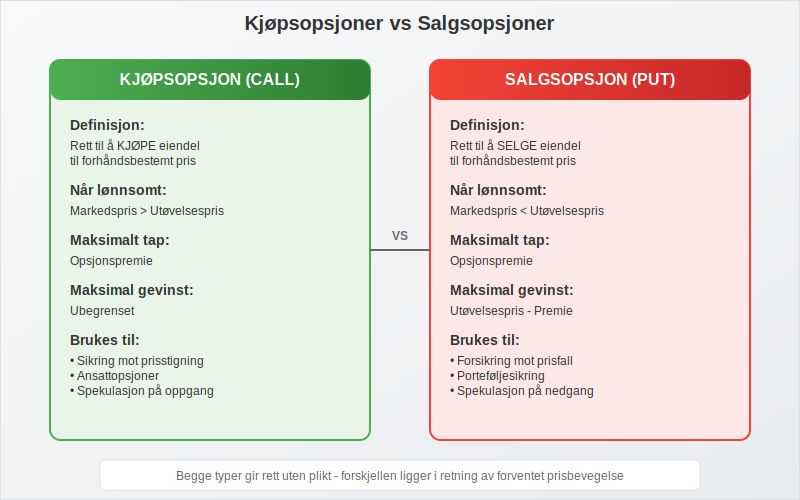
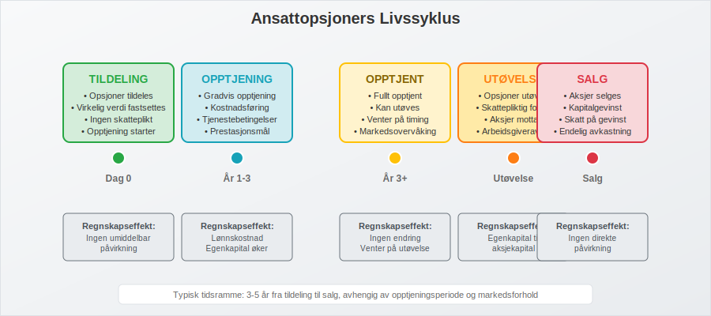
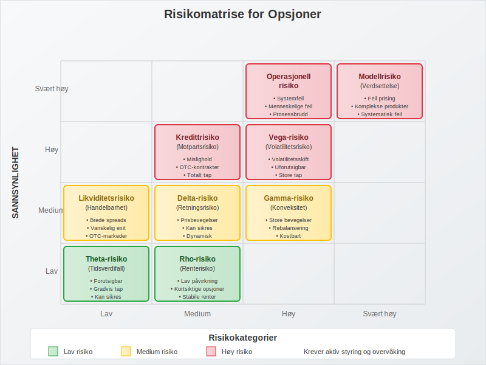
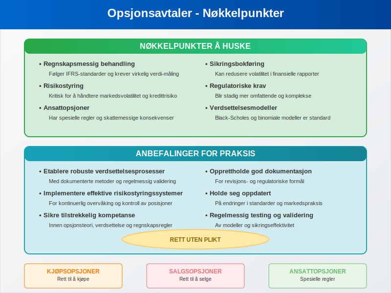

En **opsjonsavtale** er en juridisk bindende kontrakt som gir innehaveren rett, men ikke plikt, til å kjøpe eller selge en eiendel til en forhåndsbestemt pris innenfor en spesifisert tidsperiode. I regnskapssammenheng spiller opsjonsavtaler en viktig rolle for både verdsettelse, risikostyring og finansiell rapportering.

Opsjonsavtaler er en type **derivater**. Les mer om derivater i vår [guide til derivater](/blogs/regnskap/derivater "Hva er Derivater? En Guide til Derivater i Regnskap").

## Definisjon og Grunnleggende Konsepter

En **opsjonsavtale** består av flere nøkkelelementer som definerer kontraktens vilkår og betingelser:

* **Underliggende eiendel** - det som kan kjøpes eller selges
* **Utøvelsespris** (strike price) - den forhåndsbestemte prisen
* **Utløpsdato** - når opsjonen utløper
* **Opsjonspremie** - kostnaden for å kjøpe opsjonen
* **Utøvelsestype** - når opsjonen kan utøves

### Typer Opsjoner

Det finnes to hovedtyper opsjoner som har ulike regnskapsmessige implikasjoner:

#### Kjøpsopsjoner (Call-opsjon)
En **kjøpsopsjon** gir innehaveren rett til å kjøpe den underliggende eiendelen:

* Innehaveren tjener når markedsprisen overstiger utøvelsesprisen
* Maksimalt tap er begrenset til opsjonspremien
* Ofte brukt for å sikre seg mot prisstigning

* Vanlig i [aksjeselskap](/blogs/regnskap/hva-er-et-aksjeselskap "Hva er et Aksjeselskap (AS)? Komplett Guide til Selskapsformen") for ansattopsjoner

Les mer om call-opsjoner i vår [guide til Call-opsjon](/blogs/regnskap/call-opsjon "Hva er en Call-opsjon? Guide til kjøpsopsjoner").

#### Salgsopsjoner (Put Options)
En **salgsopsjon** gir innehaveren rett til å selge den underliggende eiendelen:

* Innehaveren tjener når markedsprisen faller under utøvelsesprisen
* Brukes som forsikring mot prisfall
* Viktig for risikostyring i [investeringsselskap](/blogs/regnskap/hva-er-investeringsselskap "Hva er et Investeringsselskap? Komplett Guide til Investeringsselskaper")
* Kan påvirke [egenkapital](/blogs/regnskap/hva-er-egenkapital "Hva er Egenkapital? Komplett Guide til Egenkapital i Regnskap") ved utøvelse

## Regnskapsmessig Behandling

### Innregning og Måling

Opsjonsavtaler må behandles i henhold til **IFRS 9** for finansielle instrumenter og **IAS 32** for presentasjon:

#### Første gangs innregning
* **Virkelig verdi** på kontraktsdato
* Inkluderer transaksjonskostnader for ikke-handelsformål
* Klassifiseres som eiendel eller forpliktelse
* Påvirker [balanse](/blogs/regnskap/hva-er-balanse "Hva er Balanse? Komplett Guide til Balanseregnskap") direkte

#### Etterfølgende måling
* **Virkelig verdi** gjennom resultatregnskap eller
* **Virkelig verdi** gjennom totalresultat (OCI)
* Avhenger av forretningsmodell og kontraktens karakteristikk
* Påvirker [driftsresultat](/blogs/regnskap/hva-er-driftsresultat "Hva er Driftsresultat? Komplett Guide til Driftsresultat i Regnskap")

### Sikringsbokføring

Når opsjoner brukes til **sikringsformål**, kan spesielle regler anvendes:

* **Virkelig verdi-sikring** - sikrer mot endringer i virkelig verdi
* **Kontantstrømsikring** - sikrer mot variabilitet i fremtidige kontantstrømmer
* **Nettoinvestering-sikring** - sikrer utenlandske investeringer
* Krever dokumentasjon av sikringsforhold og effektivitetstesting

## Verdsettelse av Opsjoner

### Black-Scholes Modellen

Den mest brukte modellen for opsjonsprising inkluderer følgende faktorer:

| Faktor | Symbol | Påvirkning på Verdi |
|--------|--------|-------------------|
| **Aksjepris** | S | Positiv for kjøpsopsjoner |
| **Utøvelsespris** | K | Negativ for kjøpsopsjoner |
| **Tid til utløp** | T | Generelt positiv |
| **Risikofri rente** | r | Positiv for kjøpsopsjoner |
| **Volatilitet** | σ | Positiv for alle opsjoner |
| **Utbytte** | q | Negativ for kjøpsopsjoner |

### Binomial Modell

En alternativ tilnærming som er særlig nyttig for:

* **Amerikanske opsjoner** som kan utøves når som helst
* **Eksotiske opsjoner** med spesielle funksjoner
* **Ansattopsjoner** med opptjeningsperioder
* Situasjoner med **diskrete utbyttebetalinger**

## Ansattopsjoner

### Regnskapsmessig Behandling

Ansattopsjoner krever spesiell behandling under **IFRS 2**:

#### Måling og Innregning
* **Virkelig verdi** på tildelingsdato
* Kostnadsføres over **opptjeningsperioden**
* Påvirker [lønnskostnad](/blogs/regnskap/lonnskostnad "Hva er Lønnskostnad? Komplett Guide til Lønnskostnader i Regnskap")
* Motpost i egenkapital

#### Opptjeningsvilkår
* **Tjenestebetingelser** - ansettelsesperiode
* **Prestasjonsbetingelser** - spesifikke mål
* **Markedsbetingelser** - aksjekursutvikling
* Påvirker antall opsjoner som forventes opptjent

### Skattemessige Konsekvenser

Ansattopsjoner har komplekse skattemessige implikasjoner:

* **Tildeling** - normalt ingen skatteplikt
* **Utøvelse** - skattepliktig fordel for ansatt
* **Salg** - kapitalgevinst eller -tap
* **Arbeidsgiveravgift** for [foretak](/blogs/regnskap/hva-er-foretak "Hva er et Foretak? Komplett Guide til Foretaksformer i Norge")

## Opsjoner i Ulike Bransjer

### Finanssektoren

Banker og finansinstitusjoner bruker opsjoner til:

* **Renterisiko-styring** - sikring mot renteendringer
* **Valutarisiko** - sikring av utenlandske posisjoner
* **Kredittrisiko** - beskyttelse mot mislighold
* **Handelsformål** - generere [inntekter](/blogs/regnskap/hva-er-inntekter "Hva er Inntekter? Komplett Guide til Inntekter i Regnskap")

### Råvarebransjen

Selskaper i råvarebransjen benytter opsjoner for:

* **Prissikring** - stabilisere inntekter og kostnader
* **Lagerstyring** - optimalisere beholdninger
* **Produksjonsplanlegging** - sikre råvaretilgang
* **Risikostyring** - redusere volatilitet i [kontantstrøm](/blogs/regnskap/hva-er-kontantstrom "Hva er Kontantstrøm? Komplett Guide til Kontantstrømanalyse")

### Teknologisektoren

Tech-selskaper bruker opsjoner primært til:

* **Ansattincentiver** - tiltrekke og beholde talent
* **Oppstartsfinansiering** - konvertible instrumenter
* **Strategiske partnerskap** - fleksible avtalestrukturer
* **Vekstfinansiering** - alternativ til tradisjonell [finansiering](/blogs/regnskap/hva-er-finansiering "Hva er Finansiering? Komplett Guide til Finansieringsformer")

## Risikofaktorer og Styring

### Markedsrisiko

Opsjoner er eksponert for flere typer markedsrisiko:

#### Delta-risiko
* **Sensitivitet** for endringer i underliggende pris
* **Sikring** gjennom delta-nøytrale strategier
* **Overvåking** av porteføljeeksponering
* Påvirker [avkastning](/blogs/regnskap/hva-er-avkastning "Hva er Avkastning? Komplett Guide til Avkastning og Rentabilitet") direkte

#### Gamma-risiko
* **Endringer i delta** når underliggende pris beveger seg
* **Konveksitetsrisiko** for store prisbevegelser
* **Rebalansering** av sikringsposisjoner
* Viktig for [risikostyring](/blogs/regnskap/hva-er-internkontroll "Hva er Internkontroll? Komplett Guide til Internkontroll i Bedrifter")

#### Vega-risiko
* **Sensitivitet** for endringer i volatilitet
* **Volatilitetsskift** kan påvirke verdier betydelig
* **Diversifisering** på tvers av volatilitetsregimer
* Krever sofistikerte målemodeller

### Kredittrisiko

For OTC-opsjoner (over-the-counter) oppstår kredittrisiko:

* **Motpartsrisiko** - risiko for at motpart ikke oppfyller forpliktelser
* **Sikkerhetsstillelse** - krav om margin eller pant
* **Netting-avtaler** - redusere eksponering
* **Kredittvurdering** av motparter

## Regulatoriske Krav

### IFRS-krav

Internasjonale regnskapsstandarder krever:

#### Noteopplysninger
* **Virkelig verdi-hierarki** - klassifisering av verdsettelsesmetoder
* **Sensitivitetsanalyse** - påvirkning av nøkkelforutsetninger
* **Sikringsbokføring** - dokumentasjon av sikringsforhold
* **Kredittrisiko** - eksponering og styring

#### Presentasjon
* **Balanse** - klassifisering som eiendel eller gjeld
* **Resultatregnskap** - gevinster og tap
* **Totalresultat** - sikringsineffektivitet
* **Kontantstrømoppstilling** - klassifisering av kontantstrømmer

### Norske Særregler

I Norge gjelder spesielle regler for:

* **Regnskapsloven** - forenklede regler for små [foretak](/blogs/regnskap/hva-er-foretak "Hva er et Foretak? Komplett Guide til Foretaksformer i Norge")
* **Skatteloven** - skattemessig behandling
* **Verdipapirhandelloven** - børsnoterte selskaper
* **Finanstilsynet** - tilsynskrav for finansinstitusjoner

## Praktiske Eksempler

### Eksempel 1: Ansattopsjoner

Et [aksjeselskap](/blogs/regnskap/hva-er-et-aksjeselskap "Hva er et Aksjeselskap (AS)? Komplett Guide til Selskapsformen") tildeler ansattopsjoner:

* **Tildeling**: 1000 opsjoner til kr 100 per aksje
* **Opptjeningstid**: 3 år
* **Virkelig verdi**: kr 25 per opsjon ved tildeling
* **Regnskapsføring**: kr 8 333 per år i lønnskostnad (25 000 / 3)

### Eksempel 2: Sikringsopsjon

Et eksportselskap sikrer valutarisiko:

* **Eksponering**: USD 1 million om 6 måneder
* **Sikring**: Kjøp av USD put-opsjoner
* **Utøvelsespris**: NOK/USD 8,50
* **Premie**: NOK 50 000
* **Regnskapsføring**: Kontantstrømsikring

### Eksempel 3: Handelsopsjoner

En bank handler opsjoner for [fortjeneste](/blogs/regnskap/hva-er-fortjeneste "Hva er Fortjeneste? Komplett Guide til Fortjeneste og Lønnsomhet"):

* **Posisjon**: Selger call-opsjoner på aksjeindeks
* **Premie mottatt**: NOK 100 000
* **Risiko**: Ubegrenset oppside
* **Regnskapsføring**: Virkelig verdi gjennom resultat

## Fremtidige Utviklingstrender

### Teknologisk Utvikling

Nye teknologier påvirker opsjonsmarkedet:

* **Algoritmisk handel** - automatiserte strategier
* **Kunstig intelligens** - forbedret prising og risikostyring
* **Blockchain** - desentraliserte opsjonsplattformer
* **Sanntidsrapportering** - økt transparens

### Regulatoriske Endringer

Kommende regulatoriske endringer inkluderer:

* **ESG-rapportering** - bærekraftskrav
* **Digitale eiendeler** - kryptovaluta-opsjoner
* **Klimarisiko** - nye sikringsinstrumenter
* **Cybersikkerhet** - økte krav til datasikkerhet

### Markedsutvikling

Opsjonsmarkedet utvikler seg mot:

* **Økt kompleksitet** - mer sofistikerte produkter
* **Demokratisering** - tilgang for mindre investorer
* **Globalisering** - grenseoverskridende handel
* **Standardisering** - felles markedspraksis

## Konklusjon

**Opsjonsavtaler** representerer et komplekst, men viktig område innen moderne regnskap og finans. For [foretak](/blogs/regnskap/hva-er-foretak "Hva er et Foretak? Komplett Guide til Foretaksformer i Norge") som benytter opsjoner, er det essensielt å forstå både de regnskapsmessige kravene og de underliggende økonomiske prinsippene.

### Nøkkelpunkter å Huske

* **Regnskapsmessig behandling** følger IFRS-standarder og krever virkelig verdi-måling
* **Risikostyring** er kritisk for å håndtere markedsvolatilitet og kredittrisiko
* **Ansattopsjoner** har spesielle regler og skattemessige konsekvenser
* **Sikringsbokføring** kan redusere volatilitet i finansielle rapporter
* **Regulatoriske krav** blir stadig mer omfattende og komplekse

### Anbefalinger for Praksis

For å sikre korrekt håndtering av opsjonsavtaler bør [foretak](/blogs/regnskap/hva-er-foretak "Hva er et Foretak? Komplett Guide til Foretaksformer i Norge"):

* **Etablere robuste verdsettelsesprosesser** med dokumenterte metoder
* **Implementere effektive risikostyringssystemer** for overvåking og kontroll
* **Sikre tilstrekkelig kompetanse** innen opsjonsteori og regnskapsregler
* **Opprettholde god dokumentasjon** for revisjons- og regulatoriske formål
* **Holde seg oppdatert** på endringer i standarder og markedspraksis

Ved å følge disse prinsippene kan organisasjoner dra nytte av opsjoners fleksibilitet og risikostyringsegenskaper, samtidig som de oppfyller alle regnskapsmessige og regulatoriske krav.

