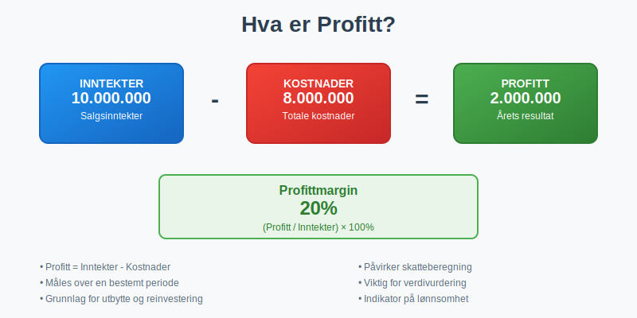
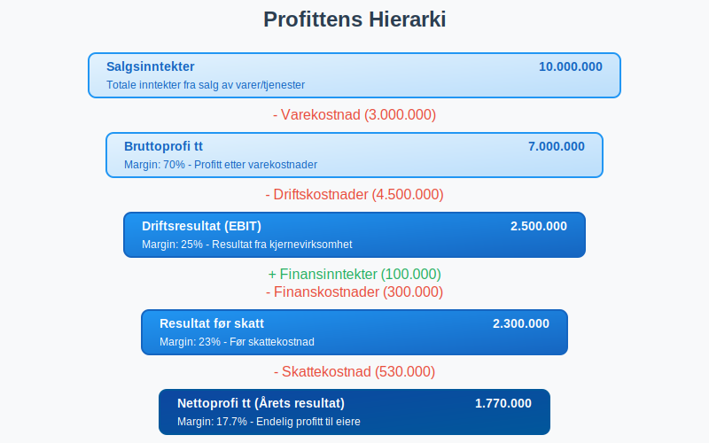
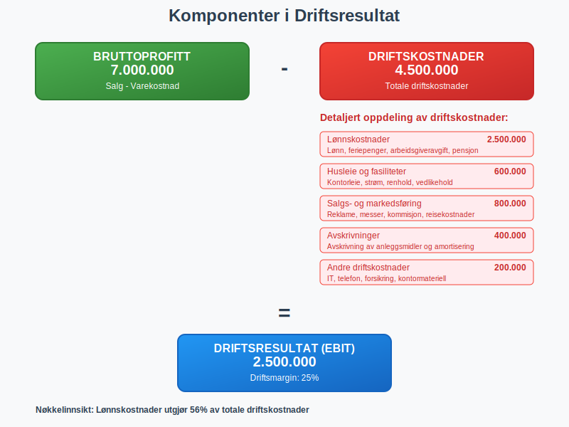
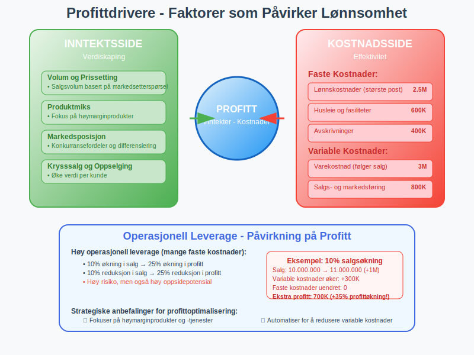
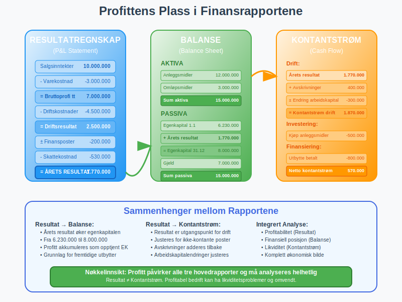
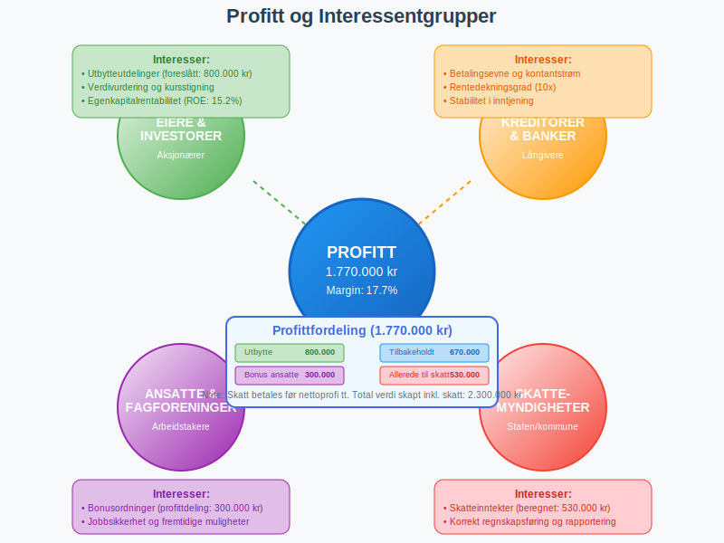
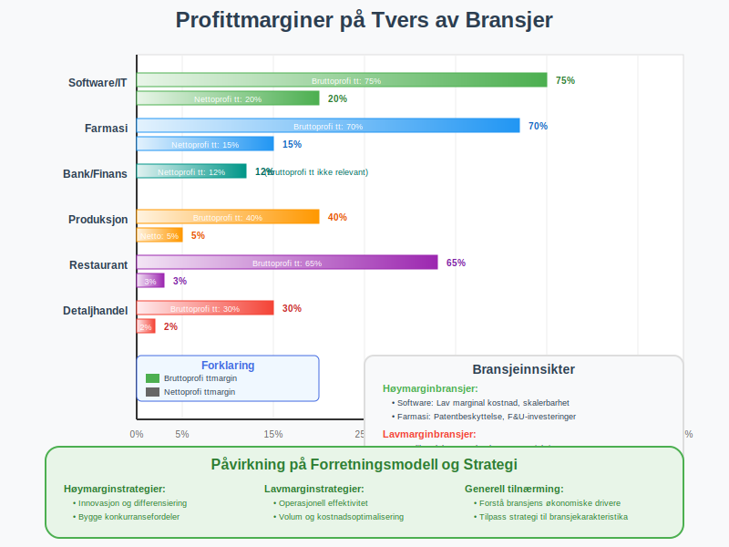

**Profitt** er kanskje det mest grunnleggende målet for enhver forretningsvirksomhet - det representerer bedriftens evne til å generere overskudd ved å levere varer eller tjenester som markedet verdsetter høyere enn kostnadene ved å produsere dem. I regnskapssammenheng er profitt ikke bare et enkelt tall, men et komplekst konsept som påvirker alt fra [beskatning](/blogs/regnskap/hva-er-skatt "Hva er Skatt? Komplett Guide til Skatteregler og Skattetyper") til [utbytteutdelinger](/blogs/regnskap/hva-er-utbytte "Hva er Utbytte? Regnskapsføring og Skattemessige Konsekvenser") og [egenkapitalendringer](/blogs/regnskap/hva-er-egenkapital "Hva er Egenkapital? Komplett Guide til Egenkapital i Regnskap").

Profitt omtales noen ganger også som **bunnlinje**. Les mer i artikkelen om [Bunnlinje](/blogs/regnskap/bunnlinje "Bunnlinje i Norsk Regnskap: Definisjon, Beregning og Eksempler").

## Seksjon 1: Profittens Grunnleggende Definisjon

**Profitt** er i sin enkleste form differansen mellom **inntekter** og **kostnader** over en bestemt periode. Denne tilsynelatende enkle formelen skjuler imidlertid mange nyanser og kompleksiteter som er avgjørende for korrekt forståelse og beregning.

### 1.1 Grunnleggende Profittformel

**Profitt = Inntekter - Kostnader**

Men i praksis må vi skille mellom ulike typer profitt og forstå hvordan de beregnes:

* **Bruttoprofi tt** = Salg - [Varekostnad](/blogs/regnskap/hva-er-varekostnad "Hva er Varekostnad? Beregning og Regnskapsføring")
* **Driftsresultat** = Bruttoprofi tt - Driftskostnader
* **Resultat før skatt** = Driftsresultat + Finansinntekter - Finanskostnader
* **Årets resultat** = Resultat før skatt - [Skattekostnad](/blogs/regnskap/hva-er-skattekostnad "Hva er Skattekostnad? Beregning og Regnskapsføring")

### 1.2 Profitt vs. Kontantstrøm

Det er viktig å forstå forskjellen mellom **profitt** og **[kontantstrøm](/blogs/regnskap/hva-er-kontantstrom "Hva er Kontantstrøm? Komplett Guide til Cash Flow Analyse og Styring")**. Profitt beregnes basert på [periodiseringsprinsippet](/blogs/regnskap/hva-er-periodisering "Hva er Periodisering i Regnskap? Komplett Guide til Periodiseringsprinsippet"), mens kontantstrøm viser faktiske inn- og utbetalinger.

En bedrift kan ha positiv profitt, men negativ kontantstrøm på grunn av:

* Store [kundefordringer](/blogs/regnskap/hva-er-debitor "Hva er Debitor i Regnskap? Komplett Guide til Kundefordringer og Debitorhåndtering")
* Investeringer i [varelager](/blogs/regnskap/hva-er-varelager "Hva er Varelager? Verdsettelse, Metoder og Regnskapsføring")
* [Avskrivninger](/blogs/regnskap/hva-er-avskrivning "Hva er Avskrivning? Komplett Guide til Avskrivningsmetoder") som reduserer profitt uten å påvirke kontanter

## Seksjon 2: Ulike Typer Profitt

### 2.1 Bruttoprofi tt

**Bruttoprofi tt** viser hvor mye virksomheten tjener på sine kjerneaktiviteter før driftskostnader:

Bruttoprofi tt = Salgsinntekter - [Varekostnad](/blogs/regnskap/hva-er-varekostnad "Hva er Varekostnad? Beregning og Regnskapsføring")

**Bruttoprofi ttmargin** = (Bruttoprofi tt / Salgsinntekter) × 100%

| Eksempel Bedrift | Salgsinntekter | Varekostnad | Bruttoprofi tt | Bruttoprofi ttmargin |
|------------------|----------------|-------------|---------------|-------------------|
| Teknologiselskap | 10.000.000    | 3.000.000   | 7.000.000     | 70%               |
| Handelsvirksomhet| 5.000.000     | 3.500.000   | 1.500.000     | 30%               |
| Tjenestebedrift  | 8.000.000     | 1.600.000   | 6.400.000     | 80%               |

### 2.2 Driftsresultat (EBIT)

**Driftsresultat** eller **EBIT** (Earnings Before Interest and Taxes) viser profitt fra kjerneaktiviteter:

Driftsresultat = Bruttoprofi tt - Driftskostnader

Driftskostnader inkluderer:
* [Lønnskostnader](/blogs/regnskap/hva-er-lonnskostnader "Hva er Lønnskostnader? Komplett Guide til Lønnskostnader i Regnskap")
* Husleie og kontorkostnader
* [Avskrivninger](/blogs/regnskap/hva-er-avskrivning "Hva er Avskrivning? Komplett Guide til Avskrivningsmetoder")
* Salgs- og markedsføringskostnader
* Administrative kostnader

### 2.3 Resultat før Skatt

Resultat før skatt inkluderer finansielle poster:

Resultat før skatt = Driftsresultat + Finansinntekter - Finanskostnader

**Finansinntekter:**
* Renteinntekter
* Utbytte fra investeringer
* [Valutagevinster](/blogs/regnskap/hva-er-valutagevinst "Hva er Valutagevinst? Regnskapsføring og Skattemessige Konsekvenser")

**Finanskostnader:**
* Rentekostnader på lån
* Bankkostnader
* [Valutatap](/blogs/regnskap/hva-er-valutatap "Hva er Valutatap? Regnskapsføring og Skattemessige Konsekvenser")

### 2.4 Nettoprofi tt (Årets Resultat)

**Nettoprofi tt** er bunnlinjen i [resultatregnskapet](/blogs/regnskap/hva-er-resultatregnskap "Hva er Resultatregnskap? Oppbygning og Analyse"):

Nettoprofi tt = Resultat før skatt - [Skattekostnad](/blogs/regnskap/hva-er-skattekostnad "Hva er Skattekostnad? Beregning og Regnskapsføring")

Dette er det endelige overskuddet som tilhører [eierne](/blogs/regnskap/hva-er-egenkapital "Hva er Egenkapital? Komplett Guide til Egenkapital i Regnskap") og som kan:
* Utbetales som [utbytte](/blogs/regnskap/hva-er-utbytte "Hva er Utbytte? Regnskapsføring og Skattemessige Konsekvenser")
* Tilbakeholdes i virksomheten for reinvestering
* Brukes til å styrke [egenkapitalen](/blogs/regnskap/hva-er-egenkapital "Hva er Egenkapital? Komplett Guide til Egenkapital i Regnskap")

## Seksjon 3: Profittmarginer og Lønnsomhetsanalyse

### 3.1 Sentrale Lønnsomhetsmål

For å vurdere en bedrifts prestasjoner brukes ulike lønnsomhetsmål:

| Lønnsomhetsmål | Formel | Hva det måler |
|----------------|--------|---------------|
| **Bruttoprofi ttmargin** | (Bruttoprofi tt / Omsetning) × 100% | Effektivitet i kjernevirksomhet |
| **Driftsmargin** | (Driftsresultat / Omsetning) × 100% | Operasjonell effektivitet |
| **Nettoprofi ttmargin** | (Nettoprofi tt / Omsetning) × 100% | Total lønnsomhet |
| **Egenkapitalrentabilitet** | (Nettoprofi tt / Gjennomsnittlig [egenkapital](/blogs/regnskap/hva-er-egenkapital "Hva er Egenkapital? Komplett Guide til Egenkapital i Regnskap")) × 100% | Avkastning til eierne |
| **Totalkapitalrentabilitet** | (Driftsresultat / Gjennomsnittlig totalkapital) × 100% | Effektivitet i kapitalbruk |

### 3.2 Benchmarking og Sammenligning

Profittmarginer varierer betydelig mellom bransjer:

| Bransje | Typisk Bruttoprofi ttmargin | Typisk Nettoprofi ttmargin |
|---------|---------------------------|--------------------------|
| **Software/IT** | 70-90% | 15-25% |
| **Farmasi** | 60-80% | 20-30% |
| **Detaljhandel** | 20-40% | 2-8% |
| **Produksjon** | 30-50% | 5-15% |
| **Restaurant** | 60-70% | 3-8% |
| **Bank/Finans** | N/A | 15-25% |

### 3.3 Trend og Utviklingsanalyse

For å vurdere bedriftens utvikling over tid, bør profittmarginer analyseres over flere perioder:

* **Stigende marginer:** Indikerer forbedret effektivitet eller prisstyrke
* **Synkende marginer:** Kan tyde på økt konkurranse eller kostnadspress
* **Volatile marginer:** Kan indikere ustabil forretningsmodell

## Seksjon 4: Faktorer som Påvirker Profitt

### 4.1 Inntektsside - Verdiskaping

**Volum og Prissetting:**
* Salgsvolum påvirket av markedsetterspørsel
* Prissetting basert på verdiproposisjon
* [Rabatter](/blogs/regnskap/hva-er-rabatt "Hva er Rabatt? Regnskapsføring og Skattemessige Konsekvenser") og salgsfremmende tiltak

**Produktmiks:**
* Produkter med forskjellige marginer
* Fokus på høymarginprodukter
* [Krysssalg](/blogs/regnskap/hva-er-krysssalg "Hva er Krysssalg? Strategier og Regnskapsmessig Behandling") og oppselging

### 4.2 Kostnadsside - Effektivitet

**Faste Kostnader:**
* [Lønnskostnader](/blogs/regnskap/hva-er-lonnskostnader "Hva er Lønnskostnader? Komplett Guide til Lønnskostnader i Regnskap") - ofte største kostnadspost
* Husleie og fasiliteter
* [Avskrivninger](/blogs/regnskap/hva-er-avskrivning "Hva er Avskrivning? Komplett Guide til Avskrivningsmetoder") på utstyr og systemer

**Variable Kostnader:**
* [Varekostnad](/blogs/regnskap/hva-er-varekostnad "Hva er Varekostnad? Beregning og Regnskapsføring") - direkte knyttet til salg
* Provisjoner og bonuser
* Transportkostnader

### 4.3 Operasjonell Leverage

**Operasjonell leverage** beskriver hvordan endringer i salg påvirker driftsresultatet:

Operasjonell leverage = Endring i driftsresultat % / Endring i salg %

Høy operasjonell leverage betyr:
* Store faste kostnader
* Stor påvirkning på profitt ved salgsendringer
* Høy risiko, men også høy oppsidepotensial

## Seksjon 5: Profitt i Regnskapsføring

### 5.1 Regnskapsprinsipper for Profitt

**[Periodiseringsprinsippet](/blogs/regnskap/hva-er-periodisering "Hva er Periodisering i Regnskap? Komplett Guide til Periodiseringsprinsippet"):**
* Inntekter føres når de er opptjent
* Kostnader føres når de påløper
* Uavhengig av betalingstidspunkt

**[Sammenstillingsprinsippet](/blogs/regnskap/hva-er-sammenstilling "Hva er Sammenstilling? Regnskapsprinsipp for Kostnader og Inntekter"):**
* Kostnader knyttes til relaterte inntekter
* Sikrer korrekt profittmåling per periode

### 5.2 Profittens Plass i Finansrapportene

**I [Resultatregnskapet](/blogs/regnskap/hva-er-resultatregnskap "Hva er Resultatregnskap? Oppbygning og Analyse"):**
* Årets resultat som bunnlinje
* Oppbygd hierarkisk fra brutto- til nettoresultat

**I [Balansen](/blogs/regnskap/hva-er-balanse "Hva er Balanse i Regnskap? Struktur og Innhold"):**
* Årets resultat påvirker [egenkapitalen](/blogs/regnskap/hva-er-egenkapital "Hva er Egenkapital? Komplett Guide til Egenkapital i Regnskap")
* Opptjent egenkapital akkumuleres over tid

**I [Kontantstrømoppstillingen](/blogs/regnskap/hva-er-kontantstrom "Hva er Kontantstrøm? Komplett Guide til Cash Flow Analyse og Styring"):**
* Nettoprofi tt er utgangspunkt for operasjonell kontantstrøm
* Justeringer for ikke-kontante poster

### 5.3 Skatteregler for Profitt

**Skattemessig vs. Regnskapsmessig Profitt:**

Forskjeller kan oppstå på grunn av:
* Ulike [avskrivningsmetoder](/blogs/regnskap/hva-er-avskrivning "Hva er Avskrivning? Komplett Guide til Avskrivningsmetoder")
* Forskjellig behandling av [avsetninger](/blogs/regnskap/avsetning "Avsetning i Regnskap - Komplett Guide til Avsetninger og Estimater")
* Tidsperspektiv for inntekts- og kostnadsføring

Dette håndteres gjennom:
* [Utsatt skatt](/blogs/regnskap/hva-er-utsatt-skatt "Hva er Utsatt Skatt? Beregning og Regnskapsføring")
* Midlertidige forskjeller
* Permanente forskjeller

## Seksjon 6: Profittanalyse og Styring

### 6.1 Break-Even Analyse

**Break-even punktet** er det salgsnivået hvor total inntekt = totale kostnader:

Break-even (enheter) = Faste kostnader / (Salgspris per enhet - Variable kostnader per enhet)

**Bidragsmargin** = Salgspris - Variable kostnader per enhet

| Scenario | Faste Kostnader | Bidragsmargin | Break-even Enheter |
|----------|-----------------|---------------|-------------------|
| Scenario A | 500.000 | 100 | 5.000 |
| Scenario B | 750.000 | 150 | 5.000 |
| Scenario C | 500.000 | 200 | 2.500 |

### 6.2 Sensitivitetsanalyse

Analyse av hvordan endringer i nøkkelvariabler påvirker profitt:

**Prisendringer:**
* 5% prisøkning → % økning i profitt?
* 10% prisreduksjon → % reduksjon i profitt?

**Volumendringer:**
* 20% økning i salgsvolum → påvirkning på profitt?
* 15% reduksjon i salgsvolum → break-even risiko?

**Kostnadsendringer:**
* Lønnsøkning 3% → påvirkning på marginer?
* Råvarepriser opp 8% → profitteffekt?

### 6.3 Marginforbedring

**Strategier for økt profitabilitet:**

**Inntektsside:**
* Premium prising basert på verdi
* Produktmiks optimering
* [Krysssalg](/blogs/regnskap/hva-er-krysssalg "Hva er Krysssalg? Strategier og Regnskapsmessig Behandling") og oppselging
* Markedsekspansjon

**Kostnadsside:**
* Automatisering og effektivisering
* Forhandlinger med leverandører
* Lean produksjon
* [Outsourcing](/blogs/regnskap/hva-er-outsourcing "Hva er Outsourcing? Regnskapsmessige og Juridiske Aspekter") av ikke-kjerneaktiviteter

## Seksjon 7: Profitt og Interessentgrupper

### 7.1 Eiere og Investorer

**For aksjonærer** er profitt avgjørende for:
* [Utbytteutdelinger](/blogs/regnskap/hva-er-utbytte "Hva er Utbytte? Regnskapsføring og Skattemessige Konsekvenser")
* Verdivurdering av selskapet
* Avkastning på investert kapital
* Fremtidig vekstpotensial

**Verdsettelsesmetoder basert på profitt:**
* P/E ratio (Pris/Fortjeneste)
* EV/EBITDA multipler
* [Neddiskontert kontantstrøm](/blogs/regnskap/hva-er-dcf "Hva er DCF? Discounted Cash Flow Verdsettelse") basert på profittanslag

### 7.2 Kreditorer og Långivere

**Banker og kreditorer** fokuserer på:
* Evne til å betjene [gjeld](/blogs/regnskap/hva-er-gjeld "Hva er Gjeld i Regnskap? Komplett Guide til Forpliktelser og Gjeldstyper")
* [Rentedekningsgrad](/blogs/regnskap/hva-er-dekningsgrad "Hva er Dekningsgrad? Komplett Guide til Beregning og Analyse")
* Stabilitet i inntjening
* [Kontantgenereringsevne](/blogs/regnskap/hva-er-kontantstrom "Hva er Kontantstrøm? Komplett Guide til Cash Flow Analyse og Styring")

### 7.3 Skattemyndigheter

**Skattemyndighetene** bruker profitt til:
* Beregning av [skattepliktig inntekt](/blogs/regnskap/hva-er-skattepliktig-inntekt "Hva er Skattepliktig Inntekt? Beregning og Regler")
* Transfer pricing kontroll
* Kontroll av fradragsføringer
* Vurdering av skattlyting

### 7.4 Ansatte og Fagforeninger

**Ansatte** påvirkes av profitt gjennom:
* [Bonusordninger](/blogs/regnskap/hva-er-bonus "Hva er Bonus? Regnskapsføring og Skattemessige Konsekvenser") knyttet til resultat
* Jobbsikkerhet og fremtidige muligheter
* Lønnsforhandlinger
* [Overskuddsdeling](/blogs/regnskap/hva-er-overskuddsdeling "Hva er Overskuddsdeling? Regnskapsføring og Skattemessige Aspekter")

## Seksjon 8: Kvalitet av Profitt

### 8.1 Faktorer som Påvirker Profittkvalitet

**Høy profittkvalitet kjennetegnes av:**
* Stabile og repeterende inntekter
* Konservative regnskapsprinsipper
* Lav andel engangsposter
* God [kontantkonvertering](/blogs/regnskap/hva-er-kontantkonvertering "Hva er Kontantkonvertering? Analyse av Kontantstrøm og Profitt")

**Lav profittkvalitet kjennetegnes av:**
* Agressive regnskapspraksiser
* Store engangsinntekter
* Voksende [arbeidskapital](/blogs/regnskap/hva-er-arbeidskapital "Hva er Arbeidskapital? En Komplett Guide til Working Capital")
* Avhengighet av få kunder

### 8.2 Røde Flagg i Profittanalyse

**Advarselstegn som krever nærmere undersøkelse:**

* Rask vekst i profitt uten tilsvarende kontantstrømøkning
* Plutselige endringer i regnskapsprinsipper
* Store [avsetninger](/blogs/regnskap/avsetning "Avsetning i Regnskap - Komplett Guide til Avsetninger og Estimater") som reverseres
* Uforklarlige endringer i [arbeidskapital](/blogs/regnskap/hva-er-arbeidskapital "Hva er Arbeidskapital? En Komplett Guide til Working Capital")

### 8.3 Bærekraftig Profitt

**Langsiktig profitabilitet krever:**
* Investeringer i forskning og utvikling
* Vedlikehold av [anleggsmidler](/blogs/regnskap/hva-er-anleggsmidler "Hva er Anleggsmidler? Komplett Guide til Faste Eiendeler")
* Kompetanseutvikling av ansatte
* Tilpasning til markedsendringer

## Seksjon 9: Profitt i Ulike Bransjer

### 9.1 Tjenestebransjer

**Karakteristikk:**
* Høye bruttomarginer (60-80%)
* Lav kapitalintensitet
* [Personalkostnader](/blogs/regnskap/hva-er-personalkostnad "Hva er Personalkostnad? Komplett Guide til Lønnskostnader og Personalkostnader") dominerer
* Skalerbarhet gjennom digitalisering

**Profittdrivere:**
* Utnyttelse av ansattes tid
* Prissetting basert på verdi
* Effektive leveranseprosesser

### 9.2 Produksjonsbedrifter

**Karakteristikk:**
* Moderate bruttomarginer (30-50%)
* Høy kapitalintensitet
* [Avskrivninger](/blogs/regnskap/hva-er-avskrivning "Hva er Avskrivning? Komplett Guide til Avskrivningsmetoder") betydelig kostnadspost
* Økonomisk volatilitet

**Profittdrivere:**
* Produksjonseffektivitet
* Kapasitetsutnyttelse
* Råvarekostnader

### 9.3 Handelsbedrifter

**Karakteristikk:**
* Lavere bruttomarginer (20-40%)
* Høy omsetningshastighet
* [Varelager](/blogs/regnskap/hva-er-varelager "Hva er Varelager? Verdsettelse, Metoder og Regnskapsføring") kritisk faktor
* Konkurranseintensiv

**Profittdrivere:**
* [Innkjøpsbetingelser](/blogs/regnskap/hva-er-innkjop "Hva er Innkjøp? Prosess, Regnskapsføring og Kontroll")
* Vareomsetning
* Logistikkeffektivitet

## Seksjon 10: Fremtidens Profittmodeller

### 10.1 Digitale Forretningsmodeller

**Nye måter å skape profitt:**
* Abonnementsinntekter og repeterende omsetning
* Plattformøkonomi og nettverkseffekter
* Data-drevet verdiskap
* [Software-as-a-Service](/blogs/regnskap/hva-er-saas "Hva er SaaS? Regnskapsføring av Software-as-a-Service") modeller

### 10.2 Bærekraft og ESG

**Påvirkning på profitt:**
* Kostnader forbundet med miljøtiltak
* Premium for bærekraftige produkter
* Regulatoriske krav og avgifter
* Investorenes fokus på [ESG-faktorer](/blogs/regnskap/hva-er-esg "Hva er ESG? Environmental, Social, Governance i Regnskap")

### 10.3 Kunstig Intelligens og Automatisering

**Effekter på profittabilitet:**
* Reduserte [lønnskostnader](/blogs/regnskap/hva-er-lonnskostnader "Hva er Lönnskostnader? Komplett Guide til Lönnskostnader i Regnskap") gjennom automatisering
* Økte investeringer i teknologi
* Ny verdiskap gjennom AI-drevne tjenester
* Endrede konkurranseforhold

## Konklusjon

Profitt er det grunnleggende målet for kommersiell virksomhet og representerer langt mer enn bare et regnskapstal. Det er et komplekst konsept som påvirker alle aspekter av bedriftsdrift - fra daglige operasjonelle beslutninger til langsiktige strategiske valg.

**Nøkkelinnsikter om profitt:**

* **Flerdimensjonalt konsept:** Profitt må forstås på flere nivåer - fra bruttoprofi tt til nettoprofi tt
* **Kvalitet over kvantitet:** Bærekraftig og høykvalitets profitt er viktigere enn kortsiktige profittoptimalisering
* **Balanse mellom interessenter:** Profitt må balanseres mot hensynet til ansatte, kunder, samfunn og miljø
* **Strategisk verktøy:** Profittanalyse er essensielt for strategisk planlegging og beslutningstagning

**For praktisk profittledelse er det viktig å:**

* Forstå bedriftens **profittdrivere** og hvordan de kan optimaliseres
* Implementere robuste systemer for **måling og oppfølging** av lønnsomhet
* Utvikle dyp forståelse av **sammenhengene** mellom profitt, [kontantstrøm](/blogs/regnskap/hva-er-kontantstrom "Hva er Kontantstrøm? Komplett Guide til Cash Flow Analyse og Styring") og verdiskaping
* Sikre høy **profittkvalitet** gjennom konservative regnskapsprinsipper og bærekraftige forretningsmodeller

I en stadig mer kompleks og konkurranseutsatt verden blir evnen til å skape, måle og styre profitt en kritisk kjernekompetanse for enhver vellykket forretningsleder. Profitt er ikke bare målet, men også kompasset som veileder bedrifter mot langsiktig suksess og verdiskaping.
