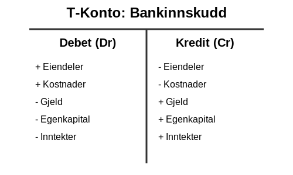
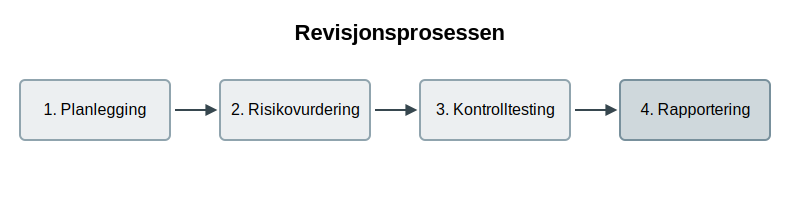
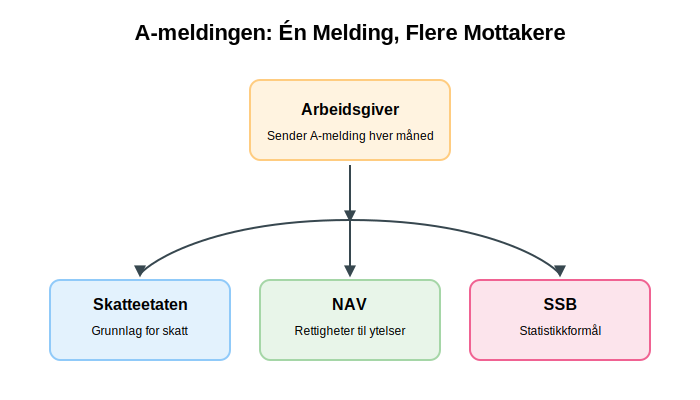
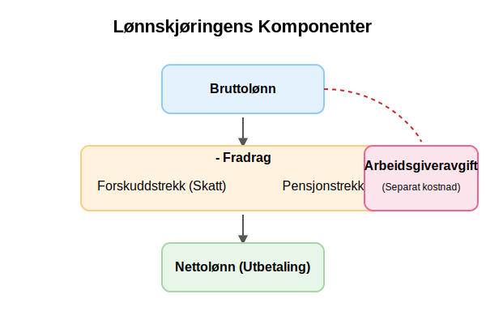

Regnskap er den systematiske og omfattende registreringen av finansielle transaksjoner knyttet til en virksomhet. Det er språket som bedrifter bruker for å kommunisere sin økonomiske helse og ytelse. Denne artikkelen gir en dyptgående analyse av regnskapets kjernekomponenter, fra de grunnleggende prinsippene til mer avanserte, spesialiserte felt.

For å sikre pålitelig og troverdig finansiell rapportering, er det avgjørende å følge [god regnskapsskikk](/blogs/regnskap/god-regnskapsskikk "God Regnskapsskikk - Prinsipper, Standarder og Beste Praksis i Norge"), som omfatter både tekniske standarder og etiske prinsipper for kvalitetsregnskap.

For en grundig gjennomgang av **revisjon** i norsk regnskap, se vår artikkel [Revisjon](/blogs/regnskap/revisjon "Revisjon – Alt du trenger å vite om Revisjon i Norge").

## Seksjon 1: Regnskapets Konseptuelle Rammeverk

Det konseptuelle rammeverket for regnskap er et sett med prinsipper og antakelser som danner grunnlaget for finansiell rapportering. Dette rammeverket sikrer at regnskapet er konsistent, sammenlignbart og pålitelig.

### 1.1 Den Grunnleggende Regnskapsligningen

Kjernen i all regnskapsføring er den fundamentale ligningen som definerer en virksomhets finansielle stilling. For en grundig forståelse av [bokføring](/blogs/regnskap/hva-er-bokføring "Hva er Bokføring? En Komplett Guide til Norsk Bokføringspraksis") som grunnlaget for all regnskapsføring, anbefaler vi vår omfattende guide:

**Eiendeler = Gjeld + Egenkapital**

*   **Eiendeler (Assets):** Økonomiske ressurser kontrollert av enheten som forventes å gi fremtidige økonomiske fordeler. For en dyptgående forklaring av aktiva, se vår artikkel [Hva er aktiva?](/blogs/regnskap/hva-er-aktiva "Hva er Aktiva? En Komplett Guide til Eiendeler i Regnskap").
*   **[Gjeld](/blogs/regnskap/hva-er-gjeld "Hva er Gjeld i Regnskap? Komplett Guide til Forpliktelser og Gjeldstyper") (Liabilities):** Eksisterende forpliktelser for enheten som stammer fra tidligere hendelser, og hvis oppgjør forventes å medføre en utstrømming av ressurser.
*   **Egenkapital (Equity):** Restinteressen i eiendelene til enheten etter fradrag for all gjeld.

### 1.2 Regnskapsprinsipper (GAAP & IFRS)

Generelt aksepterte regnskapsprinsipper (GAAP) og **[International Financial Reporting Standards (IFRS)](/blogs/regnskap/hva-er-ifrs "Hva er IFRS? Komplett Guide til International Financial Reporting Standards")** er de to dominerende standardene for finansiell rapportering. Mens GAAP primært brukes i USA, er IFRS den globale standarden som brukes av over 140 land, inkludert Norge for børsnoterte selskaper. Begge har som mål å sikre transparens og sammenlignbarhet i finansiell rapportering.

I Norge har vi utviklet et omfattende system av **[norske regnskapsstandarder](/blogs/regnskap/norsk-regnskapsstandard-nrs "Norsk regnskapsstandard (NRS) - Komplett Guide til Norske Regnskapsstandarder")** som kombinerer internasjonale standarder med nasjonale tilpasninger, administrert av Norsk RegnskapsStiftelse (NRS).

For en dyptgående forståelse av IFRS, inkludert implementering i Norge, forskjeller fra nasjonale standarder og fremtidige utviklingstrender, se vår omfattende guide til [IFRS](/blogs/regnskap/hva-er-ifrs "Hva er IFRS? Komplett Guide til International Financial Reporting Standards").

## Seksjon 2: Regnskapssyklusen

Regnskapssyklusen er en systematisk, åtte-trinns prosess som sikrer nøyaktig og konsistent finansiell rapportering.

1.  **Identifisere Transaksjoner:** Analysere kildedokumenter (fakturaer, kvitteringer) for å identifisere økonomiske hendelser. Systematisk [bilagsbehandling](/blogs/regnskap/hva-er-bilag "Hva er Bilag i Regnskap? Komplett Guide til Regnskapsbilag og Dokumentasjon") sikrer at alle transaksjoner dokumenteres korrekt fra start. I moderne detaljhandel automatiseres denne prosessen ofte gjennom [datakasse (kassasystem)](/blogs/regnskap/hva-er-datakasse "Hva er Datakasse? Komplett Guide til Kassasystem, Krav og Regnskapsføring"), som genererer elektroniske bilag og integrerer direkte med regnskapssystemet.
2.  **Journalføring:** Registrere transaksjoner i en journal ved hjelp av dobbelt bokholderi.
3.  **Bokføring i Hovedbok:** Overføre journalposter til [hovedbokskontoer](/blogs/regnskap/hva-er-hovedbok "Hva er Hovedbok? En Komplett Guide til Hovedboken i Norsk Regnskap") som er organisert etter [kontoplanen](/blogs/regnskap/hva-er-kontoplan "Hva er en Kontoplan? Komplett Guide til Kontoplaner i Norsk Regnskap"). Dette steget krever [kontering](/blogs/regnskap/hva-er-kontering "Hva er Kontering? En Komplett Guide til Kontokoding i Regnskap") - den systematiske prosessen med å tildele riktige kontonummer til hver transaksjon. Dette er kjernen i [bokføring](/blogs/regnskap/hva-er-bokføring "Hva er Bokføring? En Komplett Guide til Norsk Bokføringspraksis") og krever systematisk registrering av alle transaksjoner.
4.  **Utarbeide Råbalanse:** En liste over alle [hovedbokskontoer](/blogs/regnskap/hva-er-hovedbok "Hva er Hovedbok? En Komplett Guide til Hovedboken i Norsk Regnskap") og deres saldi for å verifisere at debet er lik kredit.
5.  **Registrere Justeringsposter:** Periodiseringer og utsatt inntekt/kostnad for å justere for transaksjoner som ikke er fullført.
6.  **Utarbeide Justert Råbalanse:** En ny råbalanse etter justeringsposter.
7.  **Utarbeide Finansregnskap:** Oppstilling av resultatregnskap, [avslutningsbalanse](/blogs/regnskap/hva-er-avslutningsbalanse "Hva er Avslutningsbalanse? Komplett Guide til Årsavslutning") og kontantstrømoppstilling.
8.  **Avslutte Kontoer:** Nullstille midlertidige kontoer (inntekter, kostnader, utbytte) til egenkapitalen.

## Seksjon 3: Dobbelt Bokholderis Prinsipp

[Dobbelt bokføring](/blogs/regnskap/hva-er-dobbel-bokforing "Hva er Dobbel Bokføring? Komplett Guide til Dobbelt Bokføringssystem") er et fundamentalt konsept der hver transaksjon har en dobbel effekt. For hver transaksjon må summen av debetposteringer være lik summen av kreditposteringer. For en omfattende forklaring av dette systemets prinsipper, historie og praktiske anvendelse, se vår detaljerte guide til [dobbel bokføring](/blogs/regnskap/hva-er-dobbel-bokforing "Hva er Dobbel Bokføring? Komplett Guide til Dobbelt Bokføringssystem").

### 3.1 Debet og Kredit: T-Kontoen

T-kontoen er et visuelt hjelpemiddel for å forstå [debet](/blogs/regnskap/hva-er-debet "Hva er Debet i Regnskap? Komplett Guide til Debetposter og Bokføring") og [kredit](/blogs/regnskap/hva-er-kreditere "Hva er Kreditere? En Komplett Guide til Kreditering i Regnskap og Kontering"). **Debet** (fra latin *debere*, "å skylde") er venstre side, og **[kredit](/blogs/regnskap/hva-er-kreditere "Hva er Kreditere? En Komplett Guide til Kreditering i Regnskap og Kontering")** (fra latin *credere*, "å betro") er høyre side. For en dyptgående forklaring av debetbegrepet, debetregler og praktiske eksempler, se vår omfattende guide [Hva er debet?](/blogs/regnskap/hva-er-debet "Hva er Debet i Regnskap? Komplett Guide til Debetposter og Bokføring").

Reglene for debet og kredit varierer avhengig av kontotype, og disse kontotypene er systematisk organisert gjennom **[kontoklasser](/blogs/regnskap/hva-er-kontoklasser "Hva er Kontoklasser? Komplett Guide til Norsk Kontoklassesystem")**:

*   **Eiendelskontoer:** Øker med debet, reduseres med [kredit](/blogs/regnskap/hva-er-kreditere "Hva er Kreditere? En Komplett Guide til Kreditering i Regnskap og Kontering").
*   **Gjeldskontoer:** Reduseres med debet, øker med [kredit](/blogs/regnskap/hva-er-kreditere "Hva er Kreditere? En Komplett Guide til Kreditering i Regnskap og Kontering").
*   **Egenkapitalkontoer:** Reduseres med debet, øker med [kredit](/blogs/regnskap/hva-er-kreditere "Hva er Kreditere? En Komplett Guide til Kreditering i Regnskap og Kontering").
*   **Inntektskontoer:** Reduseres med debet, øker med [kredit](/blogs/regnskap/hva-er-kreditere "Hva er Kreditere? En Komplett Guide til Kreditering i Regnskap og Kontering").
*   **Kostnadskontoer:** Øker med debet, reduseres med [kredit](/blogs/regnskap/hva-er-kreditere "Hva er Kreditere? En Komplett Guide til Kreditering i Regnskap og Kontering").

## Seksjon 4: Finansregnskapet

**[Finansregnskapet](/blogs/regnskap/hva-er-finansregnskap "Hva er Finansregnskap? En Komplett Guide til Ekstern Finansiell Rapportering")** er sluttproduktet av regnskapssyklusen og gir et øyeblikksbilde av en virksomhets økonomiske helse. For en dyptgående forståelse av finansregnskapets rolle i ekstern rapportering, se vår omfattende guide til [finansregnskap](/blogs/regnskap/hva-er-finansregnskap "Hva er Finansregnskap? En Komplett Guide til Ekstern Finansiell Rapportering").

### 4.1 Resultatregnskapet (Income Statement)

Viser virksomhetens finansielle resultater over en periode. Det presenterer [inntekter](/blogs/regnskap/hva-er-inntekter "Hva er Inntekter? Komplett Guide til Inntektstyper og Regnskapsføring"), [driftskostnader](/blogs/regnskap/hva-er-driftskostnader "Hva er Driftskostnader? Typer, Beregning og Regnskapsføring - Komplett Guide") og andre kostnader, samt resulterende [overskudd](/blogs/regnskap/hva-er-overskudd "Hva er Overskudd? Komplett Guide til Overskudd i Regnskap og Økonomi") eller tap. En viktig del av resultatregnskapet er [driftsregnskapet](/blogs/regnskap/hva-er-driftsregnskap "Hva er Driftsregnskap? Komplett Guide til Driftsregnskapet i Norge"), som fokuserer spesifikt på de operative inntektene og kostnadene fra kjernevirksomheten, og gir verdifull innsikt i bedriftens operative lønnsomhet.

### 4.2 Balansen (Balance Sheet)

**Balansen** gir en oversikt over virksomhetens eiendeler, gjeld og egenkapital på et bestemt tidspunkt. Den er en direkte representasjon av regnskapsligningen og et av de viktigste finansielle dokumentene for å forstå en virksomhets økonomiske stilling. For en dyptgående forklaring av balansens struktur, komponenter og praktiske anvendelse, se vår omfattende artikkel [Hva er balanse i regnskap?](/blogs/regnskap/hva-er-balanse "Hva er Balanse i Regnskap? Komplett Guide til Balansens Oppbygging og Funksjon").

For å forstå alle aspektene ved regnskapsføring og analyse av balansen, inkludert regnskapsprinsipper, verdivurdering og praktisk håndtering, anbefaler vi vår detaljerte guide om [balanseregnskap](/blogs/regnskap/hva-er-balanseregnskap "Hva er Balanseregnskap? Komplett Guide til Balansens Oppbygging og Analyse").

For å sikre klarhet og konsistens i presentasjonen, er korrekt [avrunding i regnskap](/blogs/regnskap/avrunding-regnskap "Avrunding i Regnskap - Regler, Prinsipper og Praktiske Eksempler") avgjørende for å opprettholde regnskapets kvalitet og overholdelse av lovkrav.

### 4.3 Kontantstrømoppstillingen (Cash Flow Statement)

**[Kontantstrømoppstillingen](/blogs/regnskap/hva-er-kontantstromoppstilling "Hva er Kontantstrømoppstilling? Komplett Guide til Kontantstrømanalyse og Rapportering")** rapporterer [kontantstrømmene](/blogs/regnskap/hva-er-kontantstrom "Hva er Kontantstrøm? Komplett Guide til Cash Flow Analyse og Styring") fra drifts-, investerings- og finansieringsaktiviteter over en periode. Den gir innsikt i hvordan en virksomhet genererer og bruker kontanter og er kritisk for å forstå virksomhetens likviditet og finansielle helse.

Kontantstrømoppstillingen skiller seg fra resultatregnskapet ved at den fokuserer på faktiske kontantbevegelser i stedet for periodiserte inntekter og kostnader. Endringer i [arbeidskapital](/blogs/regnskap/hva-er-arbeidskapital "Hva er Arbeidskapital? En Komplett Guide til Working Capital") (omløpsmidler minus kortsiktig gjeld) er en viktig komponent i kontantstrømmen fra drift.

For en dyptgående forståelse av kontantstrømoppstillingens struktur, utarbeidelse og analyse, se vår omfattende guide til [kontantstrømoppstilling](/blogs/regnskap/hva-er-kontantstromoppstilling "Hva er Kontantstrømoppstilling? Komplett Guide til Kontantstrømanalyse og Rapportering").

### 4.4 Saldobalanse

Saldobalansen er ikke en del av det offisielle årsregnskapet, men et kritisk internt kontrollverktøy. Det er en liste over alle kontoer i [hovedboken](/blogs/regnskap/hva-er-hovedbok "Hva er Hovedbok? En Komplett Guide til Hovedboken i Norsk Regnskap") med deres endelige debet- eller kreditsaldo. Formålet er å bekrefte at den totale debetsummen er lik den totale kredittsummen, noe som sikrer den matematiske nøyaktigheten i bokføringen før de endelige rapportene utarbeides. For en detaljert gjennomgang, les vår artikkel [Hva er en saldobalanse?](/blogs/regnskap/hva-er-saldobalanse "Alt du trenger å vite om saldobalanse").

### 4.5 Noter til Årsoppgjøret

**[Noter](/blogs/regnskap/noter "Noter - Komplett Guide til Regnskapsnoter i Norge")** er en integrert og kritisk del av finansregnskapet som gir detaljerte forklaringer og tilleggsinformasjon til tallene presentert i hovedoppstillingene. Noter er ikke bare en lovpålagt rapporteringskomponent, men også et essensielt verktøy for å sikre **transparens** og **forståelse** av selskapets økonomiske stilling.

Noter tjener flere viktige formål:
* **Oppfyllelse av lovkrav** - sikrer compliance med regnskapsstandarder
* **Økt transparens** - gir innsikt i regnskapsprinsipper og estimater  
* **Risikoinformasjon** - beskriver finansielle og operasjonelle risikoer
* **Beslutningsstøtte** - gir investorer og kreditorer nødvendig detaljinformasjon

For en omfattende forståelse av noter, deres kategorier, utarbeidelse og beste praksis, se vår detaljerte guide til [Noter](/blogs/regnskap/noter "Noter - Komplett Guide til Regnskapsnoter i Norge").

## Seksjon 5: Avanserte og Spesialiserte Emner

Utover det grunnleggende, omfatter regnskap en rekke spesialiserte felt som krever dypere ekspertise.

### 5.1 Skatteregnskap

Dette feltet fokuserer på hvordan skattelovgivning påvirker en virksomhets regnskap. Det handler ikke bare om å betale riktig skatt, men også om strategisk planlegging for å minimere skattebyrden. Skatteregnskapet avviker ofte fra finansregnskapet på grunn av ulike regler for anerkjennelse av inntekter og kostnader.

*   **Permanente Forskjeller:** Kostnader som aldri er fradragsberettigede (f.eks. visse representasjonskostnader).
*   **Midlertidige Forskjeller:** Forskjeller mellom regnskapsmessig og skattemessig verdi av eiendeler og gjeld som vil reverseres i fremtiden (f.eks. ulik avskrivningstakt for materielle eiendeler eller [amortisering](/blogs/regnskap/hva-er-amortisering "Hva er Amortisering? En Komplett Guide til Avskrivninger") av immaterielle eiendeler).

For virksomheter innen naturressurssektorer som kraft og petroleum, kommer i tillegg **[grunnrenteskatt](/blogs/regnskap/hva-er-grunnrenteskatt "Hva er Grunnrenteskatt? Komplett Guide til Norsk Grunnrenteskatt")** - en særskatt som krever spesialisert kunnskap om komplekse beregningsregler og rapporteringskrav.

En sentral del av skatteregnskapet er forståelsen av hvilke kostnader som er **fradragsberettigede** og reglene som gjelder for ulike typer fradrag. For en omfattende gjennomgang av alle kategorier av skattefradrag, dokumentasjonskrav og praktiske eksempler, se vår detaljerte guide om [fradrag i regnskap](/blogs/regnskap/hva-er-fradrag "Hva er fradrag i regnskap? Komplett Guide til Skattefradrag og Regnskapsføring").

### 5.2 Revisjon

Revisjon er en uavhengig og systematisk gransking av en virksomhets regnskap. Målet er å uttale seg med en rimelig grad av sikkerhet om regnskapet gir et rettvisende bilde av selskapets økonomiske stilling og resultat. Revisjonsprosessen er avgjørende for å bygge tillit hos investorer, kreditorer og andre interessenter.

Revisjonsprosessen følger vanligvis fire hovedfaser:
1.  **Planlegging og Risikovurdering:** Forstå virksomheten og dens omgivelser for å identifisere risikoer for vesentlig feilinformasjon.
2.  **Interne Kontroller:** Vurdere og teste effektiviteten av selskapets interne kontrollsystemer. [Forretningsføreren](/blogs/regnskap/hva-er-forretningsforer "Hva er en Forretningsfører? Komplett Guide til Roller, Ansvar og Krav") har det overordnede ansvaret for å etablere og opprettholde disse kontrollsystemene. En viktig del av dette arbeidet er [avvikshåndtering](/blogs/regnskap/hva-er-avvikshåndtering "Hva er Avvikshåndtering i Regnskap? Prosess, Metoder og Beste Praksis"), som sikrer at avvik identifiseres, analyseres og korrigeres systematisk. Et annet kritisk element er [avstemming](/blogs/regnskap/hva-er-avstemming "Hva er Avstemming i Regnskap? Komplett Guide til Regnskapsavstemming"), som sikrer at regnskapsdata stemmer overens med eksterne kilder og interne kontroller.
3.  **Substanshandlinger:** Detaljert testing av transaksjoner og saldi for å avdekke feil.
4.  **Rapportering:** Avgi en revisjonsberetning som konkluderer med revisors funn.

Gjennom hele revisjonsprosessen dokumenterer revisorer sitt arbeid i [arbeidspapirer](/blogs/regnskap/hva-er-arbeidspapirer-revisjon "Hva er Arbeidspapirer i Revisjon? Komplett Guide til Revisjonsdokumentasjon"), som utgjør grunnlaget for revisjonsuttalelsen og sikrer kvalitet og sporbarhet i revisjonsarbeidet.

### 5.3 Ledelsesregnskap vs. Finansregnskap

Selv om begge henter data fra samme økonomisystem, tjener de to grenene av regnskap svært ulike formål.

*   **[Finansregnskap](/blogs/regnskap/hva-er-finansregnskap "Hva er Finansregnskap? En Komplett Guide til Ekstern Finansiell Rapportering"):** Er eksternt rettet og strengt regulert av standarder som IFRS eller GAAP. Det gir historisk informasjon til eksterne interessenter. For en dyptgående forståelse av finansiell rapportering til eksterne interessenter, se vår omfattende guide til [finansregnskap](/blogs/regnskap/hva-er-finansregnskap "Hva er Finansregnskap? En Komplett Guide til Ekstern Finansiell Rapportering") og [eksternregnskap](/blogs/regnskap/hva-er-eksternregnskap "Hva er Eksternregnskap? Komplett Guide til Ekstern Finansiell Rapportering").
*   **Ledelsesregnskap:** Er internt rettet og helt uregulert. Det gir fremtidsrettet informasjon til ledelsen for strategisk planlegging, [budsjettering](/blogs/regnskap/hva-er-budsjettering "Hva er Budsjettering? Komplett Guide til Budsjettplanlegging for Bedrifter") og operasjonell kontroll. Eksempler inkluderer kostnads-volum-resultatanalyser, budsjetter og avviksanalyser. Et viktig verktøy innen ledelsesregnskap er [avdelingsregnskap](/blogs/regnskap/hva-er-avdelingsregnskap "Hva er Avdelingsregnskap? Kostnadsfordeling og Lønnsomhetsanalyse"), som fordeler kostnader og inntekter på ulike avdelinger for å måle lønnsomhet og effektivitet på avdelingsnivå.

### 5.4 Rettsmedisinsk Regnskap (Forensic Accounting)

Dette er en høyt spesialisert nisje som anvender regnskaps-, revisjons- og etterforskningsferdigheter i juridiske saker. Rettsmedisinske regnskapsførere blir ofte tilkalt for å etterforske økonomisk svindel, [verdsette eiendeler](/blogs/regnskap/hva-er-aktiva "Hva er Aktiva? En Komplett Guide til Eiendeler i Regnskap") i ekteskapssaker, eller beregne økonomisk tap i forsikringskrav. De er "finansielle detektiver" som må kunne presentere sine funn på en klar og overbevisende måte i en rettssal.

## Seksjon 6: Sentral Rapportering i Norge

For selskaper som opererer i Norge, er det flere obligatoriske rapporteringer til myndighetene som er sentrale i regnskapsføringen. Disse sikrer korrekt skatte- og avgiftsinnkreving samt korrekte data til velferdsordninger. Alle disse rapporteringene bygger på prinsippet om **[egenmelding](/blogs/regnskap/hva-er-egenmelding "Hva er Egenmelding? Komplett Guide til Selvrapportering i Norsk Regnskap")** - selvrapportering hvor virksomheter selv har ansvar for å rapportere korrekte opplysninger til myndighetene.

### 6.1 MVA-meldingen (Merverdiavgift)

[Merverdiavgift (MVA)](/blogs/regnskap/hva-er-avgiftsplikt-mva "Hva er Avgiftsplikt (MVA)? Komplett Guide til Merverdiavgift i Norge") er en forbruksavgift som legges på de fleste varer og tjenester. For MVA-registrerte virksomheter er **[MVA-meldingen](/blogs/regnskap/hva-er-mva-melding "Hva er MVA-melding? Komplett Guide til Merverdiavgiftsrapportering i Norge")** en periodisk rapport (vanligvis annenhver måned) som summerer opp utgående og inngående merverdiavgift.

For en komplett guide til [momsregnskap](/blogs/regnskap/momsregnskap "Momsregnskap - Komplett Guide til MVA-regnskapsføring") og alle aspekter ved MVA-regnskapsføring, se vår detaljerte artikkel.

*   **Utgående MVA:** MVA som samles inn fra kunder ved salg.
*   **Inngående MVA:** MVA som betales til leverandører ved kjøp.

Differansen mellom utgående og inngående MVA avgjør om selskapet skylder penger til staten eller har penger til gode.

### 6.2 Skattemelding og Skatteoppgjør

Alle næringsdrivende må årlig levere en skattemelding (tidligere selvangivelse) som danner grunnlaget for beregning av inntektsskatt. For selskaper inkluderer dette en detaljert **[næringsoppgave](/blogs/regnskap/hva-er-naeringsoppgave "Hva er Næringsoppgave? Komplett Guide til Næringsoppgaven i Norge")** som dokumenterer bedriftens økonomiske aktivitet og sikrer korrekt skatteberegning.

Etter at Skatteetaten har behandlet skattemeldingen, mottar virksomheten et [skatteoppgjør](/blogs/regnskap/skatteoppgjor "Skatteoppgjør Guide: Prosess, Tidslinje og Viktige Frister"). Dette dokumentet viser den endelige beregnede skatten og fastslår om man har betalt for mye (tilgodehavende) eller for lite (restskatt).

### 6.3 A-meldingen

A-meldingen er en månedlig, samordnet melding fra arbeidsgivere til NAV, SSB og Skatteetaten. Den er den praktiske gjennomføringen av [A-ordningen](/blogs/regnskap/hva-er-a-ordningen "Hva er A-ordningen?"), og inneholder informasjon om ansattes lønn, ytelser, arbeidsforhold og forskuddstrekk.

Formålet med A-meldingen er å forenkle rapporteringen for arbeidsgivere og gi myndighetene et mer nøyaktig og oppdatert datagrunnlag for:

*   Beregning av arbeidsgiveravgift og skattetrekk.
*   Opptjening av pensjonspoeng og rettigheter til ytelser fra NAV (f.eks. sykepenger, dagpenger).

### 6.4 CSRD - Bærekraftsrapportering

For større norske bedrifter blir [**CSRD (Corporate Sustainability Reporting Directive)**](/blogs/regnskap/hva-er-csrd "CSRD - Corporate Sustainability Reporting Directive: Komplett Guide for Norske Bedrifter") en viktig ny rapporteringsforpliktelse. Dette EU-direktivet, som implementeres i Norge gjennom EØS-avtalen, krever omfattende rapportering om **miljø, sosiale forhold og selskapsstyring** (ESG).

CSRD påvirker norske bedrifter som oppfyller visse størrelseskriterier og innføres trinnvis fra 2025. Rapporteringen skal følge **European Sustainability Reporting Standards** (ESRS) og krever ekstern sikring tilsvarende finansregnskapet.

## Seksjon 7: Det Digitale Økosystemet og Lovgivning

Moderne norsk regnskapsføring er dypt integrert med digitale plattformer og er strengt regulert av lovverket for å sikre kvalitet og etterprøvbarhet.

### 7.1 Altinn – Den Digitale Motorveien

[Altinn](/blogs/regnskap/hva-er-altinn "Hva er Altinn? Norges Digitale Portal for Næringsliv og Privatpersoner") er Norges felles internettportal for digital dialog mellom næringslivet, privatpersoner og offentlige etater. For regnskapsførere og bedrifter er Altinn den primære kanalen for å levere lovpålagte skjemaer som MVA-melding, skattemelding og A-melding.

Plattformen fungerer som en sentral hub som validerer og distribuerer data til riktig etat, noe som effektiviserer rapporteringsprosessene betydelig.

### 7.2 SAF-T: Standardisering for Kontroll

SAF-T (Standard Audit File - Tax) er et standardisert XML-format for utveksling av regnskapsdata. Alle bokføringspliktige med elektroniske regnskapssystemer må kunne produsere en SAF-T-fil på forespørsel fra Skatteetaten.

Formålet er å gjøre [bokettersyn](/blogs/regnskap/bokettersyn "Hva er Bokettersyn i Regnskap? Komplett Guide til Regnskapskontroller") og skattekontroll mer effektivt ved at dataene presenteres i et likt, maskinlesbart format, uavhengig av hvilket regnskapssystem bedriften bruker.

### 7.3 Bokføringsloven: Ryggraden i Norsk Regnskap

[Bokføringsloven](/blogs/regnskap/hva-er-bokføringsloven "Hva er Bokføringsloven? Krav, Regler og Praktisk Veiledning"), med tilhørende forskrifter, setter de grunnleggende kravene til hvordan regnskapsinformasjon skal registreres, dokumenteres og oppbevares. Loven etablerer [**bokføringsplikten**](/blogs/regnskap/hva-er-bokføringsplikt "Hva er Bokføringsplikt i Norge? Hvem, Når og Hvordan?") for norske virksomheter og bygger på flere sentrale prinsipper:

*   **Fullstendighetsprinsippet:** Alle transaksjoner skal bokføres.
*   **Realitetsprinsippet:** Bokføringen skal gjenspeile de reelle hendelsene.
*   **Sporbarhetsprinsippet:** Det skal være en toveis kontrollsti mellom dokumentasjon, bokføring og rapportering.
*   **Oppbevaringsprinsippet:** Regnskapsmateriale må oppbevares på en trygg måte i en bestemt periode (normalt 5 år).

For en omfattende gjennomgang av alle [bokføringsregler](/blogs/regnskap/hva-er-bokføringsregler "Hva er Bokføringsregler? Komplett Guide til Norske Bokføringsstandarder") og regnskapsstandarder som styrer norsk regnskapsføring, anbefaler vi vår detaljerte guide.

### 7.4 Forskuddsskatt: Betal Skatt på Forhånd

For enkeltpersonforetak og aksjeselskaper er forskuddsskatt den primære måten å betale inntektsskatt på. I stedet for å betale all skatt samlet året etter, betales den i terminer gjennom inntektsåret, basert på et forventet overskudd.

*   **Enkeltpersonforetak (ENK):** Betaler forskuddsskatt i fire like terminer.
*   **Aksjeselskap (AS):** Betaler forskuddsskatt i to terminer, basert på fjorårets skatteoppgjør.

Systemet sikrer at staten får en jevnere inntekt og at skattyter unngår en stor restskatt.

## Seksjon 8: Automatisering og Effektivisering

Teknologi har transformert regnskapsbransjen, og automatisering er nøkkelen til en mer effektiv og nøyaktig regnskapsføring. **[Fintech](/blogs/regnskap/hva-er-fintech "Hva er Fintech? Komplett Guide til Finansteknologi og Påvirkning på Regnskap")** (finansteknologi) spiller en stadig viktigere rolle i denne transformasjonen, med AI-drevne løsninger, automatisert bokføring og digitale betalingsplattformer som revolusjonerer hvordan bedrifter håndterer sine finansielle prosesser.

For større bedrifter som ønsker helhetlig integrasjon av alle forretningsprosesser, representerer **[ERP-systemer](/blogs/regnskap/hva-er-erp-system "Hva er ERP-system? Komplett Guide til Enterprise Resource Planning")** den ultimate løsningen for automatisering og effektivisering av regnskapsføring sammen med andre kjerneforretningsfunksjoner.

### 8.1 Elektronisk Handelsformat ([EHF](/blogs/regnskap/hva-er-ehf "Hva er EHF? Komplett Guide til Elektronisk Handelsformat i Norge"))

[EHF](/blogs/regnskap/hva-er-ehf "Hva er EHF? Komplett Guide til Elektronisk Handelsformat i Norge") er det norske standardformatet for elektronisk fakturering, basert på det felleseuropeiske PEPPOL-nettverket. I motsetning til en PDF-faktura sendt på e-post, er en EHF-faktura en strukturert datafil som sendes direkte fra avsenders til mottakers økonomisystem. Du kan lære mer om fakturaer i vår dedikerte artikkel om emnet: [Hva er en faktura?](/blogs/regnskap/hva-er-en-faktura "Hva er en Faktura? En Guide til Norske Fakturakrav"). En annen vanlig betalingsmetode er [a-konto betaling](/blogs/regnskap/hva-er-a-konto-betaling "Hva er A-konto Betaling? En Enkel Forklaring"), som brukes for delinnbetalinger basert på estimater.

Elektronisk fakturering er en viktig del av moderne [anskaffelsesprosesser](/blogs/regnskap/hva-er-anskaffelser "Hva er Anskaffelser? En Komplett Guide til Offentlige og Private Innkjøp"), hvor bedrifter må håndtere store mengder leverandørfakturaer effektivt.

Fordelene er betydelige:

*   **Redusert manuell tasting:** Data leses automatisk inn i regnskapssystemet.
*   **Raskere behandling:** Fakturaen ankommer umiddelbart og kan godkjennes digitalt.
*   **Økt sikkerhet:** Sender og mottaker er verifisert, noe som reduserer faren for falske fakturaer.

### 8.2 Bankintegrasjon og Avstemming

Moderne regnskapssystemer tilbyr direkte integrasjon med bedriftens bankkontoer. Dette innebærer at [banktransaksjoner](/blogs/regnskap/hva-er-banktransaksjoner "Hva er Banktransaksjoner i Regnskap? Typer, Regnskapsføring og Kontroll") automatisk importeres inn i regnskapssystemet daglig (ofte kalt en "bank-feed"), vanligvis via standardiserte dataformater som [CSV-filer](/blogs/regnskap/hva-er-csv-fil "Hva er en CSV-fil? Komplett Guide til CSV i Regnskap og Bokføring").

Denne automatiseringen forenkler [bankavstemmingen](/blogs/regnskap/hva-er-bankavstemming "Hva er Bankavstemming i Regnskap? Komplett Guide") dramatisk. I stedet for å manuelt sammenligne kontoutskriften med regnskapet, kan systemet automatisk foreslå hvilke åpne fakturaer en innbetaling gjelder, eller koble en utbetaling til et bokført bilag.

### 8.3 Lønnskjøring: Fra Brutto til Netto

Lønnskjøring er en kritisk og ofte kompleks prosess som innebærer beregning av [**lønn**](/blogs/regnskap/hva-er-lonn "Hva er Lønn i Regnskap? Komplett Guide til Lønnsformer, Beregning og Regnskapsføring") og lovpålagte trekk for ansatte. Prosessen må håndteres nøyaktig for å sikre korrekt utbetaling og rapportering til myndighetene. Hver ansatt har sin egen [ansattreskontro](/blogs/regnskap/hva-er-ansattreskontro "Hva er Ansattreskontro? En Guide til Ansattkontoer i Regnskap") som registrerer alle lønnsrelaterte transaksjoner.

En typisk lønnskjøring inkluderer:

*   **Beregning av [bruttolønn](/blogs/regnskap/hva-er-brutto "Hva er Brutto i Regnskap? Definisjon, Beregning og Praktisk Anvendelse"):** Fastlønn, timelønn, overtid, bonuser og andre lønnsformer som [akkordlønn](/blogs/regnskap/hva-er-akkordlonn "Hva er akkordlønn?").
*   **Beregning av fradrag:** Forskuddstrekk (skatt) basert på skattekort, og eventuelle pensjonstrekk.
*   **Beregning av nettolønn:** Beløpet som utbetales til den ansatte.
*   **Beregning av arbeidsgiveravgift:** En avgift arbeidsgiver betaler til staten som en prosentandel av [bruttolønn](/blogs/regnskap/hva-er-brutto "Hva er Brutto i Regnskap? Definisjon, Beregning og Praktisk Anvendelse"). For en detaljert forklaring av satser, fritak og beregning, se vår guide til [arbeidsgiveravgift](/blogs/regnskap/hva-er-arbeidsgiveravgift "Hva er Arbeidsgiveravgift? En Komplett Guide til Norges Lønnsavgift"). Satsen varierer geografisk.

Alle disse dataene danner grunnlaget for A-meldingen.

## Seksjon 9: Profesjonelle Regnskapstjenester

Gitt kompleksiteten i moderne regnskapsføring, velger mange bedrifter å outsource regnskapsoppgavene til profesjonelle tjenesteleverandører. Dette er spesielt aktuelt for små og mellomstore bedrifter som ikke har ressurser til å ansette egne regnskapsførere.

### 9.1 Når bør du vurdere profesjonell hjelp?

Flere faktorer kan indikere at det er tid å søke profesjonell regnskapshjelp:

* **Kompleks virksomhet:** Hvis bedriften har mange transaksjoner, flere MVA-koder, eller opererer i flere land.
* **Tidsmangel:** Når regnskapsoppgavene tar for mye tid fra kjernevirksomheten.
* **Regelverksendringer:** Hyppige endringer i skatte- og regnskapsregler krever oppdatert fagkompetanse.
* **Vekst:** Når bedriften vokser og regnskapsbehovene blir mer komplekse.

### 9.2 Autoriserte Regnskapsførerselskaper (ARS)

For bedrifter som ønsker maksimal trygghet og kvalitet, er **[ARS (Autorisert Regnskapsførerselskap)](/blogs/regnskap/hva-er-ars "Hva er ARS? Autorisert Regnskapsførerselskap - Krav, Fordeler og Prosess")** det høyeste nivået av profesjonelle regnskapstjenester i Norge. Disse selskapene er autorisert av Finanstilsynet og må oppfylle strenge krav til kompetanse, kvalitetssikring og ansvarsforsikring.

Fordeler ved å velge et ARS inkluderer:

* **Garantert fagkompetanse:** Minimum 50% av de ansatte må være autoriserte regnskapsførere.
* **Kvalitetssikring:** Obligatoriske kvalitetssystemer og internkontroll, inkludert korrekt [attestering av bilag](/blogs/regnskap/hva-er-attestering "Hva er Attestering? En Komplett Guide til Bilagsbehandling og Godkjenning").
* **Juridisk trygghet:** Ansvarsforsikring på minimum 5 millioner kroner.
* **Tilsynsmyndighet:** Underlagt Finanstilsynets kontroll og tilsyn.

Valg av riktig regnskapstjeneste er en viktig strategisk beslutning som kan påvirke bedriftens økonomiske helse og compliance betydelig.
