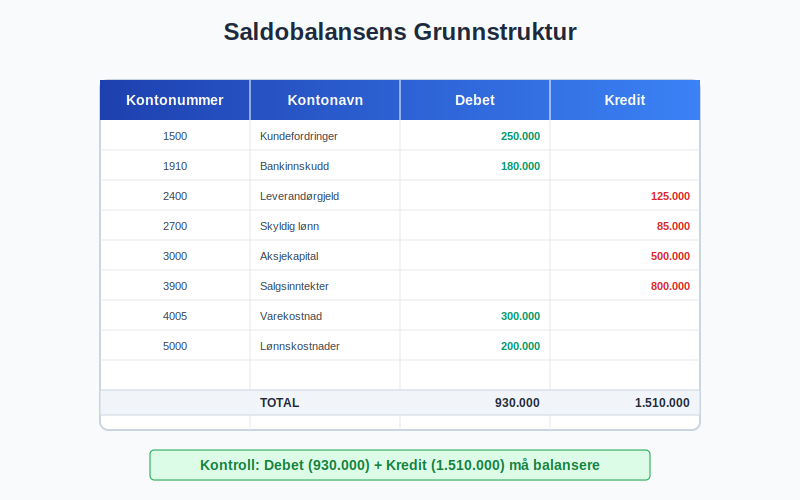
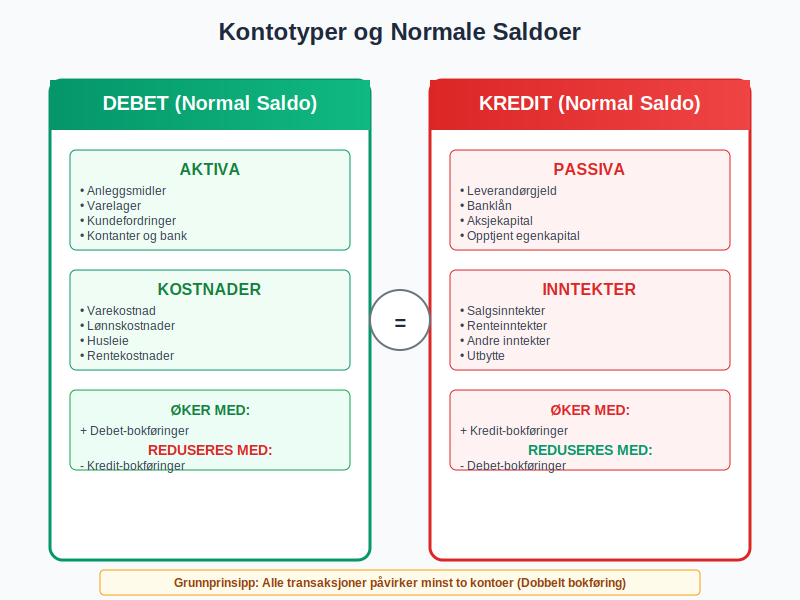
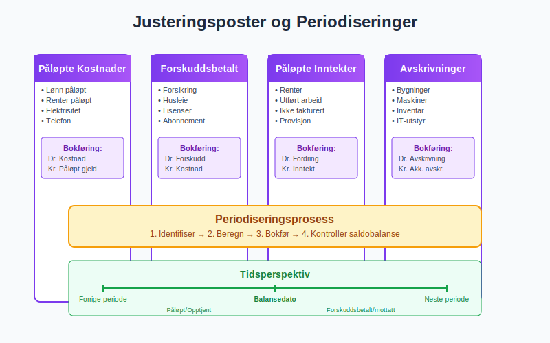
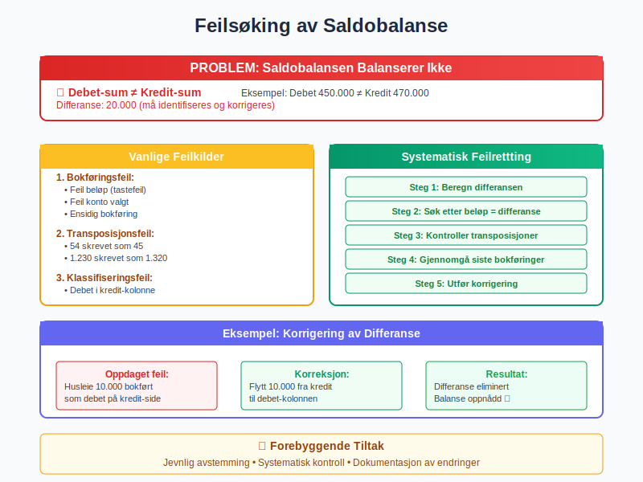
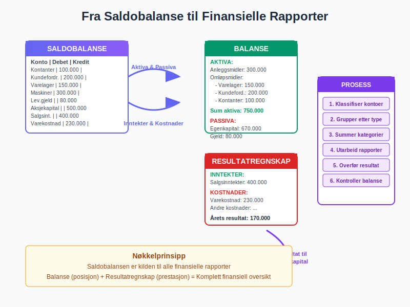
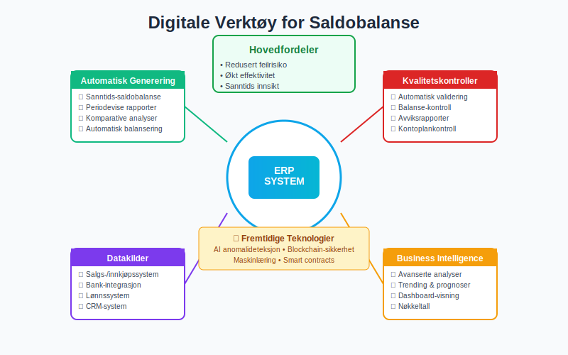
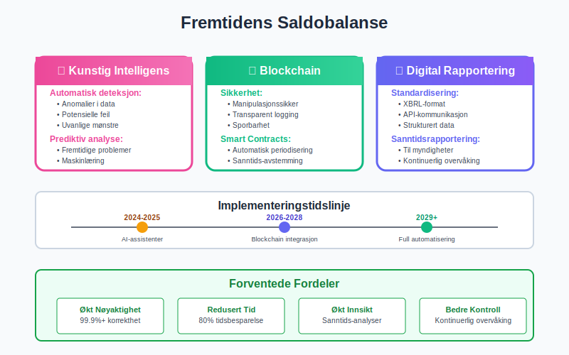
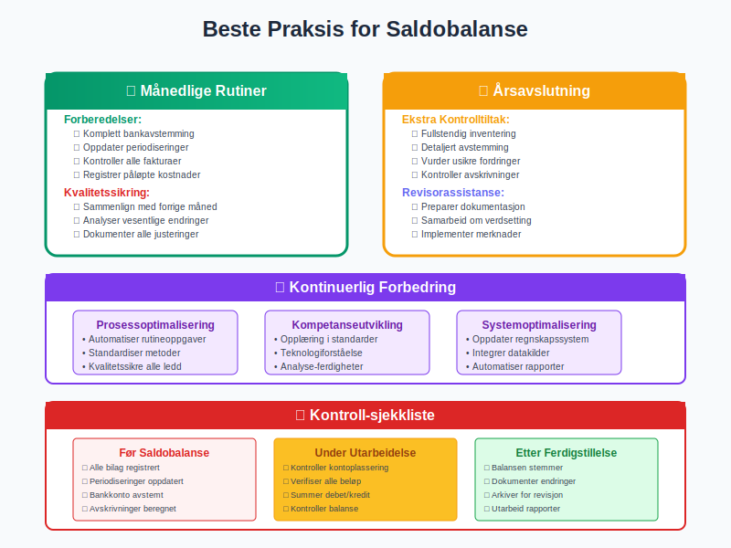

**Saldobalanse** er et av de mest fundamentale verktøyene i regnskapsføring og representerer en detaljert oversikt over alle kontoer i bedriftens [kontoplan](/blogs/regnskap/hva-er-kontoplan "Hva er Kontoplan? Komplett Guide til Kontosystem og Regnskapsstruktur") på et bestemt tidspunkt. Dette dokumentet fungerer som grunnlaget for utarbeidelse av [balansen](/blogs/regnskap/hva-er-balanse "Hva er Balanse i Regnskap? Komplett Guide til Balansens Oppbygging og Funksjon") og andre finansielle rapporter, og er en kritisk komponent i enhver regnskapsprosess.

## Seksjon 1: Saldobalansens Grunnleggende Konsept

### 1.1 Definisjon og Formål

En **saldobalanse** (også kalt prøvebalanse eller råbalanse) er en systematisk oppstilling av alle kontoer i bedriftens [hovedbok](/blogs/regnskap/hva-er-hovedbok "Hva er Hovedbok? Komplett Guide til Hovedboken i Regnskap") med deres respektive **debet-** og **kreditsaldoer** på et spesifikt tidspunkt. Saldobalansens primære formål er å:

* Kontrollere at den grunnleggende regnskapsligningen er oppfylt
* Sikre at alle [bokføringer](/blogs/regnskap/hva-er-bokforing "Hva er Bokføring? En Komplett Guide til Grunnleggende Regnskapsføring") er korrekt registrert
* Danne grunnlag for utarbeidelse av finansielle rapporter
* Identifisere potensielle feil i regnskapsføringen

### 1.2 Saldobalansens Plass i Regnskapsprosessen

Saldobalansen utarbeides typisk ved:

* **Månedens slutt** for månedlig regnskapsavslutning og fastsettelse av [utgående balanse](/blogs/regnskap/hva-er-utgaaende-balanse "Hva er Utgående Balanse (UB)? Komplett Guide til Saldooverføring")
* **Kvartalets slutt** for [kvartalsrapportering](/blogs/regnskap/hva-er-kvartalsrapport "Hva er Kvartalsrapport? Komplett Guide til Kvartalsvise Finansrapporter")
* **Årets slutt** som del av årsavslutningsprosessen
* **Ved behov** for spesielle analyser eller kontroller

## Seksjon 2: Saldobalansens Struktur og Komponenter

### 2.1 Standardoppsettet

En typisk saldobalanse inneholder følgende kolonner:

| **Kontonummer** | **Kontonavn** | **Debet** | **Kredit** |
|-----------------|---------------|-----------|------------|
| 1500 | Kundefordringer | 250.000 | |
| 1910 | Bankinnskudd | 180.000 | |
| 2400 | Leverandørgjeld | | 125.000 |
| 2700 | Skyldig lønn | | 85.000 |
| 3000 | Aksjekapital | | 500.000 |

### 2.2 Kontotyper og Normale Saldoer

Ulike kontotyper har **normale saldoer** på forskjellige sider:

#### Aktiva-kontoer (Debet-normal)
* **[Anleggsmidler](/blogs/regnskap/hva-er-anleggsmidler "Hva er Anleggsmidler? Komplett Guide til Faste Eiendeler"):** Bygninger, maskiner, inventar
* **Omløpsmidler:** Varelager, [kundefordringer](/blogs/regnskap/hva-er-debitor "Hva er Debitor i Regnskap? Komplett Guide til Kundefordringer og Debitorhåndtering"), kontanter

#### Passiva-kontoer (Kredit-normal)
* **[Gjeld](/blogs/regnskap/hva-er-gjeld "Hva er Gjeld i Regnskap? Komplett Guide til Forpliktelser og Gjeldstyper"):** Leverandørgjeld, banklån
* **[Egenkapital](/blogs/regnskap/hva-er-egenkapital "Hva er Egenkapital? Komplett Guide til Egenkapital i Regnskap"):** Aksjekapital, opptjent egenkapital

#### Inntekts-kontoer (Kredit-normal)
* **Driftsinntekter:** Salgsinntekter, andre driftsinntekter
* **Finansinntekter:** Renteinntekter, utbytte

#### Kostnads-kontoer (Debet-normal)
* **Driftskostnader:** Varekostnad, lønnskostnader, husleie
* **Finanskostnader:** Rentekostnader, bankomkostninger

## Seksjon 3: Utarbeidelse av Saldobalanse

### 3.1 Fremgangsmåte

Utarbeidelsen av en saldobalanse følger en systematisk prosess:

1. **Samle alle hovedbokskontoer** med deres saldoer
2. **Klassifiser kontoer** etter type og normal saldo
3. **Plasser saldoer** i korrekt kolonne (debet eller kredit)
4. **Summer kolonner** og kontroller at de er like
5. **Identifiser eventuelle avvik** og korriger feil

### 3.2 Justeringsposter og Periodiseringer

Før den endelige saldobalansen utarbeides, må alle nødvendige [periodiseringer](/blogs/regnskap/hva-er-periodisering "Hva er Periodisering i Regnskap? Komplett Guide til Periodiseringsprinsippet") og justeringsposter være bokført:

* **Påløpte kostnader** som ikke er fakturert ennå
* **Forskuddsbetalte kostnader** som gjelder fremtidige perioder
* **Påløpte inntekter** som ikke er fakturert ennå
* **Forskuddsmottatte inntekter** som gjelder fremtidige perioder
* **[Avskrivninger](/blogs/regnskap/hva-er-avskrivning "Hva er Avskrivning? Komplett Guide til Avskrivningsmetoder")** på anleggsmidler

## Seksjon 4: Kvalitetskontroll og Feilsøking

### 4.1 Kontrolltiltak

For å sikre korrekthet i saldobalansen:

#### Matematisk Kontroll
* **Debet-sum = Kredit-sum:** Den grunnleggende kontrollen
* **Kryssjekk mot hovedbok:** Alle saldoer må stemme med hovedboken
* **[Avstemming](/blogs/regnskap/hva-er-avstemming "Hva er Avstemming i Regnskap? Komplett Guide til Regnskapsavstemming") av nøkkelkontoer:** Bank, [kunder](/blogs/regnskap/hva-er-debitor "Hva er Debitor i Regnskap? Komplett Guide til Kundefordringer og Debitorhåndtering"), leverandører

#### Logisk Kontroll
* **Normale saldoer:** Kontroller at kontoer har saldo på riktig side
* **Urimelige saldoer:** Identifiser saldoer som virker urealistiske
* **Manglende kontoer:** Sjekk at alle aktive kontoer er inkludert

### 4.2 Vanlige Feilkilder

#### Bokføringsfeil
* **Feil beløp** i bilagsregistrering
* **Feil konto** valgt ved bokføring
* **Feil dato** som påvirker periodisering
* **Doble bokføringer** av samme bilag

#### Systemfeil
* **Tekniske feil** i regnskapssystemet
* **Manglende overføringer** mellom moduler
* **Avbrutte kjøringer** av automatiske rutiner

### 4.3 Feilrettingsprosess

Når feil oppdages i saldobalansen:

1. **Identifiser årsaken** til avviket
2. **Spor feilen** tilbake til kilden
3. **Utfør korrigerende bokføringer** hvis nødvendig
4. **Oppdater saldobalansen** med korrekte tall
5. **Dokumenter rettelsen** for [revisjon](/blogs/regnskap/hva-er-revisjon "Hva er Revisjon? En Komplett Guide til Revisjonsarbeid i Norge") og kontroll

## Seksjon 5: Fra Saldobalanse til Finansielle Rapporter

### 5.1 Utarbeidelse av Balanse

Saldobalansen er det direkte grunnlaget for [balansen](/blogs/regnskap/hva-er-balanse "Hva er Balanse i Regnskap? Komplett Guide til Balansens Oppbygging og Funksjon"):

#### Aktiva-siden
* **Anleggsmidler:** Summer alle relevant kontoer med debet-saldo
* **Omløpsmidler:** Summer alle omløpskontoer med debet-saldo
* **Trekk fra:** Akkumulerte avskrivninger (kredit-saldo)

#### Passiva-siden
* **[Egenkapital](/blogs/regnskap/hva-er-egenkapital "Hva er Egenkapital? Komplett Guide til Egenkapital i Regnskap"):** Summer alle egenkapitalkontoer med kredit-saldo
* **Gjeld:** Summer alle gjeldskontoer med kredit-saldo
* **Inkluder:** Årets resultat fra resultatregnskapet

### 5.2 Utarbeidelse av Resultatregnskap

Fra saldobalansen hentes:

#### Inntekter
* **Driftsinntekter:** Alle salgs- og inntektskontoer (kredit-saldo)
* **Andre inntekter:** Finansinntekter og andre inntekter (kredit-saldo)

#### Kostnader
* **Driftskostnader:** Varekostnad, lønn, andre kostnader (debet-saldo)
* **Finanskostnader:** Rentekostnader og finansielle kostnader (debet-saldo)

| **Regnskapspost** | **Saldo Type** | **Rapport** |
|-------------------|----------------|-------------|
| Salgsinntekter | Kredit | Resultatregnskap |
| Varekostnad | Debet | Resultatregnskap |
| Kundefordringer | Debet | Balanse |
| Leverandørgjeld | Kredit | Balanse |
| Aksjekapital | Kredit | Balanse |

## Seksjon 6: Digitale Verktøy og Automatisering

### 6.1 Moderne Regnskapssystemer

Dagens regnskapssystemer tilbyr avanserte funksjoner for saldobalanse:

#### Automatisk Generering
* **Sanntids-saldobalanse:** Oppdateres automatisk ved hver bokføring
* **Periodevise rapporter:** Automatisk generering ved måned-/årsslutt
* **Komparative analyser:** Sammenligning med tidligere perioder

#### Kvalitetskontroller
* **Automatisk balansering:** Systemet varsler hvis debet ≠ kredit
* **Validering av bokføringer:** Kontroller mot [kontoplan](/blogs/regnskap/hva-er-kontoplan "Hva er Kontoplan? Komplett Guide til Kontosystem og Regnskapsstruktur")
* **Avviksrapporter:** Identifisering av uvanlige saldoer

### 6.2 Integrasjon med Andre Systemer

#### ERP-systemer
* **Fullintegrert regnskapsføring** fra salgs- og innkjøpssystemer
* **Automatisk [periodisering](/blogs/regnskap/hva-er-periodisering "Hva er Periodisering i Regnskap? Komplett Guide til Periodiseringsprinsippet")** av gjentakende poster
* **Sanntids rapportering** til ledelse og interessenter

#### Business Intelligence
* **Avanserte analyser** av saldobalanse-data
* **Trending og [prognoser](/blogs/regnskap/hva-er-prognose "Hva er Prognose i Økonomi? Komplett Guide til Finansiell Prognostisering")** basert på historiske data
* **Dashboard-visning** av nøkkeltall fra saldobalansen

## Seksjon 7: Saldobalanse i Ulike Virksomhetstyper

### 7.1 Små og Mellomstore Bedrifter (SMB)

For SMB-virksomheter er saldobalansen ofte:

#### Enklere Struktur
* **Færre kontoer** og mindre kompleksitet
* **Månedlig utarbeidelse** for intern kontroll
* **Grunnlag for [budsjettering](/blogs/regnskap/hva-er-budsjettering "Hva er Budsjettering? Komplett Guide til Budsjettplanlegging og Økonomistyring")** og planlegging

#### Praktiske Utfordringer
* **Begrenset regnskapskompetanse** internt
* **Manuell [avstemming](/blogs/regnskap/hva-er-avstemming "Hva er Avstemming i Regnskap? Komplett Guide til Regnskapsavstemming")** av nøkkelkontoer
* **Sesongvariasjoner** som påvirker saldostrukturen

### 7.2 Store Virksomheter og Konsern

For større virksomheter innebærer saldobalansen:

#### Kompleks Struktur
* **Tusenvis av kontoer** på detaljert nivå
* **Multiple enheter** og kostsentre
* **Konsolideringskrav** for konsernregnskapet

#### Avanserte Kontroller
* **Automatiserte [avstemminger](/blogs/regnskap/hva-er-avstemming "Hva er Avstemming i Regnskap? Komplett Guide til Regnskapsavstemming")**
* **[Internkontroll](/blogs/regnskap/hva-er-internkontroll "Hva er Internkontroll? Komplett Guide til Interne Kontrollsystemer")**-rutiner
* **Revisoriske kontroller** og validering

### 7.3 Spesielle Bransjer

#### Banker og Finansinstitusjoner
* **Spesielle regnskapsstandarder** (IFRS)
* **Regulatoriske rapporteringskrav**
* **Risikoklassifisering** av balanseposter

#### Offentlig Sektor
* **Regnskapsstandarder for offentlig sektor**
* **[Budsjettkontroll](/blogs/regnskap/hva-er-budsjettering "Hva er Budsjettering? Komplett Guide til Budsjettplanlegging og Økonomistyring")** og -oppfølging
* **Transparens og offentlig innsyn**

## Seksjon 8: Analytisk Bruk av Saldobalanse

### 8.1 Finansiell Analyse

Saldobalansen gir grunnlag for omfattende finansiell analyse:

#### Likviditetsanalyse
* **Arbeidskapital** = Omløpsmidler - Kortsiktig gjeld
* **Likviditetsgrader** for å vurdere [betalingsevne](/blogs/regnskap/hva-er-betalingsevne "Hva er Betalingsevne? Analyse, Nøkkeltall og Vurdering av Likviditet")
* **[Kontantstrøm](/blogs/regnskap/hva-er-kontantstrom "Hva er Kontantstrøm? Komplett Guide til Cash Flow Analyse og Styring")**-prognoser

#### Soliditetsanalyse
* **Egenkapitalandel** og [gjeldsgrad](/blogs/regnskap/hva-er-gjeld "Hva er Gjeld i Regnskap? Komplett Guide til Forpliktelser og Gjeldstyper")
* **[Rentedekningsgrad](/blogs/regnskap/hva-er-dekningsgrad "Hva er Dekningsgrad? Komplett Guide til Beregning og Analyse")** og finansiell risiko
* **Kapitalstruktur** og finansieringskilder

### 8.2 Operasjonell Analyse

#### Effektivitetsmål
* **Omløpshastighet** for varelager og [kundefordringer](/blogs/regnskap/hva-er-debitor "Hva er Debitor i Regnskap? Komplett Guide til Kundefordringer og Debitorhåndtering")
* **Kapitalbinding** i ulike eiendeler
* **[Avkastning](/blogs/regnskap/hva-er-avkastning "Hva er Avkastning? Komplett Guide til Avkastningsberegning og Analyse")** på investerte midler

#### Trendanalyse
* **Månedlige endringer** i nøkkelkontoer
* **Sesongmønstre** og sykliske variasjoner
* **Vekstrater** for kritiske balanseposter

### 8.3 Strategisk Planlegging

#### Kapitalforvaltning
* **Investeringsbehov** i anleggsmidler
* **Finansieringsstrategi** for vekst
* **Utbyttepolitikk** og kapitalstruktur

#### Risikostyring
* **Konsentrasjonsrisiko** i kundeportefølje
* **Valutarisiko** i utenlandske eiendeler
* **Likviditetsrisiko** og beredskap

## Seksjon 9: Regulatoriske Krav og Standarder

### 9.1 Norske Regnskapsstandarder

#### Regnskapsloven
* **Grunnleggende prinsipper** for regnskapsføring
* **Krav til saldobalanse** som del av årsregnskapet
* **Konserninterne elimineringer** for konsernregnskapet

#### God Regnskapsskikk
* **Beste praksis** for utarbeidelse av saldobalanse
* **Konsekvens i regnskapsprinsipper** fra år til år
* **Sammenlignbarhet** med andre virksomheter

For mer om dette, se [God regnskapsskikk](/blogs/regnskap/god-regnskapsskikk "God Regnskapsskikk - Komplett Guide til Norske Regnskapsprinsipper").

### 9.2 Internasjonale Standarder

#### IFRS og IAS
* **Internasjonale regnskapsstandarder** for børsnoterte selskaper
* **Komplekse verdsettingsregler** for finansielle instrumenter
* **Utvidede notekrav** og tilleggsopplysninger

#### Sarbanes-Oxley
* **Internkontrollkrav** for amerikanske børsnoterte selskaper
* **Ledelsesattestasjon** av finansielle rapporter
* **Ekstern revisorbekreftelse** av kontrollsystemer

## Seksjon 10: Fremtidige Utviklingstrender

### 10.1 Teknologiske Fremskritt

#### Kunstig Intelligens
* **Automatisk anomalideteksjon** i saldobalanse-data
* **Prediktiv analyse** for å forutse problemer
* **Maskinlæring** for forbedret [avstemming](/blogs/regnskap/hva-er-avstemming "Hva er Avstemming i Regnskap? Komplett Guide til Regnskapsavstemming")

#### Blockchain og Distributed Ledger
* **Transparent og manipulasjonssikker** regnskapsføring
* **Sanntids-avstemming** mellom parter
* **Smart contracts** for automatisk periodisering

### 10.2 Regulatoriske Endringer

#### Digitalisering av Rapportering
* **XBRL-format** for strukturert rapportering
* **API-basert** kommunikasjon med myndigheter
* **Sanntidsrapportering** til skattemyndigheter

#### Bærekraftsrapportering
* **ESG-data** integrert i saldobalansen
* **Klimarelaterte eiendeler** og forpliktelser
* **Sosiale og miljømessige** påvirkningsfaktorer

## Seksjon 11: Praktiske Tips og Beste Praksis

### 11.1 Månedlige Rutiner

#### Forberedelser
* **Komplett [avstemming](/blogs/regnskap/hva-er-avstemming "Hva er Avstemming i Regnskap? Komplett Guide til Regnskapsavstemming")** av bankkontoer før saldobalanse
* **Oppdatering** av alle [periodiseringer](/blogs/regnskap/hva-er-periodisering "Hva er Periodisering i Regnskap? Komplett Guide til Periodiseringsprinsippet")
* **Kontroll** av alle fakturerte og mottatte fakturaer

#### Kvalitetssikring
* **Kryssjekk** med forrige måneds saldobalanse
* **Analyse** av vesentlige endringer
* **Dokumentasjon** av alle justeringer

### 11.2 Årsavslutning

#### Ekstra Kontrolltiltak
* **Fullstendig inventering** av alle [anleggsmidler](/blogs/regnskap/hva-er-anleggsmidler "Hva er Anleggsmidler? Komplett Guide til Faste Eiendeler")
* **Detaljert [avstemming](/blogs/regnskap/hva-er-avstemming "Hva er Avstemming i Regnskap? Komplett Guide til Regnskapsavstemming")** av alle nøkkelkontoer
* **Vurdering** av usikre fordringer og forpliktelser

#### Revisorassistanse
* **Preparering** av dokumentasjon for revisor
* **Samarbeid** om komplekse verdsettingsspørsmål
* **Implementering** av revisormerknader

### 11.3 Kontinuerlig Forbedring

#### Prosessoptimalisering
* **Automatisering** av rutineoppgaver
* **Standardisering** av arbeidsmetoder
* **[Kvalitetssikring](/blogs/regnskap/hva-er-qa-kvalitetssikring "Hva er QA (Kvalitetssikring) i Regnskap? Prosesser og Beste Praksis")** av alle ledd i prosessen

#### Kompetanseutvikling
* **Opplæring** i nye regnskapsstandarder
* **Teknologiforståelse** for bedre systembruk
* **Analyse-ferdigheter** for dypere innsikt

## Konklusjon

Saldobalansen er det fundamentale verktøyet som sikrer integritet og nøyaktighet i enhver virksomhets regnskapsføring. Som en detaljert oversikt over alle kontoer i bedriftens [kontoplan](/blogs/regnskap/hva-er-kontoplan "Hva er Kontoplan? Komplett Guide til Kontosystem og Regnskapsstruktur"), fungerer den som kvalitetskontroll, analyseverktøy og grunnlag for alle finansielle rapporter.

### Kritiske Suksessfaktorer

**Systematisk tilnærming** til utarbeidelse og kontroll er avgjørende for å oppnå pålitelige resultater. Dette inkluderer regelmessig [avstemming](/blogs/regnskap/hva-er-avstemming "Hva er Avstemming i Regnskap? Komplett Guide til Regnskapsavstemming"), grundig dokumentasjon og konsistent kvalitetssikring.

**Teknologisk støtte** fra moderne regnskapssystemer gjør prosessen mer effektiv og reduserer risikoen for feil, men krever fortsatt faglig kompetanse og kritisk vurdering fra regnskapsføreren.

**[Internkontroll](/blogs/regnskap/hva-er-internkontroll "Hva er Internkontroll? Komplett Guide til Interne Kontrollsystemer")** og [avvikshåndtering](/blogs/regnskap/hva-er-avvikshåndtering "Hva er Avvikshåndtering i Regnskap? Prosess, Metoder og Beste Praksis") må være integrerte deler av saldobalanse-prosessen for å sikre korrekthet og pålitelighet.

### Fremtidens Saldobalanse

Med økende digitalisering og automatisering vil saldobalansen utvikle seg fra et manuelt kontrollverktøy til en intelligent, sanntids-basert analyseplattform som gir kontinuerlig innsikt i virksomhetens finansielle helse.

Forståelse og mestring av saldobalansens prinsipper og praksis forblir imidlertid grunnleggende for alle som arbeider med regnskapsføring og finansiell rapportering. Den representerer ikke bare et teknisk verktøy, men en fundamental byggesten i det moderne regnskapssystemet som sikrer transparens, nøyaktighet og tillit i finansiell rapportering.