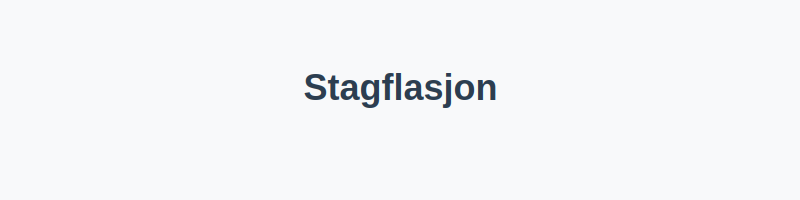
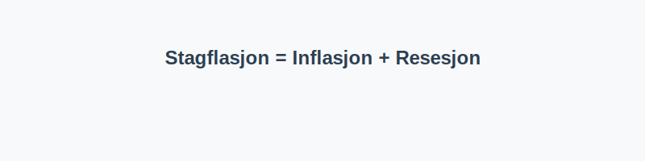

For en helhetlig forståelse av ekstreme økonomiske hendelser, se [Hva er Inflasjon?](/blogs/regnskap/hva-er-inflasjon "Hva er Inflasjon? Komplett Guide til Inflasjon i Regnskap og Økonomi"), [Hva er Resesjon?](/blogs/regnskap/resesjon "Hva er Resesjon? Betydning, årsaker og regnskapsmessige implikasjoner") og [Hva er Konjunktur?](/blogs/regnskap/hva-er-konjunktur "Hva er Konjunktur? Komplett Guide til Økonomiske Sykluser").

## Hva er Stagflasjon?

**Stagflasjon** kombinerer *stagnasjon* (lav eller negativ økonomisk vekst) med *inflasjon* (vedvarende økning i prisnivået). Dette er et uvanlig makroøkonomisk fenomen som skaper utfordringer for både pengepolitikk og bedriftsøkonomi.

## Årsaker til Stagflasjon

| **Årsak**                  | **Beskrivelse**                                                                            |
|----------------------------|-------------------------------------------------------------------------------------------|
| **Ulike tilbudssjokk**     | For eksempel kraftig økning i olje- eller matpriser som presser opp kostnadene            |
| **Lønn-prisspiral**        | Høyere inflasjonsforventninger fører til lønnskrav, som igjen øker produksjonskostnader    |
| **Ekspansiv pengepolitikk**| Lave renter stimulerer inflasjon uten å øke realøkonomisk vekst                           |
| **Stram budsjettpolitikk** | Kutt i offentlige utgifter kan dempe veksten samtidig som inflasjonen fortsetter å stige  |

## Konseptuell Illustrasjon

## Hvordan Måles og Identifiseres Stagflasjon?

1. **Inflasjonsrate** overstiger sentralt inflasjonsmål (for eksempel > 3–4 %)
2. **Negativ eller lav [BNP-vekst](/blogs/regnskap/hva-er-bnp "Hva er BNP? Betydning for Bedrifter og Regnskapsføring")** i to eller flere kvartaler
3. **Arbeidsledighet** øker samtidig som prisene stiger

## Påvirkning på Regnskap og Bedriftsdrift

* **Historiske kostprinsipper** undervurderer reell kostnadsøkning
* **Budsjettering** må justeres for høyere prisøkning og lavere vekst
* **Likviditetsstyring** blir kritisk ved økte driftskostnader og redusert omsetningsvekst

## Strategier for Håndtering

* **Prisindeksering** i langsiktige kontrakter for å kompensere for inflasjon
* **Kostnadskontroll** og effektivisering for å opprettholde marginer
* **Diversifisering** av inntektskilder og markeder for å redusere risiko
* **Stress-tester** av likviditet og lønnsomhet ved scenarier med lav vekst

## Praktiske Råd

* Vurder å inkludere inflasjonsforventninger i budsjetter og prognoser
* Bruk realrente i finansieringsbeslutninger for å unngå overraskelser
* Analyser leverandørkjeden for potensielle tilbudssjokk

## Oppsummering

**Stagflasjon** er en kompleks utfordring som krever at bedrifter og beslutningstakere kombinerer verktøy fra både inflasjonsbekjempelse og konjunkturstyring. Ved å forstå fenomenets årsaker og konsekvenser, kan man bedre navigere i perioder med høy prisvekst og svak vekst.
