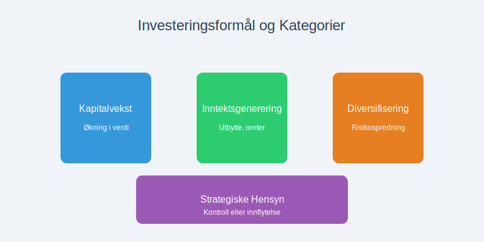
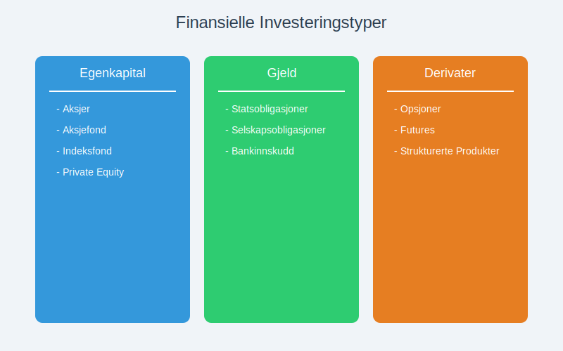
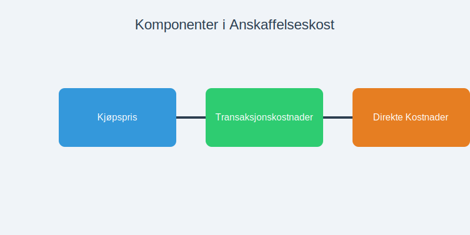
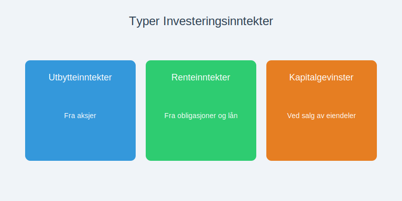
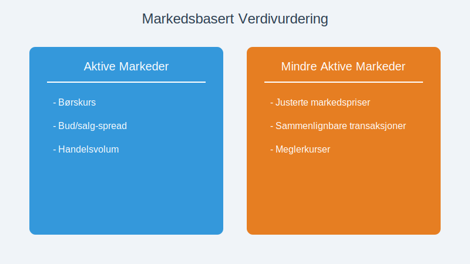
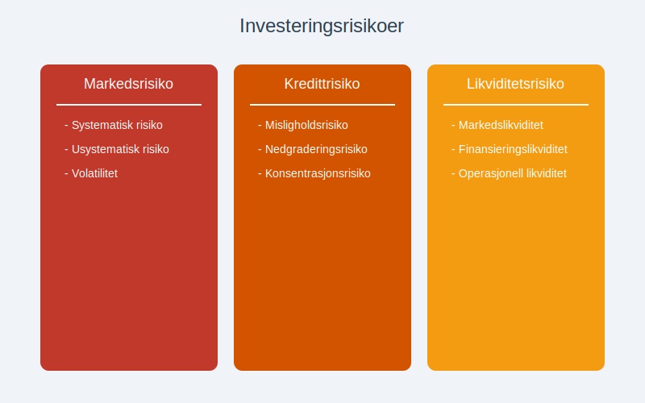
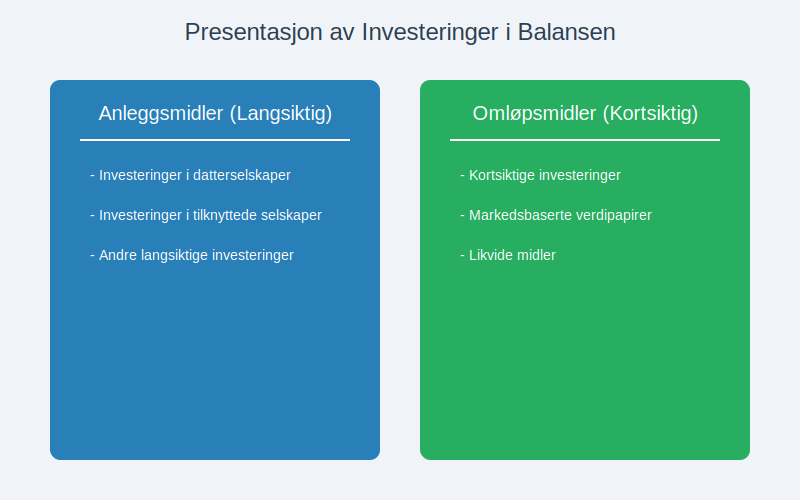
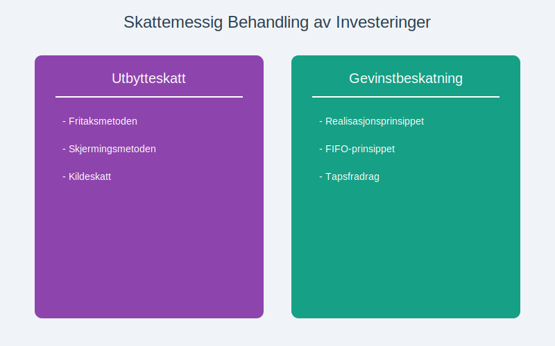
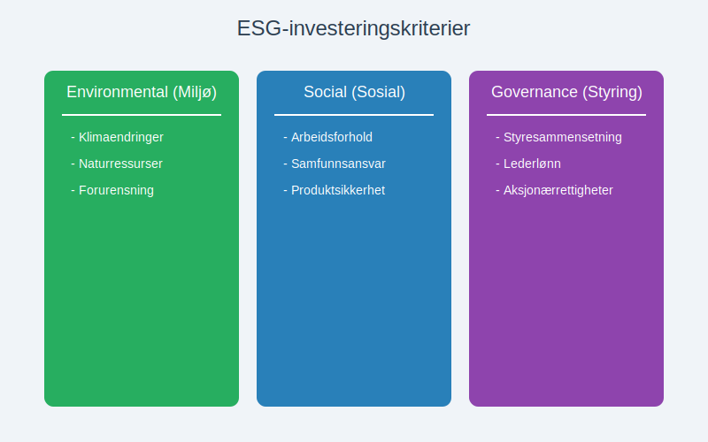
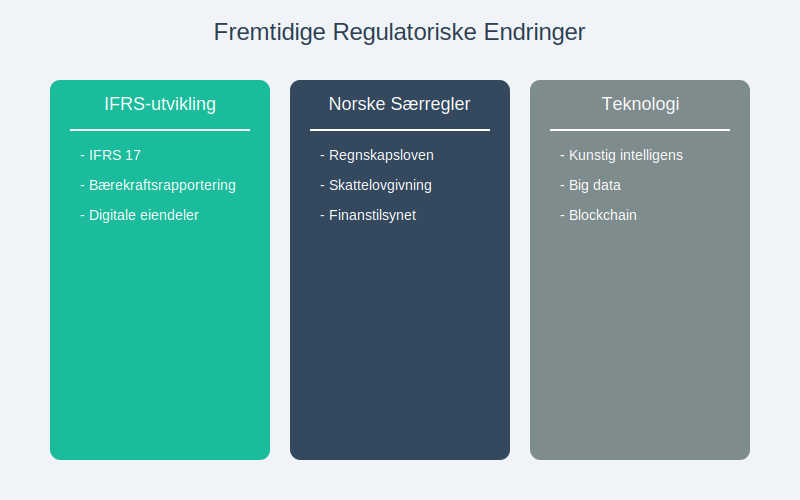

**Investering** er handlingen av å allokere kapital med forventning om fremtidig [avkastning](/blogs/regnskap/hva-er-avkastning "Hva er Avkastning? Komplett Guide til Investeringsavkastning og Beregning"). Fra et regnskapsperspektiv innebærer investeringer komplekse vurderinger knyttet til klassifisering, måling, regnskapsføring og rapportering av finansielle og ikke-finansielle eiendeler.

For aksjeinvesteringer er det viktig å forstå skattemessige konsekvenser. Se vår [Aksjonærmodellen - Komplett Guide til Norsk Aksjebeskatning](/blogs/regnskap/aksjonaermodellen-guide "Aksjonærmodellen - Komplett Guide til Norsk Aksjebeskatning") for detaljer om beskatning av utbytte og kapitalgevinster.


Når du vurderer ulike investeringsmuligheter og ressursbruk, er det viktig å forstå **alternativkostnad**, altså verdien av beste alternative bruk av begrensede ressurser. Les mer i vår guide til [alternativkostnad](/blogs/regnskap/alternativkostnad "Hva er Alternativkostnad? Komplett Guide til Alternativkostnad og Beslutningsanalyse").

Investeringer representerer en av de mest kritiske beslutningene for enhver virksomhet, og korrekt regnskapsbehandling er avgjørende for å gi interessenter et rettvisende bilde av selskapets finansielle stilling og fremtidsutsikter.

## Seksjon 1: Grunnleggende Investeringskonsepter

### 1.1 Definisjon og Formål

I regnskapssammenheng defineres en investering som en **eiendel** som anskaffes med det primære formål å generere inntekt eller kapitalvekst over tid. Investeringer skiller seg fra [driftsmidler](/blogs/regnskap/hva-er-anleggsmidler "Hva er Anleggsmidler? Komplett Guide til Langsiktige Eiendeler") ved at de ikke er nødvendige for den daglige driften av virksomheten.



**Hovedformål med investeringer:**

* **Kapitalvekst:** Økning i eiendelens verdi over tid
* **Inntektsgenerering:** Løpende inntekter som utbytte, renter eller leie
* **Diversifisering:** Spredning av risiko på tvers av ulike aktivaklasser
* **Strategiske hensyn:** Kontroll eller innflytelse over andre virksomheter

### 1.2 Investeringshorisonter

Investeringer klassifiseres basert på tidshorisont, noe som påvirker regnskapsbehandlingen betydelig:

| Tidshorisont | Klassifisering | Regnskapsbehandling | Eksempler |
|--------------|----------------|---------------------|-----------|
| **Kortsiktig** (< 1 år) | Omløpsmidler | Markedsverdi | Pengemarkedsfond, kortsiktige [obligasjoner](/blogs/regnskap/hva-er-obligasjon "Hva er en Obligasjon? Komplett Guide til Obligasjoner i Regnskap") |
| **Mellomlang** (1-5 år) | Finansielle anleggsmidler | Avhenger av intensjon | Selskapsobligasjoner, strukturerte produkter |
| **Langsiktig** (> 5 år) | Finansielle anleggsmidler | Kostpris eller markedsverdi | [Aksjer](/blogs/regnskap/hva-er-en-aksje "Hva er en Aksje? Komplett Guide til Aksjer og Aksjonærrettigheter"), eiendom, private equity |

## Seksjon 2: Investeringstyper og Klassifisering

### 2.1 Finansielle Investeringer

**Finansielle investeringer** er verdipapirer og finansielle instrumenter som representerer krav på fremtidige kontantstrømmer.



#### 2.1.1 Egenkapitalinstrumenter

* **[Aksjer](/blogs/regnskap/hva-er-en-aksje "Hva er en Aksje? Komplett Guide til Aksjer og Aksjonærrettigheter"):** Eierandeler i andre selskaper
* **Aksjefond:** Diversifiserte porteføljer av aksjer
* **[Indeksfond](/blogs/regnskap/indeksfond "Indeksfond - En komplett guide til passiv fondsforvaltning og kostnadseffektiv investering"):** Passivt forvaltede fond som gjenskaper avkastningen til en underliggende indeks med lavere kostnader
* **Private equity:** Investeringer i ikke-børsnoterte selskaper

#### 2.1.2 Gjeldsinstrumenter

* **Statsobligasjoner:** Lån til staten med fast rente
* **[Selskapsobligasjoner](/blogs/regnskap/hva-er-obligasjon "Hva er en Obligasjon? Komplett Guide til Obligasjoner i Regnskap"):** Lån til private selskaper
* **Bankinnskudd:** Sikre plasseringer med garantert avkastning

#### 2.1.3 Derivater og Strukturerte Produkter

* **[Opsjoner](/blogs/regnskap/hva-er-opsjonsavtale "Hva er en Opsjonsavtale? Komplett Guide til Opsjoner i Regnskap"):** Rett til å kjøpe/selge til bestemt pris
* **Futures:** Forpliktelse til fremtidig handel
* **Strukturerte produkter:** Kombinasjoner av ulike instrumenter

### 2.2 Realinvesteringer

**Realinvesteringer** er fysiske eiendeler som har egenverdi uavhengig av finansielle markeder.

#### 2.2.1 Eiendomsinvesteringer

Eiendom som investeringsobjekt krever spesiell regnskapsbehandling:

* **Utleieeiendom:** Genererer løpende leieinntekter
* **Utviklingseiendom:** Kjøpes for videresalg eller utvikling
* **REITs:** Eiendomsinvesteringsselskaper

#### 2.2.2 Råvarer og Edelmetaller

* **Gull og sølv:** Tradisjonelle verdireserver
* **Olje og gass:** Energiråvarer
* **Landbruksråvarer:** Korn, kaffe, sukker

## Seksjon 3: Regnskapsføring av Investeringer

### 3.1 Innledende Måling

Ved anskaffelse måles investeringer til **[anskaffelseskost](/blogs/regnskap/hva-er-anskaffelseskost "Hva er Anskaffelseskost? Komplett Guide til Kostpris og Regnskapsføring")**, som inkluderer:



* **Kjøpspris:** Det beløp som betales for investeringen
* **Transaksjonskostnader:** Meglerhonorarer, avgifter, juridiske kostnader
* **Direkte tilknyttede kostnader:** Kostnader som er nødvendige for å bringe investeringen til ønsket tilstand

**Eksempel på anskaffelseskost:**
```
Kjøp av 1000 aksjer à kr 100        = kr 100.000
Meglerprovision (0,5%)              = kr    500
Børsavgift                          = kr    100
Total anskaffelseskost              = kr 100.600
```

### 3.2 Etterfølgende Måling

Etter innledende innregning avhenger målingen av investeringens klassifisering:

#### 3.2.1 Investeringer til Virkelig Verdi

For investeringer som holdes for handel eller er tilgjengelige for salg:

* **Måles til markedsverdi** på balansedagen
* **Urealiserte gevinster/tap** føres over resultatregnskapet eller direkte mot egenkapitalen
* **Realiserte gevinster/tap** ved salg føres over resultatregnskapet som [kapitalgevinst](/blogs/regnskap/hva-er-kapitalgevinst "Hva er Kapitalgevinst? Komplett Guide til Skatt og Regnskapsføring") eller kapitaltap

#### 3.2.2 Investeringer til Amortisert Kost

For gjeldsinstrumenter som holdes til forfall:

* **Måles til amortisert kost** ved bruk av effektiv rente-metoden
* **Renteinntekter** periodiseres over instrumentets løpetid
* **Nedskrivninger** ved forventet kredittap

### 3.3 Regnskapsføring av Investeringsinntekter



#### 3.3.1 Utbytteinntekter

Utbytte fra [aksjeinvesteringer](/blogs/regnskap/hva-er-en-aksje "Hva er en Aksje? Komplett Guide til Aksjer og Aksjonærrettigheter") regnskapsføres når:

* **Rettigheten er etablert:** Utbytte er vedtatt av generalforsamlingen
* **Beløpet kan måles pålitelig:** Utbyttebeløp er kjent
* **Økonomiske fordeler vil tilflyte:** Utbetaling er sannsynlig

**Regnskapsføring:**
```
Debet: Utbyttefordring          kr 10.000
Kredit: Utbytteinntekt                    kr 10.000
```

#### 3.3.2 Renteinntekter

Renter fra [obligasjoner](/blogs/regnskap/hva-er-obligasjon "Hva er en Obligasjon? Komplett Guide til Obligasjoner i Regnskap") og bankinnskudd periodiseres:

* **Påløpte renter** regnskapsføres løpende
* **[Effektiv rente](/blogs/regnskap/hva-er-effektiv-rente "Hva er Effektiv rente? Komplett Guide til Beregning av Effektiv rente i Regnskap")**-metode for obligasjoner kjøpt til over-/underkurs
* **Sammensatte renter** beregnes på akkumulert hovedstol

#### 3.3.3 Kapitalgevinster og -tap

Ved salg av investeringer:

**Kapitalgevinst = Salgspris - Anskaffelseskost - Salgskostnader**

**Regnskapsføring av salg:**
```
Debet: Bank                     kr 105.000
Kredit: Investering                       kr 100.600
Kredit: Kapitalgevinst                    kr   4.400
```

## Seksjon 4: Verdivurdering av Investeringer

### 4.1 Markedsbasert Verdivurdering

For børsnoterte verdipapirer brukes **markedspriser** som grunnlag for verdivurdering:



#### 4.1.1 Aktive Markeder

* **Børskurs:** Siste handelspris på balansedagen
* **Bud/salg-spread:** Vurdering av likviditet
* **Handelsvolum:** Indikator på markedets dybde

#### 4.1.2 Mindre Aktive Markeder

* **Justerte markedspriser:** Hensyn til likviditetsrabatt
* **Sammenlignbare transaksjoner:** Priser på lignende instrumenter
* **Meglerkurser:** Uavhengige prisestimater

### 4.2 Modellbasert Verdivurdering

For ikke-børsnoterte investeringer anvendes **verdsettelsesmodeller**:

#### 4.2.1 Diskontert Kontantstrøm (DCF)

**Nåverdi = Σ (Fremtidig kontantstrøm / (1 + diskonteringsrente)^år)**

| År | Forventet kontantstrøm | Diskonteringsrente | Nåverdi |
|----|------------------------|-------------------|---------|
| 1  | kr 50.000             | 8%                | kr 46.296 |
| 2  | kr 55.000             | 8%                | kr 47.146 |
| 3  | kr 60.000             | 8%                | kr 47.628 |
| **Total nåverdi** |                |                   | **kr 141.070** |

#### 4.2.2 Multiplikatormodeller

* **P/E-multippel:** Pris/inntjening-forhold
* **EV/EBITDA:** Enterprise value/driftsresultat
* **P/B-multippel:** Pris/bokført verdi

#### 4.2.3 Substansverdi

For eiendomsinvesteringer og selskaper med betydelige [anleggsmidler](/blogs/regnskap/hva-er-anleggsmidler "Hva er Anleggsmidler? Komplett Guide til Langsiktige Eiendeler"):

* **Markedsverdi av eiendeler** minus gjeld
* **Takseringer** av fast eiendom
* **Avhendingsverdi** av utstyr og inventar

## Seksjon 5: Risikostyring og Porteføljeforvaltning

### 5.1 Investeringsrisiko



#### 5.1.1 Markedsrisiko

* **Systematisk risiko:** Påvirker hele markedet
* **Usystematisk risiko:** Spesifikk for enkeltinvesteringer
* **Volatilitet:** Svingninger i investeringens verdi

#### 5.1.2 Kredittrisiko

* **Misligholdsrisiko:** Sannsynlighet for at debitor ikke betaler
* **Nedgraderingsrisiko:** Forverring av kredittvurdering
* **Konsentrasjonsrisiko:** For stor eksponering mot enkeltdebitor

#### 5.1.3 Likviditetsrisiko

* **Markedslikviditet:** Mulighet til å selge uten prispress
* **Finansieringslikviditet:** Tilgang til kapital for nye investeringer
* **Operasjonell likviditet:** Kontantbehov for daglig drift

### 5.2 Diversifisering

**Diversifisering** reduserer risiko ved å spre investeringer:

| Diversifiseringstype | Beskrivelse | Eksempel |
|---------------------|-------------|----------|
| **Aktivaklasse** | Ulike typer investeringer | Aksjer, [obligasjoner](/blogs/regnskap/hva-er-obligasjon "Hva er en Obligasjon? Komplett Guide til Obligasjoner i Regnskap"), eiendom |
| **Geografisk** | Ulike markeder/land | Norge, Europa, USA, Asia |
| **Sektormessig** | Ulike bransjer | Teknologi, helse, finans |
| **Tidsmessig** | Ulike investeringstidspunkt | Dollar-cost averaging |

### 5.3 Porteføljeoptimalisering

Modern porteføljeteori fokuserer på **risiko-avkastning-optimalisering**:

* **Effisient grense:** Maksimal avkastning for gitt risikonivå
* **Sharpe-ratio:** Avkastning per risikoenhet
* **Korrelasjon:** Sammenheng mellom ulike investeringers avkastning

## Seksjon 6: Rapportering og Noteopplysninger

### 6.1 Balanseoppstilling

Investeringer presenteres i [balansen](/blogs/regnskap/hva-er-balanse "Hva er Balanse i Regnskap? Komplett Guide til Balansens Oppbygging og Funksjon") basert på klassifisering:



#### 6.1.1 Anleggsmidler

* **Investeringer i datterselskaper:** Til kostpris eller [egenkapitalmetoden](/blogs/regnskap/egenkapitalmetoden "Egenkapitalmetoden – Guide til regnskapsføring av tilknyttede selskaper")
* **Investeringer i tilknyttede selskaper:** [Egenkapitalmetoden](/blogs/regnskap/egenkapitalmetoden "Egenkapitalmetoden – Guide til regnskapsføring av tilknyttede selskaper")
* **Andre langsiktige investeringer:** Kostpris eller virkelig verdi

#### 6.1.2 Omløpsmidler

* **Kortsiktige investeringer:** Virkelig verdi
* **Markedsbaserte verdipapirer:** Børskurs på balansedagen
* **Likvide midler:** Bankinnskudd og pengemarkedsfond

### 6.2 Resultatregnskapet

Investeringsrelaterte poster i resultatregnskapet:

* **Utbytteinntekter:** Fra aksjeinvesteringer
* **Renteinntekter:** Fra [obligasjoner](/blogs/regnskap/hva-er-obligasjon "Hva er en Obligasjon? Komplett Guide til Obligasjoner i Regnskap") og bankinnskudd
* **Kapitalgevinster/-tap:** Ved salg av investeringer
* **Nedskrivninger:** Ved verdifall på investeringer

### 6.3 Noteopplysninger

**Obligatoriske opplysninger** om investeringer:

#### 6.3.1 Regnskapsprinsipper

* **Klassifisering og måling:** Hvordan investeringer behandles
* **Verdivurderingsmetoder:** Markedspriser vs. modeller
* **Nedskrivningsprinsipper:** Kriterier for verdifall

#### 6.3.2 Spesifikasjon av Investeringer

| Investeringstype | Bokført verdi | Markedsverdi | Urealisert gevinst/tap |
|------------------|---------------|--------------|------------------------|
| Norske aksjer | kr 2.500.000 | kr 2.750.000 | kr 250.000 |
| Utenlandske aksjer | kr 1.800.000 | kr 1.650.000 | kr (150.000) |
| [Obligasjoner](/blogs/regnskap/hva-er-obligasjon "Hva er en Obligasjon? Komplett Guide til Obligasjoner i Regnskap") | kr 3.200.000 | kr 3.180.000 | kr (20.000) |
| **Totalt** | **kr 7.500.000** | **kr 7.580.000** | **kr 80.000** |

#### 6.3.3 Risikoeksponering

* **Markedsrisiko:** Sensitivitetsanalyser
* **Kredittrisiko:** Kredittkvalitet på obligasjoner
* **Valutarisiko:** Eksponering mot utenlandsk valuta - se [Big Mac-indeksen](/blogs/regnskap/big-mac-indeksen "Big Mac-indeksen: Komplett guide til valutakurs og kjøpekraftsparitet for norske bedrifter") for valutavurdering
* **Konsentrasjonsrisiko:** Store enkeltinvesteringer

## Seksjon 7: Skattemessige Aspekter

### 7.1 Skattlegging av Investeringsinntekter



#### 7.1.1 Utbytteskatt

* **Fritaksmetoden:** For kvalifiserte aksjer i norske selskaper
* **Skjermingsmetoden:** For andre aksjeinvesteringer
* **Kildeskatt:** På utbytte fra utenlandske selskaper

#### 7.1.2 Gevinstbeskatning

* **Realisasjonsprinsippet:** Skatt ved salg, ikke ved verdiøkning
* **FIFO-prinsippet:** Først inn, først ut ved delvis salg
* **Tapsfradrag:** Kan trekkes fra gevinster samme år

### 7.2 Forskjeller Mellom Regnskaps- og Skatterett

| Område | Regnskapsrett | Skatterett | Konsekvens |
|--------|---------------|------------|------------|
| **Verdivurdering** | Virkelig verdi | Kostpris | Midlertidige forskjeller |
| **Nedskrivninger** | Ved verdifall | Kun ved realisert tap | Utsatt skatt |
| **Valutagevinster** | Løpende | Ved realisasjon | Timing-forskjeller |

## Seksjon 8: Moderne Investeringstrender

### 8.1 ESG-investeringer

**Environmental, Social, and Governance (ESG)** investeringer fokuserer på bærekraft:



#### 8.1.1 Miljømessige Faktorer

* **Klimaendringer:** Karbonforavtrykk og klimarisiko
* **Naturressurser:** Bærekraftig bruk av vann og råvarer
* **Forurensning:** Utslipp og avfallshåndtering

#### 8.1.2 Sosiale Faktorer

* **Arbeidsforhold:** Sikkerhet og rettferdige lønninger
* **Samfunnsansvar:** Bidrag til lokalsamfunn
* **Produktsikkerhet:** Kvalitet og forbrukerbeskyttelse

#### 8.1.3 Selskapsstyring

* **Styresammensetning:** Uavhengighet og mangfold
* **Lederlønn:** Rimelige og prestasjonsbundne ordninger
* **Aksjonærrettigheter:** Beskyttelse av minoritetsinteresser

### 8.2 Teknologiske Innovasjoner

#### 8.2.1 Robo-advisors

* **Automatisert porteføljeforvaltning:** Algoritmebaserte investeringsråd
* **Lave kostnader:** Reduserte forvaltningshonorarer
* **Tilgjengelighet:** Investeringstjenester for mindre investorer

#### 8.2.2 Kryptovalutaer og Blockchain

* **Bitcoin og Ethereum:** Digitale eiendeler som investeringsobjekt
* **Regnskapsutfordringer:** Klassifisering og verdivurdering
* **Regulatorisk usikkerhet:** Utviklende lovgivning

#### 8.2.3 Crowdfunding og Peer-to-Peer

For alternative finansieringsformer som [crowdfunding](/blogs/regnskap/hva-er-crowdfunding "Hva er Crowdfunding? Komplett Guide til Folkefinansiering og Regnskapsføring"), se vår detaljerte guide som dekker regnskapsaspektene ved denne moderne investeringsformen.

## Seksjon 9: Praktiske Eksempler og Case-studier

### 9.1 Case: Porteføljeinvestering i Børsnoterte Aksjer

**Situasjon:** Et selskap investerer kr 5.000.000 i en diversifisert aksjeportefølje.

#### 9.1.1 Innledende Regnskapsføring

```
1. januar 2024:
Debet: Kortsiktige investeringer    kr 5.000.000
Kredit: Bank                                    kr 5.000.000
```

#### 9.1.2 Løpende Verdijustering

```
31. mars 2024 (markedsverdi kr 5.200.000):
Debet: Kortsiktige investeringer    kr 200.000
Kredit: Urealisert gevinst                      kr 200.000
```

#### 9.1.3 Utbytteinntekt

```
15. april 2024:
Debet: Bank                         kr 75.000
Kredit: Utbytteinntekt                          kr 75.000
```

### 9.2 Case: Investering i Datterselskap

**Situasjon:** Oppkjøp av 80% av aksjene i et datterselskap for kr 10.000.000.

#### 9.2.1 Konsolideringseffekter

* **Goodwill:** Differanse mellom kjøpspris og andel av netto eiendeler
* **Minoritetsinteresser:** 20% av datterselskapets egenkapital
* **Eliminering:** Interne transaksjoner mellom selskapene

For mer detaljert informasjon om [konsernregnskap](/blogs/regnskap/hva-er-konsern "Hva er et Konsern? Komplett Guide til Konsernstrukturer og Konsernregnskap") og konsolideringsprosesser, se vår omfattende guide.

### 9.3 Case: Eiendomsinvestering

**Situasjon:** Kjøp av utleieeiendom for kr 15.000.000.

#### 9.3.1 Regnskapsføring

```
Debet: Investeringseiendom          kr 15.000.000
Kredit: Bank                                    kr 15.000.000
```

#### 9.3.2 Løpende Drift

* **Leieinntekter:** Månedlige inntekter fra leietakere
* **Driftskostnader:** Vedlikehold, forsikring, eiendomsskatt
* **Avskrivninger:** Systematisk fordeling av anskaffelseskost

## Seksjon 10: Fremtidsutsikter og Konklusjon

### 10.1 Regulatoriske Utviklingstrender



#### 10.1.1 IFRS-utvikling

* **IFRS 17:** Ny standard for forsikringskontrakter
* **Bærekraftsrapportering:** Økte krav til ESG-opplysninger
* **Digitale eiendeler:** Kommende standarder for kryptovalutaer

#### 10.1.2 Norske Særregler

* **Regnskapslovens endringer:** Tilpasninger til EU-direktiver
* **Skattelovgivning:** Endringer i investeringsincentiver
* **Finanstilsynets retningslinjer:** Økt fokus på risikostyring

### 10.2 Teknologiske Disrupsjoner

* **Kunstig intelligens:** Automatiserte investeringsbeslutninger
* **Big data:** Forbedret risikoanalyse og porteføljeoptimalisering
* **Blockchain:** Økt transparens og reduserte transaksjonskostnader

### 10.3 Konklusjon

**Investeringer** representerer en kompleks og kritisk del av moderne regnskap. Fra grunnleggende klassifisering og måling til avanserte verdsettelsesmodeller og risikostyring, krever området dyptgående kunnskap om både regnskapsstandarder og finansielle markeder.

**Nøkkelpunkter for suksessfulle investeringer:**

* **Grundig forståelse** av regnskapsstandarder og deres anvendelse
* **Systematisk tilnærming** til risikostyring og diversifisering
* **Løpende overvåking** av markedsutvikling og regulatoriske endringer
* **Profesjonell rådgivning** ved komplekse investeringsbeslutninger

For virksomheter som ønsker å optimalisere sin investeringsstrategi, er det avgjørende å ha solid kunnskap om både de regnskapsmessige og skattemessige konsekvensene av ulike investeringsalternativer. Dette sikrer ikke bare korrekt rapportering, men også informerte beslutninger som maksimerer [avkastning](/blogs/regnskap/hva-er-avkastning "Hva er Avkastning? Komplett Guide til Investeringsavkastning og Beregning") innenfor akseptable risikorammer.

Investeringsregnskapet vil fortsette å utvikle seg i takt med finansielle innovasjoner og regulatoriske endringer. Bedrifter som holder seg oppdatert på disse utviklingstrekkene vil være best posisjonert for fremtidig suksess i det komplekse investeringslandskapet.
